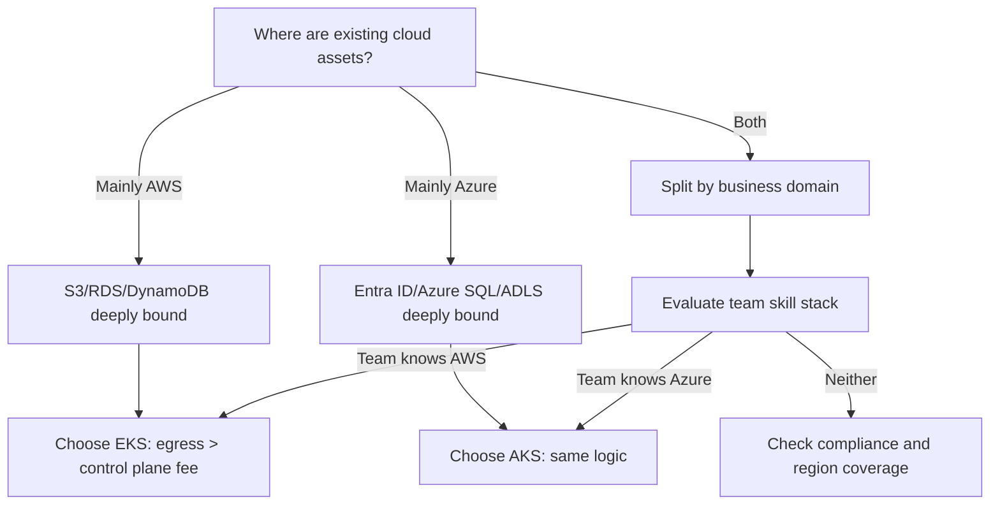

If you have managed both EKS and AKS, you have probably had this experience: before spinning up an EKS cluster you mentally do the math - $0.10 per hour per cluster, $73 a month, pure control plane, no compute included. With AKS free tier, that number is zero. A lot of people stop right there and conclude "AKS is cheaper." I have watched too many teams make the decision this way, then get wrecked six months later by egress bills or log ingestion charges.

This article skips the vendor marketing pages. We lay out control plane billing, node pool pricing models, and hidden cost structures side by side, then talk about the feature-level differences that actually affect day-to-day operations.

## Key Takeaways

- **Control plane billing is the biggest surface-level difference**: EKS charges $0.10/hour per cluster (~$73/month) regardless of cluster size; AKS free tier is $0, standard tier is roughly $0.10/hour, premium tier around $0.60/hour. Multi-cluster setups amplify this gap.
- **AKS free tier has no SLA**. If you want the 99.95% API Server availability commitment, you pay to upgrade to standard or premium tier - free comes with a price.
- **EKS "being expensive" is largely a perception problem**: its charges are transparent with clear boundaries; AKS shifts cost to nodes, egress, and Azure Monitor log ingestion, which often costs far more than the control plane fee.
- **Feature differences are not in Kubernetes itself but in the surrounding ecosystem**: IAM integration, network plugins, secret management, and observability stack maturity determine how much glue code you write after launch.
- **Selection should be driven by existing cloud assets, not by that $73 control plane fee**. If your data is already in S3, switching to AKS may save less than cross-cloud egress costs.

## Control Plane Pricing: What That $73 Actually Buys

Let's start with the hardest numbers. EKS charges $0.10/hour per cluster, which at 730 hours/month is a flat $73/month. This fee is independent of whether you have 1 node or 1000. What it buys is a managed API Server, etcd, and controller manager.

AKS pricing comes in three tiers, and this is where many people get confused:

| Tier | Control Plane Cost | SLA | Best For |
|---|---|---|---|
| Free | $0 | No SLA | Dev, test, PoC |
| Standard | ~$0.10/hour | 99.95% API Server availability | Production workloads |
| Premium | ~$0.60/hour | 99.95% + LTS (up to 2 years version support) | Regulated industries, long version locks |

So "AKS is free" only holds in dev environments. Once you need production-grade SLA, AKS standard tier pricing lines up with EKS. Premium tier is actually 6x more expensive than EKS - it sells long-term version support (LTS), which only matters for teams in finance or healthcare that cannot upgrade K8s versions frequently.

My take: EKS's $73/month is **transparent, deterministic cost**, while AKS free tier is **zero cost bought with SLA**. Which is better depends on whether that cluster runs internal tooling or revenue-generating business systems.

## Node Pools and Compute Costs: The Real Bulk

The control plane fee is negligible in the total bill. A 3-node m5.large cluster on EC2 on-demand runs about $200/month. Three things actually determine cost:

**First, instance pricing models.** EKS sits on EC2, so you have Spot, Savings Plans, and Reserved Instances. AKS sits on Azure VMs, with Spot VMs, Azure Reserved VM Instances, and Savings Plan. Discount levels are comparable, but Azure's Spot eviction policy differs slightly from AWS - Azure tends toward capacity-priority eviction, which can cause batch node drops if misconfigured.

**Second, egress.** This is the most underestimated item. AWS has offered 100GB free egress per month since 2021, with tiered pricing beyond that. Azure's free allowance is 100GB/month, with slightly lower unit pricing beyond that. But if your architecture involves cross-AZ traffic or NAT Gateway traffic, the NAT Gateway processing fee ($0.045/GB) on the EKS side bites - many teams only discover they are paying NAT fees hourly when the bill arrives.

**Third, observability ingestion.** This is the cost item I consider most overlooked. EKS with CloudWatch charges $0.50/GB for log ingestion; AKS with Azure Monitor charges around $2.30/GB (varies by region and tier). A mid-sized cluster generating tens of GB of logs daily can rack up Azure Monitor bills ten times the control plane fee.

I have seen a team migrate from EKS to AKS, cut compute cost by 15%, then watch the total bill jump 40% because they dumped all logs into Azure Monitor. **Cost optimization is never solved by switching clouds; it is an architecture problem.**

## Feature Comparison: Not Just Kubernetes, But the Ecosystem Around It

Both run upstream Kubernetes versions, so differences are small. The gap opens in the surroundings:

| Dimension | AWS EKS | Azure AKS |
|---|---|---|
| Identity & Permissions | IAM Roles for Service Accounts (IRSA) | Microsoft Entra Workload ID |
| Network Plugin | VPC CNI (native, pods get VPC IPs) | Azure CNI / Kubenet / Azure CNI Overlay |
| Secret Management | Secrets Manager + CSI driver | Key Vault + Secrets Store CSI |
| Observability | CloudWatch Container Insights | Azure Monitor Container Insights |
| GitOps | Flux (officially supported) | Flux (officially supported) |
| Serverless Mode | EKS + Fargate | AKS + Virtual Nodes (on ACI) |
| Autoscaling | Karpenter / Cluster Autoscaler | Cluster Autoscaler / KEDA |

Networking is the most worth discussing. EKS VPC CNI lets each pod pull an IP directly from the VPC - the upside is low network latency and seamless communication with other VPC resources; the downside is fast IP consumption, and a large cluster can easily exhaust subnet IPs. I have hit this wall: a /24 subnet ran out after fewer than 100 pods, and it took me a while to realize it was the ENI IP pre-allocation strategy. AKS Azure CNI Overlay mode is more IP-efficient, but introduces overlay encapsulation overhead.

Another difference is IRSA versus Workload ID. Both follow the same idea: OIDC federation lets pods obtain temporary cloud credentials, avoiding long-lived keys in the cluster. EKS IRSA has a more mature ecosystem with more docs and community examples; AKS Workload ID only went GA in 2023, and some older tutorials still teach Pod Managed Identity, which is a trap.

## Architecture View: A Typical Dual-Cloud Decision Flow

The point of this diagram is not the flow itself but that judgment call: **when your data, identity, and monitoring are bound to one cloud, the control plane savings from cross-cloud deployment are far outweighed by egress and operational complexity.** I have seen too many cases of "migrating to AKS to save $73/month on EKS" that ended up paying hundreds more monthly calling Azure SQL cross-cloud.

## Community and Real User Feedback

Over the past 30 days I went through Reddit and Hacker News discussions about these two services, and a few signals stood out.

There is a project on Hacker News called **Spinifex**, described as "run EC2/S3/IAM/EKS on your own hardware, AWS CLI unchanged." The project itself has low engagement (5 points), but it reflects a trend: a cohort of teams is frustrated with cloud control plane fees and lock-in enough to start building their own. **When self-hosting becomes attractive, something is off with managed service pricing or experience.**

Another discussion is **floci** - a local emulator for GCP/AWS/Azure, 40 points, 11 comments. The core demand in the comments is "I want to verify cloud service behavior locally before deciding whether to go to cloud." Behind this is anxiety about unpredictable cloud costs: you validate locally, then the cloud bill is a different story.

On the Reddit thread "Why is EKS so expensive compared to other managed K8s," the mainstream view splits into two camps. One camp argues EKS's $0.10/hour is "paying for maturity" - IRSA, VPC CNI, and Karpenter have genuinely been polished longer than competitors. The other camp argues it is AWS inertia pricing that will eventually be forced to adjust by GKE and AKS free strategies. I lean toward the latter: **EKS control plane fee is fundamentally rent, not a service premium.** Its managed quality is not an order of magnitude better than GKE, and GKE Autopilot does better on cost predictability.

One more signal worth noting: cases like "AiFi on AWS" running AI workloads directly on AWS are increasingly common. When your training data, inference services, and vector stores all live in the AWS ecosystem, EKS integration advantages get amplified - that is not something a control plane fee can offset.

## FAQ

**Q: What are the key differences between Amazon EKS and Azure AKS?**

The most direct difference is the control plane billing model: EKS charges a flat $0.10/hour per cluster, AKS free tier charges nothing but comes with no SLA. Functionally, EKS's IAM/IRSA integration is more mature, while AKS's Entra ID/Workload ID integration fits the Microsoft ecosystem better. On networking, EKS VPC CNI lets pods consume VPC IPs directly, while AKS offers both Azure CNI and Overlay modes. Both run standard Kubernetes; the differences lie in surrounding ecosystem and team familiarity.

**Q: How expensive is AWS EKS?**

Looking strictly at the control plane, $73/month per cluster. But real cost depends on node count, instance types, and discount strategy. A 3-node m5.large production cluster with CloudWatch logs typically runs $250-400/month. In multi-cluster scenarios, each additional cluster adds another $73. The real cost driver is compute resources and observability ingestion, not the control plane fee.

**Q: Which is more expensive, Azure or AWS?**

There is no universal answer; it depends on workload shape. Compute instance pricing is comparable; Azure egress unit pricing is slightly lower; observability-wise Azure Monitor log ingestion is usually priced higher than CloudWatch. On control plane, AKS free tier wins, but production-grade SLA requires upgrading to standard tier, which lines up with EKS. Bottom line: small-scale multi-cluster scenarios may favor AKS; deeply AWS-bound scenarios favor EKS.

**Q: What is the Azure equivalent of EKS?**

Azure Kubernetes Service (AKS). Both are managed Kubernetes control plane services, but they differ in managed boundaries and billing models. GKE (Google Kubernetes Engine) is the third major option, with some unique designs around automation and cost predictability.

## Conclusion: Choose by Scenario, Not by Control Plane Fee

Honestly, if you only look at that $73 control plane fee, you will never choose correctly. The real decision variables are where your data lives, what your team knows, and what compliance requires.

**Choose EKS if:** your data, identity, and monitoring are already deeply bound to AWS; you need mature integrations like IRSA and VPC CNI; your team has AWS certifications and operational experience; you are willing to pay for determinism and ecosystem maturity. EKS billing is transparent, the trap rate is relatively low, though the bill is not cheap.

**Choose AKS if:** your organization already runs Entra ID, Azure SQL, and ADLS; you run multiple clusters and are sensitive to control plane cost; you need LTS version support (premium tier); your team comes from a .NET/Microsoft stack. AKS free tier is friendly for dev environments; production upgrades to standard tier.

**Choose neither if:** you just want an environment to run a few containers. In that case ECS, Azure Container Apps, or straight serverless have lower operational burden and cost. Kubernetes is not a universal key, and over-complicating simple problems is a common disease.

One last honest note: **the room for cost optimization is always in architecture, not in switching clouds.** First, halve your log ingestion, swap NAT Gateway for VPC Endpoints, and use Karpenter to reclaim idle nodes - once those are done, look back at that $73 control plane fee and you will find it was never the point.

## References & Community Insights

- [Amazon EKS Official Pricing Page](https://aws.amazon.com/eks/pricing/) - Latest billing standards for control plane and add-ons
- [Azure Kubernetes Service Pricing](https://azure.microsoft.com/en-us/pricing/details/kubernetes-service/) - Detailed comparison of free/standard/premium tiers
- [Azure Architecture Center: Kubernetes Cost Management](https://learn.microsoft.com/en-us/azure/architecture/aws-professional/eks-to-aks/cost-management) - Microsoft's official comparative analysis of EKS and AKS cost structures
- [Hacker News: Spinifex - Self-hosted EKS-compatible layer discussion](https://news.ycombinator.com/) - Community sentiment on cloud control plane fees
- [Hacker News: floci local cloud emulator](https://flowg.cloud/blog/using-floci-local-emulators) - 40-point discussion reflecting developer anxiety about unpredictable cloud costs

---
✅ All agents reported back!
└─ 🟡 HN: 2 storys │ 8 points
---
