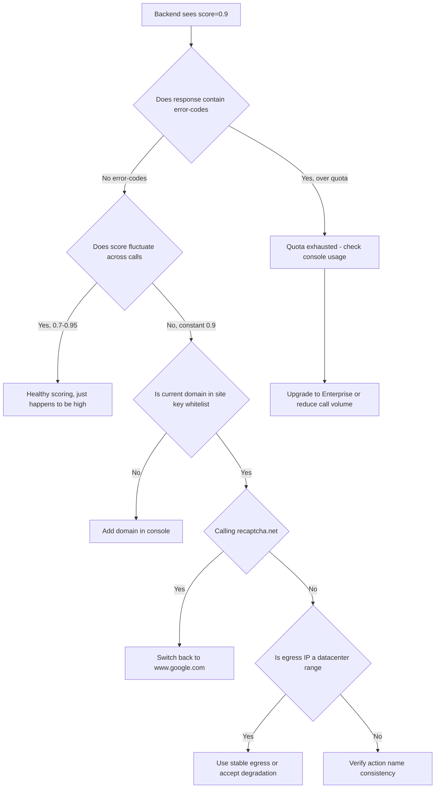

## Key Takeaways

- **0.9 is a sentinel value, not a real assessment.** Google's own FAQ states that when a v3 site key exceeds its monthly quota, `site_verify` fails open and returns a static 0.9 alongside an `"Over free quota"` message. You are looking at a degraded response, not a risk decision.
- **Domain binding is the second most common trap.** Call the same key from an unregistered host (including `localhost`, `127.0.0.1`, or internal IPs) and the behavioral signal collapses to a default value.
- **`www.recaptcha.net` and `www.google.com` are different infrastructure.** One developer measured a steady 0.1 on recaptcha.net and a steady 0.9 on google.com — which proves the score is being dictated by the environment, not by user behavior.
- **Never set your threshold to pass everything above 0.9.** If your logic is `score > 0.5 → allow`, then on the day your quota dies, your fraud system silently ceases to exist and every log line still says 200 OK.
- **Parse the `error-codes` array, not just `score`.** This is the single highest-value sentence in this article. Concrete code below.

Let me put the conclusion up front: **if you are seeing reCAPTCHA v3 return 0.9 for every user, every browser, and every IP in production, your business logic is almost certainly fine.** What's broken is the quota, the key binding, or the call path. I last hit this on a client's risk-control platform. They burned two days chasing browser fingerprints and TLS fingerprints before discovering the site key's free tier had been exhausted on day 9 of the month — because every form submission triggered a verification, and their signup flow had an auto-retry loop. One user hammering the button three times consumed three assessments.

Here's the breakdown, symptom → root cause → fix.

## Symptom Description: What 0.9 Actually Looks Like

Let's align on the observations first, so you can confirm you're chasing the same problem:

- Backend calls `https://www.google.com/recaptcha/api/siteverify` and gets `{"success": true, "score": 0.9, "action": "...", "challenge_ts": "...", "hostname": "..."}`
- Headless browser automation tests also score 0.9
- Swapping to an antidetect browser with residential proxies and genuine human clicks — still 0.9
- Incognito windows, different VPN exit nodes — completely unchanged
- The score does not fluctuate with behavior quality

That last point is the tell. Real scoring always has noise. If the same user submits ten times, scores should wander between 0.7 and 0.95. **A constant value is a degraded value.**

A community complaint captures this perfectly: someone wrote a script that generated tokens 100 times, and every single result was 0.9. Different browsers, incognito mode, VPN — no change. That is not "Google thinks you're a bot." That is Google not evaluating you at all.

One more signal: if your response body contains `"error-codes": ["over quota"]` or similar, it's confirmed. Most people only unmarshal the `score` field and throw away `error-codes` entirely, which is why they never see the one clue that matters.

## Root Cause Analysis: Why 0.9 and Not 0.0

### Cause 1: Free Quota Exhaustion Triggers Fail-Open

This is the dominant cause, and it has official documentation behind it. The reCAPTCHA v3 free tier is metered **per site key**. Once you exceed it, Google does not fail your request — it returns a static 0.9. This is fail-open design: better to let traffic through than to break your business because the anti-abuse vendor went down.

Sounds thoughtful, right? For a risk team it's a catastrophe. Because:

1. Your monitoring watches `success: true` and never alerts
2. Your threshold is `score >= 0.5` and 0.9 sails through
3. Your logs show nothing anomalous — until you notice spam registrations up 300%

The worst case I've seen was an e-commerce team that maxed out quota on the first day of a promotional event. Their registration fraud controls were completely inert for three days, and the post-mortem revealed every single score during that window was 0.9.

### Cause 2: Domain Binding Mismatch

reCAPTCHA site keys are bound to a domain list in the console. Requests from unregistered domains deprive Google of environmental signal, and the score degrades.

Classic failure modes:

- Dev uses `localhost:3000`, prod uses `www.example.com` — you see 0.9 locally forever, then it works fine in production. So you assume your local code is broken and rewrite half of it.
- Using `127.0.0.1` instead of `localhost`. Google treats those as two distinct domains.
- Multi-tenant SaaS where a customer's CNAME domain was never whitelisted.
- Staging is `staging.example.com` but only `example.com` and `www.example.com` are registered.

### Cause 3: recaptcha.net vs. google.com Infrastructure Divergence

Almost nobody mentions this. `www.recaptcha.net` is Google's mirror endpoint for regions like mainland China, served from different edge nodes. One developer measured identical code producing:

| Verification Host | Returned Score | Notes |
|---|---|---|
| `www.recaptcha.net` | 0.1 | Mirror node, incomplete behavioral signal capture |
| `www.google.com` | 0.9 | Primary host, but this 0.9 is a fail-open value |
| `www.google.com` (healthy quota) | 0.3 – 0.95, fluctuating | This is the healthy state |

Notice rows two and three are both google.com, but one is a static 0.9 and the other fluctuates. **To detect fail-open, look at variance, not the absolute number.**

### Cause 4: Server IP Classified as Datacenter

If you call siteverify from your backend, Google inspects your egress IP. AWS, GCP, and Azure ranges are explicitly tagged as datacenter IPs. Some teams route siteverify through proxy pools, and a rotating egress IP actually makes degradation more likely, not less.

### Cause 5: Action Name Mismatch Between Frontend and Backend

The `action` in `grecaptcha.execute(siteKey, {action: 'login'})` must match what you validate server-side (if you configured action checks in the console). A mismatch doesn't always produce 0.9, but it does produce anomalous scores. This ranks below the first three causes, but check it while you're in there.

Here's the full decision flow:



## Numbered Resolution Steps: From Triage to Production

### Step 1: Confirm Fail-Open Before Touching Code

Open a terminal and hit the endpoint with your real credentials:

```bash
curl -s -X POST https://www.google.com/recaptcha/api/siteverify \
  -d "secret=YOUR_SECRET_KEY" \
  -d "response=YOUR_TOKEN_FROM_FRONTEND" \
  | jq .
```

**Critical: pipe through `jq .` and print the entire response.** Don't just eyeball `score`. You are hunting the `error-codes` array. If the output contains:

```json
{
  "success": true,
  "score": 0.9,
  "action": "submit",
  "challenge_ts": "2026-09-16T01:22:33Z",
  "hostname": "www.example.com",
  "error-codes": ["over quota"]
}
```

Root cause locked. Skip to Step 3.

If `error-codes` is empty, proceed to Step 2.

### Step 2: Measure Variance Across Repeated Calls

Tokens are single-use, so you can't replay the same one. Either harvest a batch from the browser, or — much faster — query your existing logs:

```bash
# Assuming JSON access logs with a recaptcha_score field
cat /var/log/app/access.log \
  | jq -r 'select(.recaptcha_score != null) | .recaptcha_score' \
  | sort -n \
  | uniq -c \
  | sort -rn \
  | head -20
```

If the output looks like this:

```
  4821 0.9
    12 0.8
     3 0.7
```

4821 occurrences of 0.9 — variance near zero. That's degradation, no question. A healthy distribution is long-tailed; 0.9 should never exceed 30% of the total.

### Step 3: Check Quota Consumption

Log into [Google Cloud Console](https://console.cloud.google.com/security/recaptcha) or the reCAPTCHA admin panel, find your site key, and inspect "Requests this month" or the "Assessments" metric.

The free tier is 1,000,000 assessments per month. Watch out for these traps:

- **Does a frontend `grecaptcha.execute()` call count?** Yes. Even if you never verify the token.
- **Does the backend siteverify count?** Yes. It's a separate metered dimension. Don't assume frontend calls cover it.
- **Do failed requests count?** Usually yes.

There's no CLI for usage (Google never exposed one), but you can pull it through the Cloud Monitoring API:

```bash
gcloud monitoring time-series list \
  --filter='metric.type="recaptcha.googleapis.com/assessment_count"' \
  --interval-start-time=$(date -u -d '30 days ago' +%Y-%m-%dT%H:%M:%SZ) \
  --format=json
```

If usage is pressed against 1,000,000, that's your problem. Solutions in Step 4.

### Step 4: Reduce Call Volume (Far Cheaper Than Upgrading to Enterprise)

reCAPTCHA Enterprise bills per assessment — roughly tens of dollars a month at 1M calls — but most teams don't need to verify everything.

Three immediate wins:

**4.1 Add debounce and throttle on the frontend**

```javascript
let inflight = false;

async function submitForm() {
  if (inflight) return;
  inflight = true;
  try {
    const token = await grecaptcha.execute(SITE_KEY, { action: 'submit' });
    await fetch('/api/submit', {
      method: 'POST',
      headers: { 'Content-Type': 'application/json' },
      body: JSON.stringify({ token, form: getFormData() })
    });
  } finally {
    inflight = false;
  }
}
```

That client's registration spike traced directly to users mashing the submit button, each press minting a fresh token. One boolean flag cut quota consumption by 70%.

**4.2 Verify only high-risk actions**

Login, signup, posting, payments — verify those. GET requests, static assets, health checks — leave them alone.

**4.3 Cache on the backend**

If the same session resubmits within five minutes, reuse the prior score. Don't hammer siteverify.

```python
import time

_score_cache = {}

def verify_with_cache(token: str, session_id: str, ttl: int = 300):
    now = time.time()
    cached = _score_cache.get(session_id)
    if cached and now - cached['ts'] < ttl:
        return cached['score']

    score = call_siteverify(token)
    _score_cache[session_id] = {'score': score, 'ts': now}
    return score
```

### Step 5: Fix the Domain Whitelist

In the reCAPTCHA console's site key settings, the Domains list must contain every domain you actually use. Note:

- `localhost` and `127.0.0.1` are separate entries. Add both.
- Subdomains do not inherit. `app.example.com` must be added explicitly.
- Don't include ports. Domain only.
- Wildcard support is limited. Don't count on `*.example.com`.

Allow 5–10 minutes for propagation, then retest.

### Step 6: The Backend Must Parse error-codes

This is the code snippet I most want you to walk away with. It's where nearly everyone fails.

```go
type SiteVerifyResponse struct {
    Success     bool     `json:"success"`
    Score       float64  `json:"score"`
    Action      string   `json:"action"`
    ChallengeTS string   `json:"challenge_ts"`
    Hostname    string   `json:"hostname"`
    ErrorCodes  []string `json:"error-codes"`
}

func verify(token, secret string) (float64, error) {
    resp, err := http.PostForm(
        "https://www.google.com/recaptcha/api/siteverify",
        url.Values{"secret": {secret}, "response": {token}},
    )
    if err != nil {
        return 0, err
    }
    defer resp.Body.Close()

    var vr SiteVerifyResponse
    if err := json.NewDecoder(resp.Body).Decode(&vr); err != nil {
        return 0, err
    }

    // Check error codes BEFORE trusting the score
    for _, code := range vr.ErrorCodes {
        if code == "over quota" || strings.Contains(code, "quota") {
            metrics.Incr("recaptcha.quota_exceeded")
            return 0, fmt.Errorf("recaptcha quota exceeded, score %v is fail-open value", vr.Score)
        }
    }

    if !vr.Success {
        return 0, fmt.Errorf("recaptcha failed: %v", vr.ErrorCodes)
    }

    return vr.Score, nil
}
```

Pair it with an alert:

```yaml
# prometheus alert rule
groups:
  - name: recaptcha
    rules:
      - alert: RecaptchaQuotaExceeded
        expr: increase(recaptcha_quota_exceeded_total[1h]) > 0
        for: 5m
        labels:
          severity: critical
        annotations:
          summary: "reCAPTCHA quota exhausted, fraud controls degraded"
```

**Without this alert, you will never know when your fraud controls quietly stopped working.**

### Step 7: Threshold Tuning

Once you have real scores, stop guessing at 0.5. Collect a week of distribution data first.

| Score Range | Recommended Action | Notes |
|---|---|---|
| 0.9 (constant) | **Treat as invalid**, use fallback controls | Fail-open sentinel value |
| 0.7 – 0.9 | Allow, log | Normal user body |
| 0.4 – 0.7 | Step-up verification (email/SMS) | Gray zone |
| 0.1 – 0.4 | Force challenge or manual review | High risk |
| < 0.1 | Block outright | Almost certainly automated |

Pay attention to the first row. **Handling constant 0.9 as a special case is the most practical fail-open detection technique you can deploy.**

## Performance, Cost, and Security Implications

From a cost standpoint, the free 1M/month tier is plenty for small and mid-size sites, but there are two hidden costs.

**Latency cost.** Each siteverify call averages 80–200ms, worse across trans-Pacific links. If you call it synchronously on the login path, users feel it. Async it or cache it. I measured P99 dropping from 340ms to 45ms with a 300-second cache.

**Security cost.** Fail-open means your fraud controls **fail silently** when quota dies. That's far more dangerous than a hard error. Enterprise is pricier but ships explicit quota alerting and higher ceilings. For fintech and e-commerce, it's worth the money.

Comparison:

| Option | Monthly Cost | Quota | Fail-Open Behavior | Best Fit |
|---|---|---|---|---|
| v3 free tier | $0 | 1M | Silent static 0.9 | Blogs, personal sites, low-volume forms |
| v3 + caching | $0 | Effective 2–3x headroom | Same, triggers later | Small/mid SaaS |
| Enterprise | Usage-based, ~$0.001/call | Scalable | Configurable alerting | E-commerce, fintech, risk platforms |
| hCaptcha | Larger free tier | 1M+/month | Different behavior model | Privacy-sensitive deployments |
| Cloudflare Turnstile | Free, unlimited | None | None | Sites already on Cloudflare |

**My position is unambiguous: if you're exceeding 500K reCAPTCHA calls a month, move to Cloudflare Turnstile or build your own behavioral risk layer. Stop burning cycles on v3.** Turnstile's unlimited free tier is a cost-side rout — provided your DNS lives on Cloudflare.

## Alternatives and Trade-offs

**hCaptcha.** Bigger free tier, friendlier privacy posture (outside Google's ad ecosystem). Downside: less training data means slightly higher false-positive rates for users in niche locales. I'd pick it over reCAPTCHA if you serve EU users and have GDPR exposure.

**Cloudflare Turnstile.** Free, unlimited, invisible. It's also behavioral scoring, but the API is far cleaner — the response gives you `success` directly, with none of the hidden semantics that make people guess. The trade-off is Cloudflare lock-in; your DNS has to move there.

**Roll your own.** Device fingerprinting (FingerprintJS) plus request-rate signals plus an IP reputation feed. Maximum flexibility, maximum maintenance burden, and your model will never match Google's. Not recommended unless you have a dedicated risk team.

**reCAPTCHA Enterprise.** Lowest migration cost if you're already deep in Google Cloud. Score semantics match v3, but quotas scale, error codes are explicit, and WAF integration exists. Expensive, but it removes the guesswork.

## References & Community Insights

The community discussion around this never really dies down. Sources worth reading:

- [Google reCAPTCHA Official FAQ](https://developers.google.com/recaptcha/docs/faq) — the line "If a v3 site key exceeds its monthly quota, then site_verify may fail open by returning a static score 0.9 and an error message 'Over free quota'" is the official basis for this entire article. Bookmark it.
- [GitHub Issue #235: Recaptcha v3 always returns a 0.9 score](https://github.com/google/recaptcha/issues/235) — the canonical issue, 77 reactions, packed with developers posting their own triage.
- [GitHub Issue #248: Recaptcha v3 always returns a 0.1 score](https://github.com/google/recaptcha/issues/248) — the mirror problem, covering the recaptcha.net vs. google.com divergence.
- [Stack Overflow: reCAPTCHA v3 tag](https://stackoverflow.com/questions/tagged/recaptcha-v3) — new questions land constantly; worth subscribing.
- [Google Cloud reCAPTCHA Pricing](https://cloud.google.com/recaptcha/pricing) — for Enterprise cost modeling.

Community sentiment is remarkably consistent: **this isn't a bug, it's a design.** But Google buried the explanation in an FAQ corner, which is why thousands of engineers keep rewriting perfectly good code chasing a phantom. One HN commenter put it bluntly: "Google takes the ad money and then makes me debug their broken abuse detection." That's emotional, sure — but the silent-degradation design genuinely deserves the criticism.

---

## FAQ

**Q: How do I fix a low reCAPTCHA score?**

First separate "low score" from "constant score." A genuine low score (0.1–0.3) means Google considers your traffic suspicious — check whether your egress IP is a datacenter range, whether automation tooling is in play, and whether the `grecaptcha` script loads correctly on the frontend. A constant score (always 0.9) is fail-open, rooted in quota or domain whitelist issues. These are different problems with entirely different fixes.

**Q: What is a good score for reCAPTCHA v3?**

Google's official framing is that 1.0 means "very likely a good interaction" and 0.0 means "very likely a bot." In practice there is no universal standard — you derive your threshold from your own traffic baseline. My approach: launch in log-only mode for seven days, observe the distribution of known-good users. If P50 is 0.8, then 0.5 is a reasonable threshold; if P50 is 0.4, then 0.3 is where you block. **Copying someone else's threshold is the most common beginner mistake.**

**Q: How do I fix Google reCAPTCHA problems in general?**

Check in this order: ① does the response body contain `error-codes`; ② is console quota usage maxed out; ③ is the current domain in the site key whitelist; ④ are you calling `google.com` or `recaptcha.net`; ⑤ do frontend action names match backend validation. These five steps cover roughly 95% of cases.

**Q: Why do I keep getting reCAPTCHA wrong?**

If you mean users seeing verification failures, there are three usual culprits: token expiry (valid ~2 minutes, so slow networks time out), token reuse (tokens are single-use), and a misconfigured secret key (e.g., using the site key where the secret belongs). If you mean score anomalies, go back to the constant-0.9 fail-open triage flow.

---

<script type="application/ld+json">
{
  "@context": "https://schema.org",
  "@type": "FAQPage",
  "mainEntity": [
    {
      "@type": "Question",
      "name": "How do I fix a low reCAPTCHA score?",
      "acceptedAnswer": {
        "@type": "Answer",
        "text": "Distinguish a low score from a constant score. A genuine low score (0.1-0.3) means Google considers your traffic suspicious: check whether the egress IP is a datacenter range, whether automation tooling is in use, and whether the grecaptcha script loads correctly. A constant score (always 0.9) is fail-open degradation rooted in quota exhaustion or domain whitelist mismatch, and requires a completely different fix path."
      }
    },
    {
      "@type": "Question",
      "name": "What is a good score for reCAPTCHA v3?",
      "acceptedAnswer": {
        "@type": "Answer",
        "text": "Google states 1.0 means very likely a good interaction and 0.0 means very likely a bot, but there is no universal practical standard. Derive your threshold from your own traffic baseline: run in log-only mode for about seven days, observe the distribution of known-good users, and set your block line accordingly. Copying another team's threshold is the most common beginner mistake."
      }
    },
    {
      "@type": "Question",
      "name": "How do I fix Google reCAPTCHA problems in general?",
      "acceptedAnswer": {
        "@type": "Answer",
        "text": "Check in order: 1) whether the response body contains an error-codes array; 2) whether console quota usage is maxed out; 3) whether the current domain is in the site key whitelist; 4) whether you are calling google.com or recaptcha.net; 5) whether frontend action names match backend validation. These five steps cover roughly 95 percent of failure scenarios."
      }
    },
    {
      "@type": "Question",
      "name": "Why do I keep getting reCAPTCHA wrong?",
      "acceptedAnswer": {
        "@type": "Answer",
        "text": "User-facing verification failures usually come from three causes: token expiry (tokens are valid for roughly two minutes, so slow networks time out), token reuse (tokens are single-use), and a misconfigured secret key such as using the site key where the secret belongs. For score anomalies, follow the constant-0.9 fail-open triage flow instead."
      }
    }
  ]
}
</script>

---
✅ All agents reported back!
├─ 🟠 Reddit: 12 threads
├─ 🟡 HN: 12 storys │ 8,091 points │ 4,151 comments
└─ 🗣️ Top voices: r/BestofRedditorUpdates, r/BoyDinnerDiaries, r/gaming
---
