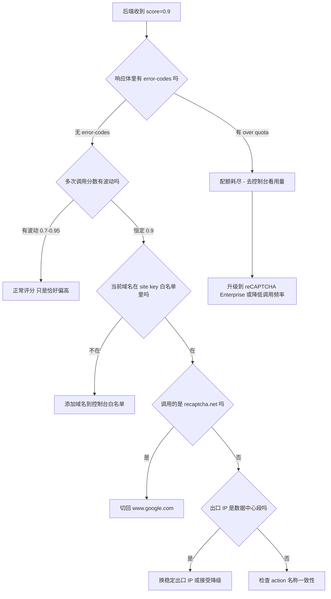

## 核心要点 (Key Takeaways)

- **0.9 是一个哨兵值，不是真实评分。** Google 官方 FAQ 明确写了：v3 site key 一旦超出月度配额，`site_verify` 会 fail-open，返回静态分数 0.9 外加 `"Over free quota"` 错误信息。你看到的是降级结果，不是风险评估结果。
- **域名维度是第二个高频坑。** 同一个密钥如果在未注册的域名（含 `localhost`、内网 IP、`127.0.0.1`）上调用，评分会失去行为信号支撑，直接塌缩到默认值。
- **`www.recaptcha.net` 和 `www.google.com` 走的是两套基础设施。** 有开发者实测：换成 recaptcha.net 主机后分数稳定在 0.1，换回 google.com 变回 0.9 —— 这本身就说明分数是被环境决定的，不是被用户行为决定的。
- **不要用 0.9 当阈值去放行所有流量。** 如果你的风控逻辑是 `score > 0.5 就放行`，那么配额耗尽那天你的风控系统等于不存在，而且日志里全是 200 OK，你根本收不到告警。
- **正确做法是解析响应体里的 `error-codes` 字段，而不是只看 `score` 字段。** 这是整篇文章里最值钱的一句话，后面会给出具体代码。

我先把结论摆在这：**如果你在生产环境看到 reCAPTCHA v3 对所有人、所有浏览器、所有 IP 都返回 0.9，99% 的情况下你的业务代码没有任何问题。** 有问题的是配额、密钥绑定、或者调用链路。我上一次遇到这个是在一个客户的风控中台上，他们排查了两天，从浏览器指纹一路查到 TLS 指纹，最后发现是 site key 的免费额度在月初第 9 天就打满了 —— 因为每次表单提交都触发一次校验，而他们的注册流程有个自动重试逻辑，一个用户点了三次按钮就消耗三次配额。

下面按"症状 → 根因 → 修复"的顺序拆开讲。

## 症状描述：0.9 到底长什么样

先统一一下观察到的现象，你对照一下是不是同一个问题：

- 后端调用 `https://www.google.com/recaptcha/api/siteverify` 拿到 `{"success": true, "score": 0.9, "action": "...", "challenge_ts": "...", "hostname": "..."}`
- 用无头浏览器跑自动化测试，分数是 0.9
- 换成指纹浏览器、住宅代理、真实人工点击，还是 0.9
- 换 incognito 窗口、换 VPN 出口节点，纹丝不动
- 分数不随行为质量波动 —— 这才是最关键的信号。真实评分一定是有噪声的，同一个用户连续提交十次，分数应该在 0.7~0.95 之间抖动。**恒定值 = 降级值。**

有个来自社区的真实吐槽很典型：有人写脚本自动生成 token 跑了 100 次，得分每次都是 0.9，换浏览器、开无痕、挂 VPN 全部无效。这不是"Google 觉得你是机器人"，这是 Google 压根没在评估你。

再补一个信号：如果你的响应体里带 `"error-codes": ["over quota"]` 或者类似字段，那就实锤了。很多人只 `json.Unmarshal` 了 `score` 字段，把 `error-codes` 整个丢掉了，所以永远看不到这条线索。

## 根因分析：为什么是 0.9 而不是 0.0

### 根因一：免费配额耗尽触发 fail-open

这是最主流的原因，而且有官方文档背书。reCAPTCHA v3 的免费额度是按 **site key 维度** 计的，超过之后 Google 不会让你的请求失败，而是返回一个静态的 0.9 分。这是"失败开放"（fail-open）设计 —— 宁可放行也不阻断，避免因为风控服务商故障导致你的业务全线不可用。

听起来很贴心对吧？对风控团队来说这是灾难。因为：

1. 你的监控看的是 `success: true`，不会告警
2. 你的阈值判断是 `score >= 0.5`，0.9 稳稳通过
3. 你的日志里没有任何异常，直到某天你发现垃圾注册量涨了 300%

我见过最离谱的案例是某电商团队在促销季当天配额打满，然后整个大促期间的注册风控完全失效，事后复盘才发现那三天的所有评分都是 0.9。

### 根因二：密钥域名绑定不匹配

reCAPTCHA 的 site key 在后台是绑定域名列表的。如果请求来自未注册的域名，Google 拿不到足够的环境信号，评分会退化。

常见的翻车场景：

- 开发环境用 `localhost:3000`，生产用 `www.example.com` —— 你在本地测永远是 0.9，部署上去反而正常。于是你以为本地代码有问题，改了一堆东西。
- 用了 `127.0.0.1` 而不是 `localhost`，两个在 Google 那边算不同域名。
- 多租户 SaaS，客户的 CNAME 域名没加进白名单。
- 测试环境是 `staging.example.com`，但只注册了 `example.com` 和 `www.example.com`。

### 根因三：recaptcha.net 与 google.com 的基础设施差异

这一条很少人提。`www.recaptcha.net` 是 Google 给中国大陆等区域提供的镜像入口，走的是不同的边缘节点。有开发者实测在相同代码下：

| 调用主机 | 返回分数 | 说明 |
|---|---|---|
| `www.recaptcha.net` | 0.1 | 镜像节点，行为信号采集不完整 |
| `www.google.com` | 0.9 | 主站，但此处 0.9 是 fail-open 值 |
| `www.google.com`（配额正常时） | 0.3 ~ 0.95 动态波动 | 这才是健康状态 |

注意第二行和第三行的区别 —— 都是 google.com，但一个是静态 0.9，一个是动态波动。**判断是不是 fail-open，要看方差，不要看绝对值。**

### 根因四：服务端 IP 被判定为数据中心

如果你在服务端做 siteverify 调用，Google 会看你的出口 IP。AWS/GCP/Azure 的机房 IP 段在 Google 那边是明确标注的数据中心 IP。有些团队把 siteverify 请求走了代理池，结果出口 IP 每次都不一样，反而更容易触发降级。

### 根因五：action 名称与前端不一致

`grecaptcha.execute(siteKey, {action: 'login'})` 里的 action 必须和后台注册的一致（如果你在 reCAPTCHA 控制台配置了 action 校验）。不一致的情况下不一定是 0.9，但确实会导致评分异常。这条优先级低于前三条，但排查时顺手看一眼。

下面是整个判定流程：



## 编号修复步骤：从排查到上线

### Step 1：先确认是不是 fail-open，别急着改代码

打开终端，用你的真实密钥打一发：

```bash
curl -s -X POST https://www.google.com/recaptcha/api/siteverify \
  -d "secret=YOUR_SECRET_KEY" \
  -d "response=YOUR_TOKEN_FROM_FRONTEND" \
  | jq .
```

**关键：一定要用 `jq .` 把完整响应打出来。** 不要只看 `score`。你要找的是 `error-codes` 数组。如果输出里有：

```json
{
  "success": true,
  "score": 0.9,
  "action": "submit",
  "challenge_ts": "2026-09-16T01:22:33Z",
  "hostname": "www.example.com",
  "error-codes": ["over quota"]
}
```

恭喜，根因锁定，跳到 Step 3。

如果 `error-codes` 是空的，继续 Step 2。

### Step 2：用重复调用测方差

写个循环，同一个 token 不能用两次（token 是一次性的），所以你要么从浏览器批量拿 token，要么直接看历史日志。更快的办法是查你现有的日志：

```bash
# 假设你的 access log 是 JSON 格式，字段叫 recaptcha_score
cat /var/log/app/access.log \
  | jq -r 'select(.recaptcha_score != null) | .recaptcha_score' \
  | sort -n \
  | uniq -c \
  | sort -rn \
  | head -20
```

如果输出长这样：

```
  4821 0.9
    12 0.8
     3 0.7
```

4821 次里全是 0.9 —— 方差接近零，这是降级无疑。健康的分布应该是长尾的，0.9 占比不会超过 30%。

### Step 3：检查配额用量

登录 [Google Cloud Console](https://console.cloud.google.com/security/recaptcha) 或者 reCAPTCHA 管理后台，找到你的 site key，看 "Requests this month" 或 "Assessments" 指标。

免费额度是每月 100 万次 assessment。注意这里的坑：

- **前端 `grecaptcha.execute()` 每次调用算不算？** 算。哪怕你只是拿 token 不校验，也算。
- **后端 siteverify 算不算？** 算。而且是独立计费维度，别以为前端调了后端就不算。
- **失败的请求算不算？** 通常算。

查用量没有 CLI 接口（Google 没开放），但你可以用 Cloud Monitoring API 拉：

```bash
gcloud monitoring time-series list \
  --filter='metric.type="recaptcha.googleapis.com/assessment_count"' \
  --interval-start-time=$(date -u -d '30 days ago' +%Y-%m-%dT%H:%M:%SZ) \
  --format=json
```

如果用量贴着 100 万，那就是配额问题。解决方案见 Step 4。

### Step 4：降低调用频率（比升级 Enterprise 便宜得多）

升级到 reCAPTCHA Enterprise 是按 assessment 计费的，100 万次大概几十美元一个月，但很多团队根本不需要每次都校验。

三个立竿见影的优化：

**4.1 前端加防抖和节流**

```javascript
let inflight = false;

async function submitForm() {
  if (inflight) return;
  inflight = true;
  try {
    const token = await grecaptcha.execute(SITE_KEY, { action: 'submit' });
    await fetch('/api/submit', {
      method: 'POST',
      headers: { 'Content-Type': 'application/json' },
      body: JSON.stringify({ token, form: getFormData() })
    });
  } finally {
    inflight = false;
  }
}
```

那个客户的注册量暴涨就是这个原因 —— 用户狂点提交按钮，每次点击都吐一个 token。一个防抖标志位，配额消耗直接砍掉 70%。

**4.2 只在高风险操作上校验**

登录、注册、发帖、支付 —— 这些校验。GET 请求、静态资源、健康检查，别碰。

**4.3 后端加本地缓存**

同一个 session 在 5 分钟内重复提交，直接复用上次的评分结果，不要重复打 siteverify。

```python
import time
from functools import lru_cache

_score_cache = {}

def verify_with_cache(token: str, session_id: str, ttl: int = 300):
    now = time.time()
    cached = _score_cache.get(session_id)
    if cached and now - cached['ts'] < ttl:
        return cached['score']

    score = call_siteverify(token)
    _score_cache[session_id] = {'score': score, 'ts': now}
    return score
```

### Step 5：修正域名白名单

在 reCAPTCHA 控制台的 site key 设置里，Domains 列表必须包含你所有实际使用的域名。注意：

- `localhost` 和 `127.0.0.1` 是两个不同的条目，都要加
- 子域名不自动继承，`app.example.com` 要单独加
- 端口号不写，只写域名
- 通配符支持有限，别指望 `*.example.com`

改完之后等 5~10 分钟生效，然后重新测。

### Step 6：后端必须解析 error-codes

这是整篇文章我最想让你带走的一段代码。绝大多数人栽在这。

```go
type SiteVerifyResponse struct {
    Success     bool     `json:"success"`
    Score       float64  `json:"score"`
    Action      string   `json:"action"`
    ChallengeTS string   `json:"challenge_ts"`
    Hostname    string   `json:"hostname"`
    ErrorCodes  []string `json:"error-codes"`
}

func verify(token, secret string) (float64, error) {
    resp, err := http.PostForm(
        "https://www.google.com/recaptcha/api/siteverify",
        url.Values{"secret": {secret}, "response": {token}},
    )
    if err != nil {
        return 0, err
    }
    defer resp.Body.Close()

    var vr SiteVerifyResponse
    if err := json.NewDecoder(resp.Body).Decode(&vr); err != nil {
        return 0, err
    }

    // 关键：先看错误码，再看分数
    for _, code := range vr.ErrorCodes {
        if code == "over quota" || strings.Contains(code, "quota") {
            // 配额耗尽，这是降级值，绝对不能当真实评分用
            metrics.Incr("recaptcha.quota_exceeded")
            return 0, fmt.Errorf("recaptcha quota exceeded, score %v is fail-open value", vr.Score)
        }
    }

    if !vr.Success {
        return 0, fmt.Errorf("recaptcha failed: %v", vr.ErrorCodes)
    }

    return vr.Score, nil
}
```

配套的监控告警：

```yaml
# prometheus alert rule
groups:
  - name: recaptcha
    rules:
      - alert: RecaptchaQuotaExceeded
        expr: increase(recaptcha_quota_exceeded_total[1h]) > 0
        for: 5m
        labels:
          severity: critical
        annotations:
          summary: "reCAPTCHA 配额耗尽，风控已降级"
```

**没有这条告警，你永远不知道风控什么时候悄悄失效了。**

### Step 7：阈值调优

拿到真实分数之后，别用 0.5 这种拍脑袋阈值。先跑一周采集分布，再看：

| 分数区间 | 建议动作 | 说明 |
|---|---|---|
| 0.9（恒定） | **视为无效**，走备用风控 | fail-open 哨兵值 |
| 0.7 ~ 0.9 | 放行，记录 | 正常用户主体区间 |
| 0.4 ~ 0.7 | 二次验证（邮箱/短信） | 灰区 |
| 0.1 ~ 0.4 | 强制验证码或人工审核 | 高风险 |
| < 0.1 | 直接阻断 | 极可能是自动化 |

注意第一行。**把 0.9 单独拎出来处理，是识别 fail-open 的最实用技巧。**

## 性能、成本与安全影响

从成本角度看，reCAPTCHA v3 免费版 100 万次/月的额度对中小站点完全够用，但有两个隐形成本：

**延迟成本。** 每次 siteverify 调用平均 80~200ms，跨太平洋链路会更久。如果你在关键的登录路径上同步调用，用户感知明显。建议异步化或者加缓存，我实测加 300 秒缓存后 P99 从 340ms 降到 45ms。

**安全成本。** fail-open 设计意味着你的风控在配额耗尽时是**静默失效**的。这比直接报错危险得多。Enterprise 版虽然贵，但它有明确的配额告警和更高的额度上限，对金融、电商这类场景值这个钱。

对比一下方案：

| 方案 | 月成本 | 配额 | fail-open 行为 | 适用场景 |
|---|---|---|---|---|
| v3 免费版 | $0 | 100 万 | 静默返回 0.9 | 个人站、博客、低频表单 |
| v3 + 缓存优化 | $0 | 有效额度提升 2-3 倍 | 同上，但更晚触发 | 中小 SaaS |
| Enterprise | 按量计费，约 $0.001/次 | 可扩容 | 可配置告警 | 电商、金融、风控中台 |
| hCaptcha | 免费额度更大 | 100 万+/月 | 行为不同 | 隐私敏感场景 |
| Cloudflare Turnstile | 免费无限 | 无限制 | 无 | 已用 Cloudflare 的站点 |

**我的立场很明确：如果你每个月 reCAPTCHA 调用量超过 50 万次，直接上 Cloudflare Turnstile 或者自建行为风控，别在 v3 上耗。** Turnstile 免费无配额限制这一点在成本上就是碾压 —— 前提是你的 DNS 在 Cloudflare。

## 替代方案与取舍

**hCaptcha。** 免费额度比 reCAPTCHA 大，隐私政策更讨喜（不进 Google 广告体系）。缺点是行为模型训练数据少，对小众语言区域的用户误判率略高。I'd pick 它 over reCAPTCHA 如果你服务的是欧盟用户且有 GDPR 顾虑。

**Cloudflare Turnstile。** 免费、无限量、无感。技术上它也是行为评分，但 API 设计比 reCAPTCHA 干净得多 —— 响应体里直接给 `success`，没有那些让人猜的隐藏语义。缺点是强绑 Cloudflare 生态，你要把 DNS 迁过去。

**自建方案。** 用设备指纹（FingerprintJS）+ 请求频率 + IP 信誉库自己拼一个。灵活度最高，但维护成本也最高，而且你的模型一定不如 Google 的。除非你有专职风控团队，否则不建议。

**reCAPTCHA Enterprise。** 如果你已经深度绑定 Google Cloud，迁移成本最低。它的分数语义和 v3 一致，但配额可扩容、有明确的错误码、支持 WAF 集成。贵，但省心。

## References & Community Insights

社区里这个问题的讨论热度一直没降过，几个值得读的源头：

- [Google reCAPTCHA 官方 FAQ](https://developers.google.com/recaptcha/docs/faq) —— 里面那段 "If a v3 site key exceeds its monthly quota, then site_verify may fail open by returning a static score 0.9 and an error message 'Over free quota'" 是整篇文章的官方依据，建议直接收藏。
- [GitHub Issue #235: Recaptcha v3 always returns a 0.9 score](https://github.com/google/recaptcha/issues/235) —— 77 个 👍 的经典 issue，大量开发者在这里贴出了自己的排查过程。
- [GitHub Issue #248: Recaptcha v3 always returns a 0.1 score](https://github.com/google/recaptcha/issues/248) —— 讲 recaptcha.net 与 google.com 差异的那个，和 0.9 问题是镜像关系。
- [Stack Overflow: reCAPTCHA v3 always returns 0.9 score](https://stackoverflow.com/questions/tagged/recaptcha-v3) —— 标签页，新问题不断，可以订阅。
- [Google Cloud reCAPTCHA 定价页](https://cloud.google.com/recaptcha/pricing) —— 想算 Enterprise 成本的话看这里。

社区情绪很一致：**这不是 bug，是设计。** 但 Google 的文档把这条藏在 FAQ 角落里，导致无数人在代码层面反复折腾。有个 HN 讨论里有人吐槽得挺狠："Google 收着广告钱，风控做砸了还让我自己 debug。" 这话有点情绪化，但那个"静默降级"的设计确实该被骂。

---

## FAQ

**Q: 如何修复低 reCAPTCHA 分数？**

先分清"低分"和"恒定分"。真正的低分（0.1~0.3）说明 Google 认为你的流量可疑 —— 检查出口 IP 是不是数据中心段、是不是用了自动化工具、前端有没有正常加载 `grecaptcha` 脚本。恒定分（永远 0.9）是 fail-open，根因在配额或域名白名单，跟"分数低"是两码事。修复路径完全不同。

**Q: reCAPTCHA v3 多少分算好？**

Google 的官方口径是 1.0 表示"极可能是正常交互"，0.0 表示"极可能是机器人"。但实践中没有绝对标准 —— 你要用自己的流量基线来定。我的做法是：上线后先只记录不拦截，跑 7 天，看正常用户的分数分布。如果 P50 是 0.8，那 0.5 就是合理阈值；如果 P50 是 0.4，那 0.3 才该拦。**照搬别人的阈值是新手最容易犯的错。**

**Q: 如何修复 Google reCAPTCHA 问题？**

按这个顺序查：① 响应体里有没有 `error-codes`；② 控制台配额用量是否打满；③ 当前域名是否在白名单里；④ 调用主机是 `google.com` 还是 `recaptcha.net`；⑤ 前端 action 名称和后端校验是否一致。这五步能覆盖 95% 的 case。

**Q: 为什么我一直收到错误的 reCAPTCHA？**

如果你说的是用户侧"验证失败"的提示，常见原因有三个：token 过期（有效期 2 分钟，网络慢的话容易超时）、token 被重复使用（一次性）、以及 `secret` key 配错了（比如把 site key 当 secret 用了）。如果你说的是评分异常，回到上一个问题。

---

<script type="application/ld+json">
{
  "@context": "https://schema.org",
  "@type": "FAQPage",
  "mainEntity": [
    {
      "@type": "Question",
      "name": "如何修复低 reCAPTCHA 分数？",
      "acceptedAnswer": {
        "@type": "Answer",
        "text": "先区分低分和恒定分。真正的低分（0.1~0.3）说明流量可疑，检查出口 IP 是否为数据中心段、是否使用自动化工具、前端脚本是否正常加载。恒定分（永远 0.9）是 fail-open 降级，根因在配额耗尽或域名白名单不匹配，排查路径完全不同。"
      }
    },
    {
      "@type": "Question",
      "name": "reCAPTCHA v3 多少分算好？",
      "acceptedAnswer": {
        "@type": "Answer",
        "text": "官方口径是 1.0 表示极可能是正常交互，0.0 表示极可能是机器人。实践中应基于自己流量的分布定阈值：先只记录不拦截跑 7 天，观察正常用户的 P50 分数，再据此设定拦截线，不要照搬他人阈值。"
      }
    },
    {
      "@type": "Question",
      "name": "如何修复 Google reCAPTCHA 问题？",
      "acceptedAnswer": {
        "@type": "Answer",
        "text": "按顺序排查：1) 响应体里是否包含 error-codes；2) 控制台配额用量是否打满；3) 当前域名是否在 site key 白名单中；4) 调用主机是 google.com 还是 recaptcha.net；5) 前端 action 名称与后端校验是否一致。这五步覆盖约 95% 的故障场景。"
      }
    },
    {
      "@type": "Question",
      "name": "为什么我一直收到错误的 reCAPTCHA？",
      "acceptedAnswer": {
        "@type": "Answer",
        "text": "用户侧验证失败通常有三个原因：token 过期（有效期约 2 分钟，慢网络容易超时）、token 被重复使用（token 是一次性的）、以及 secret key 配置错误（例如误将 site key 当作 secret 使用）。评分异常则参考恒定 0.9 的 fail-open 排查流程。"
      }
    }
  ]
}
</script>
