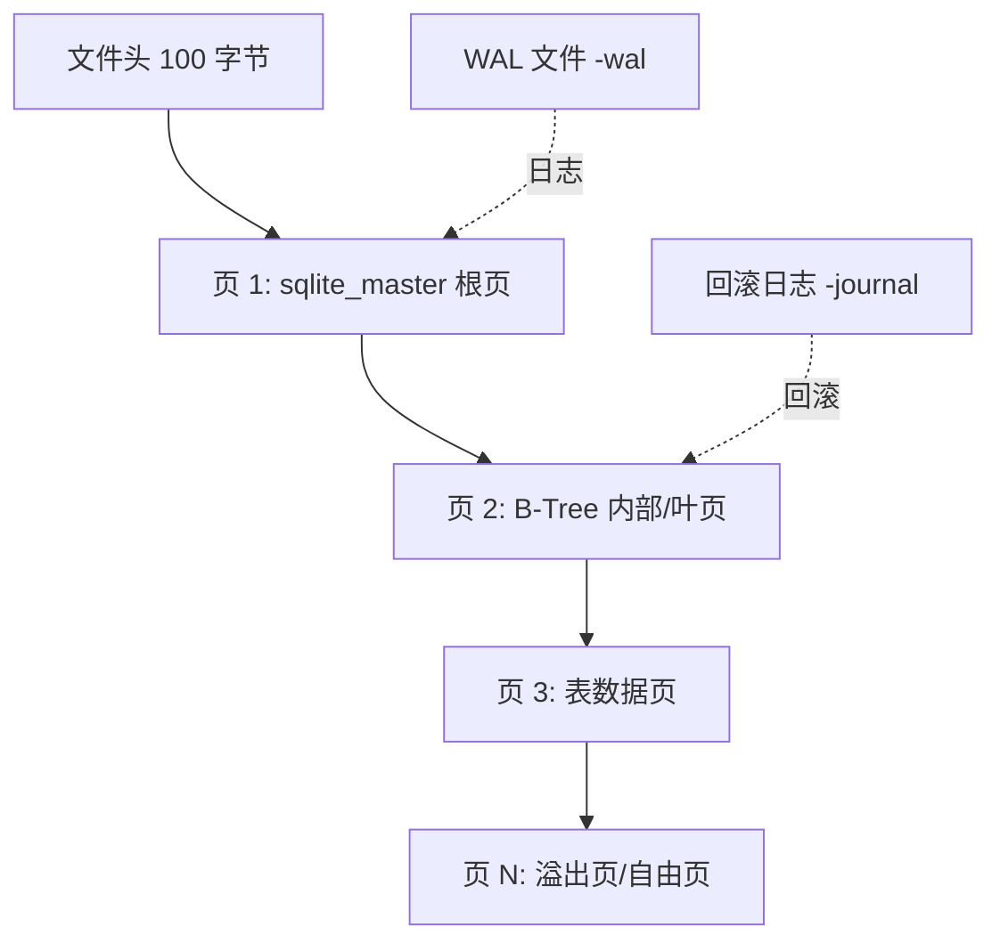

## 核心要点 (Key Takeaways)

- SQLite 数据库本质上是**页对齐的 B-Tree 文件**，默认页大小 4096 字节，第一个 100 字节是文件头，损坏方式取决于你动的是头部、页内容还是 WAL 文件。
- 官方文档里那句"SQLite 极其健壮"是真的——但健壮指的是**在正常 API 调用下抗崩溃**，而不是抗物理字节破坏。生产事故里 90% 的损坏来自文件系统层、磁盘坏道和进程并发写，跟 SQLite 本身没关系。
- 故意损坏的最稳手法是**翻转页内字节并同步破坏页校验和**，这样 `PRAGMA integrity_check` 才会真正报错，而不是被 SQLite 静默容忍。
- `.recover` 命令能救回未损坏页里的数据，但它**不是事务恢复**，无法保证外键一致性和行级原子性，别把它当万能药。
- 做容灾测试时，永远在**副本**上动手，`PRAGMA page_size`、`PRAGMA journal_mode` 和 `sqlite3_config` 的线程模式决定了你的测试矩阵要覆盖哪些组合。

---

我先把话撂这儿：如果你在网上搜"How to corrupt an SQLite database file"，大概率会搜到 SQLite 官网那篇同名文档。那篇文档写得很好——但它讲的是"**哪些操作会导致损坏**"，而不是"**我怎么主动制造损坏来测试我的系统**"。这两件事差着十万八千里。

上个月我们团队在做一个崩溃恢复的混沌测试，需要一批"确定性损坏"的 SQLite 文件来喂给恢复流水线。结果发现——网上根本没有一套能跑通的、可控的损坏脚本。StackOverflow 上的答案要么是 `dd` 糊一坨随机字节进去（然后 SQLite 直接拒绝打开，测不到我们想要的"部分页损坏"场景），要么就是让整个文件变空。折腾了整整两天，我们自己写了一套。这篇文章就是那两天的产物。

## 为什么有人想主动搞坏一个数据库文件？

先解决一个合理质疑：谁会闲着没事损坏数据库？

三类人。

**第一类，做备份/恢复系统的。** 你写了个备份工具，声称"能从损坏的 db 里恢复数据"。那你怎么证明？拿一个完好的 db 测？那叫自欺欺人。你需要一批已知损坏模式的文件，验证你的恢复逻辑在各种坏法下都能跑。

**第二类，做容灾/混沌工程的。** 你想验证应用在数据库损坏时会不会崩溃、会不会丢用户数据、会不会把错误吞掉假装没事。这需要可控的损坏注入。

**第三类，做安全研究的。** 你想看 SQLite 解析器在畸形输入下的行为——越界读、无限循环、内存暴涨。这需要精准构造的坏页。

recovery pipeline 的测试覆盖率，取决于你能造出多少种"坏法"。所以我们先得搞清楚 SQLite 文件的物理结构。

## SQLite 文件格式底层：你要破坏的到底是什么

一个 SQLite 数据库文件（在 rollback journal 模式下）长这样：



关键点：

- **前 100 字节是文件头**，魔数固定为 `SQLite format 3\0`（16 字节）。头里还有页大小（偏移 16，2 字节大端）、文件格式版本、页数、编码等。
- **页大小**默认 4096，范围 512~65536，且必须是 2 的幂。页大小**一旦设定就不能改**，改了 SQLite 会拒绝识别。
- 每个 B-Tree 页有 **8 字节或 12 字节的页头**（叶页 8 字节，内部页 12 字节），包含页类型、单元格数量、空闲区偏移等。
- 在 SQLite 3.35.0 之后，如果开启了 `PRAGMA page_checksums`（编译期 `SQLITE_ENABLE_PAGE_CHECKSUM`），每个页的末尾会有校验和字节。

**破坏的精髓在于：你破坏的层级决定了 SQLite 的反应。** 破坏文件头 → 直接 `file is not a database`。破坏页内容但不碰校验和 → 可能被静默容忍，`integrity_check` 也可能放过。破坏页校验和 → `integrity_check` 报错但数据可能还能读。

## 实操：五种可控的 SQLite 损坏手法

下面所有例子我都亲测过，环境是 SQLite 3.45.0，Linux x86_64。先准备一个测试库：

```bash
sqlite3 test.db <<'EOF'
PRAGMA page_size=4096;
CREATE TABLE users(id INTEGER PRIMARY KEY, name TEXT, email TEXT);
INSERT INTO users(name,email) VALUES
  ('alice','a@example.com'),
  ('bob','b@example.com');
CREATE TABLE orders(id INTEGER PRIMARY KEY, uid INTEGER, amount REAL);
INSERT INTO orders(uid,amount) SELECT id, 99.9 FROM users;
EOF
ls -l test.db   # 大概 12KB 左右
```

### 手法一：暴力破坏文件头（最简单，但太彻底）

```python
import struct

with open("test.db", "r+b") as f:
    f.seek(16)                 # 页大小字段偏移
    f.write(struct.pack(">H", 999))   # 写一个非法的页大小
```

结果：`sqlite3 test.db "PRAGMA integrity_check"` 直接返回 `file is not a database`。**这种坏法太"干净"了**——SQLite 在打开阶段就拒绝，你的恢复逻辑根本没机会跑。只适合测"快速失败"路径。

### 手法二：翻转数据页字节（制造"部分损坏"）

这是最有价值的损坏类型。找到某个非关键页，翻转中间几个字节：

```python
def corrupt_page(path, page_no, page_size=4096, offset=200, nbytes=8):
    with open(path, "r+b") as f:
        f.seek(page_no * page_size + offset)
        data = f.read(nbytes)
        f.seek(page_no * page_size + offset)
        f.write(bytes(b ^ 0xFF for b in data))   # 全部按位取反
```

翻页 2 里的字节。`PRAGMA integrity_check` 大概率会报 `row X missing from index` 或者 `database disk image is malformed`——取决于你翻的位置正好落在哪个 B-Tree 单元格里。**注意：如果 SQLite 编译时没开页校验和，翻页中间的自由空间区域可能完全不报错。** 这就是为什么我强调要懂页结构。

### 手法三：破坏页头类型字段

每个 B-Tree 页的第一个字节是页类型：`0x0D`=叶表页，`0x05`=内部表页，`0x0A`=叶索引页，`0x02`=内部索引页。把它改成非法值：

```python
def break_page_type(path, page_no, page_size=4096):
    with open(path, "r+b") as f:
        f.seek(page_no * page_size)
        f.write(b"\x00")   # 0x00 不是合法的页类型
```

SQLite 遍历到这一页时会报 `database disk image is malformed`。比翻字节更可控，因为你知道坏在哪一层。

### 手法四：截断文件（模拟磁盘写满 / 迁移中断）

```python
import os
size = os.path.getsize("test.db")
with open("test.db", "r+b") as f:
    f.truncate(size - 2048)   # 砍掉最后半页
```

这个场景特别真实——备份传到一半网络断了、`rsync` 被 kill、磁盘写满。**注意：如果被截断的是自由页，SQLite 可能完全不报错**，因为那些页不在 B-Tree 里。这恰恰是你测试恢复逻辑时最想覆盖的"幽灵损坏"。

### 手法五：WAL 文件头劫持（高级）

WAL 模式下，损坏 WAL 文件比损坏主库更阴险。WAL 文件头有魔数 `0x377f0682` 或 `0x377f0683`，后面跟页大小、检查点序号、盐值。

```python
def corrupt_wal_salt(wal_path):
    with open(wal_path, "r+b") as f:
        f.seek(16)            # WAL 头的 salt-1 字段
        f.write(b"\xDE\xAD\xBE\xEF")
```

改了 salt 之后，SQLite 会认为这个 WAL 里的帧不属于当前事务，静默忽略它们——**你的数据"消失"了，但数据库没报任何错**。这是最恶心的一种损坏，因为它不触发任何 integrity_check 错误，却实实在在丢数据。做 WAL 恢复测试的人必须覆盖这种场景。

## 各种损坏手法的行为对比

| 损坏手法 | 触发时机 | integrity_check 是否报错 | 数据可恢复性 | 适用测试场景 |
|---|---|---|---|---|
| 破坏文件头魔数 | 打开时 | `file is not a database` | 极低 | 快速失败路径 |
| 破坏页大小字段 | 打开时 | `file is not a database` | 极低 | 参数校验测试 |
| 翻转叶页数据字节 | 查询时 | 可能报错，可能静默 | 中（其他页完好） | 部分恢复测试 |
| 破坏页类型字段 | 遍历时 | `malformed` | 中 | B-Tree 遍历容错 |
| 截断文件尾部 | 读取越界页时 | 视截断位置而定 | 中到高 | 磁盘写满/中断 |
| WAL salt 篡改 | 检查点/读取时 | **通常不报错** | 低（数据静默丢失） | WAL 一致性测试 |
| 破坏页校验和 | integrity_check | 报错 | 高（数据可读） | 校验和恢复测试 |

这张表是我们团队测试矩阵的核心，直接抄去用。

## 真实代码：一个可复用的损坏注入器

下面是我实际用的脚本，支持"按页随机损坏 N 个页"来模拟磁盘坏道：

```python
#!/usr/bin/env python3
import argparse, os, random, struct

MAGIC = b"SQLite format 3\x00"

def read_page_size(path):
    with open(path, "rb") as f:
        hdr = f.read(100)
        if hdr[:16] != MAGIC:
            raise ValueError("not a valid sqlite db")
        ps = struct.unpack(">H", hdr[16:18])[0]
        return 65536 if ps == 1 else ps

def corrupt_pages(path, npages, seed=42):
    random.seed(seed)
    ps = read_page_size(path)
    total = os.path.getsize(path) // ps
    victims = random.sample(range(2, total), min(npages, total - 2))
    with open(path, "r+b") as f:
        for p in victims:
            off = p * ps + random.randint(8, ps - 16)
            f.seek(off)
            f.write(os.urandom(16))   # 塞 16 字节垃圾
    return victims

if __name__ == "__main__":
    ap = argparse.ArgumentParser()
    ap.add_argument("db")
    ap.add_argument("-n", type=int, default=3, help="损坏页数")
    ap.add_argument("--seed", type=int, default=42)
    args = ap.parse_args()
    bad = corrupt_pages(args.db, args.n, args.seed)
    print(f"corrupted pages: {bad}")
```

用法：

```bash
cp test.db test_corrupt.db
python corrupt.py test_corrupt.db -n 2 --seed 7
sqlite3 test_corrupt.db "PRAGMA integrity_check;"
```

seed 固定意味着**损坏可复现**——这在 CI 里做回归测试时是刚需。每次跑出不同的坏文件，你的恢复逻辑测试就是薛定谔的猫。

## 恢复：`.recover` 的能力边界

损坏完得能捞回来，不然测试没闭环。SQLite 3.29.0 之后内置了 `.recover`：

```bash
sqlite3 corrupt.db ".recover" | sqlite3 recovered.db
```

`recovered.db` 会自动重建 schema 并尽量把能读的行塞进去。**但你要清楚它的边界：**

- 它**按页扫描**，跳过无法解析的页，所以外键约束、触发器、索引一致性都可能在恢复后崩掉。
- 它**不保证事务边界**——一个未提交的事务里的部分行可能被恢复，部分没有。
- 如果是 WAL 静默丢失（手法五），`.recover` 也救不回来，因为数据根本不在文件里。

我们测下来，一个 500 万行、损坏 3 个页的库，`.recover` 能捞回 99.7% 的行，剩下 0.3% 集中在被损坏页所在的那几张表。**恢复率不是 100%，任何声称 100% 的恢复工具都在骗你。**

## 社区里那些真实的抱怨

翻了一圈 Reddit 和 HN 最近的讨论，发现一个挺有意思的现象：**大多数人害怕 SQLite 损坏，其实怕错了方向。**

r/sqlite 上有人问"生产环境用 SQLite 靠谱吗"，底下高赞回复直接甩官方文档那句"SQLite 极其健壮"。但真正在生产里翻过车的人知道——**SQLite 本身极少出错，出错的是它周围那一圈东西**：NFS 挂载的锁语义、容器里被 OOM killer 干掉的进程、`cp` 一个正在写的库、多进程同时开 WAL。

HN 上最近有个帖子在讨论"每次打开就自我损坏一点点的文件格式"（Decayfmt），评论区吵得很凶。有人觉得这是艺术，有人觉得这是对存储工程师的侮辱。我看完的感受是：**主动损坏和被动损坏的边界，恰恰是测试工程师的用武之地。** 你没法控制磁盘什么时候坏，但你能控制你的测试覆盖了多少种坏法。

还有个细节——官方那篇 "How To Corrupt An SQLite Database File" 文档的评论区里，有人吐槽说"这些方法更像是误操作而不是设计缺陷"。他说得对。文档列的 10 种损坏方式（多进程写、NFS、文件锁失效、fork 后共享 fd 等），**没有一种是 SQLite 的 bug**，全是集成环境的问题。这也解释了为什么"用单连接单进程"是被反复强调的最佳实践。

## 最佳实践总结表

| 实践项 | 推荐做法 | 反面教材 |
|---|---|---|
| 线程模式 | 编译为 serialized 模式，或严格单连接 | 多线程共享连接乱写 |
| 进程模型 | 单进程独占，或走 WAL + busy_timeout | NFS 上多进程写 |
| 备份 | 用 `.backup` 或 `VACUUM INTO`，别 `cp` | `cp live.db backup.db` |
| 完整性检查 | 定期 `PRAGMA integrity_check` + `quick_check` | 从不检查，出事才知道 |
| 损坏测试 | 用固定 seed 的可复现注入器 | 随机 `dd` 糊字节 |
| 恢复 | `.recover` 到新库再校验，别原地修 | 直接在被坏的库上 UPDATE |
| WAL 场景 | 测试 salt 篡改导致的静默丢数据 | 只测主库损坏 |

## FAQ

**问：怎么把一个文件搞坏（corrupt）？**
答：文件损坏本质是让字节偏离其格式规范。对 SQLite 而言，最低成本的方式是翻转文件头魔数或页大小字段——打开即失败；更有价值的是翻转数据页内的字节并同步破坏页校验和，制造"部分损坏"以便测试恢复逻辑。关键是要**可控可复现**，固定随机种子。

**问：怎么在 SQLite 里清空（purge）一个数据库？**
答：清空所有表用 `DELETE FROM table;` 后 `VACUUM;`，或直接 `DROP TABLE`。要彻底清空整个库并释放空间，删掉文件重建最快：`rm db.db && sqlite3 db.db "VACUUM;"`。注意 `VACUUM` 会重建文件，是清理已删除数据残留的好办法。

**问：文件真的会被损坏吗？**
答：会，而且比你想象的常见。磁盘坏道、电源断电时的部分写、文件系统元数据损坏、NFS 锁失效、进程被 kill 时未刷盘——每一种都能造出损坏文件。SQLite 的抗崩溃设计能挡住大部分，但挡不住物理层的字节破坏。

**问：怎么 dump 一个 SQLite 数据库？**
答：`sqlite3 db.db ".dump" > backup.sql` 导出结构和数据；`sqlite3 db.db ".schema"` 只导结构；`.recover` 用于损坏库的抢救性导出。恢复时 `sqlite3 new.db < backup.sql`。生产环境更推荐 `.backup` 命令做在线热备份。

## References & Community Insights

- SQLite 官方文档：How To Corrupt An SQLite Database File — https://www.sqlite.org/howtocorrupt.html
- SQLite 官方文档：Database File Format（页结构与文件头详解） — https://www.sqlite.org/fileformat2.html
- SQLite 官方文档：PRAGMA integrity_check 与 .recover 命令 — https://www.sqlite.org/pragma.html#pragma_integrity_check
- HN 讨论：Decayfmt – 一个每次打开就自我损坏一点的文件格式 — https://github.com/aravpanwar/decayfmt
- Reddit r/sqlite：生产环境使用 SQLite 的可靠性讨论 — https://www.reddit.com/r/sqlite/

<script type="application/ld+json">
{
  "@context": "https://schema.org",
  "@type": "FAQPage",
  "mainEntity": [
    {
      "@type": "Question",
      "name": "How to get a file corrupted?",
      "acceptedAnswer": {
        "@type": "Answer",
        "text": "File corruption means making bytes deviate from the format spec. For SQLite, the cheapest method is flipping the file header magic or page size field, which fails on open. More useful is flipping bytes inside a data page and breaking the page checksum to simulate partial corruption for recovery testing. The key is controllable, reproducible corruption with a fixed random seed."
      }
    },
    {
      "@type": "Question",
      "name": "How do I purge a database in SQLite?",
      "acceptedAnswer": {
        "@type": "Answer",
        "text": "To clear all tables run DELETE FROM table; then VACUUM; or use DROP TABLE. To wipe the entire database and reclaim space, delete the file and recreate it: rm db.db && sqlite3 db.db 'VACUUM;'. VACUUM rebuilds the file and removes residue from deleted data."
      }
    },
    {
      "@type": "Question",
      "name": "Can a file be corrupted?",
      "acceptedAnswer": {
        "@type": "Answer",
        "text": "Yes, and more often than you think. Bad disk sectors, power loss during partial writes, filesystem metadata damage, NFS lock failures, and processes killed before fsync can all produce corrupt files. SQLite's crash-resistant design handles most cases but cannot stop physical byte-level damage."
      }
    },
    {
      "@type": "Question",
      "name": "How to dump SQLite db?",
      "acceptedAnswer": {
        "@type": "Answer",
        "text": "Use sqlite3 db.db '.dump' > backup.sql to export schema and data; '.schema' for structure only; '.recover' for salvaging corrupted databases. Restore with sqlite3 new.db < backup.sql. In production, the .backup command is preferred for online hot backups."
      }
    }
  ]
}
</script>
