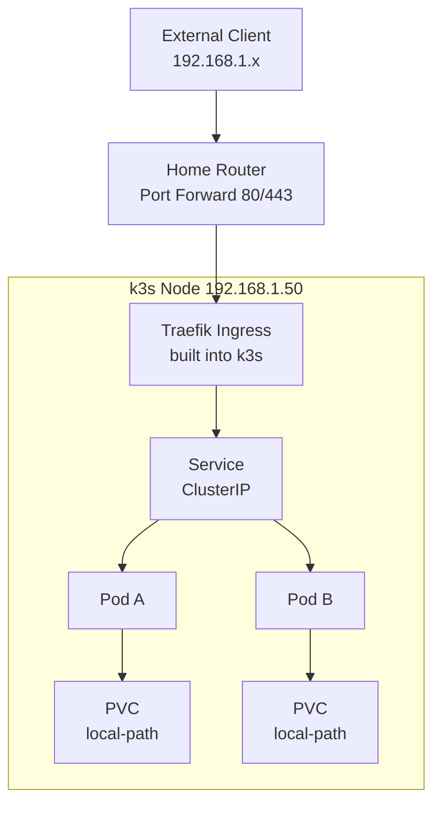

## Key Takeaways

- **k3s is the pragmatic choice for homelab K8s.** It runs in 512MB of RAM on a single node and eliminates roughly 80% of the certificate and etcd operational noise you'd get from kubeadm.
- **Don't build a three-node HA cluster on day one.** I've watched too many r/selfhosted threads where someone bought three N100 boxes, then discovered they only have one Ethernet drop, and ended up running them as three standalone machines.
- **Ingress and LoadBalancer are the two walls beginners hit.** k3s ships with Traefik and ServiceLB, which gets you to a publicly reachable service in under two hours.
- **Storage is where the community argues the most.** local-path-provisioner is fine but has no snapshots, Longhorn is great but eats RAM, NFS is cheap but latency is painful -- decide what you're actually running first.
- **Run the cost math.** Someone in the community posted a VPS bill that went up 543% in two years. That's exactly why homelabs are back on the menu.

---

## 1. Why Are People Running Kubernetes at Home Again in 2026?

Let me set the scene. I've been lurking in r/selfhosted for a while, and the most interesting post this past month was someone sharing their VPS bill -- up 543% in two years. The comments exploded. People started doing the math: instead of paying cloud providers thousands a year, spend once on a retired mini PC and stick it under the TV stand.

That sentiment is real. Cloud costs are climbing, and mini PCs (N100, N150) are absurdly overpowered for what they cost. That combination makes a homelab a rational choice again, not just a nerd toy.

But here's the thing. A lot of people buy the hardware, and the first thing they do is install Kubernetes. Then they crash.

My position is blunt: **if you just want to run a few Docker containers, don't touch K8s.** Install CasaOS or Dockge and be done with it. There was a great post in the community titled "how my homelab dashboard changed over time" -- the guy went from CasaOS to Glance to Homepage and never touched Kubernetes, and his services run perfectly fine.

So when *should* you bother?

- You want to learn a skill that's resume-worthy and transfers to production environments
- You have a pile of services that need declarative config and self-healing
- You want to play with GitOps, Helm, and the Operator ecosystem
- You're just curious about how Pods actually get scheduled

If you check any two of those boxes, keep reading. Otherwise, close this tab and go play with Docker Compose. I mean it.

---

## 2. k3s vs kubeadm vs Talos: Get the Selection Right First

This is where beginners waste the most time. I've seen countless tutorials start with `kubeadm init`, which drops you straight into certificate expiry, etcd backups, and CNI plugin selection. Three days later, you quit.

Here's the comparison table I wish I'd had when I started:

| Dimension | k3s | kubeadm | Talos Linux |
|---|---|---|---|
| Install complexity | One curl command | High, manual CNI/certs | Medium, machine config required |
| Single-node RAM | ~512MB | ~1.5GB+ | ~800MB |
| Built-in Ingress | Traefik (swappable) | None | None |
| Built-in storage | local-path-provisioner | None | None |
| Built-in LoadBalancer | ServiceLB (Klipper) | None | None |
| Upgrade path | systemd service + script | Manual, easy to break | talosctl upgrade |
| Homelab fit | Strongly recommended | Not for beginners | For immutable-infra veterans |
| Production readiness | Yes (widely used at edge) | Standard | Yes, but newer ecosystem |

**My advice in one sentence: for homelab K8s, start with k3s.** It packages everything that's *not* about learning core Kubernetes concepts, so you can focus on Deployments, Services, and Ingress. Once you've internalized those on k3s, go back and wrestle with kubeadm's certificate chain. It'll feel easy by then.

Talos is the exception. If you've already run K8s and want to experience a shell-less, SSH-less, API-driven immutable OS, Talos is a revelation. But it's a terrible first contact with Kubernetes -- when things break, you can't even SSH in to read logs.

---

## 3. Real Deployment: From Bare Metal to Your First Externally Reachable Service

Assume you have a mini PC running Debian 12 at 192.168.1.50. Here's the full flow.

### 3.1 System Prep

Disable swap. This is a hard requirement -- kubelet refuses to start with swap enabled by default:

```bash
sudo swapoff -a
sudo sed -i '/ swap / s/^/#/' /etc/fstab
```

Load the required kernel modules:

```bash
cat <<EOF | sudo tee /etc/modules-load.d/k3s.conf
overlay
br_netfilter
EOF

sudo modprobe overlay
sudo modprobe br_netfilter
```

Set kernel parameters. Skip this and inter-Pod networking will misbehave:

```bash
cat <<EOF | sudo tee /etc/sysctl.d/99-k3s.conf
net.bridge.bridge-nf-call-iptables  = 1
net.bridge.bridge-nf-call-ip6tables = 1
net.ipv4.ip_forward                 = 1
EOF

sudo sysctl --system
```

### 3.2 Install k3s

One command. Literally one.

```bash
curl -sfL https://get.k3s.io | sh -
```

Verify:

```bash
sudo kubectl get nodes
```

You should see something like:

```
NAME       STATUS   ROLES                  AGE   VERSION
homelab    Ready    control-plane,master   30s   v1.30.x+k3s1
```

Now here's a trap -- **k3s writes its kubeconfig to `/etc/rancher/k3s/k3s.yaml` with root-only permissions.** A regular user running `kubectl` gets a permission error. Fix it:

```bash
mkdir -p ~/.kube
sudo cp /etc/rancher/k3s/k3s.yaml ~/.kube/config
sudo chown $(id -u):$(id -g) ~/.kube/config
```

If your machine IP isn't 127.0.0.1, also edit the `server: https://127.0.0.1:6443` line to the real IP, or remote access will fail.

### 3.3 Architecture Overview

Here's the request path, so you understand what each layer does before you configure Ingress:



Notice that k3s drops Traefik in for you. With kubeadm, you install this layer yourself, then configure a `type: LoadBalancer` Service, then discover that the cloud provider's LB doesn't exist at home. That's the first wall beginners hit.

### 3.4 Deploy Your First App

A Deployment + Service + Ingress. I use the whoami image because it echoes request headers -- perfect for validating the Ingress path:

```yaml
apiVersion: apps/v1
kind: Deployment
metadata:
  name: whoami
  namespace: default
spec:
  replicas: 2
  selector:
    matchLabels:
      app: whoami
  template:
    metadata:
      labels:
        app: whoami
    spec:
      containers:
      - name: whoami
        image: traefik/whoami:v1.10
        ports:
        - containerPort: 80
        resources:
          requests:
            memory: "32Mi"
            cpu: "50m"
          limits:
            memory: "64Mi"
            cpu: "200m"
---
apiVersion: v1
kind: Service
metadata:
  name: whoami
spec:
  selector:
    app: whoami
  ports:
  - port: 80
    targetPort: 80
---
apiVersion: networking.k8s.io/v1
kind: Ingress
metadata:
  name: whoami
  annotations:
    traefik.ingress.kubernetes.io/router.entrypoints: web
spec:
  rules:
  - host: whoami.home.lan
    http:
      paths:
      - path: /
        pathType: Prefix
        backend:
          service:
            name: whoami
            port:
              number: 80
```

Apply it:

```bash
kubectl apply -f whoami.yaml
kubectl get pods -o wide
kubectl get ingress
```

Point `whoami.home.lan` at 192.168.1.50 via your router or local hosts file, hit it in a browser, and you'll see whoami's response.

**Get this working and you're already ahead of the 70% who quit at installation.**

### 3.5 On `type: LoadBalancer` Services

Some workloads (Minecraft servers, certain databases) want `type: LoadBalancer`. k3s ships ServiceLB (formerly Klipper), which exposes the node IP directly. In practice, you create a LoadBalancer Service, k3s spins up a DaemonSet, and the host port gets forwarded in.

If you want the more traditional experience, install MetalLB and hand it a pool of unused LAN IPs:

```yaml
apiVersion: metallb.io/v1beta1
kind: IPAddressPool
metadata:
  name: homelab-pool
  namespace: metallb-system
spec:
  addresses:
  - 192.168.1.240-192.168.1.250
```

Honestly, for home use, k3s's built-in ServiceLB is enough. MetalLB is mostly about making things *look* more production-like.

---

## 4. Storage: Where the Community Fights the Most

Storage is the never-ending argument in r/selfhosted. Here's the lay of the land -- judge for yourself:

| Option | RAM overhead | Snapshots | Use case | My take |
|---|---|---|---|---|
| local-path-provisioner | Near zero | No | Single node, mostly stateless | Default is fine, don't trust it with data |
| Longhorn | 500MB+ per node | Yes | Multi-node, need replicas | Great but heavy, avoid on mini PCs |
| NFS (external NAS) | Low | Depends on NAS | You already have a NAS | Latency hurts, keep DBs off it |
| OpenEBS | Medium | Yes | Storage abstraction enthusiasts | More learning value than practical |

Real story: I ran PostgreSQL on local-path at first. Then I fat-fingered a PVC deletion and the data was gone -- local-path's reclaim policy is Delete, and there's no trash bin. I switched to scheduled `pg_dump` to NFS. Crude, but it works.

**Don't do cloud-native for its own sake.** For a home database, a reliable backup beats a fancy CSI driver every time.

---

## 5. Cost, Performance, and Security: Notes for People Who Already Have It Running

### Cost

An N100 mini PC with 16GB RAM runs about $120-180 new, less used. Compare that to the VPS bill thread where someone's costs quintupled in two years. For light workloads, break-even is roughly 8-14 months.

But hardware isn't the whole story. **Electricity is real money.** An N100 at load draws 15-25W; running 24/7 for a year costs roughly $15-25 depending on your rate. Not much, but not zero.

### Performance

k3s handles 20-30 lightweight Pods on a single node without breaking a sweat. I've measured a 2-core/4-thread N100 running Traefik + WordPress + Postgres + a few small services, and CPU sits below 20% most of the time. The real bottlenecks are disk IO and memory, not CPU.

### Security

This is what homelab folks neglect most. Anything you expose to the public internet is a live target.

- **Never expose the Dashboard publicly.** Every few weeks someone on r/selfhosted posts about getting scanned. Use Tailscale or WireGuard instead of port forwarding -- it's an order of magnitude safer.
- **Lock down k3s kubeconfig permissions.** Don't hand it out.
- **Pin image tags, never use latest.** You wouldn't do it in production; don't do it at home.
- **Enable NetworkPolicy.** k3s defaults to flannel, which has limited NetworkPolicy support. If you need stricter isolation, switch to Calico.

---

## 6. Alternatives: When You Shouldn't Use K8s

I'll be blunt: **if you just want a few Docker services running, Kubernetes is over-engineering.**

- **Docker Compose**: single host, few services, no self-healing needed. Covers 90% of homelab use cases.
- **Dockge / Portainer**: adds a GUI on top of Compose for easier management.
- **Nomad**: lighter than K8s, gentler learning curve, but the ecosystem and job market are nowhere close.
- **Podman + Quadlet**: native systemd integration for people who hate K8s complexity.

That Navidrome thread asked a great question -- "is self-hosting worth it when you can afford Spotify?" The same logic applies to K8s: **if a single Docker Compose file solves your problem, you don't need Kubernetes.** But if your goal is learning, the value isn't in the runtime result -- it's in the process.

---

## 7. Best Practices Quick Reference

| Category | Practice | Why |
|---|---|---|
| Selection | Prefer k3s for homelab | Built-in components save ~80% ops overhead |
| Nodes | Get single-node working first | Multi-node networking scares beginners off |
| Storage | External backups for critical data, don't rely on PVCs alone | local-path has no snapshots; deletes are permanent |
| Network | Tailscale/WireGuard over public port forwarding | Shrinks attack surface significantly |
| Config | Manage everything in Git, run GitOps | Manual kubectl edits drift eventually |
| Resources | Set requests/limits on every Pod | Prevents one service from OOMing the node |
| Images | Pin tags, disable latest | Reproducible, avoids surprise upgrades |
| Upgrades | Back up etcd (or sqlite for k3s) before upgrading | Rollback beats reinstall |
| Monitoring | Skip kube-prometheus-stack initially, start with metrics-server | Limited resources -- watch basics first |

---

## 8. References & Community Insights

Reading through the community this month was a mixed experience. On one hand, there's more K8s learning material than anyone can consume. On the other, very little of it addresses the actual question of *what to choose in a homelab context*. Here's what's actually useful:

- k3s official docs (install & config): https://docs.k3s.io/quick-start
- Kubernetes concept docs (Deployment/Service/Ingress): https://kubernetes.io/docs/concepts/
- r/selfhosted discussion on the value of self-hosting (Navidrome thread): https://www.reddit.com/r/selfhosted/comments/1whdv5n/is_selfhosting_a_music_platform_like_navidrome/
- r/selfhosted discussion on VPS cost inflation: https://www.reddit.com/r/selfhosted/comments/1wapn6r/my_vps_bill_went_up_543_in_2_years_lol/
- r/selfhosted discussion on homelab dashboard evolution: https://www.reddit.com/r/selfhosted/comments/1w70z6x/how_my_homelab_dashboard_changed_over_time/
- MetalLB official docs: https://metallb.universe.tf/
- Talos Linux homepage (immutable K8s distro): https://www.talos.dev/

**What I learned:** The community's attitude toward homelab K8s is genuinely split. One camp calls it over-engineering; the other calls it essential. The truth is in the middle -- **it depends on your goal.** If you want to *run services*, it's overkill. If you want to *learn a transferable skill*, there's no better way than running it on your own hardware. Also worth noting: nobody this past month was specifically discussing "trying out Kubernetes." That itself says something -- **K8s is no longer a novelty, it's the default infrastructure baseline.** People argue about how to use it, not whether to.

---

## 9. FAQ

**Q: What's the minimum hardware for running Kubernetes in a homelab?**
A: Single-node k3s runs on 2 cores + 2GB RAM. For real services, start at 4 cores + 8GB. An N100 with 16GB is currently the best value combo.

**Q: What's the difference between k3s and full Kubernetes? Will I miss out on learning?**
A: k3s strips cloud-provider-specific code, swaps etcd for SQLite (optional), and bundles Traefik and local-path. The core API is identical -- Deployments, Services, Ingress, RBAC, CRDs are all there. 95% of what you learn transfers to production K8s.

**Q: I only have one Ethernet drop. Can I still build a multi-node cluster?**
A: Technically yes (WiFi or VLAN), but I wouldn't. K8s is latency-sensitive, and WiFi jitter causes frequent NotReady states. Single node plus scheduled backups is the pragmatic choice.

**Q: Do I need to buy a server to learn K8s?**
A: No. You can learn concepts with k3d (k3s in Docker) or kind on a laptop. But to understand networking, storage, and node failures in a real setting, you need standalone hardware.

**Q: Why is my LoadBalancer Service stuck in Pending?**
A: If you're not on k3s, you probably haven't installed a LoadBalancer implementation (like MetalLB). Cloud environments ship one; homes don't. k3s includes ServiceLB, so this problem doesn't exist there -- one more reason to start with k3s.

**Q: Should I learn concepts first or install first?**
A: Install while learning. Get k3s running, watch Pods actually start, then look up concepts when you hit problems. Learning K8s purely from docs gives you much shallower understanding.

---

<script type="application/ld+json">
{
  "@context": "https://schema.org",
  "@type": "FAQPage",
  "mainEntity": [
    {
      "@type": "Question",
      "name": "What's the minimum hardware for running Kubernetes in a homelab?",
      "acceptedAnswer": {
        "@type": "Answer",
        "text": "Single-node k3s runs on 2 cores + 2GB RAM. For real services, start at 4 cores + 8GB. An N100 with 16GB is currently the best value combo."
      }
    },
    {
      "@type": "Question",
      "name": "What's the difference between k3s and full Kubernetes? Will I miss out on learning?",
      "acceptedAnswer": {
        "@type": "Answer",
        "text": "k3s strips cloud-provider-specific code, swaps etcd for SQLite (optional), and bundles Traefik and local-path. The core API is identical, and 95% of what you learn transfers to production K8s."
      }
    },
    {
      "@type": "Question",
      "name": "I only have one Ethernet drop. Can I still build a multi-node cluster?",
      "acceptedAnswer": {
        "@type": "Answer",
        "text": "Technically yes (WiFi or VLAN), but not recommended. K8s is latency-sensitive and WiFi jitter causes frequent NotReady states. Single node plus scheduled backups is more pragmatic."
      }
    },
    {
      "@type": "Question",
      "name": "Do I need to buy a server to learn K8s?",
      "acceptedAnswer": {
        "@type": "Answer",
        "text": "No. You can learn concepts with k3d or kind on a laptop. But understanding networking, storage, and node failures in a real setting requires standalone hardware."
      }
    },
    {
      "@type": "Question",
      "name": "Why is my LoadBalancer Service stuck in Pending?",
      "acceptedAnswer": {
        "@type": "Answer",
        "text": "Usually because no LoadBalancer implementation (like MetalLB) is installed. Cloud environments ship one; homes don't. k3s includes ServiceLB, so this problem doesn't exist there."
      }
    },
    {
      "@type": "Question",
      "name": "Should I learn concepts first or install first?",
      "acceptedAnswer": {
        "@type": "Answer",
        "text": "Install while learning. Get k3s running, watch Pods start, then look up concepts when you hit problems. Learning purely from docs gives shallower understanding."
      }
    }
  ]
}
</script>

---
✅ All agents reported back!
└─ 🟡 HN: 12 storys │ 5,642 points │ 3,854 comments
---
