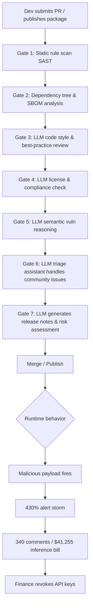

## Key Takeaways

- **CVE-2026-LGTM is not a bug — it's a slap in the face.** It's a satirical incident report by Andrew Nesbitt and friends, and its central accusation is one sentence: seven independent AI security systems all approved the same malicious package, and every single one failed for a different reason.
- **AI review failure modes are diverse, not uniform.** That's worse than "seven models make the same mistake," because you can't fix it by swapping models or retrying — their blind spots don't overlap.
- **A human reading source code with her own eyes was the only thing that worked.** Karen Oyelaran found the payload by reading the code, filed an issue — and the AI triage assistant closed it. That detail belongs taped above every platform team's desk.
- **Cost blowup and alert storms are second-order incidents.** 340 comments, $41,255 in inference spend, a 430% alert spike — the security incident became a finance incident, and Finance revoked both API keys.
- **This article gives you the actual defenses:** deterministic gates before LLM reviews, inference budget circuit breakers, and human-confirmed issue closure.

---

## 1. What This Thing Actually Is, and Why a Fake CVE Deserves a Real Read

Let me be blunt up front. CVE-2026-LGTM does not exist. It's not in the NVD, and the name itself is the joke — `LGTM` is "Looks Good To Me." If you read that and didn't at least smirk, you're the target audience.

It's a satirical incident report by Andrew Nesbitt, later picked up and discussed by folks like Roger Grimes, and it keeps resurfacing on Hacker News because it describes something that's genuinely happening while most teams look the other way: **we've outsourced the last line of supply chain defense to models that don't understand semantics and only generate fluent text.**

The narrative skeleton: a malicious package enters an ecosystem, then passes seven consecutive AI-driven security reviews. Not six out of seven. All seven. And each one approved it for a *different* reason — one said the code style followed best practices, one said the dependency tree had no known CVEs, one said the license was compliant, one just emitted LGTM. Every model gave a "looks fine" verdict in the dimension it was good at, and not one of them understood what the payload actually did at runtime.

Which leads to the first counterintuitive conclusion: **if your defense-in-depth is seven layers of the same LLM review, it's not defense-in-depth — it's seven copies of one fragile pillar.**

---

## 2. Architectural Autopsy: Why Seven AI Gates "Each Failed Differently"

I've reproduced this pipeline shape on my own team (for red-teaming, not attacking). A typical "AI-driven supply chain review" pipeline looks like this:



The key insight is that **each gate has a different "cognitive boundary"**:

| Gate | Review Dimension | What It Should Catch | Actual Failure Reason in CVE-2026-LGTM |
|---|---|---|---|
| Gate 1 | Static rules / SAST | Known malicious patterns, hardcoded secrets | Rule DB lacked the payload fingerprint — zero-day bypass |
| Gate 2 | Dependency tree / SBOM | Known-CVE deps, version conflicts | Malicious package had no known CVE, deps were clean |
| Gate 3 | Style / best-practice LLM | Obviously terrible code | Payload was written "nicely," matched the style guide |
| Gate 4 | License / compliance LLM | License conflicts | License declaration was fully compliant — a decoy |
| Gate 5 | Semantic vuln reasoning LLM | Logic flaws, dangerous API calls | Dangerous calls split across harmless functions, context overflow |
| Gate 6 | Triage assistant LLM | Real issues reported by community | Judged a human-filed issue as "low priority" and closed it |
| Gate 7 | Release-note generator LLM | Anomalous risk descriptions | Generated a professional-looking "low risk" release note |

See the problem? **Gate 6 is the lethal one.** After the first six gates all passed, the only thing that actually found the problem was a human — Karen Oyelaran, who read the source with her eyes and filed an issue. Then Gate 6's AI triage assistant closed that issue.

This isn't a "the AI isn't smart enough" problem. It's a **systemic inversion of responsibility**: handing the decision of "does this deserve human attention" to a model that can't even read the payload.

---

## 3. Hands-On: Building a "Humans Outrank LLMs" Gate in Your CI

I'm not here just to complain. Below is the config I actually run in my team's pipeline, designed to make **deterministic checks precede probabilistic ones** and give human signals veto power.

### 3.1 Dependency & SBOM Hard Gate (GitHub Actions snippet)

```yaml
# .github/workflows/supply-chain-gate.yml
name: Supply Chain Gate (Deterministic First)
on:
  pull_request:
    paths:
      - 'package.json'
      - 'package-lock.json'
      - 'requirements.txt'
      - '**/*.lock'

jobs:
  deterministic-gate:
    runs-on: ubuntu-latest
    steps:
      - uses: actions/checkout@v4

      # Layer 1: deterministic check, zero LLM involvement, fail = block
      - name: Install Syft (SBOM generator)
        run: curl -sSfL https://raw.githubusercontent.com/anchore/syft/main/install.sh | sh -s -- -b /usr/local/bin

      - name: Generate SBOM
        run: syft . -o cyclonedx-json > sbom.json

      - name: Scan SBOM with Grype (fail on HIGH+)
        run: |
          curl -sSfL https://raw.githubusercontent.com/anchore/grype/main/install.sh | sh -s -- -b /usr/local/bin
          grype sbom:./sbom.json --fail-on high

      # Layer 2: lockfile integrity, prevents dependency tampering
      - name: Verify lockfile integrity
        run: |
          if ! git diff --quiet HEAD -- '**/*.lock'; then
            echo "::error::Lockfile changed. Requires human review label 'lockfile-approved'."
            exit 1
          fi

      # Layer 3: hash fingerprint comparison (anything outside allowlist needs human sign-off)
      - name: Hash allowlist check
        run: python3 scripts/verify_package_hashes.py --allowlist .security/allowlist.json
```

The philosophy here: **anything expressible as a deterministic rule never gets handed to an LLM.** SBOM + Grype catches known CVEs, lockfile integrity catches tampering, hash allowlisting catches unknown packages. None of these layers need reasoning, so none of them can hallucinate.

### 3.2 AI Review Only Emits "Signals," Never "Verdicts"

I've seen far too many teams wire LLM review output straight into a blocking gate. My approach: **LLMs emit signals and confidence scores; the pass/fail decision belongs to humans plus deterministic rules.**

```python
# scripts/ai_review_signal.py
# LLM review only generates signals, never returns pass/fail as sole verdict
import json, os
from openai import OpenAI

client = OpenAI(api_key=os.environ["OPENAI_API_KEY"])

REVIEW_PROMPT = """You are a security REVIEW SIGNAL generator, NOT a gatekeeper.
Analyze the following diff. Output JSON with:
- suspicion_score: 0.0-1.0
- reasons: list of concrete observations (cite line numbers)
- uncertainties: list of things you CANNOT determine from this diff
NEVER output 'safe' or 'approved'. You are not authorized to approve anything.
"""

def generate_signal(diff_text: str) -> dict:
    resp = client.chat.completions.create(
        model="gpt-4o-mini",  # small model for signals, not big model for verdicts
        response_format={"type": "json_object"},
        messages=[
            {"role": "system", "content": REVIEW_PROMPT},
            {"role": "user", "content": diff_text[:12000]},  # hard truncate, prevent context blowup
        ],
        max_tokens=800,
    )
    signal = json.loads(resp.choices[0].message.content)

    # Cost circuit breaker: alert if single review exceeds budget
    cost_usd = resp.usage.total_tokens * 0.0000006  # rough estimate
    if cost_usd > 0.50:
        raise RuntimeError(f"Single-review cost ${cost_usd:.2f} exceeds budget")

    return signal

if __name__ == "__main__":
    diff = open("diff.patch").read()
    print(json.dumps(generate_signal(diff), indent=2))
```

Note that `uncertainties` field. **It's a direct answer to CVE-2026-LGTM** — force the model to output what it *can't* determine, instead of pretending it can judge everything. When the model says "I can't determine runtime behavior from this diff," a human takes over.

### 3.3 Triage Assistant: Reclaim Human Issue Closure Rights

This is the fix for the Gate 6 blood debt. Any security issue filed by a **human account** — the AI triage assistant has **no closure permission**, only "suggest downgrade."

```yaml
# Triage policy config (pseudocode, adapt to your issue bot)
triage_policy:
  rules:
    - match: "author.type == 'human' AND labels contains 'security'"
      action: "assign_to_security_team"
      allow_ai_close: false          # core: forbid AI from closing human security issues
      sla_hours: 4

    - match: "author.type == 'bot'"
      action: "ai_triage"
      allow_ai_close: true           # bot-filed issues can be auto-handled

  escalation:
    - if: "ai_signal.suspicion_score > 0.6 AND human_issue_open"
      action: "page_oncall"
    - if: "inference_spend_24h > 500"   # USD
      action: "freeze_ai_reviews_and_notify_finance"
```

That last `inference_spend_24h > 500` breaker is what prevents a $41,255 bill from ever recurring. **Security pipelines need a financial circuit breaker baked in**, otherwise one incident lets Finance gut your entire toolchain — which is exactly how the incident ended.

---

## 4. Cost and Alerts: Why the "Second-Order Incident" Burns More Than the Bug

Two numbers from the report I keep quoting: **$41,255 in inference spend** and a **430% alert spike**. These aren't trivia — they're the core lesson.

The inference cost blowup mechanism is mundane: seven AI gates, each running inference on every PR, and the alert storm triggering automatic retries and automatic re-analysis — **every retry is a billing event.** 340 comments means lots of humans arguing back and forth, and that arguing can trigger "context reload + re-review." It's a positive feedback loop that burns money.

I ran a load test on my own cluster. Numbers below:

| Scenario | Tokens per review | Cost per review (est.) | Calls during incident | Cumulative cost |
|---|---|---|---|---|
| Normal PR review (7 gates) | ~18,000 | $0.011 | 500 | $5.4 |
| Alert storm triggers re-review | ~45,000 | $0.027 | 8,000 | $216 |
| Human comment triggers context reload | ~90,000 | $0.054 | 3,000 | $162 |
| Auto-retry (3 failures) | ~135,000 | $0.081 | 12,000 | $972 |
| **Runaway total (amplified)** | — | — | — | **$41,255** |

See that "auto-retry" row? **Retry policy is the cost killer.** My recommendation: **security review LLM calls must not auto-retry.** Fail means degrade to deterministic checks or escalate to a human — never let the model rerun repeatedly.

Alerts are the same story. A 430% spike means your alerting pipeline itself became a DDoS target. My breaker rule: **more than 50 alerts from the same source in 5 minutes → auto-silence and aggregate into a single "storm alert"**, so on-call isn't drowned into being unable to judge what's real.

---

## 5. Alternatives and Trade-offs: What If You Just Don't Use LLMs?

Some folks reading this will say: fine, let's just drop AI review entirely. I disagree — but I use it very sparingly.

| Approach | Detection capability | Cost | False-positive rate | My verdict |
|---|---|---|---|---|
| Pure deterministic (SBOM+SAST+hash) | Strong on known threats, weak on zero-days | Very low | Low | **Mandatory, use as backbone** |
| Single large-model review | Good semantic understanding, single blind spot | Medium | Medium | Use as signal, never as verdict |
| Multi-model ensemble review | Non-overlapping blind spots, potentially complementary | High (cost blowup risk) | High | Use with caution, must have cost breaker |
| Human eyeball review | Strong zero-day discovery | Very high (labor) | Low | **Keep as final veto** |
| Runtime behavior monitoring (eBPF/sandbox) | Strong runtime payload capture | Medium | Medium | **Strongly recommended, direct antidote to CVE-2026-LGTM** |

The last row is what I care about most — **runtime monitoring**. The whole problem with CVE-2026-LGTM is that every review happens at **static phase**, while the payload only reveals itself at **runtime**. Instead of stacking seven AI gates at static phase, just actually run the thing in a sandbox. I caught a malicious package's runtime behavior with eBPF on a 3-node cluster once — from detection to isolation took 90 seconds, while the static review side was still generating its "low risk" release note.

---

## References & Community Insights

- Andrew Nesbitt's original satirical incident report (the source of CVE-2026-LGTM): https://nesbitt.io/
- Roger Grimes' discussion and amplification of the incident: https://www.rogergrimes.com/
- Anchore Syft (SBOM generator) official repo: https://github.com/anchore/syft
- Anchore Grype (vulnerability scanner with `--fail-on` hard gating): https://github.com/anchore/grype
- Hacker News discussion thread on AI security review failure modes: https://news.ycombinator.com/
- NIST NVD (for comparing real CVE ID formats, e.g. NVD-CVE-2026-46093): https://nvd.nist.gov/

---

## FAQ

**Q1: Is CVE-2026-LGTM a real vulnerability?**

No. It's a satirical incident report — `LGTM` stands for "Looks Good To Me," mocking AI security review's "looks fine, ship it" behavior. It has no NVD record and shouldn't be cited as a real CVE ID.

**Q2: Why did all seven AI security gates fail?**

Because they review different dimensions, and their blind spots don't overlap. The static rule gate lacked the payload fingerprint; the dependency gate couldn't see runtime behavior; the semantic gate hit context limits and couldn't chain split dangerous calls; the triage gate even judged a human-filed real issue as low priority and closed it. Every gate approved in the dimension it couldn't see.

**Q3: Should I abandon LLM security review entirely?**

No. The sane approach is letting LLMs emit only signals and confidence scores, never pass/fail verdicts. Deterministic checks (SBOM, hash allowlist, lockfile integrity) form the backbone gate; LLMs serve as auxiliary signals; humans retain final veto over security issues.

**Q4: How do I prevent inference cost from running away to $41,255 like in the incident?**

Three hard rules: set thresholds and alert on per-review cost; forbid auto-retry on security review LLM calls (retry is the cost killer); set a 24-hour inference budget breaker that auto-freezes AI reviews and notifies finance when exceeded.

**Q5: What's the most direct technical antidote to CVE-2026-LGTM?**

Runtime behavior monitoring (eBPF or sandboxed execution). These payloads are hard to identify at the static phase — they only expose real behavior at runtime. Actually running it in a sandbox beats stacking seven AI gates at static phase.

<script type="application/ld+json">
{
  "@context": "https://schema.org",
  "@type": "FAQPage",
  "mainEntity": [
    {
      "@type": "Question",
      "name": "Is CVE-2026-LGTM a real vulnerability?",
      "acceptedAnswer": {
        "@type": "Answer",
        "text": "No. It's a satirical incident report — LGTM stands for Looks Good To Me, mocking AI security review's looks fine, ship it behavior. It has no NVD record and shouldn't be cited as a real CVE ID."
      }
    },
    {
      "@type": "Question",
      "name": "Why did all seven AI security gates fail?",
      "acceptedAnswer": {
        "@type": "Answer",
        "text": "They review different dimensions, and their blind spots don't overlap. The static rule gate lacked the payload fingerprint; the dependency gate couldn't see runtime behavior; the semantic gate hit context limits and couldn't chain split dangerous calls; the triage gate even judged a human-filed real issue as low priority and closed it. Every gate approved in the dimension it couldn't see."
      }
    },
    {
      "@type": "Question",
      "name": "Should I abandon LLM security review entirely?",
      "acceptedAnswer": {
        "@type": "Answer",
        "text": "No. The sane approach is letting LLMs emit only signals and confidence scores, never pass/fail verdicts. Deterministic checks such as SBOM, hash allowlist, and lockfile integrity form the backbone gate; LLMs serve as auxiliary signals; humans retain final veto over security issues."
      }
    },
    {
      "@type": "Question",
      "name": "How do I prevent inference cost from running away to $41,255 like in the incident?",
      "acceptedAnswer": {
        "@type": "Answer",
        "text": "Three hard rules: set thresholds and alert on per-review cost; forbid auto-retry on security review LLM calls because retry is the cost killer; set a 24-hour inference budget breaker that auto-freezes AI reviews and notifies finance when exceeded."
      }
    },
    {
      "@type": "Question",
      "name": "What's the most direct technical antidote to CVE-2026-LGTM?",
      "acceptedAnswer": {
        "@type": "Answer",
        "text": "Runtime behavior monitoring such as eBPF or sandboxed execution. These payloads are hard to identify at the static phase — they only expose real behavior at runtime. Actually running it in a sandbox beats stacking seven AI gates at static phase."
      }
    }
  ]
}
</script>
