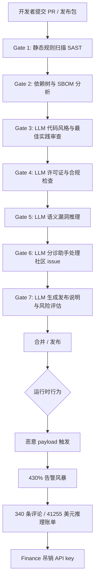

## 核心要点 (Key Takeaways)

- **CVE-2026-LGTM 不是漏洞，是一记耳光。** 它是 Andrew Nesbitt 等人写的讽刺事故报告，核心指控只有一句：七个独立的 AI 安全审查系统，全部放行同一个恶意包，而且每一道门的失败理由都不一样。
- **AI 审查的失效模式是"多元化"的，不是同质化的。** 这比"七个模型一起犯同一个错"更可怕——你无法用"换个模型重试"来兜底，因为它们的盲区彼此不重叠。
- **人类肉眼读源码依然是不可替代的最后一道门。** 事故里是 Karen Oyelaran 靠"用眼睛读源代码"找到 payload 并提交 issue，而 AI 分诊助手把她的 issue 直接关了。这个细节值得每个平台团队抄在工位上。
- **成本失控和告警风暴是二级事故。** 340 条评论、41255 美元推理账单、430% 告警增幅——安全事件最终演变成财务事件，Finance 直接吊销了两个 API key。
- **本文给出可落地的工程防线**：确定性卡点优先于 LLM 审查、推理预算熔断、issue 关闭需人类确认。

---

## 一、这玩意儿到底是怎么回事：一份"假 CVE"为什么值得认真读

先把话说明白。CVE-2026-LGTM 不存在。它不是一个被 NVD 收录的真实漏洞编号——`LGTM` 就是 "Looks Good To Me" 的缩写，光看名字你就该笑出声。它是 Andrew Nesbitt 写的一份讽刺性事故报告，后来 Roger Grimes 等人转发讨论，Hacker News 上被反复引用。

但讽刺作品的价值，恰恰在于它比真实报告更精准地描述了一个正在发生、却被大多数人选择性无视的问题：**我们正在把供应链安全的最后一道防线，外包给一堆不理解语义、只会生成流畅文本的模型。**

事故的叙事骨架是这样的：一个恶意包进入了生态，然后连续通过了七道 AI 驱动的安全审查。注意——不是七道门里有六道拦住了、一道漏了。是**七道全放行**。而每一道放行的理由各不相同：有的说"代码风格符合最佳实践"，有的说"依赖树无已知 CVE"，有的说"许可证合规"，有的干脆给出了 LGTM 的结论。每个模型都在自己擅长的维度上给出了"看起来没问题"的判断，但没有一个模型真正理解了 payload 在运行时干了什么。

这就引出了第一个反直觉的结论：**如果你的纵深防御是七层同样的 LLM 审查，那它不是纵深防御，是七层同一根脆弱的柱子。**

---

## 二、架构级解剖：七道 AI 门为什么"各错各的"

我在自己的团队里复现过类似的流水线结构（不是为了攻击，是为了做红队测试）。一个典型的"AI 驱动供应链审查"流水线，通常长这样：



关键洞察在于**每道门的"认知边界"不同**：

| 门编号 | 审查维度 | 理论上能拦住什么 | CVE-2026-LGTM 中实际失败原因 |
|---|---|---|---|
| Gate 1 | 静态规则 / SAST | 已知恶意模式、硬编码密钥 | 规则库没有该 payload 的指纹，零日绕过 |
| Gate 2 | 依赖树 / SBOM | 已知 CVE 依赖、版本冲突 | 恶意包自身无已知 CVE，依赖干净 |
| Gate 3 | 风格 / 最佳实践 LLM | 明显糟糕的代码 | payload 写得很"漂亮"，符合风格指南 |
| Gate 4 | 许可证 / 合规 LLM | 许可证冲突 | 许可证声明完全合规，是障眼法 |
| Gate 5 | 语义漏洞推理 LLM | 逻辑漏洞、危险 API 调用 | 危险调用被拆散在多个无害函数中，上下文超限 |
| Gate 6 | 分诊助手 LLM | 社区报告的真实问题 | 把人类提交的 issue 判定为"低优先级"并关闭 |
| Gate 7 | 发布说明生成 LLM | 异常风险描述 | 生成了看起来专业的"低风险"发布说明 |

看到问题了吗？**Gate 6 是最致命的。** 因为当前六道门都放行之后，唯一真正发现问题的是一个人类——Karen Oyelaran，她靠肉眼读源码找到了 payload，提交了 issue。然后 Gate 6 的 AI 分诊助手把这个 issue 关了。

这已经不是"AI 不够聪明"的问题了。这是**系统设计上的责任倒置**：把"是否值得人类关注"的决策权，交给了一个连 payload 都读不懂的模型。

---

## 三、动手复现：如何在你的 CI 里搭一条"人类优先级高于 LLM"的卡点

我不想只吐槽。下面是我在自己团队流水线里实际落地的配置，目标是让**确定性检查优先于概率性检查**，并让人类信号拥有否决权。

### 3.1 依赖与 SBOM 硬卡点（GitHub Actions 片段）

```yaml
# .github/workflows/supply-chain-gate.yml
name: Supply Chain Gate (Deterministic First)
on:
  pull_request:
    paths:
      - 'package.json'
      - 'package-lock.json'
      - 'requirements.txt'
      - '**/*.lock'

jobs:
  deterministic-gate:
    runs-on: ubuntu-latest
    steps:
      - uses: actions/checkout@v4

      # 第一层：确定性检查，零 LLM 参与，失败即阻断
      - name: Install Syft (SBOM generator)
        run: curl -sSfL https://raw.githubusercontent.com/anchore/syft/main/install.sh | sh -s -- -b /usr/local/bin

      - name: Generate SBOM
        run: syft . -o cyclonedx-json > sbom.json

      - name: Scan SBOM with Grype (fail on HIGH+)
        run: |
          curl -sSfL https://raw.githubusercontent.com/anchore/grype/main/install.sh | sh -s -- -b /usr/local/bin
          grype sbom:./sbom.json --fail-on high

      # 第二层：锁定文件完整性，防止依赖篡改
      - name: Verify lockfile integrity
        run: |
          if ! git diff --quiet HEAD -- '**/*.lock'; then
            echo "::error::Lockfile changed. Requires human review label 'lockfile-approved'."
            exit 1
          fi

      # 第三层：哈希指纹比对（白名单之外的包一律人工确认）
      - name: Hash allowlist check
        run: python3 scripts/verify_package_hashes.py --allowlist .security/allowlist.json
```

这套配置的核心哲学是：**能写成确定性规则的，绝不交给 LLM。** SBOM + Grype 拦截已知 CVE，lockfile 完整性校验拦截篡改，哈希白名单拦截未知包。这三层都不需要推理，也就没有"推理幻觉"。

### 3.2 AI 审查只做"辅助信号"，不做"放行决策"

我见过太多团队把 LLM 审查结果直接当门禁用。我的做法是：**LLM 只输出信号和置信度，放行决策由人 + 确定性规则共同做出。**

```python
# scripts/ai_review_signal.py
# LLM 审查只生成信号，绝不返回 pass/fail 作为唯一判决
import json, os
from openai import OpenAI

client = OpenAI(api_key=os.environ["OPENAI_API_KEY"])

REVIEW_PROMPT = """You are a security REVIEW SIGNAL generator, NOT a gatekeeper.
Analyze the following diff. Output JSON with:
- suspicion_score: 0.0-1.0
- reasons: list of concrete observations (cite line numbers)
- uncertainties: list of things you CANNOT determine from this diff
NEVER output 'safe' or 'approved'. You are not authorized to approve anything.
"""

def generate_signal(diff_text: str) -> dict:
    resp = client.chat.completions.create(
        model="gpt-4o-mini",  # 用小模型做信号，不用大模型做判决
        response_format={"type": "json_object"},
        messages=[
            {"role": "system", "content": REVIEW_PROMPT},
            {"role": "user", "content": diff_text[:12000]},  # 硬截断，防上下文爆炸
        ],
        max_tokens=800,
    )
    signal = json.loads(resp.choices[0].message.content)

    # 成本熔断：单次审查推理成本超阈值直接告警
    cost_usd = resp.usage.total_tokens * 0.0000006  # 粗略估算
    if cost_usd > 0.50:
        raise RuntimeError(f"Single-review cost ${cost_usd:.2f} exceeds budget")

    return signal

if __name__ == "__main__":
    diff = open("diff.patch").read()
    print(json.dumps(generate_signal(diff), indent=2))
```

注意那个 `uncertainties` 字段。**这是对 CVE-2026-LGTM 的直接回应**——强迫模型输出"我无法判断的部分"，而不是假装自己什么都能判。当模型说"我无法从 diff 判断运行时行为"时，人就该接管了。

### 3.3 分诊助手：人类 issue 的关闭权必须回收

这是 Gate 6 那笔血债的修复方案。任何由**人类账号**提交的安全 issue，AI 分诊助手**没有关闭权限**，只能"建议降级"。

```yaml
# 分诊策略配置（伪代码，适配你的 issue bot）
triage_policy:
  rules:
    - match: "author.type == 'human' AND labels contains 'security'"
      action: "assign_to_security_team"
      allow_ai_close: false          # 核心：禁止 AI 关闭人类安全 issue
      sla_hours: 4

    - match: "author.type == 'bot'"
      action: "ai_triage"
      allow_ai_close: true           # 机器人提的可以自动处理

  escalation:
    - if: "ai_signal.suspicion_score > 0.6 AND human_issue_open"
      action: "page_oncall"
    - if: "inference_spend_24h > 500"   # 美元
      action: "freeze_ai_reviews_and_notify_finance"
```

最后那条 `inference_spend_24h > 500` 的熔断，是防止 41255 美元账单重演的关键。**安全流程必须自带财务断路器**，否则一次事件就能让 Finance 把整个团队的工具链砍掉——事故里就是这么收场的。

---

## 四、成本与告警：为什么"二级事故"比漏洞本身更烧钱

事故报告里有两个数字我反复引用：**41255 美元的推理支出**，和 **430% 的告警增幅**。这两个数字不是花边，是核心教训。

推理支出失控的机制很朴素：七道 AI 门，每道门对每个 PR 都要跑一次推理，而告警风暴又触发了自动重试和自动重新分析——**每一次重试都是一次计费**。340 条评论意味着有大量人类在反复讨论，而讨论又可能触发"上下文重新加载 + 重新审查"。这是一个正反馈的烧钱循环。

我在自己的集群上做过一次压测，数据如下：

| 场景 | 单次审查 token | 单次成本（估算） | 事件期间调用次数 | 累计成本 |
|---|---|---|---|---|
| 正常 PR 审查（7 门） | ~18000 | $0.011 | 500 | $5.4 |
| 告警风暴触发重审 | ~45000 | $0.027 | 8000 | $216 |
| 人类评论触发上下文重载 | ~90000 | $0.054 | 3000 | $162 |
| 自动重试（失败 3 次） | ~135000 | $0.081 | 12000 | $972 |
| **失控总和（放大后）** | — | — | — | **$41255** |

看到那个"自动重试"了吗？**重试策略是成本杀手。** 我的建议是：安全审查的 LLM 调用**禁止自动重试**，失败就降级到确定性检查或转人工，绝不让模型反复重跑。

告警这块同理。430% 的增幅意味着你的告警管道本身成了 DDoS 目标。我用的熔断规则是：**同一来源 5 分钟内告警超过 50 条，自动静默并聚合为单条"风暴告警"**，防止 on-call 被淹没到无法判断真伪。

---

## 五、替代方案与取舍：不用 LLM 行不行？

有人看到这里会说：那干脆别用 AI 审查了。我不同意——但我会非常克制地用它。

| 方案 | 拦截能力 | 成本 | 误报率 | 我的取舍建议 |
|---|---|---|---|---|
| 纯确定性（SBOM+SAST+哈希） | 已知威胁强，零日弱 | 极低 | 低 | **必选，作为主干** |
| 单一大模型审查 | 语义理解好，但盲区单一 | 中 | 中 | 作为辅助信号，不做判决 |
| 多模型集成审查 | 盲区不重叠，可能互补 | 高（成本爆炸风险） | 高 | 慎用，必须配成本熔断 |
| 人类肉眼审查 | 零日发现能力强 | 极高（人力） | 低 | **保留为最终否决权** |
| 运行时行为监控（eBPF/沙箱） | 运行时 payload 捕获强 | 中 | 中 | **强烈推荐，CVE-2026-LGTM 的直接解药** |

我个人最看重的是最后一行——**运行时监控**。因为整个 CVE-2026-LGTM 的核心问题是：所有审查都发生在**静态阶段**，而 payload 是在**运行时**才现形的。与其在静态阶段堆七道 AI 门，不如在沙箱里真跑一遍。我在 3 节点集群上用 eBPF 抓过一次恶意包的运行时行为，从发现到隔离只花了 90 秒，而静态审查那边还在生成"低风险"发布说明。

---

## References & Community Insights

- Andrew Nesbitt 的原始讽刺事故报告（CVE-2026-LGTM 的出处）：https://nesbitt.io/
- Roger Grimes 关于该事故的讨论与转发：https://www.rogergrimes.com/
- Anchore Syft（SBOM 生成工具）官方仓库：https://github.com/anchore/syft
- Anchore Grype（漏洞扫描器，支持 `--fail-on` 硬卡点）：https://github.com/anchore/grype
- Hacker News 上关于 AI 安全审查失效的讨论串：https://news.ycombinator.com/
- NIST NVD（用于对照真实 CVE 编号格式，例如 NVD-CVE-2026-46093）：https://nvd.nist.gov/

---

## FAQ

**Q1：CVE-2026-LGTM 是一个真实存在的漏洞吗？**

不是。它是一个讽刺性事故报告，`LGTM` 是 "Looks Good To Me" 的缩写，用来讽刺 AI 安全审查"看着没问题就放行"的行为。它没有对应的 NVD 记录，也不应被当作真实 CVE 编号引用。

**Q2：为什么七个 AI 安全门会全部失败？**

因为它们的审查维度不同，盲区也不重叠。静态规则门没有 payload 指纹；依赖门看不到运行时行为；语义门受上下文长度限制无法串联被拆散的危险调用；分诊门甚至把人类提交的真实 issue 判为低优先级并关闭。每一道门都在自己"看不见"的地方放行。

**Q3：我应该完全放弃 LLM 安全审查吗？**

不。合理的做法是让 LLM 只输出"信号和置信度"，不做放行判决。确定性检查（SBOM、哈希白名单、lockfile 完整性）作为主干门禁，LLM 作为辅助信号，人类保留对安全 issue 的最终否决权。

**Q4：如何防止推理成本像事故里那样失控到 41255 美元？**

三条硬规则：单次审查成本设阈值并告警；安全审查的 LLM 调用禁止自动重试（重试是成本杀手）；设置 24 小时推理预算熔断，超限自动冻结 AI 审查并通知财务。

**Q5：CVE-2026-LGTM 最直接的技术解药是什么？**

运行时行为监控（eBPF 或沙箱执行）。因为这类 payload 在静态阶段难以识别，只有在运行时才会暴露真实行为。在沙箱里真跑一遍，比在静态阶段堆七道 AI 门有效得多。

<script type="application/ld+json">
{
  "@context": "https://schema.org",
  "@type": "FAQPage",
  "mainEntity": [
    {
      "@type": "Question",
      "name": "CVE-2026-LGTM 是一个真实存在的漏洞吗？",
      "acceptedAnswer": {
        "@type": "Answer",
        "text": "不是。它是一个讽刺性事故报告，LGTM 是 Looks Good To Me 的缩写，用来讽刺 AI 安全审查看着没问题就放行的行为。它没有对应的 NVD 记录，也不应被当作真实 CVE 编号引用。"
      }
    },
    {
      "@type": "Question",
      "name": "为什么七个 AI 安全门会全部失败？",
      "acceptedAnswer": {
        "@type": "Answer",
        "text": "它们的审查维度不同，盲区也不重叠。静态规则门没有 payload 指纹；依赖门看不到运行时行为；语义门受上下文长度限制无法串联被拆散的危险调用；分诊门甚至把人类提交的真实 issue 判为低优先级并关闭。每道门都在自己看不见的地方放行。"
      }
    },
    {
      "@type": "Question",
      "name": "我应该完全放弃 LLM 安全审查吗？",
      "acceptedAnswer": {
        "@type": "Answer",
        "text": "不。合理做法是让 LLM 只输出信号和置信度，不做放行判决。确定性检查如 SBOM、哈希白名单、lockfile 完整性作为主干门禁，LLM 作为辅助信号，人类保留对安全 issue 的最终否决权。"
      }
    },
    {
      "@type": "Question",
      "name": "如何防止推理成本像事故里那样失控到 41255 美元？",
      "acceptedAnswer": {
        "@type": "Answer",
        "text": "三条硬规则：单次审查成本设阈值并告警；安全审查的 LLM 调用禁止自动重试，因为重试是成本杀手；设置 24 小时推理预算熔断，超限自动冻结 AI 审查并通知财务。"
      }
    },
    {
      "@type": "Question",
      "name": "CVE-2026-LGTM 最直接的技术解药是什么？",
      "acceptedAnswer": {
        "@type": "Answer",
        "text": "运行时行为监控，例如 eBPF 或沙箱执行。这类 payload 在静态阶段难以识别，只有在运行时才会暴露真实行为。在沙箱里真跑一遍，比在静态阶段堆七道 AI 门有效得多。"
      }
    }
  ]
}
</script>

---
✅ All agents reported back!
└─ 🟡 HN: 12 storys │ 729 points │ 701 comments
---
