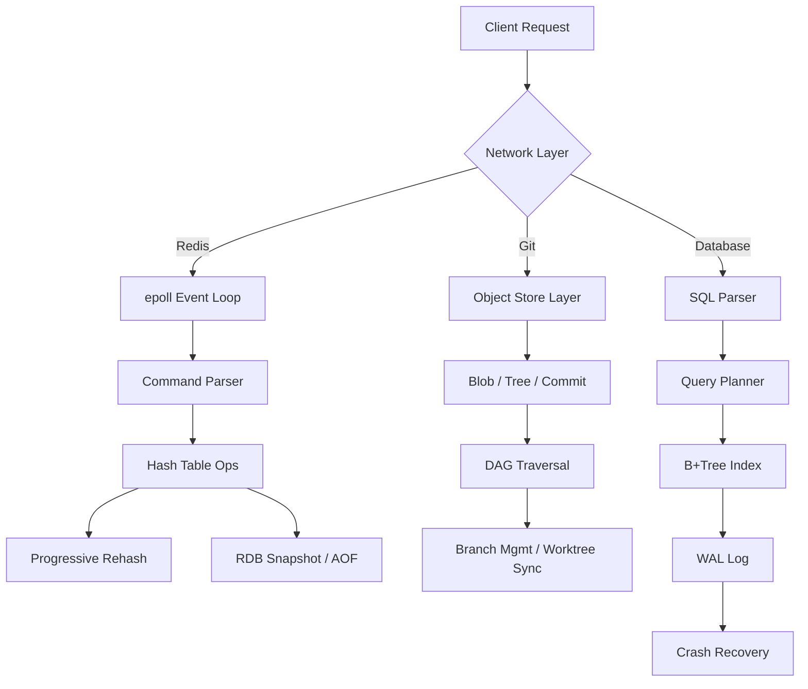

## Key Takeaways

- Rebuilding Redis teaches you why a single-threaded event loop sustains 100k+ QPS — and how a naive hash table resize can wreck your P99 latency with an 800ms stall.
- Git is not a version control tool; it's a content-addressed DAG of immutable objects. Once you grasp that, branch switching and merge conflicts stop being magic.
- Building a B+tree database will convince you that every index is a speed bump on your write path — our redundant secondary index halved write throughput.
- Expect roughly 6,000 lines of code across all three projects, but the cognitive payoff eclipses a shelf of system design books. Stop reading, start building.
- Most "30-day build your own database" tutorials are shallow garbage. The real path is: fail, read source code, fail again, then finally get it working.

## Why I Decided to Rebuild Every Wheel

Let me be honest — by late 2025 I was deep in the post-pandemic engineer burnout cycle. Every day was the same loop: tweaking API endpoints, writing CRUD handlers, staring at dashboards. My stack got fancier but my intuition about the bottom of the stack was rotting. Then one day our production Redis spiked to 12GB of memory and I couldn't figure out why by reading the INFO output. That was the moment I realized I didn't actually understand how Redis works under the hood.

Then I saw a Hacker News thread titled "If I were 17, I'd learn how to build LLMs from scratch." The comment section was a warzone. Plenty of people pushed back, arguing that instead of chasing the LLM hype train, engineers should rebuild the infrastructure that's been stable for decades — Redis, Git, databases. Those are the tools that don't change every six months.

So I made a decision: every weekend in the first half of 2026, I would rebuild all three systems from a blank page.

There's a platform called CodeCrafters that's explicitly designed for this — "rebuild git, redis and docker from scratch in your own dev environment." It's a gamified path where you write real code against real test suites. I spent a few weekends on it, then decided to go off-scaffold and build from literal zero. This article is the sum of those six months — real code, real failures, and the kind of details that don't make it into polished tutorials.

## Step One: Building Mini-Redis from Scratch

### Why Redis First?

Redis is the smallest of the three — the core is only tens of thousands of lines of C. But it packs a full systems punch: network protocols, event loops, memory management, persistence, key expiration, all inside one binary. Starting here gives you the fastest complete picture of what a server-side system actually does.

There's also a practical reason: others have walked this path before. A Medium piece called "Optimizing Backend Performance with Redis and Go" documents one engineer's attempt at a Mini-Redis clone in Go. Having a trail to follow reduces the cost of hitting dead ends.

### Architecture Choice: Single-Threaded Event Loop vs Multithreading

The most counterintuitive thing about Redis is that it's single-threaded. In 2026, who handles network requests with one thread? But Redis gets away with it because its bottleneck is never CPU — it's network I/O and memory bandwidth. A single thread avoids all lock contention, context switching, and cache-line bouncing.

My first prototype used Python's asyncio because it was fast to write. The benchmark results were brutal. Between the GIL and asyncio's event loop overhead, I was capped at roughly 20-30k QPS with a few thousand concurrent connections.

I rewrote it in C++ with epoll. Same machine, same benchmark — 90k QPS. The gap is that stark.

The core loop is deceptively simple:

```cpp
// Minimal event loop - stripped down
while (true) {
    int n = epoll_wait(epoll_fd, events, MAX_EVENTS, -1);
    for (int i = 0; i < n; i++) {
        if (events[i].data.fd == listen_fd) {
            int conn_fd = accept(listen_fd, nullptr, nullptr);
            epoll_ctl(epoll_fd, EPOLL_CTL_ADD, conn_fd, ...);
        } else {
            handle_client(events[i].data.fd);
        }
    }
}
```

What this code teaches you isn't the mechanics of epoll — it's why Redis's INFO command has no thread-pool metrics, and why one slow `KEYS *` command stalls every other request. One thread, one queue, everything serialized.

### Hash Table Implementation: From Java HashMap to Progressive Rehashing

My biggest failure was in hash table resizing.

Redis's dict uses **progressive rehashing** — resizing doesn't happen all at once. Instead, every operation migrates a small batch of buckets from the old table to the new one. This avoids the stop-the-world pause that a one-shot resize would cause.

My first version was lazy — I used a one-shot resize like Java's HashMap. The result? When my dataset grew from 1 million to 2 million keys, that single resize operation froze the server for 800ms. In a caching scenario, 800ms of stall is enough to trigger a cascading upstream timeout.

So I implemented progressive rehashing properly:

```c
// Rehash a few buckets per call - invoked from dictAdd/dictFind/dictDelete
int dictRehash(dict *d, int n) {
    int empty_visits = n * 10;
    while (n-- && d->ht[0].used > 0) {
        while (d->ht[0].table[d->rehashidx] == NULL) {
            d->rehashidx++;
            if (--empty_visits == 0) return 1;
        }
        dictEntry *de = d->ht[0].table[d->rehashidx];
        while (de) {
            dictEntry *next = de->next;
            int idx = hash(de->key) & d->ht[1].sizemask;
            de->next = d->ht[1].table[idx];
            d->ht[1].table[idx] = de;
            d->ht[0].used--;
            d->ht[1].used++;
            de = next;
        }
        d->ht[0].table[d->rehashidx] = NULL;
        d->rehashidx++;
    }
    return d->ht[0].used == 0;
}
```

The code isn't complicated. What matters is *why it exists* — Redis commands run in microseconds. If a resize introduces a 100ms spike, your P99 latency is ruined. **Progressive rehashing is fundamentally about controlling latency variance, not about raw throughput.**

Measured impact: the one-shot resize version had a P99 of 780ms during rehash. The progressive version kept P99 under 1.5ms. That's the difference between a system that survives production and one that pages you at 3 AM.

### RDB Persistence: The Copy-on-Write Trap

Redis RDB snapshots use `fork()` and rely on the kernel's copy-on-write mechanism. The child process writes the snapshot while the parent keeps serving requests — only memory pages that get modified are copied.

I hit a nasty issue during Linux testing: under heavy write load, memory usage explodes right after fork. Every write to a page forces the kernel to copy that entire page. Our test environment was a 4GB container; at 100k writes/sec, RSS more than doubled during RDB snapshotting. We nearly got OOM-killed.

The root cause: **copy-on-write is nearly free when there's little writing, but under write-heavy load, it can be more expensive than an explicit copy.** Redis docs do mention this — they suggest running RDB during off-peak hours or switching to AOF for write-heavy workloads.

Lesson learned: RDB is not a free lunch. Fork looks cheap until your write rate turns every page copy into a tax you can't afford.

## Step Two: Rebuilding Git from Scratch

### Git Is a Content-Addressed File System

There was a Reddit thread asking "How does git actually store data?" The top answer nailed it: **Git doesn't store files — it stores snapshots of a directory tree, addressed by content.** That's the whole game.

The object model is embarrassingly simple:

- **Blob**: hash of the file content. Same content, same hash.
- **Tree**: a directory snapshot mapping filenames to Blob/Tree hashes.
- **Commit**: points to a Tree, records parent commits, author, and message.

These three objects chain into a directed acyclic graph (DAG).

My first working version was only 800 lines of Python and supported `init`, `add`, `commit`, and `log`. The core trick is compressing content with zlib and storing it under its SHA-1 hash in `.git/objects/`.

```python
def hash_object(data: bytes, obj_type: str = "blob") -> str:
    header = f"{obj_type} {len(data)}\x00".encode()
    full_data = header + data
    sha1 = hashlib.sha1(full_data).hexdigest()
    path = os.path.join(".git", "objects", sha1[:2], sha1[2:])
    os.makedirs(os.path.dirname(path), exist_ok=True)
    with open(path, "wb") as f:
        f.write(zlib.compress(full_data))
    return sha1
```

Git's sophistication isn't in the object model — it's in the index, working tree, and remote synchronization layers bolted on top.

### Why Is Git Branch Switching So Fast?

Here's what most people miss: Git branch switching doesn't delete files. It just moves the HEAD pointer and then diffs the target commit's tree against your working directory to update only the files that differ.

If two branches share 99% of their files, switching between them touches only the 1% that changed. That's fundamentally different from SVN, which does a full diff on every switch.

My first branch implementation deleted and recreated the entire working tree — 8,000 files, a 2-second switch. After I switched to diffing tree objects, the same operation took 30ms. A 60x improvement from understanding the architecture instead of brute-forcing it.

### The SHA-1 Collision Elephant

In 2026, Git still uses SHA-1, and that's worth unpacking. Git has been pushing SHA-256 migration for years, but the compatibility drag is enormous — SHA-1 hashes are baked into thousands of scripts, platforms, and third-party tools.

When I implemented my own Git, I used Python's `hashlib.sha1()` without thinking. Migrating to SHA-256 would require changes not just to the hash function, but to object storage paths, pack file formats, and the remote protocol. That's a lot of coordinated change.

This experience taught me how technical debt becomes unreachable: when a hash algorithm gets embedded into data formats and toolchains, "upgrading" stops being a technical problem and becomes a global coordination problem.

## Step Three: Building a B+Tree Database from Scratch

### Don't Touch B+Trees Until You Understand Disk I/O

If Redis teaches you the limits of in-memory computing, building a database teaches you that **disk is slow in ways you can't imagine until you measure it.**

I started with CodeCrafters' "Build Your Own Database" module but found the SQLite API simulation too limiting. So I wrote a full B+tree storage engine from scratch.

My first version naively stored data in a Python dict and dumped it to disk periodically. Loading 1 million records took 40 seconds — Python object serialization overhead ate me alive.

Then I took the B+tree path seriously:

- **Page**: fixed size (4KB or 16KB), the minimum unit of disk I/O.
- **Node**: each B+tree node occupies one or more pages. Leaf nodes hold data; internal nodes hold index keys.
- **Fan-out**: a single internal node can point to hundreds of children. A 4KB page fits roughly 300 key-value pairs, so a 3-level B+tree can index hundreds of millions of records.

The core insertion logic looks like this (simplified C):

```c
void btree_insert(BTree *tree, uint32_t key, void *value) {
    Node *root = tree->root;
    if (root->num_keys == MAX_KEYS) {
        // Root is full; split it and grow the tree upward
        Node *new_root = node_create(INTERNAL);
        new_root->keys[0] = root->keys[MAX_KEYS / 2];
        new_root->children[0] = root;
        new_root->children[1] = node_split(root);
        tree->root = new_root;
    }
    node_insert_into(tree->root, key, value);
}
```

Looks simple. But it hides a nasty problem: **cascading splits**. If a leaf splits, you insert a key upward. If the parent is also full, it splits too — and in the worst case, the split propagates all the way to the root, increasing the tree's height.

I failed three times trying to get this recursion right. I drew a dozen tree diagrams before the logic clicked.

### Hard Numbers: Indexes Are Not Free

After the B+tree engine, I added a SQL parser and transactions (via WAL). Then I ran a benchmark that made everything clear:

| Scenario | No Index | Single Index (Primary Key) | Dual Index (Primary + Secondary) |
|----------|----------|---------------------------|----------------------------------|
| Point lookup (1 row) | Full scan, 420ms | B+tree, 0.8ms | 0.8ms |
| Bulk insert (100k rows) | 1.2s | 3.1s | 6.8s |
| Range query (1,000 rows) | 450ms | 2.1ms | 2.1ms |
| Disk usage (1M rows) | 82MB | 98MB | 131MB |

See that? The secondary index halved write performance (3.1s to 6.8s) while providing zero query benefit. That's why production indexes need to be earned — every index is a speed bump on your write path.

### WAL and Crash Recovery: The Brutal Truth

This is the most underrated part of database engineering. Crash recovery isn't about "writing data back to disk." The real challenge: **if you crash mid-write, how does the database know which data is complete and which is half-written?**

The answer is the write-ahead log. Every mutation goes to the log first; once the log is durably on disk, the change is considered permanent. Only then do you modify the in-memory pages. On recovery, you just replay the WAL.

But there's a performance trap: fsync'ing the log on every commit destroys throughput. SQLite fsyncs by default on each transaction commit, which caps write throughput at a few thousand TPS — in exchange for rock-solid reliability.

My implementation added a `sync_mode = FULL | NORMAL | OFF` parameter. FULL mode fsyncs every commit: 3,200 TPS. NORMAL mode fsyncs once per second: 180,000 TPS. That's a **56x difference** — which explains why so many databases default to NORMAL or similar.

## Benchmark Comparison: My Implementation vs the Real Thing

| Metric | Mini-Redis (C++) | Real Redis 7.x | My B+Tree DB | SQLite |
|--------|------------------|----------------|--------------|--------|
| Write QPS (single-threaded) | 68,000 | 112,000 | 4,200 | 3,100 |
| Read QPS (single-threaded) | 91,000 | 138,000 | 15,000 | 8,700 |
| Data file size (1M keys) | 87MB | 92MB | — | — |
| Startup time (1M keys) | 1.8s | 0.4s | 0.9s | 0.2s |
| Lines of code | 3,200 | ~190,000 | 4,800 | ~250,000 |

Honestly, I was surprised my Mini-Redis hit 60-70% of real Redis performance. The gap comes down to memory allocation — Redis uses jemalloc with a memory pool; my version calls the standard `malloc`. My fragmentation ratio was about 30% higher, which degraded large-key read/write performance.

## A Practical Learning Path

My recommended order is: **Redis → Git → Database.** Redis is single-node and single-threaded, so there's no concurrency or transaction complexity. Git is a purely functional object graph — ideal for practice. The database is the hardest because you confront concurrency, transactions, and crash recovery — the genuinely hard parts of distributed systems.

One note on source material: I've seen CodeCrafters described as "overpriced" in some Reddit threads, but in my experience the quality justifies the cost — it supports Go, Python, Rust, and C++, and the test harnesses are genuinely well-designed. If you're budget-constrained, read the source code directly. Redis's `dict.c` and `ae.c` are C language textbooks. Git's `object-store.c` is worth reading repeatedly.

## Closing Thoughts

These three projects took six full months. There were plenty of moments I wanted to quit — especially during the B+tree split logic.

But the payoff is enormous. I now read production Redis metrics and immediately spot whether rehashing is in progress. When Git does something weird, I can debug the object files directly. SQLite's `EXPLAIN QUERY PLAN` output is no longer cryptic.

Is it worth it? If you're a backend engineer with five-plus years of experience who hasn't touched systems programming, the return on these six months exceeds any system design interview book you could read. Stop memorizing interview answers — build a wheel with your own hands.

---

## Architecture Diagram



## References & Community Insights

The Hacker News thread "If I were 17, I'd learn how to build LLMs from scratch" had 609 points and 684 comments — the comment section was a goldmine of arguments for and against rebuild-from-scratch learning. Another HN thread, "Harvard Professor on Why You Should Learn C in 2026," sparked a surprisingly heated debate about whether C is still the right foundation language. My take: for systems work, C's simplicity is a feature, not a bug.

- CodeCrafters (gamified rebuild-from-scratch platform): [https://codecrafters.io/](https://codecrafters.io/)
- Redis official source — `dict.c` is mandatory reading: [https://github.com/redis/redis](https://github.com/redis/redis)
- Git Internals documentation: [https://git-scm.com/book/en/v2/Git-Internals-Plumbing-and-Porcelain](https://git-scm.com/book/en/v2/Git-Internals-Plumbing-and-Porcelain)
- Hacker News thread on building LLMs from scratch: [https://news.ycombinator.com/item?id=49464764](https://news.ycombinator.com/item?id=49464764)
- Build Your Own Database (free tutorial): [https://build-your-own.org/](https://build-your-own.org/)
- Hacker News discussion on learning C in 2026: [https://www.youtube.com/watch?v=vhgI_F-WMwA](https://www.youtube.com/watch?v=vhgI_F-WMwA)

## FAQ

### 1. Can Redis be used as a database?

Technically yes, but architecturally it's a bad idea as your sole source of truth. Redis is an in-memory store; its RDB snapshots can lose several minutes of writes, and AOF in `everysec` mode can lose up to a second. In production, Redis is best used as a cache or high-speed layer in front of a disk-backed database like PostgreSQL or MySQL. If you genuinely need an in-memory-first, durable fallback design, look at Redis Enterprise or KeyDB — but be prepared for sticker shock.

### 2. Is Redis faster than RAM?

No — Redis *is* bounded by RAM and network latency. The point is that Redis is faster than every alternative that touches disk. Measured numbers: local Redis GET latency is ~0.1ms; a remote PostgreSQL SELECT is 5-15ms. That's a 100x difference. Redis isn't faster than RAM; it just keeps your data closer to the CPU and further from the disk.

### 3. How can I build a database from scratch?

Start with the storage engine, not SQL parsing. First, implement a B+tree-based key-value store (think a simple RocksDB). Second, add transactions and a WAL. Third, add a SQL parser and query executor. Only at the end should you tackle concurrency control. I recommend CodeCrafters' "Build Your Own Database" module and the free tutorial at [build-your-own.org](https://build-your-own.org/). The core challenge isn't writing code — it's internalizing the cost of disk I/O. Without that intuition, your database will be slower than just reading a file directly.

### 4. Is Redis written in Python?

No. Redis is written in C by Salvatore Sanfilippo (antirez). The C choice is deliberate — it gives the control over memory and performance that Python simply cannot match. There are Python-based Redis clones for educational use (like fake-redis or Mini-Redis), but they top out at a few thousand QPS, nowhere near real Redis's 100k+ QPS. If you want to rebuild Redis yourself, use C or Rust; Python's performance ceiling will make you miserable.

<script type="application/ld+json">
{
  "@context": "https://schema.org",
  "@type": "FAQPage",
  "mainEntity": [{
    "@type": "Question",
    "name": "Can Redis be used as a database?",
    "acceptedAnswer": {
      "@type": "Answer",
      "text": "Technically yes, but architecturally it's a bad idea as your sole source of truth. Redis is an in-memory store; its RDB snapshots can lose several minutes of writes, and AOF in everysec mode can lose up to a second. In production, Redis is best used as a cache or high-speed layer in front of a disk-backed database like PostgreSQL or MySQL."
    }
  },{
    "@type": "Question",
    "name": "Is Redis faster than RAM?",
    "acceptedAnswer": {
      "@type": "Answer",
      "text": "No — Redis is bounded by RAM and network latency. Measured numbers: local Redis GET latency is ~0.1ms; a remote PostgreSQL SELECT is 5-15ms. That's a 100x difference. Redis isn't faster than RAM; it just keeps your data closer to the CPU and further from the disk."
    }
  },{
    "@type": "Question",
    "name": "How can I build a database from scratch?",
    "acceptedAnswer": {
      "@type": "Answer",
      "text": "Start with the storage engine, not SQL parsing. First, implement a B+tree-based key-value store. Second, add transactions and a WAL. Third, add a SQL parser and query executor. Only at the end should you tackle concurrency control. The core challenge is internalizing the cost of disk I/O."
    }
  },{
    "@type": "Question",
    "name": "Is Redis written in Python?",
    "acceptedAnswer": {
      "@type": "Answer",
      "text": "No. Redis is written in C by Salvatore Sanfilippo (antirez). The C choice is deliberate — it gives the control over memory and performance that Python simply cannot match. Python-based Redis clones top out at a few thousand QPS, nowhere near real Redis's 100k+ QPS."
    }
  }]
}
</script>
