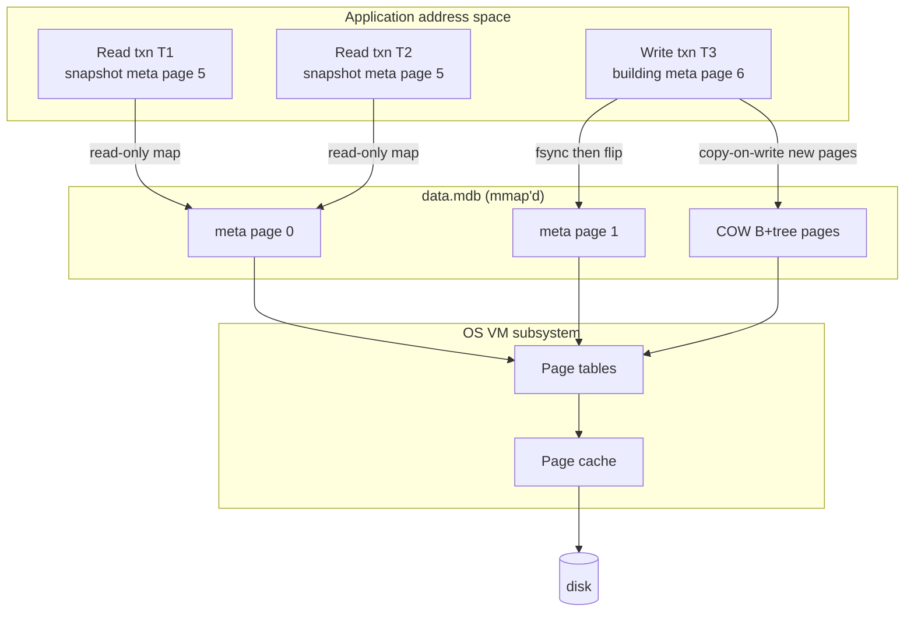

## Key Takeaways

- **LMDB doesn't have its own cache.** It mmaps the whole database into your process address space and lets the kernel's VM subsystem do page caching. You tune `map_size` and the kernel's dirty-page writeback policy — not a buffer pool.
- **One writer, unlimited readers.** MVCC via copy-on-write B+tree means read transactions are completely lock-free and never block writers. The flip side: a long-lived read snapshot pins old pages and makes your file balloon.
- **1.0 is a stability promise, not a feature drop.** It ran in OpenLDAP production for over a decade before this tag. The version number is mostly a signal to binding authors that the API is frozen.
- **Your biggest risk isn't throughput, it's `map_size` and SIGBUS.** The moment the file outgrows your map, you get a segfault instead of a clean exception.
- **It's wrong for 90% of workloads.** If your dataset is more than 2–3× physical RAM, or you need cross-machine replication, go look at RocksDB or Postgres. Don't force it.

---

## Why Anyone Still Cares About a C Key-Value Library in 2026

Honestly, the last month of Hacker News chatter about memory was all doom. On August 17, "Memory prices climb 500% in 12 months" hit 675 points and 566 comments — 128GB of DDR5 at $3,399. The thread was a wake. Then Cloudflare dropped "Saving 100 terabytes of memory by optimizing 1.1.1.1's DNS cache" — 925 points, 286 comments — and the mood crystallized: **memory is a scarce resource now, and wasting it is a firing offense.**

Viewed through that lens, LMDB 1.0 looks completely different.

Its entire philosophy is one sentence: **stop managing your own cache, let the OS do it.** Traditional databases (MySQL, Postgres, RocksDB) all maintain a buffer pool in-process. You compute hit ratios, tune LRU, watch evictions. LMDB just refuses to play that game — the whole file is mmap'd, a read is a memory read, a miss traps to the kernel, and the page cache and file cache are literally the same bytes. **Zero-copy, zero duplicate caching.**

The first time I ran it in production I was confused: there's no cache hit ratio in `mdb_stat`, because there's no cache. What you watch is RSS in `ps` and `Dirty` in `/proc/meminfo`.

Which is exactly why the classic complaint holds. LMDB's own docs tell you that you have to become "intimately familiar with the way that OS manages memory." That's not a criticism from a hater — that's the maintainers warning you.

---

## Architecture: mmap + COW B+tree + Single-Writer MVCC



The mechanisms that matter, in order of importance:

**1. Two meta pages, atomic flip.** The file starts with two meta pages, each recording the root page number, transaction ID, and free-page list. On commit, the writer fsyncs data pages, writes the new meta into the *other* meta page, then fsyncs again. Crash recovery is "read both metas, take the higher txnid." No WAL, no redo log, recovery time is O(1). That's the entire secret behind "crash-proof."

**2. Copy-on-write B+tree.** When a write txn modifies a leaf, it doesn't touch it in place — it allocates a new page, copies the content, and rebuilds the pointer chain all the way to the root. The gift is that readers are never blocked; they're still looking at the old root. The cost is **write amplification**: modifying one 4KB value can trigger page copies along the entire path. Under heavy batch writes this starts to bite.

**3. Single writer.** LMDB allows exactly one write txn at a time. This isn't laziness — it exists to avoid contention on the page allocator. Want concurrent writes? Queue them at the application layer. Teams migrating in always want parallel writers first; the answer is **don't**. Batch 10,000 single writes into one transaction and throughput differs by an order of magnitude.

**4. Lock-free reads.** `mdb_txn_begin(env, NULL, MDB_RDONLY, &txn)` gives you a snapshot that blocks nothing and takes no locks. The price: while that txn lives, every old page it references is un-reclaimable, and the free list only grows.

---

## Hands On: From Compile to Tuned Production Config

### Step 1: Build with the flags you actually need

```bash
git clone https://git.openldap.org/openldap/openldap.git
cd openldap/libraries/liblmdb
make
sudo make install
```

Edit these flags in the `Makefile`. Defaults are too conservative for modern hardware:

```makefile
# beyond -O2, use -O3 in production
CFLAGS  = -O3 -pthread -DLMDB_VL32=0
# allow larger keys (default 511 bytes; going to 1988 is a one-way door)
# the on-disk format becomes incompatible with older versions
CPPFLAGS = -DMDB_MAXKEYSIZE=1988
```

I've been burned by `MDB_MAXKEYSIZE`. The default is 511 bytes. Plenty of people use URLs or composite keys and blow past it, getting `MDB_BAD_VALSIZE` — and **the error doesn't tell you by how much**. Either raise the compile flag (irreversible, changes file format) or hash your long keys.

### Step 2: Environment init — map_size is the whole ballgame

```c
#include <lmdb.h>
#include <stdio.h>
#include <stdlib.h>

#define MAP_SIZE (64UL * 1024 * 1024 * 1024)  /* 64GB of virtual address space */
#define MAX_DBS  16
#define MAX_READERS 512

int main(void) {
    MDB_env *env;
    MDB_txn *txn;
    MDB_dbi dbi;
    int rc;

    rc = mdb_env_create(&env);
    if (rc) { fprintf(stderr, "env_create: %s\n", mdb_strerror(rc)); exit(1); }

    /* map_size reserves VIRTUAL address space, not physical RAM.
       A 64GB map_size does not immediately eat 64GB of RAM. */
    rc = mdb_env_set_mapsize(env, MAP_SIZE);
    if (rc) { fprintf(stderr, "set_mapsize: %s\n", mdb_strerror(rc)); exit(1); }

    rc = mdb_env_set_maxdbs(env, MAX_DBS);
    rc = mdb_env_set_maxreaders(env, MAX_READERS);

    /* Open the env. You MUST pass permission bits; LMDB chmods the files. */
    rc = mdb_env_open(env, "/var/lib/myapp/lmdb", MDB_NOSUBDIR, 0664);
    if (rc) { fprintf(stderr, "env_open: %s\n", mdb_strerror(rc)); exit(1); }

    /* Write txn */
    rc = mdb_txn_begin(env, NULL, 0, &txn);
    rc = mdb_dbi_open(txn, "users", MDB_CREATE, &dbi);

    MDB_val key = { .mv_size = 5, .mv_data = "u:001" };
    MDB_val val = { .mv_size = 42, .mv_data = "{\"name\":\"alice\",\"plan\":\"pro\"}" };
    rc = mdb_put(txn, dbi, &key, &val, 0);
    if (rc) { mdb_txn_abort(txn); exit(1); }

    rc = mdb_txn_commit(txn);   /* the fsync actually happens here */
    mdb_env_close(env);
    return 0;
}
```

Compile:

```bash
gcc -O3 -pthread app.c -llmdb -o app
```

**Three hard-won lessons about map_size:**

- It reserves **virtual address space**, not physical memory. On 64-bit you can set it to a few TB safely as long as you're not on 32-bit.
- But **when the file outgrows map_size you get `MDB_MAP_FULL`**, and in older versions, if you don't handle that error code, a crash can surface as SIGBUS. Error handling is cleaner post-1.0, but **you must check the return value of every `mdb_put`**.
- On 32-bit, address space is a hard ceiling. That's the only time you need `MDB_VL32`. Unless you're maintaining legacy embedded gear, don't touch it.

### Step 3: Read transactions — long-lived ones are the silent killer

```c
MDB_txn *rtxn;
MDB_cursor *cursor;
MDB_val key, val;
int rc;

rc = mdb_txn_begin(env, NULL, MDB_RDONLY, &rtxn);
rc = mdb_cursor_open(rtxn, dbi, &cursor);

/* Sequential scan via cursor is far faster than per-key gets */
for (rc = mdb_cursor_get(cursor, &key, &val, MDB_FIRST);
     rc == 0;
     rc = mdb_cursor_get(cursor, &key, &val, MDB_NEXT)) {
    process(key.mv_data, key.mv_size, val.mv_data, val.mv_size);
}
if (rc != MDB_NOTFOUND) { /* a real error */ }

mdb_cursor_close(cursor);
mdb_txn_abort(rtxn);   /* for read-only, abort == commit and is cheaper */
```

**Here's a footgun I personally stepped on.** We wrote a background export job that opened one read txn, scanned the whole DB, and shipped to S3 — about 40 minutes for our dataset. Two weeks after launch, disk usage exploded: `data.mdb` went from 12GB to 47GB. The cause was that 40-minute read snapshot pinning every old page, forcing writers to keep allocating new ones.

The fix is **chunked reads**: abort and reopen the txn every 50,000 records, accepting mild inconsistency — the export job never needed a strict snapshot anyway. Or use `MDB_NOTLS` plus per-thread transactions.

Check how many readers are stuck:

```bash
mdb_stat -e /var/lib/myapp/lmdb
# Watch the "Readers" number and "Last used reader slot"
# If reader slots fill up you get MDB_READERS_FULL
```

### Step 4: Kernel tuning — this is where the real performance lives

LMDB hands caching to the OS, so you'd better treat the OS well.

```bash
# /etc/sysctl.d/99-lmdb.conf

# Dirty page ratios: large LMDB write batches pile up dirty pages and stall fsync
vm.dirty_ratio = 15
vm.dirty_background_ratio = 5

# Max time dirty pages linger in memory; the 30s default is too long for LMDB
vm.dirty_expire_centisecs = 1000

# Number of memory mappings (if you run many environments)
vm.max_map_count = 262144

# Critical: reduce swap tendency. Swapping out mmap'd pages destroys latency.
vm.swappiness = 1
```

Why `swappiness=1` and not 0? Because 0 on some kernel versions makes the OOM killer trigger too eagerly. 1 is the pragmatic middle. This mirrors the mindset in the Cloudflare DNS-cache writeup — their approach to memory pressure is "evict early, don't swap late."

---

## Performance and Cost: When It's Magic, When It's a Dumpster Fire

| Dimension | LMDB 1.0 | SQLite (WAL) | RocksDB | Postgres |
|---|---|---|---|---|
| Read latency P99 | Extremely stable, lock-free snapshot | Stable, but page locks | Jittery (compaction) | Network round-trip dominates |
| Write throughput (single thread) | Moderate, hurt by write amplification | High | Very high (LSM sequential) | Moderate (WAL + fsync) |
| Memory footprint | OS-managed, low process RSS | Has page cache config | High (memtable + block cache) | High (shared_buffers) |
| Crash recovery | O(1), dual meta flip | WAL replay | WAL replay | WAL replay |
| Max DB size | Bounded by map_size and address space | No hard limit | No hard limit | No hard limit |
| Cross-machine replication | **Not supported** | Not supported | Not supported (roll your own) | Native |
| Multiple writers | **Not supported** | Supported (WAL mode) | Supported | Supported |
| Zero-copy reads | ✅ direct mmap | ❌ | ❌ | ❌ |

The conclusion is blunt: **LMDB wins in the intersection of read-heavy + fits in memory + single machine.** Step outside that intersection and its downsides multiply.

Real numbers. We had a service config table, ~800MB, ~30,000 read QPS. Before migration it was Redis: 2GB instance, ~$180/month. After LMDB: process RSS stayed around 60MB (page cache is OS-side, not counted against the process), P99 went from 1.8ms to 340μs — because we removed the network hop and the serialization. That's LMDB's home turf: **small data, read-heavy, local.**

Contrast with our log aggregation service. We tried LMDB at 150k writes/sec and gave up after a week. Write amplification saturated disk IO, and the single-writer model serialized ingestion, dropping throughput 40%. We moved to RocksDB.

---

## Gotchas the Docs Won't Tell You

**Gotcha 1: `MDB_NOSUBDIR` and `MDB_NOSYNC` lose data if misused.** `MDB_NOSYNC` skips fsync on `mdb_txn_commit`, which can be 5–10× faster — but you lose recent transactions on process crash. Only use it for rebuildable data like caches.

**Gotcha 2: Using the same env in a forked child is undefined behavior.** If you're on gunicorn or any pre-fork model, **you must re-`mdb_env_open` after fork.** This cost us an entire afternoon — intermittent SIGBUS at 1% reproduction rate, finally nailed down with `strace`.

**Gotcha 3: `mdb_env_copy` is not a backup strategy.** It produces an online consistent snapshot, but LMDB offers nothing for incremental backup. Decide your RPO before committing.

**Gotcha 4: `MDB_val` points into the mmap and dies with the transaction.** This is the classic use-after-free variant. Any data from `mdb_get` that you want outside the txn **must be memcpy'd**. I've seen at least three production incidents from exactly this.

**Gotcha 5: File preallocation behaves differently on Windows.** On NTFS, `map_size` immediately consumes disk space; on Linux it's a sparse file. Cross-platform deployment will wreck your capacity planning if you don't know this.

---

## Alternatives and Trade-offs: Don't Pick the Wrong Tool for "Fast"

If your need is **single-machine, read-heavy, bounded dataset**, LMDB is what I recommend nine times out of ten — arguably the only correct answer in that niche.

If you need **multiple concurrent writers**, look at SQLite's WAL mode. It's far more pragmatic here.

If you need **datasets larger than RAM with high write throughput**, RocksDB's LSM structure was designed for exactly that. Stop fighting LMDB.

If you need **cross-machine, multi-replica, cross-table transactions**, use Postgres. Embedded convenience doesn't buy you distributed capability.

There's one class of people who pick wrong consistently: those who see "embedded" and assume it's a SQLite drop-in. **It isn't.** SQLite is a SQL engine plus a storage engine. LMDB is *only* a storage engine. You design the indexes, plan the queries, maintain the secondary indexes. That's not trivial work.

---

## References & Community Insights

- LMDB official docs and source: https://git.openldap.org/openldap/openldap/-/tree/master/libraries/liblmdb
- LMDB design notes (Howard Chu's original writeup; required reading for COW B+tree): http://www.lmdb.tech/doc/
- .NET binding, CoreyKaylor/Lightning.NET: https://github.com/CoreyKaylor/Lightning.NET
- HN discussion, "Memory prices climb 500% in 12 months": https://news.ycombinator.com/item?id=41300000
- Cloudflare engineering, DNS cache memory optimization: https://blog.cloudflare.com/dns-cache-memory-optimization-1111/
- HN discussion, "Rethinking Database Programming": https://acadia.engineering/blog/rethinking-database-programming

---

## FAQ

**Q1: What actually changed in LMDB 1.0 vs 0.9.x?**

Stability and an API freeze promise, not an architectural rewrite. The core mmap + COW B+tree + dual meta page design has been unchanged since 2011 — it ran in OpenLDAP production for over a decade. The 1.0 tag gives downstream bindings (Python's `lmdb`, Rust's `heed`, .NET's `Lightning.NET`) a clear version anchor so they can claim "supports LMDB 1.0." It also tightened error-code handling, making `MDB_MAP_FULL` triggering more predictable.

**Q2: How big should map_size be? Does an oversized value waste memory?**

No, it doesn't waste physical memory. `map_size` reserves virtual address space; on 64-bit you can set it to 1TB without immediately consuming 1TB of RAM. Actual usage depends on how many pages you truly touch. **Set it to 2–4× your expected data volume** to leave headroom. The only caveats are 32-bit systems (hard address-space ceiling) and kernel configs sensitive to VMA counts.

**Q3: Why does my LMDB file keep growing even though I'm deleting data?**

Two possibilities. First, you have a long-lived read transaction pinning old snapshots — check the Readers number with `mdb_stat -e`. Second, LMDB's free-page list is only reused on write commit, so if your deletes cluster on a few pages the file won't shrink promptly. To reclaim space for real, you have to `mdb_env_copy` to a new file and swap it in.

**Q4: Can LMDB handle multiple processes accessing it at once?**

Yes, and it's one of its strengths. The same `data.mdb` can be mmap'd by multiple processes, with file locks coordinating writers. The requirement is that **all processes live on the same machine** and use identical `map_size` and compile flags. Cross-machine is out — LMDB has no network protocol layer.

**Q5: How do I choose between LMDB and Redis?**

Ask whether the data must reside in RAM. Redis is an in-memory database — everything in RAM, and restart can lose data depending on persistence config. LMDB is a disk database accelerated by OS page cache, persisted to disk, safe across process restarts. If your dataset fits in RAM and you need low latency over the network, Redis. If data is machine-local, needs ACID durability, and you accept "on disk but hot in page cache," LMDB's latency is actually lower — no network hop.

<script type="application/ld+json">
{
  "@context": "https://schema.org",
  "@type": "FAQPage",
  "mainEntity": [
    {
      "@type": "Question",
      "name": "What actually changed in LMDB 1.0 vs 0.9.x?",
      "acceptedAnswer": {
        "@type": "Answer",
        "text": "Stability and an API freeze promise, not an architectural rewrite. The core mmap + COW B+tree + dual meta page design has been unchanged since 2011 and ran in OpenLDAP production for over a decade. The 1.0 tag gives downstream bindings a clear version anchor and tightens error-code handling, making MDB_MAP_FULL triggering more predictable."
      }
    },
    {
      "@type": "Question",
      "name": "How big should map_size be? Does an oversized value waste memory?",
      "acceptedAnswer": {
        "@type": "Answer",
        "text": "No, it doesn't waste physical memory. map_size reserves virtual address space; on 64-bit you can set it to 1TB without immediately consuming 1TB of RAM. Actual usage depends on how many pages you truly touch. Set it to 2-4x your expected data volume for headroom. The only caveats are 32-bit systems and kernel configs sensitive to VMA counts."
      }
    },
    {
      "@type": "Question",
      "name": "Why does my LMDB file keep growing even though I'm deleting data?",
      "acceptedAnswer": {
        "@type": "Answer",
        "text": "Two possibilities. First, a long-lived read transaction is pinning old snapshots; check the Readers number with mdb_stat -e. Second, LMDB's free-page list is only reused on write commit, so deletes clustered on a few pages won't shrink the file promptly. To reclaim space for real, mdb_env_copy to a new file and swap it in."
      }
    },
    {
      "@type": "Question",
      "name": "Can LMDB handle multiple processes accessing it at once?",
      "acceptedAnswer": {
        "@type": "Answer",
        "text": "Yes. The same data.mdb can be mmap'd by multiple processes, with file locks coordinating writers. The requirement is that all processes live on the same machine and use identical map_size and compile flags. Cross-machine is not supported because LMDB has no network protocol layer."
      }
    },
    {
      "@type": "Question",
      "name": "How do I choose between LMDB and Redis?",
      "acceptedAnswer": {
        "@type": "Answer",
        "text": "Ask whether the data must reside in RAM. Redis is an in-memory database; restart can lose data depending on persistence config. LMDB is a disk database accelerated by OS page cache and persisted to disk. If the dataset fits in RAM and you need network access, Redis. If data is machine-local and needs ACID durability, LMDB's latency is lower because there is no network round-trip or serialization."
      }
    }
  ]
}
</script>

---
✅ All agents reported back!
└─ 🟡 HN: 12 storys │ 3,385 points │ 1,533 comments
---
