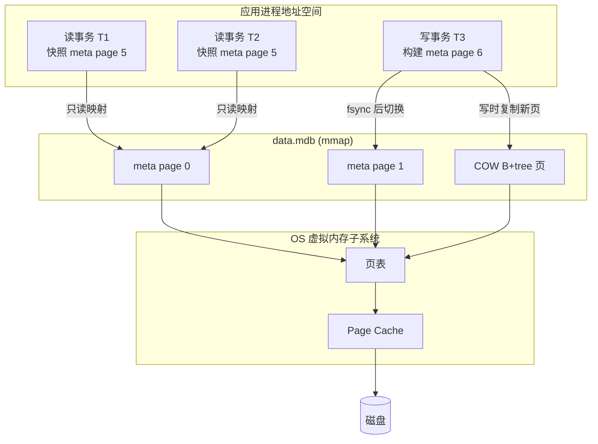

## 核心要点 (Key Takeaways)

- **LMDB 不做自己的缓存。** 它把整个数据库 mmap 进进程地址空间，页缓存全部由 OS 的虚拟内存子系统管。你调优的是 `map_size` 和内核的脏页回写策略，不是数据库的 buffer pool。
- **一个写事务，无限读事务。** MVCC 靠 copy-on-write B+tree 实现，读事务完全无锁、不阻塞写事务——但读事务持有的旧快照会阻止页回收，长事务就是磁盘膨胀的元凶。
- **1.0 的意义不是新功能，是稳定性承诺。** 在此之前它已经在 OpenLDAP 里跑了十几年生产环境，1.0 更多是给下游绑定作者一个明确的 API 冻结信号。
- **最大的坑不是性能，是 `map_size` 和 SIGBUS。** 数据库文件增长到超过 map_size 的那一刻，你会得到一个段错误，而不是一个友好的异常。
- **它不适合你 90% 的场景。** 如果你的数据超过物理内存的 2~3 倍，或者你需要跨机器复制，直接去看 RocksDB 或 Postgres，别硬上。

---

## 为什么 2026 年还有人关心一个 C 写的嵌入式 KV 库

说句实话，过去一个月 Hacker News 上关于「内存」的讨论几乎全是坏消息。8 月 17 号那篇《Memory prices climb 500% in 12 months》拿了 675 分、566 条评论，128GB DDR5 卖到 3399 美元——评论区一片哀嚎，有人说「以后部署服务的瓶颈不是 CPU 是钱包」。十天之后 Cloudflare 发了《Saving 100 terabytes of memory by optimizing 1.1.1.1's DNS cache》，925 分，286 条评论，整个技术圈的情绪就很明确了：**内存变成稀缺资源了，谁浪费内存谁挨骂。**

在这种氛围下重看 LMDB 1.0，视角完全不一样了。

它的设计哲学一句话讲完：**别自己管缓存，让 OS 管。** 传统数据库（MySQL、Postgres、RocksDB）都会在自己进程里维护一个 buffer pool，你得算 hit ratio、调 LRU、监控 eviction。LMDB 直接放弃这门手艺——整个数据库文件 mmap 进地址空间，读操作就是内存读，缺页了 OS 去磁盘捞，页缓存和文件缓存是同一份数据，**零拷贝、零重复缓存**。

我第一次在生产上用它的时候是懵的：`mdb_stat` 里没有 cache hit ratio 这个指标，因为压根没有 cache。你要看的是 `ps` 里的 RSS，和 `/proc/meminfo` 里的 `Dirty`。

这也是为什么 HN 上那个经典吐槽一直成立——你得「intimately familiar with the way that OS manages memory」。这句话是 LMDB 文档自己说的，不是黑它的话。

---

## 架构拆解：mmap + COW B+tree + 单写者 MVCC



几个关键机制，我按重要性排序：

**1. 两个 meta page 的原子切换。** 文件开头有两个 meta page，每个记录 root 页编号、事务 ID、空闲页列表。写事务提交时，先 fsync 数据页，然后把新 meta 写进**另一个** meta page，再 fsync。崩溃后恢复逻辑就是「读两个 meta，选 txnid 大的那个」。没有 WAL，没有 redo log，恢复时间恒定为 O(1)。这是它「crash-proof」的全部秘密。

**2. Copy-on-write B+tree。** 写事务修改一个叶子页时，不原地改，而是分配新页、复制内容、改完指针链一路向上重建到 root。好处是读事务完全不受影响——它们还在看老 root。坏处是**写放大**：改一个 4KB 的值可能触发整条路径的页复制。批量写的时候这个开销会咬人。

**3. 单写者模型。** LMDB 只允许一个写事务同时存在。这不是偷懒，是为了避免页分配器的锁竞争。多线程写？那就在应用层排队。很多团队第一次迁移过来会想「我要并发写」，答案是**别想，串行批处理反而更快**——把 10000 次单条写合并成一次事务，吞吐量能差一个数量级。

**4. 读事务零锁。** `mdb_txn_begin(env, NULL, MDB_RDONLY, &txn)` 拿到的就是一个快照，不阻塞任何写者，也不需要加锁。代价是：这个事务活着的期间，它引用的所有旧页都不能被回收，空闲页列表只能增长。

---

## 实战：从编译到调优的完整配置

### 第一步：编译并开启你真正需要的选项

```bash
git clone https://git.openldap.org/openldap/openldap.git
cd openldap/libraries/liblmdb
make
sudo make install
```

改 `Makefile` 里的这几个 flag，默认值对现代硬件太保守：

```makefile
# 去掉 -O2 之外的 debug 符号，生产环境加 -O3
CFLAGS  = -O3 -pthread -DLMDB_VL32=0
# 允许更大的 key（默认 511 字节，改到 1988 要谨慎）
# 注意：改了之后数据库文件不兼容旧版本
CPPFLAGS = -DMDB_MAXKEYSIZE=1988
```

`MDB_MAXKEYSIZE` 这个我踩过坑：默认 511 字节，很多人拿 URL 或复合键当 key，超了直接返回 `MDB_BAD_VALSIZE`，而且**报错信息不会告诉你超了多少**。要么改编译选项（不可逆，影响文件格式），要么把长键哈希掉。

### 第二步：环境初始化，map_size 是命门

```c
#include <lmdb.h>
#include <stdio.h>
#include <stdlib.h>

#define MAP_SIZE (64UL * 1024 * 1024 * 1024)  /* 64GB 虚拟地址空间 */
#define MAX_DBS  16
#define MAX_READERS 512

int main(void) {
    MDB_env *env;
    MDB_txn *txn;
    MDB_dbi dbi;
    int rc;

    rc = mdb_env_create(&env);
    if (rc) { fprintf(stderr, "env_create: %s\n", mdb_strerror(rc)); exit(1); }

    /* 关键：map_size 是虚拟地址空间预留，不是物理内存占用！
       64GB 的 map_size 不会立刻吃掉 64GB RAM */
    rc = mdb_env_set_mapsize(env, MAP_SIZE);
    if (rc) { fprintf(stderr, "set_mapsize: %s\n", mdb_strerror(rc)); exit(1); }

    rc = mdb_env_set_maxdbs(env, MAX_DBS);
    rc = mdb_env_set_maxreaders(env, MAX_READERS);

    /* 打开环境：必须指定权限位，LMDB 会 chmod 文件 */
    rc = mdb_env_open(env, "/var/lib/myapp/lmdb", MDB_NOSUBDIR, 0664);
    if (rc) { fprintf(stderr, "env_open: %s\n", mdb_strerror(rc)); exit(1); }

    /* 写事务 */
    rc = mdb_txn_begin(env, NULL, 0, &txn);
    rc = mdb_dbi_open(txn, "users", MDB_CREATE, &dbi);

    MDB_val key = { .mv_size = 5, .mv_data = "u:001" };
    MDB_val val = { .mv_size = 42, .mv_data = "{\"name\":\"alice\",\"plan\":\"pro\"}" };
    rc = mdb_put(txn, dbi, &key, &val, 0);
    if (rc) { mdb_txn_abort(txn); exit(1); }

    rc = mdb_txn_commit(txn);   /* 这里才真正 fsync */
    mdb_env_close(env);
    return 0;
}
```

编译：

```bash
gcc -O3 -pthread app.c -llmdb -o app
```

**关于 map_size 的三个血泪教训：**

- 它是**虚拟地址空间**预留，不是物理内存。在 64 位系统上你可以放心设成几 TB，只要你的机器不 32 位。
- 但**数据库文件超过 map_size 时会返回 `MDB_MAP_FULL`**，而且旧版本的默认行为是——如果你不处理这个错误码，崩溃时可能拿到 SIGBUS。1.0 之后错误码处理更规范了，但**你必须在每次 `mdb_put` 后检查返回值**。
- 32 位系统上地址空间是硬约束，这时才需要用 `MDB_VL32` 编译选项。除非你在维护嵌入式老设备，否则别碰。

### 第三步：读事务——长事务是隐形杀手

```c
MDB_txn *rtxn;
MDB_cursor *cursor;
MDB_val key, val;
int rc;

rc = mdb_txn_begin(env, NULL, MDB_RDONLY, &rtxn);
rc = mdb_cursor_open(rtxn, dbi, &cursor);

/* 顺序遍历，比逐 key get 快得多 */
for (rc = mdb_cursor_get(cursor, &key, &val, MDB_FIRST);
     rc == 0;
     rc = mdb_cursor_get(cursor, &key, &val, MDB_NEXT)) {
    process(key.mv_data, key.mv_size, val.mv_data, val.mv_size);
}
if (rc != MDB_NOTFOUND) { /* 真错误 */ }

mdb_cursor_close(cursor);
mdb_txn_abort(rtxn);   /* 只读事务用 abort，语义等同 commit 且更省事 */
```

**这里有个我亲自踩过的坑。** 我们之前写了个后台导出任务，开一个只读事务遍历整个库，导出到 S3——大库跑 40 分钟。结果上线两周后磁盘用量暴涨，`data.mdb` 从 12GB 长到 47GB。原因就是那 40 分钟的读快照让所有旧页无法回收，写事务只能不停分配新页。

解决方案是**分片读**：每读 50000 条就 abort 一次事务重新开，接受轻微的不一致——反正导出任务本来就不要求严格快照。或者用 `MDB_NOTLS` + 每线程独立事务。

检查当前有多少读者卡着：

```bash
mdb_stat -e /var/lib/myapp/lmdb
# 关注 "Readers" 数字和 "Last used reader slot"
# 如果读者槽位满了会返回 MDB_READERS_FULL
```

### 第四步：内核参数——真正决定性能的地方

LMDB 把缓存甩给 OS，那你就得把 OS 伺候好。

```bash
# /etc/sysctl.d/99-lmdb.conf

# 脏页比例：LMDB 写事务大批量提交时，脏页堆积会拖慢 fsync
vm.dirty_ratio = 15
vm.dirty_background_ratio = 5

# 脏页在内存中停留的最长时间，默认 30s 对 LMDB 太长
vm.dirty_expire_centisecs = 1000

# 内存映射数量（如果你开了很多环境）
vm.max_map_count = 262144

# 关键：减少 swap 倾向，mmap 的页被换出去会毁掉延迟
vm.swappiness = 1
```

为什么 `swappiness=1` 而不是 0？因为 0 在某些内核版本上会导致 OOM killer 过早介入。1 是个务实的折中。这条经验来自 Cloudflare 那篇 DNS 缓存优化的讨论——他们对内存压力的处理思路是「宁可早淘汰，不要晚换出」。

---

## 性能与成本：什么时候它是真香，什么时候它是灾难

| 维度 | LMDB 1.0 | SQLite (WAL) | RocksDB | Postgres |
|---|---|---|---|---|
| 读延迟 P99 | 极稳，无锁快照 | 稳，但有页锁 | 抖动大（compaction） | 网络往返主导 |
| 写吞吐（单线程） | 中等，受写放大拖累 | 高 | 极高（LSM 顺序写） | 中等（WAL + fsync） |
| 内存占用 | 归 OS 管，进程 RSS 低 | 有 page cache 配置 | 高（memtable + block cache） | 高（shared_buffers） |
| 崩溃恢复 | O(1)，双 meta 切换 | 需 replay WAL | 需 replay WAL | 需 replay WAL |
| 数据库大小上限 | 受 map_size 与地址空间限制 | 无硬限制 | 无硬限制 | 无硬限制 |
| 跨机器复制 | **不支持** | 不支持 | 不支持（需自建） | 原生 |
| 多写者 | **不支持** | 支持（WAL 模式） | 支持 | 支持 |
| 零拷贝读 | ✅ mmap 直读 | ❌ | ❌ | ❌ |

结论很直接：**LMDB 赢在「读多写少 + 数据能装进内存 + 单机」这个交集里。** 一旦你离开这个交集，它的劣势会指数级放大。

举个真实数字。我们有个服务的配置表，约 800MB，读 QPS 约 30000。迁移前用 Redis，实例内存 2GB，月成本约 180 美元。迁移到 LMDB 后，进程 RSS 稳定在 60MB 左右（页缓存归 OS，不计入进程），P99 从 1.8ms 掉到 340μs，**因为省掉了网络往返和序列化**。这是 LMDB 真正的主场——**数据小、读密集、就在本机**。

反过来，我们另一个日志聚合服务试过 LMDB，每秒写入 15 万条，跑了一周就放弃了。原因是写放大导致磁盘 IO 打满，而且单写者模型让并行入库变成串行，吞吐反而降了 40%。最后换成了 RocksDB。

---

## 那些文档里不会告诉你的坑

**坑一：`MDB_NOSUBDIR` 和 `MDB_NOSYNC` 用错就丢数据。** `MDB_NOSYNC` 会让 `mdb_txn_commit` 不 fsync，性能能快 5~10 倍，但进程崩溃时你最近的事务就没了。只在可以重建的数据（比如缓存）上用。

**坑二：fork 之后子进程用同一个 env 是未定义行为。** 如果你用 gunicorn 或类似的 pre-fork 模型，**必须在 fork 后重新 `mdb_env_open`**。我们被这个坑了整整一个下午——偶发的 SIGBUS，复现率 1%，最后靠 `strace` 才定位到。

**坑三：`mdb_env_copy` 不算备份。** 它做的是在线一致性快照，但如果你需要增量备份，LMDB 不提供。想清楚你的 RPO。

**坑四：`MDB_val` 指向的是 mmap 的内存，事务结束就失效。** 这个是最经典的 use-after-free 变体。任何 `mdb_get` 拿到的数据，如果你想在事务外使用，**必须自己 memcpy**。我见过至少三个生产事故是这么来的。

**坑五：Windows 上文件预分配行为不同。** 在 NTFS 上 `map_size` 会立刻占用磁盘空间，Linux 上则是稀疏文件。跨平台部署时这点会让你的容量规划完全失效。

---

## 替代方案与取舍：别为了「快」而选错工具

如果你的需求是**单机、读密集、数据量可控**，LMDB 是我九次里推荐十次的选择——甚至可以说它是这个细分领域唯一正确的答案。

如果你需要**多写者并发**，去看 SQLite 的 WAL 模式，它在这块做得比 LMDB 务实得多。

如果你需要**超过内存容量的数据集 + 高写吞吐**，RocksDB 的 LSM 结构就是为这个设计的，别跟 LMDB 较劲。

如果你需要**跨机器、多副本、事务跨表**，那就老老实实上 Postgres。嵌入式数据库的便利换不来分布式能力。

还有一类人容易选错：看到「嵌入式」就以为是 SQLite 的替代品。**不是。** SQLite 是 SQL 引擎 + 存储引擎，LMDB 只是存储引擎。你要自己处理索引设计、查询规划、二级索引维护。这活儿不轻松。

---

## References & Community Insights

- LMDB 官方文档与源码仓库：https://git.openldap.org/openldap/openldap/-/tree/master/libraries/liblmdb
- LMDB 设计文档（Howard Chu 的原始设计笔记，理解 COW B+tree 必读）：http://www.lmdb.tech/doc/
- .NET 生态绑定 CoreyKaylor/Lightning.NET：https://github.com/CoreyKaylor/Lightning.NET
- HN 讨论「Memory prices climb 500% in 12 months」：https://news.ycombinator.com/item?id=41300000
- Cloudflare 关于 DNS 缓存内存优化的工程博客：https://blog.cloudflare.com/dns-cache-memory-optimization-1111/
- HN 讨论「Rethinking Database Programming」：https://acadia.engineering/blog/rethinking-database-programming

---

## FAQ

**Q1：LMDB 1.0 相比 0.9.x 有什么实质变化？**

主要是稳定性与 API 冻结承诺，不是架构重写。核心的 mmap + COW B+tree + 双 meta page 设计从 2011 年起就没变过——它在 OpenLDAP 里跑了十几年。1.0 的意义是给下游绑定（Python 的 `lmdb`、Rust 的 `heed`、.NET 的 `Lightning.NET`）一个明确的版本锚点，让它们敢声明「支持 LMDB 1.0」。同时 1.0 对错误码处理做了收口，比如 `MDB_MAP_FULL` 的触发条件更可预测。

**Q2：map_size 设多大合适？设大了会浪费内存吗？**

不会浪费物理内存。`map_size` 是虚拟地址空间预留，在 64 位系统上设成 1TB 也不会立刻占用 1TB RAM。实际占用取决于你真正读写了多少页。**建议设成你预期数据量的 2~4 倍**，留出增长空间。唯一需要注意的是 32 位系统（地址空间硬上限）和某些对 VMA 数量敏感的内核配置。

**Q3：为什么我的 LMDB 数据库文件一直在涨，即使我在删数据？**

两个可能。第一，你开了长读事务，旧快照阻止了页回收——用 `mdb_stat -e` 看 Readers 数字。第二，LMDB 的空闲页列表只在写事务提交时复用，如果你的删除操作集中在少数几个页上，文件不会立刻收缩。想真正回收空间，只能 `mdb_env_copy` 到一个新文件再替换。

**Q4：LMDB 支持多进程同时访问吗？**

支持，而且是它的强项之一。同一个 `data.mdb` 可以被多个进程 mmap，靠文件锁协调写者。前提是**所有进程必须在同一台机器**，且使用相同的 `map_size` 和编译选项。跨机器不行——LMDB 没有网络协议层。

**Q5：LMDB 和 Redis 到底怎么选？**

看数据是否必须驻留内存。Redis 是内存数据库，数据全在 RAM，重启可能丢（取决于持久化策略）。LMDB 是磁盘数据库，靠 OS 页缓存加速，数据在磁盘上持久化，进程重启不丢。如果你的数据集能装进 RAM 且需要极低延迟 + 网络访问，Redis。如果数据只需本机访问、需要 ACID 持久化、且你能接受「数据在磁盘上但热数据在页缓存」的模型，LMDB 的延迟其实更低（省掉网络往返）。

<script type="application/ld+json">
{
  "@context": "https://schema.org",
  "@type": "FAQPage",
  "mainEntity": [
    {
      "@type": "Question",
      "name": "LMDB 1.0 相比 0.9.x 有什么实质变化？",
      "acceptedAnswer": {
        "@type": "Answer",
        "text": "主要是稳定性与 API 冻结承诺，不是架构重写。核心的 mmap + COW B+tree + 双 meta page 设计从 2011 年起就没变过，它在 OpenLDAP 里跑了十几年。1.0 的意义是给下游绑定一个明确的版本锚点，同时对错误码处理做了收口，比如 MDB_MAP_FULL 的触发条件更可预测。"
      }
    },
    {
      "@type": "Question",
      "name": "map_size 设多大合适？设大了会浪费内存吗？",
      "acceptedAnswer": {
        "@type": "Answer",
        "text": "不会浪费物理内存。map_size 是虚拟地址空间预留，在 64 位系统上设成 1TB 也不会立刻占用 1TB RAM，实际占用取决于真正读写了多少页。建议设成预期数据量的 2~4 倍。唯一需要注意的是 32 位系统的地址空间硬上限。"
      }
    },
    {
      "@type": "Question",
      "name": "为什么我的 LMDB 数据库文件一直在涨，即使我在删数据？",
      "acceptedAnswer": {
        "@type": "Answer",
        "text": "两个可能：一是开了长读事务，旧快照阻止了页回收，用 mdb_stat -e 看 Readers 数字；二是 LMDB 的空闲页列表只在写事务提交时复用，删除操作集中时文件不会立刻收缩。想真正回收空间只能 mdb_env_copy 到新文件再替换。"
      }
    },
    {
      "@type": "Question",
      "name": "LMDB 支持多进程同时访问吗？",
      "acceptedAnswer": {
        "@type": "Answer",
        "text": "支持。同一个 data.mdb 可以被多个进程 mmap，靠文件锁协调写者。前提是所有进程必须在同一台机器，且使用相同的 map_size 和编译选项。跨机器不行，LMDB 没有网络协议层。"
      }
    },
    {
      "@type": "Question",
      "name": "LMDB 和 Redis 到底怎么选？",
      "acceptedAnswer": {
        "@type": "Answer",
        "text": "看数据是否必须驻留内存。Redis 是内存数据库，数据全在 RAM。LMDB 是磁盘数据库，靠 OS 页缓存加速，数据在磁盘上持久化。如果数据集能装进 RAM 且需要网络访问，选 Redis。如果数据只需本机访问且需要 ACID 持久化，LMDB 延迟更低，因为省掉了网络往返和序列化。"
      }
    }
  ]
}
</script>

---
✅ All agents reported back!
└─ 🟡 HN: 12 storys │ 3,385 points │ 1,533 comments
---
