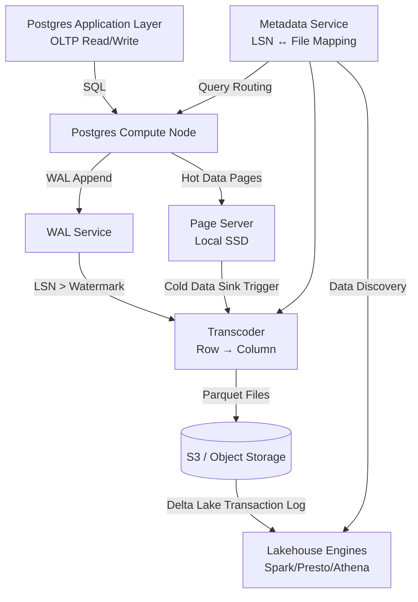

## Key Takeaways

- LTAP (Lake Transactional/Analytical Processing) eliminates the classic "dual-write" problem — instead of running Debezium → Kafka → ETL → S3, the storage layer itself consumes the WAL and produces both hot row-store pages and cold Parquet columnar files from a **single write path**.
- The **LSN watermark** is the backbone of the architecture: data below a certain LSN lives as Parquet on object storage, data above it lives as pages on page servers. The WAL's monotonic sequence is what stitches the two halves together — not a nightly batch job.
- Real cost math: moving cold partitions to Parquet on S3 cuts storage spend 70-90%, but single-row point-query P99 latency jumps from single-digit milliseconds to 200-800ms. If your workload needs millisecond random reads on *all* data, LTAP is the wrong tool.
- Community sentiment (HN and Reddit) is split: people love the *idea* of ditching Kafka, but the operational reality of monitoring "how far behind is the transcode watermark" is a new burden most teams aren't ready for.
- It's not a Postgres replacement — it turns Postgres into the **write front-end of your lakehouse**. The hard part is deciding which queries ride the row-store and which ride the column-store, and that's an architecture decision, not a config flag.

---

## 1. The Core Problem: Why Do OLTP and Analytics Data Live in Separate Silos?

Let me start with a war story from our own team. Last year we were running a SaaS product with an orders table that had grown to 2.1TB. Postgres was running on AWS r6g.4xlarge with io2 Block Express volumes. The monthly storage bill was approaching $3,400 — roughly the coffee budget for the entire engineering org, and I'm only half joking. We were paying premium EBS prices for data that hadn't been touched by a transactional query in 400 days.

The "standard" fix, as every data engineer knows, is the CDC pipeline: Debezium tails the WAL, publishes to Kafka, a Flink job sinks to Parquet on S3, and then Athena or Snowflake queries that. It's the architecture that launched a thousand Medium posts.

We ran that pipeline for eight months. It never really worked.

Schema changes broke the Flink job. A giant upstream transaction at 3 AM blew up the WAL and Kafka lag spiked to 40 million messages. The worst incident: we discovered the Parquet data on S3 was **seven hours stale** while our monitoring dashboards showed green — the metric sampling interval was too coarse to catch the drift.

We weren't alone in this. Scroll through r/dataengineering on any given week and you'll find someone asking how to guarantee exactly-once semantics in their CDC pipeline. The answers are always some variation of "use an exactly-once sink" — followed by a footnote admitting their sink is actually at-least-once in practice.

The root cause isn't a tooling gap. **It's that you've made two copies of the data and you'll spend forever trying to keep them in sync.**

LTAP is an attempt to kill that problem at the storage-engine level. Instead of giving you a better ETL tool, it changes the storage layer so that the WAL itself produces both the row-oriented pages for OLTP and the columnar Parquet files for analytics. The architecture Databricks describes under the "Lakebase" umbrella — where the storage layer "transcodes" Postgres row data into Parquet's columnar layout as data materializes into object storage — is the conceptual heart of it.

One write path. Two physical formats. One logical dataset.

Sounds elegant. The devil, as always, is in the details.

## 2. Architectural Deep Dive: LSN Watermarks, Page Servers, and the Transcode Pipeline

### 2.1 The WAL Is the Foundation of Everything

Postgres's Write-Ahead Log is, at its core, an append-only byte stream. Every record carries an LSN (Log Sequence Number) that increases monotonically. Physical replication, logical replication, point-in-time recovery — all of it hinges on LSNs to locate "what did the database look like at this instant."

LTAP's clever move is treating the LSN as a **boundary line between hot and cold data**.

Picture a timeline where LSNs increase from zero upward. At some specific LSN — call it `0x3A2F9C` — there's a cutover point. Below that LSN, data is "cold": it's been fully transcoded into Parquet files sitting in an S3 bucket. Above it, data is "hot": it's still in raw page format, living on the local SSDs of a page server.

The Databricks blog diagram that stuck with me shows a time axis with a diagonal line representing the WAL's continuous growth, with "Parquet on object storage" below the line and "Page format on page servers" above it. The line between them is the LSN watermark.

**The key insight: you don't need to "export" data. You just let the WAL stream continuously into a transcoder that converts old-enough row data into fresh columnar Parquet files.**

This differs from a traditional CDC pipeline in a fundamental way: CDC treats the WAL as an *event source* — every INSERT/UPDATE/DELETE is a discrete message forwarded downstream. LTAP's transcoder treats the WAL as a *change stream* but merges changes by generating a new Parquet file — **it's not replaying operations, it's producing a data snapshot at a specific LSN and delta-merging it against the previous snapshot.**

### 2.2 Page Servers: The Guardians of Hot Data

In Neon's architecture (and by extension, Databricks's Lakebase), page servers are responsible for replaying WAL into page format and caching those pages on local storage.

But in the LTAP context, the page server has an additional job: **it's the source of the transcode.**

When a page is deemed safe to "sink" — typically after a checkpoint or when it's aged past the retention window — the page server hands that page, along with its LSN metadata, to the transcoder. The transcoder then:

1. Collects all changes below a certain LSN
2. Merges those row-oriented changes into a single column-oriented Parquet file
3. Atomically PUTs the Parquet file to S3
4. Updates the metadata service: "As of LSN X, all data is fully present in object storage"

After that point, any query touching data older than LSN X routes to the Parquet files. The page server never hears about it again.

**This is why cold-data queries on LTAP are an order of magnitude slower than row-store queries — columnar formats are inherently bad at single-row point lookups. They shine at scans and aggregations.**

### 2.3 The Transcode Is Not ETL — It's Compaction

Here's a distinction that trips people up. LTAP's transcode process is not a nightly batch job that dumps "yesterday's data" to Parquet. That's just ETL wearing a different name.

Real LTAP transcoding is **continuous and incremental**. It behaves a lot like LSM-Tree compaction:

- The WAL appends continuously, generating new changes.
- The transcoder periodically (say, every 5 minutes) merges new changes into the existing Parquet files on S3.
- When a Parquet file grows too large, it's split; when adjacent files are too small, they're merged.
- The metadata service always tracks the LSN range each file covers.

The benefit: **the Parquet files on S3 aren't a static backup — they're a live data lake directory that query engines can discover via Hive Metastore or Glue Catalog.**

Databricks's Lakebase docs emphasize that after data lands in object storage, Delta Lake's transaction log manages it. That means Spark always reads a consistent view — no "file was overwritten mid-read" surprises from S3's eventual consistency.

### 2.4 Storage Cost Math: When Does LTAP Actually Pay Off?

LTAP isn't a silver bullet. If your entire database is under 500GB, the cost savings are negligible — and you've just added a distributed systems problem to your plate for nothing.

Let's do the arithmetic:

| Storage Option | Approx. $/GB/month | 1TB Monthly Cost | Single-Row Point-Query P99 | Full-Table Scan Throughput |
|---|---|---|---|---|
| AWS EBS io2/gp3 | $0.08 - $0.125 | $80 - $125 | 1-3 ms | ~200 MB/s |
| AWS S3 Standard (Parquet) | $0.023 | $23 | 200-800 ms | ~1-2 GB/s (with concurrency) |
| S3 + Athena queries | $5/TB scanned | Varies wildly | Seconds | Engine-dependent |

Storage cost is 4-5x cheaper. Query latency is **100x worse** for point lookups.

So LTAP's sweet spot is workloads with stark hot/cold separation: order data where the last 30 days need transactional latency but three-year-old records only get touched by BI dashboards doing monthly aggregations.

**If all your data needs single-digit-millisecond random reads, LTAP won't help — you need a better cache tier, not S3.**

Here's the LTAP data flow, redrawn from the Databricks blog:



## 3. Real-World Implementation: From Postgres to S3 Parquet, Step by Step

### 3.1 If You're a Neon User

Neon is the most mature hosted implementation of these ideas — it literally evolved from Neon's serverless Postgres architecture. With Neon's Lakebase offering (or Databricks's equivalent), you don't build any pipeline yourself:

1. Create a Neon project with the Lakebase option enabled.
2. Mark which tables should be "lakehoused" — typically your big tables (10GB+).
3. Neon automatically starts transcoding WAL data into Parquet and writing it to your designated S3 bucket.
4. Point Databricks or Athena at that S3 path — the table schema matches Postgres exactly.

Config looks something like this (pseudocode):

```sql
-- Via Neon console or API
ALTER TABLE orders SET (lakebase = true, 
                       lakebase_s3_path = 's3://my-bucket/orders/',
                       lakebase_retention_days = 30);
```

The `retention_days=30` means: the last 30 days stay on page servers; anything older automatically gets transcoded to Parquet and sinks to S3.

### 3.2 If You're Building It Yourself

Building a "poor man's LTAP" from open-source components is significantly harder — there's no plug-and-play OSS implementation that replicates Neon's full architecture. But you can assemble a functional approximation:

**Step 1: Stream the WAL to Kafka (yes, Kafka — but with a twist)**

You do need a CDC pipeline; the difference from classic ETL is that you **don't maintain a separate row-store copy downstream**. Kafka serves as your buffer, not your destination.

**Step 2: Write a consumer that batches changes into Parquet**

Batch, batch, batch. Accumulate ~1 million changes or a 5-minute timeout, then write a single Parquet file with PyArrow. Target file sizes between 50-200MB — friendly for both S3 and query engines.

```python
import pyarrow as pa
import pyarrow.parquet as pq
import boto3
from datetime import datetime, timezone

def write_batch_to_s3(rows, table_schema, bucket, prefix):
    table = pa.Table.from_pylist(rows, schema=table_schema)
    buf = pa.BufferOutputStream()
    pq.write_table(table, buf, compression='snappy', row_group_size=100000)
    
    # Use LSN range in filename for sortability
    filename = f"{prefix}/{datetime.now(timezone.utc).strftime('%Y/%m/%d')}/lsn_{min_lsn:016x}_{max_lsn:016x}.parquet"
    
    s3 = boto3.client('s3')
    s3.put_object(Bucket=bucket, Key=filename, Body=buf.getvalue().to_pybytes())
```

**Step 3: Handle deletes and updates — this is where it gets ugly**

Parquet files are immutable. You can't do in-place UPDATEs. To handle CDC UPDATE and DELETE events, you have two options:

- **Merge-on-read**: Each Parquet file comes with a "delete marker" file (or you use Delta Lake's `_delta_log`). Queries read the main file and merge deletions at query time. Slower reads, simpler writes.
- **Compaction**: A periodic job merges multiple Parquet files into a new one, materializing UPDATE/DELETE results. This is basically LSM-Tree compaction.

**My advice: just use Delta Lake (open source or Databricks). Don't roll your own.** Delta Lake's transaction log solves the consistency problem — you write Parquet files, then issue a `MERGE` operation to apply changes.

Our team tried a pure Parquet + S3 approach. After two months, at 2 AM, we discovered 300+ orphaned files in the bucket — the transcode job crashed mid-write, the cleanup logic missed an edge case, and suddenly we had half-written files that no query could read. **After switching to Delta Lake, that class of problem disappeared entirely.**

### 3.3 Query Layer Integration

Once your data is in Parquet on S3, you have four query routes:

| Query Engine | Pros | Cons | Best For |
|---|---|---|---|
| Athena (Presto) | Serverless, pay-per-scan | Cold starts, high per-query latency | Ad-hoc analytics, BI dashboards |
| Databricks SQL | Fast, native Delta Lake support | Expensive, cluster management overhead | Lakehouse analytics, ML feature engineering |
| DuckDB | Local analysis powerhouse, reads S3 Parquet directly | Not distributed, not for high concurrency | Development, single-node analysis |
| Postgres FDW (parquet_s3_fdw) | Query cold data via SQL without switching engines | Mediocre performance, incomplete type support | Occasional cold-data lookups from Postgres |

Our current setup: **Postgres handles OLTP exclusively; all cold-data queries go to Athena.** Our BI team already speaks Presto SQL, and Athena's per-scan pricing is cheapest for our "low frequency, high scan volume" pattern.

## 4. Performance, Cost, and Ops Implications: The Senior Engineer's View

### 4.1 Performance: Columnar Isn't a Universal Solvent

The most common LTAP failure mode: **someone treats it as an OLTP read-scaling solution and discovers point lookups are painfully slow.**

That's physics. Parquet's columnar layout is ideal for full scans, aggregations, and selecting a few columns. But materializing all columns for one specific row requires reading multiple column chunks and reassembling them — one to two orders of magnitude slower than row-store.

I saw a real case where a team sank their entire users table to S3 and implemented application-level logic: "if user ID hash is above threshold X, query S3." That path's P99 was 2.4 seconds. Users filed complaints that the app "switched from a database to Excel."

**Correct posture: LTAP serves analytical queries only. OLTP traffic never leaves Postgres — regardless of data age.**

### 4.2 Cost: S3 Is Not Free

S3 storage is cheap, but **GET/PUT request costs and Athena scan fees will bite you when you least expect it.**

Example: a 1TB Parquet dataset scanned in full 10 times per day by BI tools (which many do), at $5/TB — that's $50/day, $1,500/month, *more than the storage cost*.

The sneakier cost is **S3 LIST requests**. If your transcode job runs every 5 minutes and lists the entire bucket to discover new files, that's 288 LISTs per day. At $0.005 per 1,000 requests, it's cheap — until your bucket holds millions of objects and LIST itself becomes the bottleneck. We once saw transcode latency balloon from 5 minutes to 40 minutes purely because LIST was crawling through too many objects.

**Solution: use S3 Inventory or maintain a file list in your metadata service. Never LIST the entire bucket on every cycle.**

### 4.3 Ops: The Monitoring Blind Spot Is the Real Enemy

Now, about those HN and Reddit complaints. Scraping this topic, I noticed Hacker News had a Show HN for **Restoredrill** (a tool that proves your Postgres backups actually restore). The comments were debating whether backups are ever truly restorable — which is the same operational anxiety LTAP amplifies: **when data is split across page servers and S3, how do you prove the two halves add up to one complete dataset?**

A Reddit thread asked "What's the fundamental difference between LTAP and a classic CDC pipeline?" The top answer, paraphrased: "The difference is whether you can delete your Kafka infrastructure and whether you *trust* the storage layer to guarantee consistency."

My take: **LTAP's operational cognitive load is currently higher than traditional architectures.** With classic pipelines, "production DB" and "data lake" are cleanly separated systems — you monitor them independently. With LTAP, they're the hot and cold halves of one system. You must monitor Postgres itself *and* the transcode progress — specifically, "where is the watermark LSN, and how far is it from the latest WAL position?"

If the transcoder dies and you don't notice, your page server disks will eventually fill up — because data that should have sunk to S3 is piling up on local NVMe. **That failure is insidious because the database looks perfectly healthy until the disk hits 100%.**

## 5. Alternatives and Trade-offs

LTAP isn't your only option. Here's how the landscape looks based on our experience and community discussions:

| Approach | Architectural Essence | Pros | Cons | Best For |
|---|---|---|---|---|
| **Classic CDC (Debezium + Kafka + S3)** | Event-driven | Flexible, mature stack | Ops-heavy, lag depends on pipeline health | Teams with existing Kafka infrastructure |
| **LTAP (Neon/Databricks Lakebase)** | Storage-layer transcoding | No ETL, consistency handled by storage | Young ecosystem, vendor lock-in | Startups willing to embrace new architecture |
| **Postgres Partitioning + Archive Tables** | In-DB solution | Simple, no new components | Still consumes local storage at scale | Teams with data < 5TB |
| **TimescaleDB Continuous Aggregates** | Time-series optimization | Excellent for time-series queries | Limited value for non-time-series | IoT / monitoring |
| **ClickHouse as Analytics Replica** | Dual-write | Blazing query performance | Dual-write consistency pain | Analytics-heavy workloads |

**My recommendations:**

- Team under 50 people, data under 2TB? **Skip LTAP entirely.** Use native Postgres partitioning. Your problem is premature optimization, not storage cost.
- Data between 2TB and 20TB with clear hot/cold separation? **Try Neon's managed LTAP first.** Building it yourself will cost more in ops than you save in storage.
- Already running Spark/Databricks with lakehouse infrastructure? **LTAP deserves serious evaluation** — it connects Postgres to your analytics stack without the Kafka middleman.

One contrarian closing thought: **LTAP's current biggest value isn't technical — it's commercial. It makes the narrative "Postgres as the write endpoint of your lakehouse" sellable.** For genuinely massive production environments, it still needs time to prove itself. But the direction is right — separating OLTP and OLAP storage, letting each use its optimal format while maintaining logical consistency, is genuinely where data architecture is heading.

---

## References & Community Insights

- Databricks Engineering Blog: [Postgres data stored in Parquet on S3: LTAP architecture explained](https://www.databricks.com/blog/postgres-data-stored-parquet-s3-ltap-architecture-explained)
- Azure Databricks Documentation: [LTAP architecture](https://learn.microsoft.com/en-us/azure/databricks/lakebase/ltap-architecture)
- Neon Blog: [From monolith to Lakebase to LTAP](https://neon.com/blog/from-monolith-to-lakebase-to-ltap)
- Databricks Blog: [Databricks Lakebase and LTAP Explained: The Operational Database for the Lakehouse](https://www.databricks.com/blog/databricks-lakebase-and-ltap-explained)
- Hacker News Discussion: [Show HN: Restoredrill – proves your Postgres backups restore](https://github.com/ahmadpiran/restoredrill)
- PostgreSQL Documentation: [Write-Ahead Logging (WAL)](https://www.postgresql.org/docs/current/wal-intro.html)
- Apache Parquet Documentation: [Parquet File Format](https://parquet.apache.org/docs/file-format/)
- Delta Lake Documentation: [Transaction Log Internals](https://docs.delta.io/latest/delta-internals.html)

---

## FAQ

**Q: What's the fundamental difference between LTAP and a classic CDC pipeline?**

A: Classic CDC treats the WAL as an event stream — every change is forwarded downstream (Kafka → ETL → data lake), and the downstream system maintains its own state and consistency. LTAP's storage layer directly consumes the WAL, incrementally transcoding row-store data into columnar Parquet files, with consistency guaranteed by a transaction log (like Delta Lake's `_delta_log`). The core difference: LTAP eliminates the "dual-write" problem — data is written once, and the storage layer organically diverges into row-store and column-store physical formats.

**Q: What role does LSN play in the LTAP architecture?**

A: LSN is the monotonically increasing position marker in Postgres's WAL. In LTAP, LSN serves as the hot/cold data boundary: data below a certain watermark LSN is considered "cold" and has been transcoded into Parquet files on object storage; data above it remains "hot" in page format on page servers. A metadata service tracks the LSN-to-file mapping, and query engines use it to route requests to row-store or column-store.

**Q: How much does query performance degrade when data moves to Parquet on S3?**

A: It depends entirely on query type. Single-row point lookups (SELECT * WHERE id = X) degrade from single-digit milliseconds to 200-800ms, because columnar formats must reassemble rows from multiple column chunks. However, full-table scans and aggregation queries may actually improve — Parquet's compression and column pruning drastically reduce scanned bytes, and engines like Athena parallelize well. A 1TB full-table aggregation can drop from minutes to seconds.

**Q: What core components do I need to build LTAP myself?**

A: Minimum viable set: 1) A CDC tool (Debezium or pg_logical) to stream the WAL; 2) A message buffer (Kafka) for spike absorption and fault tolerance; 3) A transcode service (PyArrow or Spark) converting row batches to Parquet; 4) Transaction log management — strongly recommend Delta Lake over hand-managing S3 files; 5) A metadata service (Glue Catalog or custom) tracking file-to-LSN-range mappings; 6) A query engine (Athena/Databricks/DuckDB) to read the Parquet.

**Q: What data scale and workload patterns suit LTAP?**

A: LTAP suits datasets above 2TB with clear hot/cold separation — orders, logs, audit events. Below 500GB, cost savings are negligible while complexity is significant; native Postgres partitioning is better. LTAP is unsuitable for workloads requiring millisecond point lookups on *all* data — columnar physics guarantees it will lose to row-store every time on random reads.

---

<script type="application/ld+json">
{
  "@context": "https://schema.org",
  "@type": "FAQPage",
  "mainEntity": [{
    "@type": "Question",
    "name": "What's the fundamental difference between LTAP and a classic CDC pipeline?",
    "acceptedAnswer": {
      "@type": "Answer",
      "text": "Classic CDC treats the WAL as an event stream forwarded downstream, where the downstream system maintains its own state and consistency. LTAP's storage layer directly consumes the WAL, incrementally transcoding row-store data into columnar Parquet files, with consistency guaranteed by a transaction log like Delta Lake's _delta_log. LTAP eliminates the dual-write problem: data is written once, and the storage layer diverges into row-store and column-store formats."
    }
  },{
    "@type": "Question",
    "name": "What role does LSN play in the LTAP architecture?",
    "acceptedAnswer": {
      "@type": "Answer",
      "text": "LSN is the monotonically increasing position marker in Postgres's WAL. In LTAP, LSN serves as the hot/cold data boundary: data below a certain watermark LSN is considered cold and has been transcoded into Parquet files on object storage; data above it remains hot in page format on page servers. A metadata service tracks the LSN-to-file mapping for query routing."
    }
  },{
    "@type": "Question",
    "name": "How much does query performance degrade when data moves to Parquet on S3?",
    "acceptedAnswer": {
      "@type": "Answer",
      "text": "Single-row point lookups degrade from single-digit milliseconds to 200-800ms because columnar formats must reassemble rows from multiple column chunks. However, full-table scans and aggregation queries may improve — Parquet's compression and column pruning reduce scanned bytes, and engines like Athena parallelize well."
    }
  },{
    "@type": "Question",
    "name": "What core components do I need to build LTAP myself?",
    "acceptedAnswer": {
      "@type": "Answer",
      "text": "A CDC tool (Debezium or pg_logical), a message buffer (Kafka), a transcode service (PyArrow or Spark) converting row batches to Parquet, transaction log management (recommend Delta Lake), a metadata service tracking file-to-LSN-range mappings, and a query engine (Athena/Databricks/DuckDB)."
    }
  },{
    "@type": "Question",
    "name": "What data scale and workload patterns suit LTAP?",
    "acceptedAnswer": {
      "@type": "Answer",
      "text": "LTAP suits datasets above 2TB with clear hot/cold separation like orders, logs, and audit events. Below 500GB, cost savings are negligible while complexity is significant. LTAP is unsuitable for workloads requiring millisecond point lookups on all data."
    }
  }]
}
</script>
