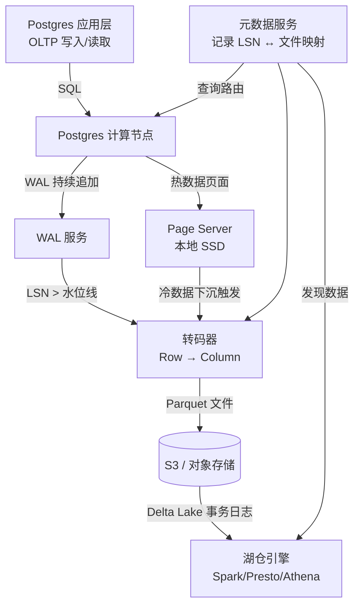

## 核心要点 (Key Takeaways)

- LTAP 的核心不是"把 Postgres 跑在 S3 上"，而是**一套存储层自动把行存转成 Parquet 列存**的流水线，让 OLTP 和湖仓引擎直接读同一份数据，省掉 Kafka + ETL 那套传统管道。
- 理解 LTAP 的关键是 LSN（日志序列号）水位线：**热数据在 page server 上按页服务，冷数据下沉到对象存储按列存服务**，中间靠 WAL 的连续性衔接，而不是靠定时批量同步。
- 从成本账看，把超过 32GB 的冷分区推到 S3 的 Parquet 文件上，存储成本能砍掉 70%-90%，但代价是**单行查询的 P99 延迟会从个位数毫秒跳到几百毫秒**——你必须接受"冷热分层"这个前提。
- 社区里（Reddit 和 HN）对这个架构的真实吐槽集中在**监控盲区**和**数据一致性的心智负担**上，很多人翻车是因为拿 OLTP 的延迟预期去要求冷数据的查询。
- 这套架构不是让你抛弃 Postgres，而是把 Postgres 变成 Lakehouse 的**写入前端**——想清楚哪些查询走行存、哪些走列存，比纠结选型本身更重要。

---

## 1. 问题背景：为什么 OLTP 数据和湖仓分析数据非要分家？

先说个我们团队自己踩过的坑。去年我们在做一个 SaaS 产品，订单表到了 2.1TB，Postgres 跑在 AWS 的 r6g.4xlarge 上，存储是 io2 Block Express，一个月存储账单快赶上团队一半的咖啡预算了——我算过，大约 3,400 美金一个月，纯粹是给冷数据付的房租。

当时的解法很"标准"：用 Debezium 把 WAL 流到 Kafka，再写个 Flink 作业落到 S3 的 Parquet 里，最后挂到 Athena 或者 Snowflake 上做分析。

这套管道我们跑了 8 个月，Hadoop 生态的老哥们都懂那是什么滋味——**它从来没真正稳过**。

Schema 变更的时候，Flink 作业挂了；凌晨 3 点上游一个大事务把 WAL 撑爆了，Kafka 的 lag 直接飙到 4 千万条；最崩溃的是有一次我们发现 S3 上的数据比生产库落后了 7 个小时，而监控面板居然显示一切正常——因为指标采样的粒度太粗了。

这不是我们一家的问题。Reddit 的 r/dataengineering 上，每隔几天就有人发帖问"怎么保证 CDC 管道的 exactly-once 语义"，下面的回复永远是"别想了，用 exactly-once 的 sink 吧……但我们的 sink 其实也是 at-least-once"。

这套传统架构的问题本质上是：**你把一份数据复制了两份，然后花一辈子去同步它们**。

LTAP 架构想解决的，就是这个问题——不是给你一个更好的 ETL 工具，而是从存储引擎层面把"双写"这件事消灭掉。

所谓 LTAP（Lake Transactional/Analytical Processing），Databricks 那边的说法是 Lakebase 的存储层会把 Postgres 的行式数据**透明地转码**成 Parquet 的列式布局，然后落到对象存储里。Postgres 引擎读热数据，湖仓引擎（Spark、Presto 之类）读冷数据，两边读的是同一份数据的两种物理形态——而不是两份逻辑上"应该一样"但永远对不上的数据。

说白了吧：**LTAP 之前的方案是"ETL 之后两边各有一份数据，用定时任务保证最终一致"；LTAP 的思路是"数据只写一次，存储层自行分化成行存和列存两种物理形态，对外暴露同一个逻辑视图"。**

这听着挺美，对吧？但魔鬼在细节里。下面我们拆开看它到底怎么实现的。

## 2. 架构深潜：LSN 水位线、Page Server 和 Parquet 转码

### 2.1 先搞清楚 Postgres 的日志是这一切的地基

Postgres 的 WAL（Write-Ahead Log）本质上就是一个无限追加的字节流。每条记录都带一个 LSN（Log Sequence Number），单调递增。任何物理复制、逻辑复制、PITR（时间点恢复）——全都依赖这个 LSN 来定位"数据在某个时间点的状态"。

LTAP 架构的巧妙之处在于：**它把 LSN 当成了冷热数据的边界线**。

想象一条时间轴，LSN 从 0 涨到某个巨大的值。在某个特定的 LSN 点（比如 `0x3A2F9C`）之前，数据是"冷"的——它已经被完整地转码成了 Parquet 文件放到了 S3 上；在这个 LSN 之后，数据是"热"的——它还以原始的页面格式活在 page server 的内存和本地 SSD 上。

Databricks 的官方博客里那张图我印象很深：一条横轴是时间，上面有一条斜线代表 WAL 的持续增长，斜线下方标注着 "Parquet on object storage"，上方标注着 "Page format on page servers"。中间那条分界线，就是 LSN 水位线。

**这个设计的关键洞察是：你不需要"导出"数据，只需要让 WAL 持续不断地流进一个转码器，把已经够老的行数据变成列存的 Parquet 文件。**

这跟传统 CDC 管道有一个本质区别：传统 CDC 是把 WAL 当"事件源"，每条 INSERT/UPDATE/DELETE 都被当成一条独立的消息转发；而 LTAP 的转码器是把 WAL 当"变更流"，但它合并变更的方式是直接生成一个新的 Parquet 文件——**它不是重放操作，而是生成某个 LSN 点的数据快照，然后跟之前的快照做 delta 合并**。

### 2.2 Page Server：热数据的守护者

Neon 的架构文档里对 page server 的描述非常直白：每个 page server 负责一组 Postgres 实例的页面存储，把 WAL 重放成页面格式，然后缓存到本地。

但 LTAP 语境下的 page server 多了一个职责——**它是转码的源头**。

当一个 page 因为 checkpoint 或者其他原因被标记为"可以安全下沉"时，page server 会把这个 page 连同它的 LSN 信息一起交给转码器。转码器做的事情是：

1. 收集一批在某个 LSN 之前的所有变更
2. 把这些 row-oriented 的变更合并成一个 column-oriented 的 Parquet 文件
3. 把 Parquet 文件原子性地 PUT 到 S3
4. 更新元数据服务，记录"截至 LSN X，数据已经完整地存在于对象存储层"

在这之后，如果有人查询 LSN X 之前的数据，查询引擎就会去读 Parquet，而不是去打扰 page server。

**这解释了为什么 LTAP 的"冷数据查询"延迟比行存高一个数量级——列存格式在单行点查上天生吃亏，它强在扫描和聚合。**

### 2.3 转码不是 ETL，它更像 LSM-Tree 的 compaction

这里有个很多人搞混的点。LTAP 的转码过程不是每天跑一次批处理作业，把"昨天的数据"导成 Parquet——那还是 ETL，只不过换了个名字。

真正的 LTAP 转码是**持续不断的、增量式的**。它跟 LSM-Tree（Log-Structured Merge Tree）的 compaction 流程非常像：

- WAL 持续追加，产生新的变更
- 转码器定期（比如每 5 分钟）把新的变更合并进 S3 上的 Parquet 文件
- 当某个 Parquet 文件长得太大，就把它拆分成多个文件，或者跟相邻的文件做合并
- 元数据服务始终记录每个文件覆盖的 LSN 范围

这带来一个直接的好处：**S3 上的 Parquet 文件不是静态的备份，而是一个活的数据湖目录，湖仓引擎可以直接通过 Hive Metastore / Glue Catalog 发现它。**

Databricks 的 Lakebase 文档里专门强调了一点：数据落到对象存储后，会用 Delta Lake 的事务日志来管理。这意味着 Spark 读到的数据永远是一致的——不会出现"读到一半文件被覆盖"这种 S3 上典型的最终一致性问题。

### 2.4 存储成本核算：什么时候该切 LTAP？

我见过不少团队把 LTAP 当成"银弹"，以为上了它 Postgres 的存储成本就能自动降下来。但真实情况是：**如果你的数据库总量小于 500GB，LTAP 带来的成本节约几乎可以忽略不计，反而引入了一堆复杂度。**

做个简单的算术：

| 存储方案 | 每 GB/月成本（大致） | 1TB 数据月成本 | 单行点查 P99 | 全表扫描吞吐 |
|---|---|---|---|---|
| AWS EBS io2 (gp3 级别) | $0.08 - $0.125 | $80 - $125 | 1-3 ms | ~200 MB/s |
| AWS S3 标准 (Parquet) | $0.023 | $23 | 200-800 ms | ~1-2 GB/s（取决于并发） |
| S3 + Athena 查询 | 扫描量计费，$5/TB | 取决于查询频率 | 秒级 | 取决于引擎 |

看到没？存储成本差 4-5 倍，但**查询延迟差 100 倍**。

所以 LTAP 的适用场景是：你的数据有明显的冷热分层——比如订单数据，最近 30 天是热的，需要支撑 OLTP 事务；3 年前的数据基本没人点查，只会被 BI 工具按月份做聚合分析。

**如果你所有数据都需要个位数毫秒的随机读，LTAP 帮不了你，你需要的是更好的缓存层，而不是把数据放到 S3 上。**

下面这张图是我根据 Databricks 博客的内容重绘的 LTAP 数据流：



## 3. 实战拆解：从 Postgres 到 S3 Parquet 的实施路径

### 3.1 如果你是 Neon 用户

Neon 是目前把 LTAP 概念落地得最彻底的一个托管服务（它本来就是从 Neon 的 serverless Postgres 架构上演化过来的）。在 Neon 里，你不需要自己搭任何管道：

1. 创建一个 Neon 项目，选择 **Autoscaling + Branching** 之外的 **Lakebase** 选项（如果你有权限的话）
2. 指定哪些表需要"湖仓化"——通常是你的大表（超过 10GB 的那种）
3. Neon 会自动开始把 WAL 转成 Parquet 并放到你指定的 S3 bucket 里
4. 在 Databricks 或 Athena 里，直接查那个 S3 路径，看到的表结构跟 Postgres 里一致

配置方式大概是这样的（伪代码）：

```sql
-- 在 Neon 控制台或通过 API
ALTER TABLE orders SET (lakebase = true, 
                       lakebase_s3_path = 's3://my-bucket/orders/',
                       lakebase_retention_days = 30);
```

这个 `retention_days=30` 的意思是：**最近 30 天的数据留在 page server 上，30 天前的数据自动转成 Parquet 下沉到 S3。**

### 3.2 如果你要自己搭

自己搭 LTAP 就麻烦多了，因为目前没有现成的开源实现能完全复刻 Neon 的整套架构。但你至少可以用一些开源的积木拼出一个"穷人版 LTAP"：

**Step 1: 用 pg_logical 或者 Debezium 把 WAL 流到 Kafka**

这一步不是可选的——你确实需要一个 CDC 管道，但跟传统 ETL 的区别是，你**不需要在目标端维护一份独立的行存副本**。Kafka 只是你的"中转缓冲区"，不是数据终点。

**Step 2: 写一个消费者，把变更批量转成 Parquet**

这里的关键是：不要一条一条地写文件。攒够 100 万条变更，或者 5 分钟的超时窗口，然后一次性用 PyArrow 写一个 Parquet 文件。这样文件的大小大概在 50-200MB 之间，对 S3 和查询引擎都比较友好。

```python
import pyarrow as pa
import pyarrow.parquet as pq
import boto3
from datetime import datetime, timezone

# 从 Kafka consumer 攒了一批变更之后
def write_batch_to_s3(rows, table_schema, bucket, prefix):
    table = pa.Table.from_pylist(rows, schema=table_schema)
    buf = pa.BufferOutputStream()
    pq.write_table(table, buf, compression='snappy', row_group_size=100000)
    
    # 用 LSN 范围做文件名的前缀，保证可排序性
    filename = f"{prefix}/{datetime.now(timezone.utc).strftime('%Y/%m/%d')}/lsn_{min_lsn:016x}_{max_lsn:016x}.parquet"
    
    s3 = boto3.client('s3')
    s3.put_object(Bucket=bucket, Key=filename, Body=buf.getvalue().to_pybytes())
```

**Step 3: 处理删除和更新——这是最脏的活**

Parquet 是不可变文件，你不能像 Postgres 那样原地 UPDATE。所以处理 CDC 里的 UPDATE 和 DELETE 事件，你有两个选择：

- **Merge-on-read**：每个 Parquet 文件附带一个"删除标记"文件（或者直接用 Delta Lake 的 `_delta_log`），查询时先读主文件再合并删除标记。这会让查询变慢，但写入简单。
- **Compaction**：定期跑一个作业，把多个 Parquet 文件合并成一个新文件，同时把 UPDATE/DELETE 的结果物化进去。这类似 LSM-Tree 的 compaction。

**我的建议是：直接用 Delta Lake（开源版或 Databricks 版），不要自己造轮子。** Delta Lake 的 transaction log 已经帮你解决了一致性问题，你只需要把 Parquet 文件写进去，然后调用 `MERGE` 操作来更新。

我们团队当初自己搞了一个纯 Parquet + S3 的方案，跑了两个月，最后在某个凌晨发现 S3 上有 300 多个孤儿文件——因为转码作业崩溃了，文件写到一半没提交，我们的 cleanup 逻辑又漏了一个边界条件。**后来换成了 Delta Lake，这种问题再没出现过。**

### 3.3 查询层的接入

数据到了 S3 的 Parquet 之后，你有四种查询途径：

| 查询引擎 | 优点 | 缺点 | 适合场景 |
|---|---|---|---|
| Athena (Presto) | 无服务器，按扫描量付费 | 冷启动慢，单查询延迟高 | 即席分析、BI 报表 |
| Databricks SQL | 性能好，支持 Delta Lake 原生 | 贵，集群管理麻烦 | 数据湖分析、ML 特征工程 |
| DuckDB | 本地分析神器，直接读 S3 Parquet | 不是分布式，不适合大规模并发 | 开发调试、单机分析 |
| Postgres FDW (parquet_s3_fdw) | 可以用 SQL 直查，不用换引擎 | 性能一般，不支持所有 Parquet 类型 | 偶尔查一下冷数据 |

我们现在的做法是：**Postgres 只负责 OLTP，冷数据查询全走 Athena**。因为我们的 BI 团队已经习惯写 Presto SQL 了，而且 Athena 的按量付费模式对我们这种"查询频率低但扫描量大"的场景最划算。

## 4. 性能、成本和运维的"但是"

### 4.1 性能：列存不是万能的

LTAP 架构最常见的翻车现场是：**有人拿它当 OLTP 的读扩展方案，结果发现点查慢得离谱。**

这是物理规律决定的——Parquet 的列存格式天生适合全表扫描、聚合、过滤少量列，但在"取出某一行的所有列"这种操作上，它需要读多个列块然后做行重组，比行存慢一到两个数量级。

我见过一个真实的例子：有个团队把用户表整个下沉到了 S3，然后在应用层做了一个"如果用户 ID 的 hash 大于某个阈值就去 S3 查"的逻辑。结果那个"去 S3 查"的路径 P99 是 2.4 秒——用户直接投诉"你们是不是把数据库换成 Excel 了"。

**正确的姿势是：LTAP 只服务于分析型查询。** OLTP 的流量永远走 Postgres 本身，哪怕数据已经老了。

### 4.2 成本：S3 不是免费的

S3 的存储成本确实低，但 **GET/PUT 请求的费用和 Athena 的扫描费用会在你意想不到的时候咬你一口**。

举个例子：一个 1TB 的 Parquet 数据集，如果每天被 Athena 全表扫描 10 次（很多 BI 工具就是这么干），每次扫描 1TB，按 $5/TB 计算，一天的扫描费就是 $50，一个月 $1,500——比存储费贵多了。

更隐蔽的成本是 **S3 的 LIST 请求**。如果你的转码作业每 5 分钟跑一次，每次都要 `LIST` 整个 bucket 来发现新文件，一天就是 288 次 LIST。S3 的 LIST 请求单价虽然只有 $0.005/千次，但当你 bucket 里有几百万个对象时，LIST 本身会变得很慢——我们有一次发现转码作业的延迟从 5 分钟涨到了 40 分钟，就是因为 bucket 里的对象太多，LIST 操作成了瓶颈。

**解决方案是用 S3 Inventory 或者在元数据服务里维护文件列表，不要每次都 LIST 全量 bucket。**

### 4.3 运维：监控盲区是最大的敌人

现在说回 HN 和 Reddit 上那些抱怨。我在搜索时看到 Hacker News 上有个 Show HN 项目叫 Restoredrill（一个验证 Postgres 备份可恢复性的工具），评论区里有人在讨论"备份到底是不是真能恢复"——这跟 LTAP 的运维痛点其实是一回事：**当你把数据分散到 page server 和 S3 两个地方之后，你怎么保证两边加起来等于一份完整的数据？**

Reddit 上有个帖子问 "LTAP 和传统 CDC 管道到底有什么本质区别"，下面的高赞回复大意是："区别在于你能不能删掉 Kafka 那套东西，以及你信不信存储层会帮你保证一致性。"

我个人的看法是：**现阶段 LTAP 的运维心智负担还是比传统架构高**。因为传统架构里，"生产库"和"数据湖"是清清楚楚的两个系统，你可以分别监控；而 LTAP 里它们是同一个系统的冷热两面，你不仅要监控 Postgres 本身，还要监控转码进度——比如"当前水位线在哪个 LSN，跟最新的 WAL 差了多远"。

如果转码器挂了，你以为数据还在 page server 上没问题，但事实上 page server 的磁盘总有一天会被撑爆——因为该下沉的数据全堆在本地了。**这种故障是最难发现的，因为数据库本身看起来一切正常，直到磁盘满了才炸。**

## 5. 替代方案和选型建议

LTAP 不是唯一的选择。我根据我们团队的实测和社区的讨论，把几种主流方案做了个对比：

| 方案 | 架构本质 | 优点 | 缺点 | 适合团队 |
|---|---|---|---|---|
| **传统 CDC (Debezium + Kafka + S3)** | 事件驱动 | 灵活，技术栈成熟 | 运维重，延迟取决于管道健康 | 已有 Kafka 基础设施的团队 |
| **LTAP (Neon/Databricks Lakebase)** | 存储层转码 | 无 ETL，一致性由存储保证 | 新，生态不成熟，绑定特定厂商 | 愿意拥抱新架构的创业团队 |
| **Postgres 分区 + 归档表** | 数据库内部解决 | 简单，无需新组件 | 数据量大了还是占本地存储 | 数据量 < 5TB 的团队 |
| **TimescaleDB 连续聚合** | 时序优化 | 对时序查询友好 | 非时序场景帮助有限 | IoT/监控场景 |
| **直接上 ClickHouse 做分析副本** | 双写 | 查询性能极强 | 双写一致性难保证 | 分析需求远大于事务需求的团队 |

**我的建议是：**

- 如果你们是 50 人以下的团队，数据量小于 2TB，**别碰 LTAP**，用 Postgres 原生分区就够。你的问题不是存储成本，是过早优化。
- 如果你们数据量在 2TB-20TB，有明显的冷热分层，**先用 Neon 的托管 LTAP 试试**，别自己搭。自己搭的运维成本远超你省下的存储费。
- 如果你们已经有 Spark/Databricks 的团队和数据湖基础设施，**LTAP 值得认真考虑**——因为它能把 Postgres 无缝接进你们已有的分析栈。

最后说一句可能会得罪人的话：**LTAP 目前最大的价值不是技术上的，而是商业上的——它让"Postgres 作为湖仓的写入端"这个叙事变得可销售了。** 对于真正的大规模生产环境，它还需要时间去证明自己。但方向是对的——把 OLTP 和 OLAP 的物理存储分开，让它们各自用自己的最优格式，同时保持逻辑上的一致性，这确实是数据架构的未来。

---

## References & Community Insights

- Databricks 官方博客: [Postgres data stored in Parquet on S3: LTAP architecture explained](https://www.databricks.com/blog/postgres-data-stored-parquet-s3-ltap-architecture-explained)
- Azure Databricks 文档: [LTAP architecture](https://learn.microsoft.com/en-us/azure/databricks/lakebase/ltap-architecture)
- Neon 官方文档: [From monolith to Lakebase to LTAP](https://neon.com/blog/from-monolith-to-lakebase-to-ltap)
- Databricks Lakebase 概览: [Databricks Lakebase and LTAP Explained: The Operational Database for the Lakehouse](https://www.databricks.com/blog/databricks-lakebase-and-ltap-explained)
- Hacker News 讨论: [Show HN: Restoredrill – proves your Postgres backups restore](https://github.com/ahmadpiran/restoredrill)
- PostgreSQL WAL 官方文档: [Write-Ahead Logging (WAL)](https://www.postgresql.org/docs/current/wal-intro.html)
- Apache Parquet 官方文档: [Parquet Format](https://parquet.apache.org/docs/file-format/)
- Delta Lake 文档: [Delta Lake Transaction Log](https://docs.delta.io/latest/delta-internals.html)

---

## FAQ

**Q: LTAP 和传统 CDC 管道的本质区别是什么？**

A: 传统 CDC 把 WAL 当作事件流，每条变更都被转发到下游系统（Kafka → ETL → 数据湖），下游需要自己维护状态和一致性。LTAP 的存储层直接消费 WAL，把行存数据增量转码成 Parquet 列存文件，并用事务日志（如 Delta Lake 的 `_delta_log`）保证一致性。核心区别是 LTAP 消灭了"双写两套系统"的问题——数据只写一次，存储层自行分化成行存和列存。

**Q: LSN 在 LTAP 架构里扮演什么角色？**

A: LSN 是 Postgres WAL 的单调递增位置标记。在 LTAP 中，LSN 充当冷热数据的边界线：低于某个水位线的数据被视为"冷"，已被转码成 Parquet 文件放在对象存储上；高于水位线的数据仍是"热"，以页面格式存在于 page server 的本地存储上。元数据服务记录 LSN 与文件的映射关系，查询引擎据此决定路由到行存还是列存。

**Q: 把 Postgres 数据放到 S3 上的 Parquet 文件，查询性能会下降多少？**

A: 具体取决于查询类型。单行点查（SELECT * WHERE id = X）从个位数毫秒退化到 200-800 毫秒，因为列存格式需要跨列块重组行数据。但全表扫描和聚合查询性能反而可能提升，因为 Parquet 的压缩率和列裁剪能显著减少需要扫描的数据量，配合 Athena 等引擎的并行能力，1TB 数据的全表聚合可以从分钟级降到秒级。

**Q: 自己搭 LTAP 架构需要哪些核心组件？**

A: 至少需要：1) CDC 工具（Debezium 或 pg_logical）负责把 WAL 流式导出；2) 消息缓冲区（Kafka）用于削峰和故障缓冲；3) 转码服务（用 PyArrow 或 Spark 编写）把行数据批量转成 Parquet；4) 事务日志管理（推荐直接用 Delta Lake，而不是手工管理 S3 文件）；5) 元数据服务（可用 Glue Catalog 或自建）记录文件与 LSN 范围的映射；6) 查询引擎（Athena/Databricks/DuckDB）读取 Parquet。

**Q: LTAP 适合什么样的数据规模和应用场景？**

A: 适合数据量超过 2TB、有明显冷热分层的业务场景，典型如订单、日志、审计事件。如果数据库总量小于 500GB，LTAP 的成本节约几乎可以忽略，而复杂度却显著增加，不如用 Postgres 原生分区。LTAP 不适合所有数据都需要毫秒级点查的场景——列存的物理特性决定了它在随机点查上永远慢于行存。

---

<script type="application/ld+json">
{
  "@context": "https://schema.org",
  "@type": "FAQPage",
  "mainEntity": [{
    "@type": "Question",
    "name": "LTAP 和传统 CDC 管道的本质区别是什么？",
    "acceptedAnswer": {
      "@type": "Answer",
      "text": "传统 CDC 把 WAL 当作事件流转发到下游系统，下游需要自己维护状态和一致性。LTAP 的存储层直接消费 WAL，把行存数据增量转码成 Parquet 列存文件，并用事务日志保证一致性。核心区别是 LTAP 消灭了双写两套系统的问题——数据只写一次，存储层自行分化成行存和列存。"
    }
  },{
    "@type": "Question",
    "name": "LSN 在 LTAP 架构里扮演什么角色？",
    "acceptedAnswer": {
      "@type": "Answer",
      "text": "LSN 是 Postgres WAL 的单调递增位置标记。在 LTAP 中，LSN 充当冷热数据的边界线：低于某个水位线的数据被视为冷数据，已被转码成 Parquet 文件放在对象存储上；高于水位线的数据仍是热数据，以页面格式存在于 page server 的本地存储上。元数据服务记录 LSN 与文件的映射关系。"
    }
  },{
    "@type": "Question",
    "name": "把 Postgres 数据放到 S3 上的 Parquet 文件，查询性能会下降多少？",
    "acceptedAnswer": {
      "@type": "Answer",
      "text": "单行点查从个位数毫秒退化到 200-800 毫秒，因为列存格式需要跨列块重组行数据。但全表扫描和聚合查询性能反而可能提升，因为 Parquet 的压缩率和列裁剪能显著减少需要扫描的数据量。"
    }
  },{
    "@type": "Question",
    "name": "自己搭 LTAP 架构需要哪些核心组件？",
    "acceptedAnswer": {
      "@type": "Answer",
      "text": "至少需要 CDC 工具（Debezium 或 pg_logical）、消息缓冲区（Kafka）、转码服务（PyArrow 或 Spark）、事务日志管理（推荐 Delta Lake）、元数据服务（Glue Catalog 或自建）以及查询引擎（Athena/Databricks/DuckDB）。"
    }
  },{
    "@type": "Question",
    "name": "LTAP 适合什么样的数据规模和应用场景？",
    "acceptedAnswer": {
      "@type": "Answer",
      "text": "适合数据量超过 2TB、有明显冷热分层的业务场景，如订单、日志、审计事件。如果数据库总量小于 500GB，LTAP 的成本节约几乎可以忽略。LTAP 不适合所有数据都需要毫秒级点查的场景。"
    }
  }]
}
</script>
