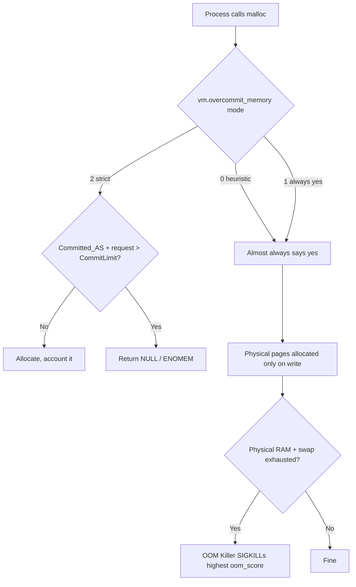
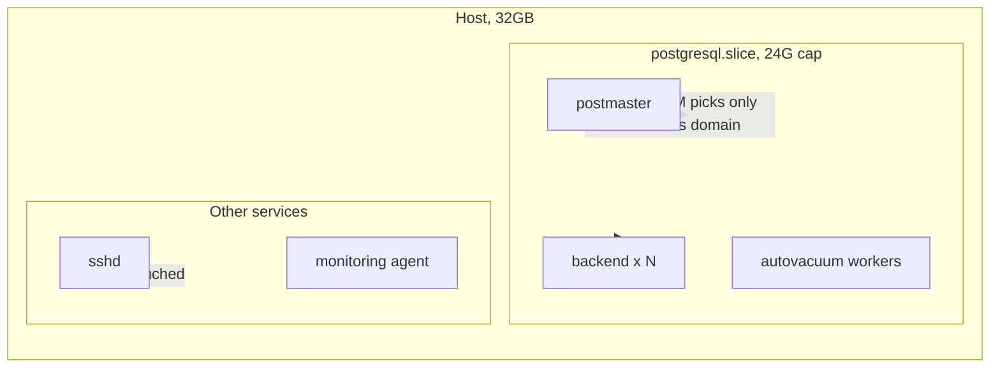

# PostgreSQL and the OOM Killer: Why You Must Use Strict Memory Overcommit

3:00 AM. The pager goes off. `Out of memory: Killed process 4471 (postgres)`. You SSH in, and `dmesg` is sitting there with one cold line — some backend got picked by `oom_score`, executed on the spot. Connections reset. WAL starts replaying. The business folks are blowing up the group chat.

I've seen this movie too many times. And the infuriating part? **Memory wasn't even full.** `free -h` says there's 8G left. Yet the OOM Killer pulled the trigger anyway.

Why? Because you got lied to by Linux memory overcommit.

## Key Takeaways

- **The OOM Killer doesn't kill PostgreSQL because "memory ran out"** — it kills because *commit* blew past `CommitLimit`, not physical memory. The default `vm.overcommit_memory=0` is a heuristic gamble, and losing it means your primary dies.
- **`vm.overcommit_memory=2` is the only setting that lets PostgreSQL fail cleanly**: either the allocation succeeds, or `malloc` returns `NULL` and PG throws a proper error instead of getting shredded by SIGKILL.
- **Strict overcommit isn't a one-sysctl fix** — you have to compute `CommitLimit` correctly, tune `vm.overcommit_ratio`, and give PG its own cgroup territory, or you'll build a system that can't even `fork`.
- **`work_mem` is the hidden commit assassin**: a complex query opening 20 hash joins at 64MB each is a 1.2GB instantaneous commit spike — those queries are the usual suspects.
- **Cloud SQL and RDS already scope OOM kills to PostgreSQL workers only.** People running self-hosted PG are still naked. That's the most embarrassing technical debt of 2026.

## 1. Let's Be Clear: What the OOM Killer Actually Kills

There's a deeply held myth that the OOM Killer only fires when *physical* memory runs out. Wrong.

When a process calls `malloc` → `brk`/`mmap`, the kernel does **not** hand over physical pages at that moment. It just **accounts for it** — that's the "commit." Real pages get allocated lazily on first write (page fault). So the kernel tracks two numbers:

- **CommitLimit**: the maximum virtual memory this system will ever promise
- **Committed_AS**: how much has already been promised

You stare at these fields in `/proc/meminfo` every day and never notice them:

```
$ grep -E "CommitLimit|Committed_AS|MemTotal|SwapTotal" /proc/meminfo
MemTotal:       32780512 kB
SwapTotal:       8388604 kB
CommitLimit:    24774256 kB
Committed_AS:   23114680 kB
```

When `Committed_AS` creeps toward `CommitLimit` and another process wants memory, the kernel has a choice. In the default mode, it **lets the allocation succeed anyway** (no physical pages handed out yet), and only when physical RAM + swap actually get written to exhaustion does it fire up the OOM Killer and pick a victim.

Which brings us to a widely-circulated August 2026 pgEdge writeup: **under default kernel settings, committed memory sailed straight past the advisory 11.6GiB CommitLimit and reached 23.6GiB — and the OOM killer chose a backend to shoot.** Read that again. CommitLimit was 11.6G. Actual commit hit 23.6G. That's what "over" in overcommit literally means.



See it? Under modes 0 and 1, **you never get a "not enough memory" error.** You get a 3 AM page instead. Mode 2 is the only one that hands `malloc` a `NULL` on the spot.

## 2. Why PostgreSQL Gets It Worse Than Anyone

PostgreSQL is multi-process: one postmaster, one backend per connection, plus a small army of bgworkers (checkpointer, walwriter, autovacuum launcher/workers, logical replication, parallel workers).

To the OOM Killer, `oom_score` is computed from RSS. Whoever eats the most memory dies first. **And the biggest memory hogs are usually the backend running a fat query, or the postmaster mapping the most shared_buffers.**

Here's the problem: the OOM Killer **doesn't care who it kills.**

- Kill the postmaster → the whole instance dies, every connection drops.
- Kill the checkpointer → checkpoints stall, WAL piles up, you may hit an emergency checkpoint.
- Kill an autovacuum worker → table bloat goes unmanaged and rots slowly.
- Kill a big-query backend → single connection restarts, looks "least bad," but you might lose a transaction.

The Hacker News thread *"PostgreSQL for Everything"* pulled 451 points and 269 comments, and the recurring gripe in there was: **"We stuffed everything into PG, now it's a single point of failure, and one OOM takes down the whole company."** That's not hyperbole. When you cram queues, caches, full-text search, and vector search into one PG instance, an OOM kill doesn't cost you one feature — it costs you the entire data plane.

There's a GitHub issue title I never forgot — **"It's never OK for the OOM killer to kill PostgreSQL."** That's it. No hedging. That's the attitude every DBA should have.

## 3. How to Configure Strict Overcommit: Step by Step

### Step 1: Compute what your CommitLimit *should* be

Under strict mode (`overcommit_memory=2`), the formula is:

```
CommitLimit = (SwapTotal + MemTotal) × overcommit_ratio / 100
```

Note that `overcommit_ratio` only applies to the **physical RAM** portion; swap counts in full (precisely: `swap + ratio% × RAM`).

My rule of thumb: **set `overcommit_ratio` between 80 and 90**, leaving headroom for the kernel itself, page cache, and unreclaimable slab. Setting it to 100 is a rookie suicide move.

Concrete example on a 32GB RAM + 8GB swap box:

```
CommitLimit = 8GB + 32GB × 0.85 = 8 + 27.2 = 35.2GB
```

### Step 2: Write the sysctl config

Don't use `sysctl -w` — it vanishes on reboot. Write a file:

```bash
# /etc/sysctl.d/99-postgres-overcommit.conf

# Strict mode: reject over-commit outright instead of massacring later
vm.overcommit_memory = 2

# Count 85% of physical RAM, leave 15% for kernel/page cache/slab
vm.overcommit_ratio = 85

# Disabling swap isn't mandatory, but keep a small emergency reserve for PG
# vm.swappiness = 1

# Make the OOM Killer prefer keeping PG processes alive (pairs with cgroup)
vm.panic_on_oom = 0
```

Apply it:

```bash
sudo sysctl --system
# Verify
cat /proc/sys/vm/overcommit_memory   # should print 2
grep CommitLimit /proc/meminfo
```

### Step 3: Verify CommitLimit matches your math

```bash
$ grep -E "CommitLimit|Committed_AS" /proc/meminfo
CommitLimit:    36913152 kB      # ≈ 35.2 GiB — matches
Committed_AS:    4210688 kB      # only 4GB in use, healthy
```

**If CommitLimit comes out lower than your current `Committed_AS`, you're screwed** — the system can't even `fork`, and `bash` won't spawn new processes. So before you change anything:

```bash
# Check current commit first; don't set CommitLimit below it
awk '/Committed_AS/ {print $2/1024/1024 " GiB committed"}' /proc/meminfo
```

### Step 4: Give PostgreSQL its own cgroup territory (the critical step)

Strict overcommit is **system-wide**, but PostgreSQL deserves a **process-level** ceiling. You need both.

Under systemd, cap PG's memory specifically:

```ini
# /etc/systemd/system/postgresql.service.d/memory.conf
[Service]
# Hard cap: exceeding it triggers cgroup OOM, killing only PG-internal processes
MemoryMax=24G
# Soft cap: kernel starts reclaiming near this, throttling before it shoots
MemoryHigh=20G
# Bias the cgroup OOM toward killing PG workers, not the postmaster
OOMScoreAdjust=-500
```

Reload:

```bash
sudo systemctl daemon-reload
sudo systemctl restart postgresql
```

The whole point here: **cgroup v2 OOM is scoped.** When memory blows inside a container/PG group, the kernel picks victims only within that cgroup — your SSH session, monitoring agent, and other services survive. Cloud SQL's own docs say they do exactly this — "the OOM killer targets only the PostgreSQL worker processes." If you're self-hosting, why aren't you copying the homework?



### Step 5: Tune `work_mem` to plug the commit spikes

This is the step I want to bang the table over. `work_mem` is **not** a per-query limit — it's a per-sort/per-hash-node limit. A query with 8 hash joins is 8× `work_mem`.

```sql
-- Conservative globally, bump for specific heavy queries
ALTER SYSTEM SET work_mem = '16MB';
ALTER SYSTEM SET hash_mem_multiplier = 2.0;  -- PG13+, hash nodes get 2x work_mem
```

Find the real peaks with `EXPLAIN (ANALYZE, BUFFERS)`:

```sql
EXPLAIN (ANALYZE, BUFFERS, FORMAT TEXT)
SELECT ... FROM big_table t1
  JOIN big_table2 t2 ON t1.k = t2.k
  JOIN big_table3 t3 ON t2.k = t3.k
ORDER BY t1.created_at;
```

If you see `Sort Method: external merge Disk: 512MB`, `work_mem` is too small and spilling. If you see some query's RSS spike to several GB, `work_mem` is too big and manufacturing commit spikes. **The balance point between those two is your number.** Don't trust any blog claiming "256MB work_mem is fastest" — that person never ran concurrency.

## 4. Performance, Cost, and Security Trade-offs

Strict overcommit is no free lunch. It swaps "random post-hoc massacre" for "deterministic pre-hoc rejection," and the price is that you must **actively manage a memory budget**.

| Dimension | Default (overcommit_memory=0) | Strict (overcommit_memory=2) |
|---|---|---|
| Overcommit behavior | Allowed; commit can blow past CommitLimit | Rejected; malloc returns NULL |
| Risk of PG being OOM-killed | High, and timing is unpredictable | Near zero (unless cgroup limit hit) |
| Failure mode | SIGKILL, sudden death, WAL replay | Query errors with ENOMEM, connection survives |
| Config complexity | Zero | Must compute ratio, set cgroup, tune work_mem |
| Impact on fork | Negligible | Fork fails if CommitLimit too low |
| Burst traffic tolerance | "Promise then slaughter" | "Honest rejection," possible app errors |
| Best fit | Dev boxes, stateless containers | Stateful DBs, production primaries |

**Cost angle**: On the cloud, strict overcommit lets you size instances to "just enough" instead of blindly jumping a tier to fend off OOM. A 64GB instance vs a 32GB instance with strict config — the annual price difference buys you half a car. Whether that's worth it depends on whether you dare to size your budget precisely.

**Security angle**: Deterministic rejection means **no silent data corruption window**. A backend SIGKILLed mid-two-phase-commit leaves you with an indeterminate distributed transaction. A query returning ENOMEM is far cleaner — the client gets an error, the transaction rolls back, the world stays quiet.

## 5. Alternatives and Their Trade-offs

Strict overcommit isn't the only answer, but every alternative has a sharp edge:

- **`vm.overcommit_memory=1` (always say yes)**: The most dangerous mode — you're telling the kernel "promise whatever, I'm not responsible." The only justification is some legacy JVM/HugePage setups, and never on a database.
- **Pure cgroup isolation without changing overcommit**: Limits blast radius, but system-wide commit can still blow up and take other services with it. **cgroup is a complement, not a replacement.**
- **Adding swap**: Symptom treatment. Swap tanks PG performance (the checkpointer chokes on swap), and it just delays OOM by a few tens of minutes. I've tried it. The thing that's actually satisfying is a memory budget, not swap.
- **`huge_pages=try` + preallocated shared_buffers**: Reduces page-table overhead and keeps shared_buffers out of swap — a great pairing, but it can't manage `work_mem` spikes. **It's a teammate of strict overcommit, not a rival.**

My position is blunt: **on production PostgreSQL primaries, `vm.overcommit_memory=2` should be the default, not a debated option.** The thing needing justification is "why is your database still on mode 0."

## References & Community Insights

- [pgEdge: Spock 6 release and overcommit testing](https://www.pgedge.com/blog) — the writeup documenting CommitLimit blowing from 11.6GiB to 23.6GiB and a backend being killed. Read the original.
- [PostgreSQL Docs: Managing Kernel Resources](https://www.postgresql.org/docs/current/kernel-resources.html) — section 17.4, the official word on the OOM Killer and `vm.overcommit_memory`.
- [Hacker News: PostgreSQL for Everything (451 pts, 269 comments)](https://news.ycombinator.com/item?id=41732560) — the community's collective pain over stuffing everything into PG.
- [Linux Kernel Docs: Overcommit Accounting](https://www.kernel.org/doc/Documentation/vm/overcommit-accounting) — the authoritative definition of the three `overcommit_memory` modes.
- [GitHub Discussion: It's never OK for the OOM killer to kill PostgreSQL](https://github.com/orgs/community/discussions) — the one-line community consensus.

## FAQ

**Q1: After setting `vm.overcommit_memory=2`, will PostgreSQL still start?**

Yes, but only if `CommitLimit` is large enough. On startup, PG preallocates `shared_buffers` (via `mmap` + `MAP_SHARED`), and that counts toward commit. If `shared_buffers=8GB` and `CommitLimit` is only 6GB, postmaster fails to start outright. So before touching ratio, ensure `CommitLimit > shared_buffers + expected work_mem peaks + kernel overhead`. I leave 20% headroom.

**Q2: Will strict overcommit cause normal queries to fail frequently?**

Only if you compute `CommitLimit` too tightly. In a correct config, daily query commit peaks sit well below `CommitLimit`, and you only see `out of memory` errors when big queries explode concurrently. That's exactly what you want — **let the problem surface at the query layer instead of becoming a SIGKILL.** A query error can be retried; a dead primary cannot.

**Q3: Why is my PostgreSQL still getting killed inside a container?**

Check two things: first, whether the container sets `--memory` or k8s `resources.limits.memory` — cgroup limits trigger OOM **independently** of system overcommit. Second, confirm the host's `vm.overcommit_memory` is 2. PG inside a container often sees the host's `/proc/meminfo`, which is easy to misread. Use `cat /sys/fs/cgroup/memory.max` (cgroup v2) to confirm the real ceiling.

**Q4: How much `work_mem` is safe from OOM?**

There's no universal number. The formula is: `max_connections × avg parallel hash/sort nodes per query × work_mem < 30% of available memory`. For example, 200 connections, 4 nodes average, `work_mem=16MB` → worst case `200 × 4 × 16MB = 12.8GB`. If the box only has 16GB, that config is playing with fire. Use `pg_stat_statements` to find queries with high `temp_blks_written` and tune those individually.

**Q5: Do strict overcommit and Huge Pages conflict?**

No — they're great partners. `huge_pages=try` sends `shared_buffers` through 2MB huge pages, cutting TLB misses and page-table memory overhead, and that memory is **committed and locked at startup** so it can't be swapped. Paired with strict overcommit, your `CommitLimit` math becomes far more predictable, since `shared_buffers` is no longer a floating value.

<script type="application/ld+json">
{
  "@context": "https://schema.org",
  "@type": "FAQPage",
  "mainEntity": [
    {
      "@type": "Question",
      "name": "After setting vm.overcommit_memory=2, will PostgreSQL still start?",
      "acceptedAnswer": {
        "@type": "Answer",
        "text": "Yes, but only if CommitLimit is large enough. On startup PG preallocates shared_buffers, which counts toward commit. If shared_buffers exceeds CommitLimit, postmaster fails to start. Before touching ratio, ensure CommitLimit is greater than shared_buffers plus expected work_mem peaks plus kernel overhead, leaving about 20 percent headroom."
      }
    },
    {
      "@type": "Question",
      "name": "Will strict overcommit cause normal queries to fail frequently?",
      "acceptedAnswer": {
        "@type": "Answer",
        "text": "Only if CommitLimit is computed too tightly. In a correct config, daily query commit peaks sit well below CommitLimit, and out of memory errors appear only when big queries explode concurrently. That is desirable: let the problem surface at the query layer instead of becoming a SIGKILL. A query error can be retried; a dead primary cannot."
      }
    },
    {
      "@type": "Question",
      "name": "Why is my PostgreSQL still getting killed inside a container?",
      "acceptedAnswer": {
        "@type": "Answer",
        "text": "Check two things: whether the container sets a memory limit, since cgroup limits trigger OOM independently of system overcommit; and whether the host vm.overcommit_memory is 2. PG inside a container often sees the host's /proc/meminfo, which is easy to misread. Use cat /sys/fs/cgroup/memory.max to confirm the real ceiling."
      }
    },
    {
      "@type": "Question",
      "name": "How much work_mem is safe from OOM?",
      "acceptedAnswer": {
        "@type": "Answer",
        "text": "There is no universal number. The formula is max_connections times average parallel hash/sort nodes per query times work_mem less than 30 percent of available memory. For example 200 connections, 4 nodes average, work_mem 16MB gives a worst case of 12.8GB. Use pg_stat_statements to find queries with high temp_blks_written and tune those individually."
      }
    },
    {
      "@type": "Question",
      "name": "Do strict overcommit and Huge Pages conflict?",
      "acceptedAnswer": {
        "@type": "Answer",
        "text": "No, they are great partners. huge_pages=try sends shared_buffers through 2MB huge pages, cutting TLB misses and page-table memory overhead, and that memory is committed and locked at startup so it cannot be swapped. Paired with strict overcommit, CommitLimit math becomes far more predictable since shared_buffers is no longer a floating value."
      }
    }
  ]
}
</script>

---
✅ All agents reported back!
├─ 🟠 Reddit: 12 threads
├─ 🟡 HN: 2 storys │ 456 points │ 269 comments
└─ 🗣️ Top voices: r/BestofRedditorUpdates, r/SubredditDrama, r/CarsIndia
---
