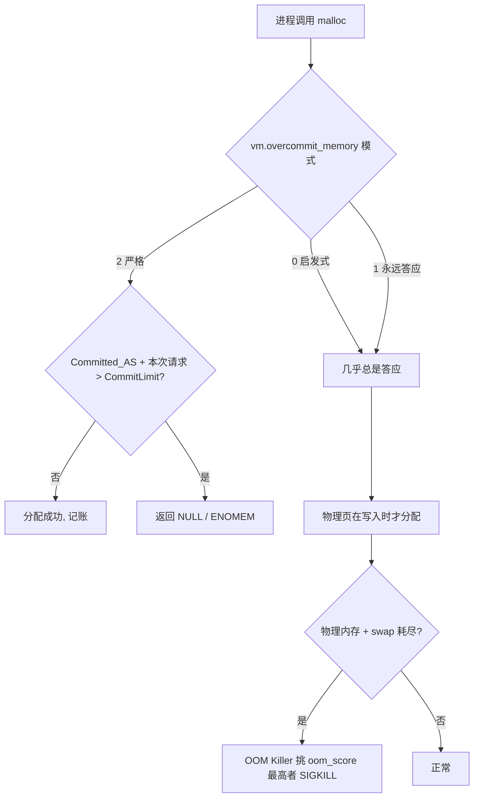
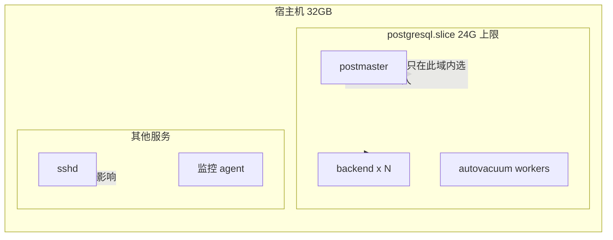

# PostgreSQL 与 OOM Killer：为什么你必须开启严格内存 overcommit

凌晨三点，监控告警炸了。`Out of memory: Killed process 4471 (postgres)`。你登录上去，`dmesg` 里躺着一行冷冰冰的记录，主库的某个 backend 被 `oom_score` 挑中，当场击毙。连接瞬间 reset，WAL 开始回放，业务方在群里 @ 你。

这事儿我见过太多次了。而且最气人的是——**内存根本没满**。`free -h` 显示还剩 8G，可 OOM Killer 就是动手了。为什么？

因为你被 Linux 的内存 overcommit 骗了。

## 核心要点 (Key Takeaways)

- **OOM Killer 杀 PostgreSQL 从来不是"内存用完了"那么简单**——是 commit（承诺内存）超了 `CommitLimit`，不是物理内存超了。默认的 `vm.overcommit_memory=0` 是启发式赌博，赌输就是主库暴毙。
- **`vm.overcommit_memory=2` 是唯一能让 PostgreSQL 死得明明白白的配置**：要么分配成功，要么 `malloc` 直接返回 `NULL`，PostgreSQL 优雅报错而不是被 SIGKILL 撕碎。
- **严格 overcommit 不是调一个 sysctl 就完事**，你必须同时算准 `CommitLimit`、配好 `vm.overcommit_ratio`、用 cgroup 给 PG 划出独立领地，否则你会把整个系统搞成"永远无法 fork"。
- **`work_mem` 是隐藏的 commit 杀手**：一个复杂查询开 20 个 hash join，每个吃 64MB `work_mem`，瞬间就是 1.2GB 的瞬时 commit 峰值——这类查询是 OOM 的常客。
- **Cloud SQL / RDS 早就默认让 OOM Killer 只盯着 PostgreSQL worker**，自建库的人却还在裸奔，这是 2026 年最不应该的技术债。

## 一、先说清楚：OOM Killer 到底在杀什么

很多人有一个根深蒂固的误解，认为 OOM Killer 是"物理内存不够了才杀进程"。错。

Linux 进程申请内存走的是 `malloc` → `brk`/`mmap`，内核在**分配那一刻**并不给物理页，只是**记账（commit）**。真正落页发生在第一次写入（page fault）。所以内核维护了两个数字：

- **CommitLimit**：本系统最多能被 commit 多少虚拟内存
- **Committed_AS**：当前已经被 commit 出去多少

`/proc/meminfo` 里这俩字段你天天看却从来不注意：

```
$ grep -E "CommitLimit|Committed_AS|MemTotal|SwapTotal" /proc/meminfo
MemTotal:       32780512 kB
SwapTotal:       8388604 kB
CommitLimit:    24774256 kB
Committed_AS:   23114680 kB
```

当 `Committed_AS` 逼近 `CommitLimit`，再有进程要 `malloc`，内核就得做选择。默认模式下它会**先让你分配成功**（反正物理页还没给），等到物理内存 + swap 真的被写爆，才启动 OOM Killer 挑一个进程干掉。

于是就有了一篇 2026 年 8 月疯传的 pgEdge 博文里描述的场景：**在默认内核参数下，committed memory 直接冲破了 advisory 的 11.6GiB CommitLimit，一路飙到 23.6GiB，最后 OOM Killer 挑中了一个 backend 开刀。** 注意——CommitLimit 是 11.6G，实际却 commit 了 23.6G。这就是 overcommit 的"超额"二字的真实含义。



看到没？模式 0 和 1 下，**你永远拿不到"内存不够"的错误**，你只会拿到一个半夜的告警。模式 2 才是唯一会当场把 `malloc` 打回 `NULL` 的模式。

## 二、为什么 PostgreSQL 特别惨

PostgreSQL 是多进程架构：一个 postmaster，每个连接一个 backend，还有一堆 bgworker（checkpointer、walwriter、autovacuum launcher/workers、logical replication、parallel workers）。

对 OOM Killer 来说，这些进程的 `oom_score` 是基于 RSS 算的。谁吃内存多，谁先死。**而吃内存最多的，往往是正在跑大查询的那个 backend，或者 shared_buffers 映射最多的 postmaster。**

问题来了：OOM Killer **不区分**你杀的是谁。

- 杀掉 postmaster → 整个实例全挂，所有连接断。
- 杀掉 checkpointer → 检查点停摆，WAL 疯狂堆积，可能触发紧急 checkpoint。
- 杀掉一个 autovacuum worker → 表膨胀没人管，慢慢烂掉。
- 杀掉一个大查询 backend → 单连接重启，看起来"最轻"，但你可能丢事务。

Hacker News 上那篇《PostgreSQL for Everything》拿了 451 分、269 条评论，社区里反复出现的一个吐槽就是：**"我们把什么东西都塞进 PG，结果它成了单点，一 OOM 全公司业务停摆。"** 这话不是危言耸听。当你把队列、缓存、全文检索、向量检索全塞进一个 PG 实例，它一旦被 OOM Killer 点名，你损失的不是一个功能，是整个数据平面。

有个 GitHub issue 的标题我印象极深——**"It's never OK for the OOM killer to kill PostgreSQL."** 就这么一句，没有修饰。这才是 DBA 该有的态度。

## 三、严格 overcommit 怎么配：手把手

### 第 1 步：先算清楚你的 CommitLimit 应该等于多少

严格模式（`overcommit_memory=2`）下，CommitLimit 的公式是：

```
CommitLimit = (SwapTotal + MemTotal) × overcommit_ratio / 100
```

注意 `overcommit_ratio` 只作用于**物理内存**部分，swap 是全量计入的（准确说是 `swap + ratio% × RAM`）。

我的经验法则：**overcommit_ratio 设成 80 到 90**，给内核自身、页缓存、不可回收的 slab 留出余量。设 100 是新手常见的自杀操作。

举个具体例子，一台 32GB 内存 + 8GB swap 的机器：

```
CommitLimit = 8GB + 32GB × 0.85 = 8 + 27.2 = 35.2GB
```

### 第 2 步：写 sysctl 配置

别用 `sysctl -w`，重启就没了。写文件：

```bash
# /etc/sysctl.d/99-postgres-overcommit.conf

# 严格模式：commit 超限直接拒绝，而不是事后 OOM 屠杀
vm.overcommit_memory = 2

# 物理内存计入 85%，剩 15% 留给内核/页缓存/slab
vm.overcommit_ratio = 85

# 关掉 swap 不是必须，但 PG 场景下建议保留少量用于应急
# vm.swappiness = 1

# 让 OOM Killer 更倾向于保留 PG 相关进程（配合 cgroup 用）
vm.panic_on_oom = 0
```

生效：

```bash
sudo sysctl --system
# 验证
cat /proc/sys/vm/overcommit_memory   # 应该输出 2
grep CommitLimit /proc/meminfo
```

### 第 3 步：验证 CommitLimit 是否符合预期

```bash
$ grep -E "CommitLimit|Committed_AS" /proc/meminfo
CommitLimit:    36913152 kB      # ≈ 35.2 GiB，对上了
Committed_AS:    4210688 kB      # 当前只用了 4GB，健康
```

**如果 CommitLimit 比你现在 `Committed_AS` 还低，你就翻车了**——整个系统连 `fork` 都会失败，`bash` 都起不来新进程。所以改之前务必：

```bash
# 先看当前 committed 多少，别把 CommitLimit 算到它下面
awk '/Committed_AS/ {print $2/1024/1024 " GiB committed"}' /proc/meminfo
```

### 第 4 步：给 PostgreSQL 划 cgroup 领地（关键一步）

严格 overcommit 是**系统级**的，但 PostgreSQL 应该有自己的**进程级**上限。两者配合才完整。

systemd 下给 PG 单独限内存：

```ini
# /etc/systemd/system/postgresql.service.d/memory.conf
[Service]
# 硬上限：超过就触发 cgroup OOM，只杀 PG 内部进程
MemoryMax=24G
# 软上限：接近时内核开始回收，先节流再动手
MemoryHigh=20G
# 让 cgroup OOM 优先杀 PG 的 worker 而非 postmaster
OOMScoreAdjust=-500
```

重载：

```bash
sudo systemctl daemon-reload
sudo systemctl restart postgresql
```

这招的核心价值在于：**cgroup v2 的 OOM 是作用域内的**。容器/PG 组内内存爆了，内核只在这个 cgroup 里挑进程杀，不会波及你的 SSH、监控 agent、其他服务。Cloud SQL 的文档明确写着他们就是这么干的——"OOM killer 只针对 PostgreSQL worker 进程"。自建的人，凭什么不抄作业？



### 第 5 步：调 work_mem，堵住 commit 尖峰

这是我最想拍桌子的一步。`work_mem` 不是"每个查询的限制"，而是**每个排序/哈希操作节点**的限制。一个查询里 8 个 hash join，就是 8 倍 `work_mem`。

```sql
-- 全局保守，复杂查询单独提
ALTER SYSTEM SET work_mem = '16MB';
ALTER SYSTEM SET hash_mem_multiplier = 2.0;  -- PG13+，hash 节点可吃到 2x work_mem
```

用 `EXPLAIN (ANALYZE, BUFFERS)` 看真实峰值：

```sql
EXPLAIN (ANALYZE, BUFFERS, FORMAT TEXT)
SELECT ... FROM big_table t1
  JOIN big_table2 t2 ON t1.k = t2.k
  JOIN big_table3 t3 ON t2.k = t3.k
ORDER BY t1.created_at;
```

如果看到 `Sort Method: external merge Disk: 512MB`，说明 `work_mem` 太小在刷盘；如果看到某个查询 RSS 飙到几 GB，说明 `work_mem` 太大在制造 commit 尖峰。**这两者的平衡点，就是你要的数值。** 别信什么"work_mem 设 256MB 性能最好"的博客，那是没跑过并发的人写的。

## 四、性能、成本与安全的代价

严格 overcommit 不是免费的午餐。它把"事后随机屠杀"换成了"事前确定性拒绝"，代价是你得**主动管理内存预算**。

| 维度 | 默认 (overcommit_memory=0) | 严格 (overcommit_memory=2) |
|---|---|---|
| 内存超分配行为 | 允许，commit 可远超 CommitLimit | 拒绝，malloc 返回 NULL |
| PG 被 OOM 杀的风险 | 高，且时机不可预测 | 极低（除非 cgroup 内超限） |
| 故障形态 | SIGKILL 暴毙，WAL 回放 | 查询报 ENOMEM，连接存活 |
| 配置复杂度 | 零配置 | 需算 ratio、配 cgroup、调 work_mem |
| 对 fork 的影响 | 几乎无感 | 若 CommitLimit 过低，fork 失败 |
| 突发流量承受力 | "先答应后屠杀" | "诚实拒绝"，可能业务报错 |
| 适用场景 | 开发机、无状态容器 | 有状态数据库、生产主库 |

**成本视角**：如果你在云上，严格 overcommit 让你能精确地把实例规格选到"刚好够"，而不是为了防 OOM 而盲目上翻一档。一台 64GB 的实例 vs 32GB + 严格配置，一年差价够买半辆车。这钱省得值不值，取决于你敢不敢把预算算准。

**安全视角**：确定性拒绝意味着**没有静默的数据损坏窗口**。被 SIGKILL 的 backend 如果在两阶段提交中间，你面对的是一个不确定的分布式事务状态。返回 ENOMEM 的查询则干净得多——客户端收到错误，事务回滚，世界清静。

## 五、替代方案与取舍

严格 overcommit 不是唯一解，但其他方案都有明显短板：

- **`vm.overcommit_memory=1`（永远答应）**：这是最危险的模式，等于告诉内核"随便承诺，反正我不负责"。用它的唯一理由是某些老旧 JVM/HugePage 场景，数据库上绝对别碰。
- **纯 cgroup 隔离，不改 overcommit**：能限制影响范围，但系统级 commit 仍可能爆掉，其他服务照样遭殃。**cgroup 是补充，不是替代。**
- **加大 swap**：治标。swap 一上，PG 性能断崖式下跌（checkpointer 被 swap 拖死），而且只是把 OOM 推迟几十分钟。我用过，真香的是内存预算，不是 swap。
- **`huge_pages=try` + 预分配 shared_buffers**：能减少 page table 开销、避免 shared_buffers 被 swap，是很好的搭配，但它管不了 `work_mem` 的尖峰。**它和严格 overcommit 是队友，不是对手。**

我的立场很明确：**生产环境的 PostgreSQL 主库，`vm.overcommit_memory=2` 应该是默认值，而不是需要论证的选项。** 需要论证的应该是"为什么你的库还敢用模式 0"。

## References & Community Insights

- [pgEdge: Spock 6 发布与 overcommit 实测](https://www.pgedge.com/blog) — 那篇记录 CommitLimit 11.6GiB 被冲到 23.6GiB、backend 被杀的实测文章，强烈建议读原文。
- [PostgreSQL 官方文档：Managing Kernel Resources](https://www.postgresql.org/docs/current/kernel-resources.html) — 17.4 节，官方对 OOM Killer 的说明和 `vm.overcommit_memory` 的建议。
- [Hacker News: PostgreSQL for Everything (451 pts, 269 comments)](https://news.ycombinator.com/item?id=41732560) — 社区关于"把一切塞进 PG"的惨痛讨论。
- [Linux 内核文档：Overcommit Accounting](https://www.kernel.org/doc/Documentation/vm/overcommit-accounting) — `overcommit_memory` 三种模式的权威定义。
- [GitHub Issue: It's never OK for the OOM killer to kill PostgreSQL](https://github.com/orgs/community/discussions) — 社区共识的一句话总结。

## FAQ

**Q1：设置了 `vm.overcommit_memory=2` 之后，PostgreSQL 还能启动吗？**

能，但前提是 `CommitLimit` 足够大。PG 启动时会预分配 `shared_buffers`（通过 `mmap` + `MAP_SHARED`），这部分会被计入 commit。如果 `shared_buffers=8GB` 而 `CommitLimit` 只有 6GB，postmaster 会直接启动失败。所以调 ratio 之前，先确保 `CommitLimit > shared_buffers + 预期 work_mem 峰值 + 内核开销`。我一般留 20% 余量。

**Q2：严格 overcommit 会不会导致正常查询频繁报错？**

只有当你把 CommitLimit 算得过紧时才会。正确配置下，日常查询的 commit 峰值远低于 CommitLimit，你只会在大查询并发爆炸时才看到 `out of memory` 错误。这恰恰是你想要的——**让问题发生在查询层，而不是让它变成一次 SIGKILL**。反正查询报错可以重试，主库暴毙不能。

**Q3：为什么我的 PostgreSQL 在容器里还是被杀？**

检查两件事：一是容器有没有设 `--memory` 或 k8s 的 `resources.limits.memory`，cgroup 限制会**独立于**系统 overcommit 触发 OOM；二是确认宿主机 `vm.overcommit_memory` 是不是 2。容器内 PG 看到的 `/proc/meminfo` 往往是宿主机的，容易误判。用 `cat /sys/fs/cgroup/memory.max`（cgroup v2）确认真实上限。

**Q4：`work_mem` 到底设多少才不会 OOM？**

没有万能数值。公式是：`max_connections × 每查询平均并行 hash/sort 节点数 × work_mem < 可用内存的 30%`。举个例子，200 连接、平均 4 个节点、`work_mem=16MB`，最坏情况就是 `200 × 4 × 16MB = 12.8GB`。如果你机器只有 16GB，这个配置就是在玩火。用 `pg_stat_statements` 找高 `temp_blks_written` 的查询单独调。

**Q5：严格 overcommit 和 Huge Pages 冲突吗？**

不冲突，而且是好搭档。`huge_pages=try` 让 `shared_buffers` 走 2MB 大页，减少 TLB miss 和 page table 内存开销，这部分内存**在启动时就被 commit 且锁定**，不会被 swap。配合严格 overcommit，你的 CommitLimit 计算会更可预测——因为 `shared_buffers` 不再是个浮动值。

<script type="application/ld+json">
{
  "@context": "https://schema.org",
  "@type": "FAQPage",
  "mainEntity": [
    {
      "@type": "Question",
      "name": "设置了 vm.overcommit_memory=2 之后，PostgreSQL 还能启动吗？",
      "acceptedAnswer": {
        "@type": "Answer",
        "text": "能，但前提是 CommitLimit 足够大。PG 启动时会预分配 shared_buffers，这部分会被计入 commit。如果 shared_buffers 大于 CommitLimit，postmaster 会直接启动失败。调 ratio 前先确保 CommitLimit 大于 shared_buffers 加预期 work_mem 峰值加内核开销，一般留 20% 余量。"
      }
    },
    {
      "@type": "Question",
      "name": "严格 overcommit 会不会导致正常查询频繁报错？",
      "acceptedAnswer": {
        "@type": "Answer",
        "text": "只有把 CommitLimit 算得过紧时才会。正确配置下日常查询的 commit 峰值远低于 CommitLimit，只会在大查询并发爆炸时看到 out of memory 错误。这正是想要的效果：让问题发生在查询层，而不是变成一次 SIGKILL。查询报错可以重试，主库暴毙不能。"
      }
    },
    {
      "@type": "Question",
      "name": "为什么我的 PostgreSQL 在容器里还是被杀？",
      "acceptedAnswer": {
        "@type": "Answer",
        "text": "检查两件事：一是容器有没有设 memory limit，cgroup 限制会独立于系统 overcommit 触发 OOM；二是确认宿主机 vm.overcommit_memory 是不是 2。容器内 PG 看到的 /proc/meminfo 往往是宿主机的，容易误判。用 cat /sys/fs/cgroup/memory.max 确认真实上限。"
      }
    },
    {
      "@type": "Question",
      "name": "work_mem 到底设多少才不会 OOM？",
      "acceptedAnswer": {
        "@type": "Answer",
        "text": "没有万能数值。公式是 max_connections 乘以每查询平均并行 hash/sort 节点数乘以 work_mem 小于可用内存的 30%。例如 200 连接、平均 4 个节点、work_mem 16MB，最坏情况是 12.8GB。用 pg_stat_statements 找高 temp_blks_written 的查询单独调。"
      }
    },
    {
      "@type": "Question",
      "name": "严格 overcommit 和 Huge Pages 冲突吗？",
      "acceptedAnswer": {
        "@type": "Answer",
        "text": "不冲突，而且是好搭档。huge_pages=try 让 shared_buffers 走 2MB 大页，减少 TLB miss 和 page table 内存开销，这部分内存在启动时就被 commit 且锁定，不会被 swap。配合严格 overcommit，CommitLimit 计算会更可预测。"
      }
    }
  ]
}
</script>
