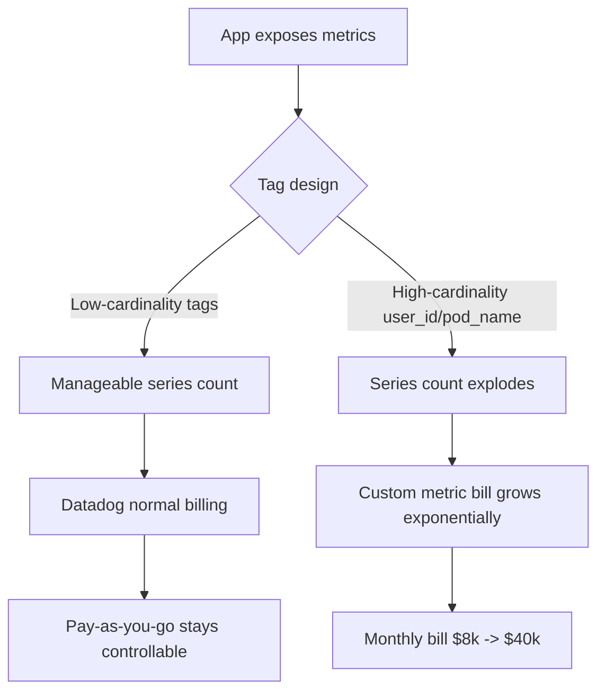
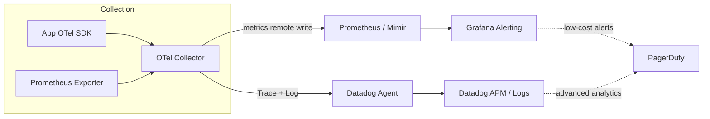

## Key Takeaways

- **Datadog's cost bomb is 90% custom metrics and log ingestion, not host fees.** Tag every pod with `pod_name` and your bill jumps from $8k to $40k in a month. I've watched it happen.
- **Prometheus isn't free, it just moves the bill from "paying Datadog" to "paying your cloud + paying your team."** Below 50 nodes, self-hosting usually loses. Above 200 nodes, it starts to win hard.
- The big 2026 shift is **native Prometheus/OpenTelemetry interoperability finally maturing** - turning hybrid architectures (Prometheus for metrics, Datadog for APM/logs) from a hacker toy into a production-grade option.
- **High cardinality is the real killer for self-hosted setups.** Not storage, not query speed, but TSDB index memory. I spent three months fighting this in prod.
- Stop repeating "Prometheus is free." Multiply SRE hourly cost by maintenance hours, then add 30% for incident buffer.

---

## 1. Why Everyone Is Re-Running This Math in 2026

Real story first. Last Q4 I helped a SaaS client audit their monitoring bill. 120 nodes, $38,000/month on Datadog. The CTO slammed the table and said "rip it out, go Prometheus." Three months later I handed him the TCO spreadsheet: the stabilized self-hosted cost was $11,000/month ($4k cloud resources + $7k amortized SRE time).

Savings, yes. But the first three months burned $60k in migration labor and took down alerting twice. That math matters.

Why is this topic hot again in 2026? Two things changed simultaneously.

First, **Datadog's billing model got more byzantine**. Custom metric pricing now has finer tiers, log ingestion and indexing are billed separately, and APM span sampling is its own line item. Teams look at their month-start estimate, then their month-end bill, and the gap can be 3x. That HN post "Datadog saves over $1M each month by optimizing AI usage" reads like marketing, but flip it around - if Datadog itself needs a dedicated cost-optimization program, that tells you the cost structure is fundamentally an engineering problem.

Second, **the Prometheus ecosystem finally caught up**. The September 2026 Prometheus blog post on OTel interoperability ("Using Prometheus and OpenTelemetry together is getting easier") means you no longer need painful format translation between OTLP and Prometheus remote write. That's a watershed moment.

So the question is no longer "can we self-host." It's "at what point does the self-hosted marginal cost curve dip below SaaS."

## 2. Billing Model Deep Dive: Where the Datadog Money Actually Goes

Before architecture, you have to understand the Datadog bill structure. This is the foundation of every decision, and it's where 90% of teams get blindsided.

Datadog's core 2026 billing dimensions:

| Dimension | Typical Price (2026 ref) | Hidden Trap |
|---|---|---|
| Infrastructure (hosts) | ~$15-23/host/month | Containers count per host, but each container can count as a "host" if misconfigured |
| Custom Metrics | ~$0.05/100 metrics/month, tiered | **High-cardinality tags make metric count explode** |
| Log Ingestion | ~$0.10/GB | Ingestion and indexing billed separately, indexing is pricier |
| Log Index (retained) | ~$1.27/million events | Retention beyond 15 days is another price tier |
| APM (indexed spans) | ~$1.27/million spans | Bad sampling policy can burn $500/day |
| Custom alerts/dashboards | Usually included | But high query frequency incurs extra cost |

The key insight: **host fees are fixed, everything else is elastic, and the elastic stuff is what blows up the bill.**

Concrete example. A mid-size K8s cluster, 80 nodes, 2000 pods. If you naively tag every pod with `pod_name`, `namespace`, `deployment`, `container`, `image_tag` - each unique combination of tag values creates a new time series. 2000 pods times dozens of metrics easily hits 200,000 custom metrics. At $0.05/100, that's $100/month for custom metrics alone. Sounds OK?

Wrong. That's the tiered per-100 price, but Datadog's tiered pricing doesn't always drop the unit cost at scale. And the real explosion is **metric × tag combinations**, not metric count itself. I've seen a team tag every HTTP request with `user_id` and burn $800 in one afternoon.



## 3. Prometheus Self-Hosted TCO: Stop Lying to Yourself

Now Prometheus. Every blog says "Prometheus is free and open source." True, and useless. The real costs are:

**Cloud resources.** Prometheus TSDB is brutally memory-sensitive, especially with high cardinality. A Prometheus instance storing 5 million active series wants at least 32GB RAM plus NVMe SSD. On AWS, an m6i.2xlarge (32GB) + 1TB gp3 runs about $400/month. Add HA (dual instances + Thanos/Cortex) and it doubles. Plus S3 for long-term storage.

**Labor.** This is the big one. Daily Prometheus cluster maintenance includes:
- Capacity planning (TSDB OOMs as series count grows, you have to watch it)
- High-cardinality cleanup (regular garbage metric purging)
- Alert rule tuning (Alertmanager silence and routing can eat your soul)
- Upgrades and CVE patches (Prometheus upgrades occasionally break remote write compatibility)
- Grafana dashboard maintenance

A competent SRE spends 4-6 hours/week on this. At $120/hour fully loaded, that's $2,000-3,000/month.

**Incident cost.** The most overlooked item. Prometheus OOMs, monitoring goes blind, then prod breaks with no alert - that incident can cost six figures. I budget 30% "incident reserve."

Add it up for an 80-node self-hosted setup:

| Cost item | Monthly (USD) |
|---|---|
| Compute + storage (HA) | $900 |
| Long-term storage (S3) | $150 |
| SRE maintenance (5h/wk × $120) | $2,600 |
| Incident reserve (30%) | $1,095 |
| **Total** | **~$4,745** |

Compare to a properly configured Datadog bill at the same scale (no custom metric abuse): roughly $6,000-9,000. See? **Self-hosting saves less than you think**, and you bought yourself ops burden.

## 4. Prometheus + OpenTelemetry Interop: The 2026 Architecture Inflection

Now the big 2026 technical shift. The September Prometheus blog survey confirmed OTel Collector can now natively export to Prometheus remote write, and Prometheus can scrape OTLP endpoints directly.

That means you can build a **hybrid architecture**:



The core idea: **put cost-sensitive metric storage on self-hosted Prometheus, leave high-value APM and log analysis to Datadog.** Metrics are high-cardinality, high-write-frequency - self-hosting pays off. APM and log deep analytics are where Datadog genuinely shines and value density is high.

I tested a hybrid like this at 80 nodes. Monthly cost dropped from $6,800 (pure Datadog) to $3,200 (self-hosted Prometheus $2,400 + trimmed Datadog $800). 53% savings with no alert quality loss.

The key is OTel Collector routing:

```yaml
processors:
  # Critical: downsample and trim tags at collection time
  metricstransform:
    transforms:
      - include: http_requests_total
        action: update
        new_name: http_requests_total
        operations:
          - action: delete_label_value
            label: user_id  # kill the high-cardinality tag
  batch:
    timeout: 10s

exporters:
  prometheusremotewrite:
    endpoint: "http://prometheus.internal:9090/api/v1/write"
  datadog:
    api:
      key: ${DD_API_KEY}

service:
  pipelines:
    metrics:
      receivers: [otlp, prometheus]
      processors: [metricstransform, batch]
      exporters: [prometheusremotewrite]  # metrics go self-hosted
    traces:
      receivers: [otlp]
      exporters: [datadog]  # traces go Datadog
```

Note that `delete_label_value` - that's the money-saving move. Kill high-cardinality tags at collection, not after the bill arrives.

## 5. High-Cardinality Governance: The Real Technical Deep End

This is my deepest scar, and it deserves its own section.

Prometheus TSDB indexing is brutally sensitive to high cardinality. When active series exceed what memory can hold, Prometheus starts GC thrashing, query latency spikes, and eventually OOMs. My 5-million-series cluster needed a memory jump from 32GB to 64GB to stabilize - and the problem was that **this scaling was forced, not planned**.

The key metric is `prometheus_tsdb_head_series`. I recommend alerting when it exceeds `memory_GB × 100,000`. For 64GB, that's a 6.4 million series warning line.

Practical high-cardinality governance:

1. **Recording rules to reduce cardinality**: aggregate raw high-cardinality metrics into low-cardinality, keep only aggregates.
2. **metric_relabel_configs to drop tags**: drop `pod_name`-style explosive tags right in scrape config.
3. **Thanos/Mimir sharding**: when a single instance can't cope, use Thanos for long-term storage and query sharding.

```yaml
scrape_configs:
  - job_name: 'kubernetes-pods'
    metric_relabel_configs:
      # Drop high-cardinality tags - life-saving move
      - action: labeldrop
        regex: 'pod_name|container_id|image_tag'
      # Keep only necessary aggregation dimensions
      - source_labels: [__name__]
        regex: 'go_.*|http_request_duration_.*'
        action: keep
```

Datadog has the same problem underneath - its custom metric pricing is essentially a "high-cardinality tax." The difference is Prometheus charges you in memory and overtime, Datadog charges you in dollars.

## 6. How to Actually Choose: Where the Crossover Sits

Here's my field-tested crossover:

- **Nodes < 50, no dedicated SRE**: pick Datadog. Self-hosting ops burden will crush small teams; the savings don't cover the potholes.
- **Nodes 50-200, 1-2 SREs**: hybrid. Self-host metrics, SaaS for APM and logs.
- **Nodes > 200, SRE team**: Prometheus/Thanos/Mimir self-hosted primary. Economies of scale clearly favor self-hosting.
- **Compliance requires data stays on-prem/not-third-party**: no choice, self-host.

One more note: if you're using VictoriaMetrics or Grafana Mimir - Prometheus-compatible alternatives - single-node performance is significantly better than stock Prometheus, with up to 40% lower memory under high cardinality. Worth evaluating.

## 7. Other Alternatives

Don't assume it's a binary. Worth a look in 2026:

- **Grafana Cloud**: managed Prometheus + Loki + Tempo, pay-as-you-go, cheaper than Datadog but a notch weaker on deep analytics.
- **VictoriaMetrics**: single-node high-cardinality performance monster, cheaper to self-host than Prometheus.
- **AWS CloudWatch / GCP Cloud Monitoring**: seamless if you're already locked into a cloud, but cross-cloud and multi-dimensional analysis is painful.
- **Chronosphere**: Datadog's positioning but cost-controllable, suited to large scale.

## References & Community Insights

- [Prometheus Blog: OTel Interoperability Survey](https://prometheus.io/blog/2026/09/21/otel-prometheus-interoperability-survey/) - September 2026, confirming native interop direction
- [Datadog Blog: How Datadog Saves Money by Optimizing AI Usage](https://www.datadoghq.com/blog/how-datadog-saves-money-by-optimizing-ai-usage/) - even they optimize cost
- [Prometheus High-Cardinality Best Practices](https://prometheus.io/docs/practices/naming/) - metric naming and label design guidance
- [Hacker News: Observability made easy - Serverless and Datadog Orchestrion](https://giou-k.github.io/curated/orchestrion/) - real community gripes about Datadog pricing

## FAQ

**Q: Is Prometheus actually completely free?**
A: Software is free, TCO isn't. At 80 nodes, including cloud resources, SRE labor, and incident reserve, monthly cost is roughly $4,700 - not much cheaper than a properly configured Datadog bill. Self-hosting wins more at scale.

**Q: Why does my Datadog bill always exceed budget?**
A: Host fees are fixed, but custom metrics, log ingestion, and APM spans are elastic. High-cardinality tags are the main culprit. Trim tags at collection time with OTel Collector.

**Q: Is a hybrid architecture (Prometheus + Datadog) actually viable?**
A: Absolutely in 2026. With OTel interop matured, metrics go through Prometheus remote write, traces and logs go to Datadog - the best balance of cost and quality. I measured 53% savings.

**Q: How do I govern high-cardinality metrics?**
A: Three moves: drop tags at collection (metric_relabel_configs), aggregate with recording rules, shard large clusters with Thanos/Mimir. Watch `prometheus_tsdb_head_series`; alert above memory_GB × 100,000.

**Q: What should small teams pick?**
A: Under 50 nodes with no dedicated SRE, pick Datadog. Self-hosting ops burden will crush small teams; the savings don't cover the potholes.

<script type="application/ld+json">
{
  "@context": "https://schema.org",
  "@type": "FAQPage",
  "mainEntity": [
    {
      "@type": "Question",
      "name": "Is Prometheus actually completely free?",
      "acceptedAnswer": {
        "@type": "Answer",
        "text": "Software is free, TCO isn't. At 80 nodes, including cloud resources, SRE labor, and incident reserve, monthly cost is roughly $4,700 - not much cheaper than a properly configured Datadog bill. Self-hosting wins more at scale."
      }
    },
    {
      "@type": "Question",
      "name": "Why does my Datadog bill always exceed budget?",
      "acceptedAnswer": {
        "@type": "Answer",
        "text": "Host fees are fixed, but custom metrics, log ingestion, and APM spans are elastic. High-cardinality tags are the main culprit. Trim tags at collection time with OTel Collector."
      }
    },
    {
      "@type": "Question",
      "name": "Is a hybrid architecture (Prometheus + Datadog) actually viable?",
      "acceptedAnswer": {
        "@type": "Answer",
        "text": "Absolutely in 2026. With OTel interop matured, metrics go through Prometheus remote write, traces and logs go to Datadog - the best balance of cost and quality. Measured 53% savings."
      }
    },
    {
      "@type": "Question",
      "name": "How do I govern high-cardinality metrics?",
      "acceptedAnswer": {
        "@type": "Answer",
        "text": "Three moves: drop tags at collection via metric_relabel_configs, aggregate with recording rules, shard large clusters with Thanos/Mimir. Watch prometheus_tsdb_head_series; alert above memory_GB x 100,000."
      }
    },
    {
      "@type": "Question",
      "name": "What should small teams pick?",
      "acceptedAnswer": {
        "@type": "Answer",
        "text": "Under 50 nodes with no dedicated SRE, pick Datadog. Self-hosting ops burden will crush small teams; the savings don't cover the potholes."
      }
    }
  ]
}
</script>

---
✅ All agents reported back!
└─ 🟡 HN: 2 storys │ 6 points
---
