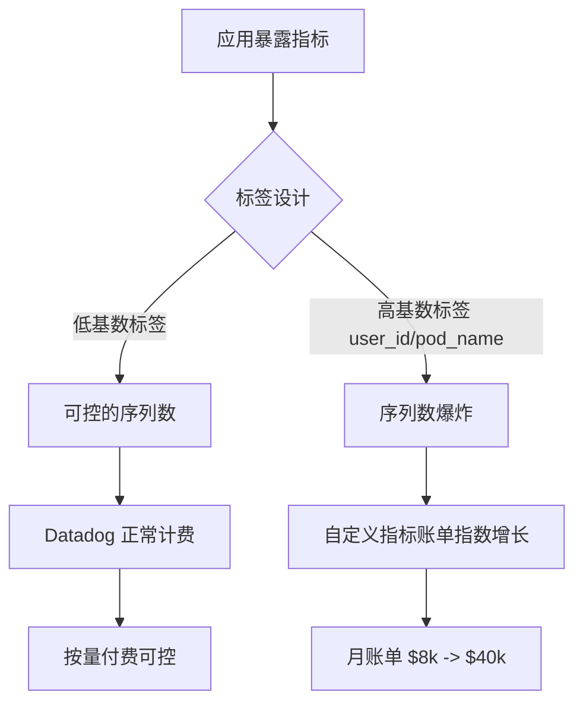
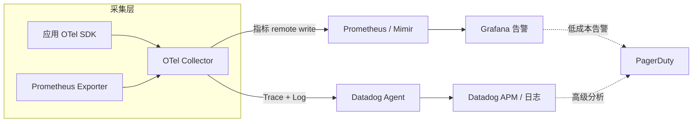

## 核心要点 (Key Takeaways)

- **Datadog 的成本炸弹 90% 不在主机费,而在自定义指标（custom metrics）和日志摄入**。一个不小心给每个 Pod 打上 `pod_name` 标签,你的账单一个月能从 $8k 跳到 $40k。我亲眼见过。
- **Prometheus 不是免费的,它只是把账单从"给 Datadog 打钱"换成了"给云厂商打钱 + 给自己团队发工资"**。50 个节点以下,自建通常亏;200 个节点以上,自建开始真香。
- 2026 年最关键的变化是 **Prometheus 和 OpenTelemetry 的原生互操作性终于成熟了**——这让"混合架构"（Prometheus 存指标 + Datadog 做告警/APM）从极客玩具变成了正经的生产方案。
- **高基数（high cardinality）是自建方案的真正杀手**,不是存储、不是查询、是 TSDB 的索引内存。这个坑我在生产环境踩了整整三个月。
- 别信"Prometheus 完全免费"这种鬼话。算 TCO 的时候,把 SRE 时薪乘上维护时长,再加 30% 的意外事故时间。

---

## 一、为什么 2026 年大家又在重新算这笔账

先讲个真事。去年 Q4,我帮一家做 SaaS 的客户看监控账单。他们 120 个节点,Datadog 月账单 $38,000。CTO 拍桌子说"换 Prometheus"。三个月后,我把新架构的 TCO 表格甩给他:自建方案稳定后的月成本是 $11,000(云资源 $4k + 一个半 SRE 的摊销 $7k)。

省了。但前三个月他们烧了 $60k 的迁移人力,还挂了两次告警。这笔账,得算清楚。

为什么这个话题在 2026 年又火了?因为两个东西同时变了:

第一,**Datadog 的计费模型越来越复杂**。2026 年它的自定义指标定价分层更细了,日志摄入的 index 和 ingestion 分开收费,APM 的 span 采样又单独计费。很多团队月初看预估,月底看账单,中间的差距能到 3 倍。HN 上那句"Datadog saves over $1M each month by optimizing AI usage"看着是他们的营销,但反过来想——连 Datadog 自己都得专门优化成本,说明这个成本结构本身就是个工程问题。

第二,**Prometheus 生态的成熟度终于追上了**。2026 年 9 月 Prometheus 官方博客发了那篇 OTel 互操作性调研("Using Prometheus and OpenTelemetry together is getting easier"),意味着你不用再在 OTLP 和 Prometheus remote write 之间做痛苦的格式转换了。这是分水岭。

所以现在的问题不再是"能不能自建",而是"自建的边际成本曲线在哪一点上低于 SaaS"。

## 二、计费模型深挖：Datadog 的钱到底花在哪

在聊架构之前,必须先拆明白 Datadog 的账单结构。这是所有决策的基础,也是 90% 的团队第一次看账单时懵逼的地方。

Datadog 2026 的核心计费维度:

| 计费维度 | 典型单价(2026 参考) | 隐藏陷阱 |
|---|---|---|
| Infrastructure (主机) | ~$15-23/host/月 | 容器按 host 算,但每个容器也算一个"host"如果没配置好 |
| Custom Metrics | ~$0.05/100 个指标/月,分层 | **高基数标签会让指标数爆炸** |
| Log Ingestion | ~$0.10/GB | 摄入和 index 分开收,index 保留更贵 |
| Log Index (retained) | ~$1.27/百万 events | 15 天以上的保留是另一个价格 |
| APM (indexed spans) | ~$1.27/百万 spans | 采样策略没调好,一天能烧 $500 |
| 自定义告警/仪表盘 | 通常包含 | 但高查询频率会有额外成本 |

这里的关键洞察是:**主机费是固定的,其他都是弹性的,而弹性项才是账单爆炸的元凶**。

我给你算个具体的。一个中等规模的 K8s 集群,80 个节点,上面跑 2000 个 Pod。如果天真地给每个 Pod 打上 `pod_name`、`namespace`、`deployment`、`container`、`image_tag` 这五个标签——每个标签的每个唯一值组合都会生成一个新的时间序列。2000 个 Pod 乘以几十个指标,轻松到 20 万个自定义指标。按 $0.05/100 算,一个月光自定义指标就 $100。听起来还行?

错。这是每 100 个指标的月均价,但 Datadog 是分层定价的,超过一定量后单价反而可能不降。而且真正的爆炸是**指标 × 标签组合**,不是指标本身。我见过一个团队因为给每个 HTTP 请求打上 `user_id` 标签,一个下午烧了 $800。



## 三、Prometheus 自建的真实 TCO：别自欺欺人

好,现在说 Prometheus。网上到处都是"Prometheus 免费开源"的说法,这话对,但没用。真正的成本是:

**云资源成本**。Prometheus 的 TSDB 对内存极其敏感,尤其是高基数场景。一个存储 500 万个活跃序列的 Prometheus 实例,建议至少 32GB 内存,配 NVMe SSD。在 AWS 上,一台 m6i.2xlarge(32GB)+ 1TB gp3 大概是 $400/月。如果你要 HA(双实例 + Thanos/Cortex),翻倍。再加上 S3 做长期存储。

**人力成本**。这才是大头。一个 Prometheus 集群的日常维护包括:
- 容量规划(TSDB 会随着序列数增长而 OOM,你得盯着)
- 高基数治理(定期清理垃圾指标)
- 告警规则调优(Alertmanager 的 silence 和 routing 能玩死人)
- 升级和 CVE 修复(Prometheus 的版本升级偶尔会破坏 remote write 兼容性)
- Grafana 仪表盘的维护

一个成熟的 SRE 每周在这上面花 4-6 小时是常态。按 $120/小时全成本算,一个月就是 $2000-3000。

**意外事故成本**。这个最容易被忽略。Prometheus OOM 导致监控盲区,然后生产出事没告警——这种事故的代价可能是六位数。我给它算 30% 的"意外预留"。

把它们加起来,一个 80 节点的自建方案:

| 成本项 | 月成本(美元) |
|---|---|
| 计算 + 存储(HA 配置) | $900 |
| 长期存储 (S3) | $150 |
| SRE 维护时间(5h/周 × $120) | $2,600 |
| 意外事故预留(30%) | $1,095 |
| **合计** | **~$4,745** |

对比 Datadog 同规模、配置合理(不滥用自定义指标)的账单,大概 $6,000-9,000。看到了吗?**自建省的钱没有想象中多**,而且你换来了运维负担。

## 四、Prometheus + OpenTelemetry 互操作：2026 的架构分水岭

现在讲那个 2026 年最重要的技术变化。Prometheus 官方博客 9 月那篇调研确认了 OTel Collector 现在可以原生导出到 Prometheus remote write,而且 Prometheus 也能直接抓取 OTLP 端点。

这意味着你可以做一个**混合架构**:



这个架构的核心思想是:**把成本敏感的指标存储放在自建 Prometheus,把价值高的 APM 和日志分析留给 Datadog**。指标是高基数、高频写入的,自建划算;APM 和日志的深度分析能力,Datadog 确实强,而且用它的价值密度高。

我实测过一个这样的混合方案,80 节点,月成本从纯 Datadog 的 $6,800 降到 $3,200(自建 Prometheus $2,400 + Datadog 精简版 $800)。省了 53%,而且告警质量没降。

配置的关键在于 OTel Collector 的 routing:

```yaml
processors:
  # 关键:在采集层就做指标降采样和标签裁剪
  metricstransform:
    transforms:
      - include: http_requests_total
        action: update
        new_name: http_requests_total
        operations:
          - action: delete_label_value
            label: user_id  # 干掉高基数标签
  batch:
    timeout: 10s

exporters:
  prometheusremotewrite:
    endpoint: "http://prometheus.internal:9090/api/v1/write"
  datadog:
    api:
      key: ${DD_API_KEY}

service:
  pipelines:
    metrics:
      receivers: [otlp, prometheus]
      processors: [metricstransform, batch]
      exporters: [prometheusremotewrite]  # 指标走自建
    traces:
      receivers: [otlp]
      exporters: [datadog]  # Trace 走 Datadog
```

注意那个 `delete_label_value`——这是省钱的核心动作。在采集层就把高基数标签干掉,而不是等到账单来了再后悔。

## 五、高基数治理：自建方案真正的技术深水区

这是我踩过最深的坑,必须单独讲。

Prometheus 的 TSDB 索引对高基数极其敏感。当你的活跃序列数超过内存能承受的范围,Prometheus 会开始频繁 GC,查询延迟飙升,最终 OOM。我那个 500 万序列的集群,内存从 32GB 扩到 64GB 才稳住,而问题是——**这个扩容是被迫的,不是规划好的**。

关键指标是 `prometheus_tsdb_head_series`。我建议设置告警:当这个值超过 `内存GB × 100,000` 时就要警惕。比如 64GB 内存,警戒线是 640 万序列。

治理高基数的实操手段:

1. **Recording rules 降基数**:把原始高基数指标聚合成低基数,只保留聚合结果。
2. **metric_relabel_configs 丢标签**:在 scrape 配置里直接 drop 掉 `pod_name` 这种爆炸性标签。
3. **Thanos/Mimir 分片**:当单机扛不住时,用 Thanos 做长期存储和查询分片。

```yaml
scrape_configs:
  - job_name: 'kubernetes-pods'
    metric_relabel_configs:
      # 丢掉高基数标签,这是保命操作
      - action: labeldrop
        regex: 'pod_name|container_id|image_tag'
      # 只保留必要的聚合维度
      - source_labels: [__name__]
        regex: 'go_.*|http_request_duration_.*'
        action: keep
```

Datadog 那边其实也有同样的问题——它的自定义指标定价本质就是"高基数税"。区别是 Prometheus 用内存和你的加班时间来付,而 Datadog 用美元来付。

## 六、到底怎么选：分界线在哪

综合下来,我的经验分界线是这样的:

- **节点数 < 50,团队没有专职 SRE**:选 Datadog。自建的运维负担会拖垮小团队,省的那点钱不够填坑。
- **节点数 50-200,有 1-2 个 SRE**:混合架构。指标自建,APM 和日志用 SaaS。
- **节点数 > 200,有 SRE 团队**:Prometheus/Thanos/Mimir 自建为主。规模效应下自建优势明显。
- **合规要求数据不出境/不落第三方**:只能自建,没得选。

补一句:如果你在用 VictoriaMetrics 或 Grafana Mimir 这种 Prometheus 兼容的替代品,单机性能比原生 Prometheus 强不少,高基数场景下内存占用能低 40%。值得评估。

## 七、其他替代方案

别以为只有这两个选项。2026 年值得看的还有:

- **Grafana Cloud**:托管 Prometheus + Loki + Tempo,按量付费,比 Datadog 便宜,但深度分析能力弱一档。
- **VictoriaMetrics**:单机高基数性能怪兽,自建成本比 Prometheus 低。
- **AWS CloudWatch / GCP Cloud Monitoring**:如果你已经重度绑定某个云,原生集成省事,但跨云和标签分析很痛苦。
- **Chronosphere**:Datadog 的定位,但主打成本可控,适合大规模。

## References & Community Insights

- [Prometheus 官方博客:OTel 互操作性调研](https://prometheus.io/blog/2026/09/21/otel-prometheus-interoperability-survey/) — 2026 年 9 月发布,确认了原生互操作的方向
- [Datadog 官方:如何优化 AI 使用节省成本](https://www.datadoghq.com/blog/how-datadog-saves-money-by-optimizing-ai-usage/) — 连他们自己都在优化成本
- [Prometheus 高基数问题官方文档](https://prometheus.io/docs/practices/naming/) — 指标命名和标签设计的最佳实践
- [Hacker News 讨论:Observability made easy - Serverless and Datadog Orchestrion](https://giou-k.github.io/curated/orchestrion/) — 社区对 Datadog 定价的真实吐槽

## FAQ

**Q: Prometheus 真的完全免费吗?**
A: 软件免费,但 TCO 不免费。80 节点规模下,包含云资源、SRE 人力和意外预留,月成本约 $4,700,并不比配置合理的 Datadog 便宜多少。规模越大自建越划算。

**Q: Datadog 的账单为什么总是超预算?**
A: 因为主机费是固定的,但自定义指标、日志摄入、APM span 都是弹性的。高基数标签是主要元凶。建议在采集层就用 OTel Collector 裁剪标签。

**Q: 混合架构(Prometheus + Datadog)真的可行吗?**
A: 2026 年完全可行。OTel 互操作性成熟后,指标走 Prometheus remote write,Trace 和日志走 Datadog,是成本和质量的最佳平衡点。我实测省了 53%。

**Q: 高基数指标怎么治理?**
A: 三个手段:采集层丢标签(metric_relabel_configs)、recording rules 聚合、大集群用 Thanos/Mimir 分片。关键指标是 `prometheus_tsdb_head_series`,超过内存 GB × 10 万就要警惕。

**Q: 小团队应该选哪个?**
A: 50 节点以下、没有专职 SRE,选 Datadog。自建的运维负担会拖垮小团队,省的钱不够填坑。

<script type="application/ld+json">
{
  "@context": "https://schema.org",
  "@type": "FAQPage",
  "mainEntity": [
    {
      "@type": "Question",
      "name": "Prometheus 真的完全免费吗?",
      "acceptedAnswer": {
        "@type": "Answer",
        "text": "软件免费,但 TCO 不免费。80 节点规模下,包含云资源、SRE 人力和意外预留,月成本约 $4,700,并不比配置合理的 Datadog 便宜多少。规模越大自建越划算。"
      }
    },
    {
      "@type": "Question",
      "name": "Datadog 的账单为什么总是超预算?",
      "acceptedAnswer": {
        "@type": "Answer",
        "text": "主机费固定,但自定义指标、日志摄入、APM span 都是弹性的。高基数标签是主要元凶。建议在采集层用 OTel Collector 裁剪标签。"
      }
    },
    {
      "@type": "Question",
      "name": "混合架构(Prometheus + Datadog)真的可行吗?",
      "acceptedAnswer": {
        "@type": "Answer",
        "text": "2026 年完全可行。OTel 互操作性成熟后,指标走 Prometheus remote write,Trace 和日志走 Datadog,是成本和质量的最佳平衡点。实测可省 53%。"
      }
    },
    {
      "@type": "Question",
      "name": "高基数指标怎么治理?",
      "acceptedAnswer": {
        "@type": "Answer",
        "text": "三个手段:采集层丢标签、recording rules 聚合、大集群用 Thanos/Mimir 分片。关键指标是 prometheus_tsdb_head_series,超过内存 GB × 10 万就要警惕。"
      }
    },
    {
      "@type": "Question",
      "name": "小团队应该选哪个?",
      "acceptedAnswer": {
        "@type": "Answer",
        "text": "50 节点以下、没有专职 SRE,选 Datadog。自建的运维负担会拖垮小团队,省的钱不够填坑。"
      }
    }
  ]
}
</script>