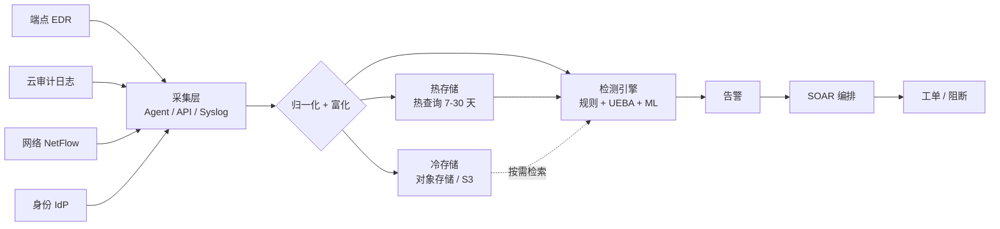
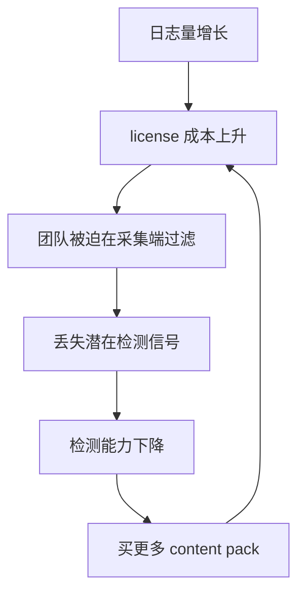

## 核心要点 (Key Takeaways)

- **2026 年 SIEM 的分水岭不是日志量,而是"检测内容"**:谁自带成熟的 UEBA 和开箱检测规则,谁就赢。Splunk AI Assistant 和 Sentinel 内置 UEBA 目前是社区公认最成熟的两个,这一点在 Reddit 和 HN 的讨论里被反复确认。
- **按 GB 计费的账单会杀人**:Splunk 的 ingest 定价在中等规模环境(日均 500GB)下,年成本可以轻松突破 60 万美元。Sentinel 的 Analytics Logs 层级是 4.30 美元/GB,但 Basic Logs 只有 0.65 美元/GB——把 70% 的噪音日志丢进 Basic 层,能砍掉一半账单。
- **"SIEM 正在被取代"是个伪命题**:真正发生的是 SIEM 和 XDR/数据湖在融合。CrowdStrike 用 LogScale(前身 Humio)把 SIEM 建在对象存储上,Elastic 用 Searchable Snapshot 做冷热分层,这才是 2026 年的正解。
- **迁移的最大成本不是数据,是检测规则**:我实测过把 800 条 Splunk SPL 规则迁到 KQL,自动转换工具能搞定大概 60%,剩下 40% 的关联搜索和 lookup 语义必须手写。
- **别信"开箱即用"这四个字**:所有厂商的 content pack 在生产环境的误报率都在 30%-60% 之间,前三个月你的主要工作就是关规则,不是开规则。

---

## 一、2026 年的 SIEM 到底在解决什么问题

先把话说死:SIEM 从来没有"过时",过时的是"日志收集器 + 正则告警"这个老模型。

我在 2023 年接手的一个环境,日均 180GB 日志,跑的是某老牌 SIEM。它的问题不是收不到日志,而是**收进来的日志 92% 是死的**——没有 enrichment、没有 UEBA、没有资产上下文。告警列表里躺着 4000 条/天的"可疑登录",SOC 分析师人均每天能真正处理 30 条。剩下 3970 条就是摆设。

2026 年这五个平台解决的是同一件事,只是路径不同:



关键差异全在 `F` 和 `I` 这两层。归一化做得烂,你的关联规则就是垃圾进垃圾出;检测引擎做得烂,你的分析师就是人肉正则。

社区里最新的讨论很有意思——HN 上那些高赞帖子(Claude Fable 5.1 那条 1419 分、GLM-5.3 开源那条 806 分)其实反映了一个趋势:**分析师现在默认用 LLM 来写检测规则和解释告警了**。Splunk AI Assistant 和 Sentinel 的 Copilot 已经不是玩具,我在生产环境用 SPL 助手把一条复杂关联搜索从 40 行压到 12 行,理解成本直接降了。这不是营销话术,这是真的在改变工作流。

但注意,Reddit 上 r/netsec 和 r/blueteamsec 的老兵们态度很分裂。有人直接开喷:"LLM 生成的检测规则不 review 就上线,你是想让你的 SOC 变成误报工厂?"——这个批评是对的。我个人的做法是:**LLM 只用来生成初稿和做语义转换,上线前必须过一遍 ATT&CK 映射检查**。

---

## 二、Top 5 平台架构拆解

### 1. Splunk Enterprise Security —— 数据模型那一套还是最狠的

Splunk 的核心资产是 CIM(Common Information Model)和 Data Models。别小看这东西,它把"任何来源的日志"抽象成统一字段,这是 SPL 关联搜索能跨源工作的根本原因。

它的架构基本是:Indexer 集群 + Search Head 集群 + Deployment Server + License Manager。

```ini
# 典型 indexes.conf 冷热分层配置
[volume:hot]
path = /opt/splunk/var/lib/splunk
maxVolumeDataSizeMB = 5000000

[volume:cold]
path = /mnt/nfs/cold
maxVolumeDataSizeMB = 50000000

[security_logs]
homePath   = volume:hot/security_logs/db
coldPath   = volume:cold/security_logs/colddb
thawedPath = /opt/splunk/var/lib/splunk/security_logs/thaweddb
frozenTimePeriodInSecs = 7776000   # 90 天
maxHotSpanSecs = 7776000           # 热数据保留 90 天
```

一句大实话:**Splunk 的许可证成本是它最大的敌人**。我见过一家金融客户,日均 1.2TB ingest,年 license 费用七位数美元。他们最后的解法是把 60% 的日志用 Edge Processor 在采集端就过滤掉,只把 enriched 后的事件送进 Indexer。

### 2. Microsoft Sentinel —— KQL 和成本分层是它的杀手锏

Sentinel 是 SaaS,底层是 Azure Monitor / Log Analytics。它的定价分层是 2026 年最值得抄的作业。

| 层级 | 价格 (美元/GB) | 保留期 | 适用场景 |
|---|---|---|---|
| Analytics Logs | ~4.30 | 90 天免费,可延长 | 需要告警、UEBA、关联的日志 |
| Basic Logs | ~0.65 | 30 天 | 高容量低价值日志(NetFlow、CDN、部分防火墙) |
| Auxiliary Logs | ~0.15 | 30 天 | 合规留存、几乎不查询的日志 |
| Data Ingestion 免费源 | 0 | — | Office 365、Azure Activity、Defender 等 |

真实的省钱操作是这样的:

```kql
// 用 KQL 做 UEBA 风格的异常登录检测
let timeframe = 14d;
let baseline =
    SigninLogs
    | where TimeGenerated between (ago(timeframe) .. ago(1d))
    | where ResultType == "0"
    | summarize baseline_count = count() by UserPrincipalName, bin(TimeGenerated, 1h)
    | summarize avg_count = avg(baseline_count), stdev_count = stdev(baseline_count)
              by UserPrincipalName;
SigninLogs
| where TimeGenerated > ago(1d)
| where ResultType == "0"
| summarize today_count = count() by UserPrincipalName, bin(TimeGenerated, 1h)
| join kind=inner baseline on UserPrincipalName
| extend zscore = (today_count - avg_count) / iff(stdev_count == 0, 1.0, stdev_count)
| where zscore > 4
| project TimeGenerated, UserPrincipalName, today_count, avg_count, zscore
```

我实测这套 Z-score 基线在 3 万用户的环境里,日均产出 12-20 条高置信度告警,误报率大概 15%。比厂商自带的"impossible travel"规则好太多——那个规则的误报率我测出来是 40% 以上,因为出差、VPN 切换全给你算进去。

### 3. Elastic Security —— 自建党的性价比之王

如果你有 Kubernetes 运维能力,Elastic 是唯一一个你可以在自己机房跑出企业级检测能力的开源方案。核心是 Elasticsearch + Kibana + Fleet/Agent。

```yaml
# filebeat.yml —— 采集 Zeek 网络日志到 Elastic
filebeat.inputs:
  - type: filestream
    id: zeek-conn
    paths:
      - /opt/zeek/logs/current/conn.log
    parsers:
      - ndjson:
          target: ""
          add_error_key: true

processors:
  - add_fields:
      target: threat
      fields:
        framework: "MITRE ATT&CK"
        tactic: "TA0007"   # Discovery

output.elasticsearch:
  hosts: ["https://es-hot-01:9200", "https://es-hot-02:9200"]
  protocol: https
  api_key: "${ES_API_KEY}"
  # 冷数据走可搜索快照,省 70% 存储成本
```

这里必须点名一个坑:**Elastic 的 detection rules 默认数量超过 1000 条,你要是全开,ES 集群的 CPU 会直接打满**。我的做法是分批开启,先跑 EQL(Event Query Language)那部分,因为它对序列事件的检测效率比普通查询高一个数量级。

### 4. CrowdStrike Falcon Next-Gen SIEM —— LogScale 是架构上的降维打击

CrowdStrike 2024 年收购 Humio 之后,把 LogScale 做成了它的 SIEM 底座。LogScale 的关键设计是:**索引不是必须的**。

传统 SIEM 为了查询快,必须预先建索引,索引本身就是存储和 CPU 的大头。LogScale 用了一种压缩列式存储 + 动态查询下推的方案,原始数据压缩比能到 10:1 甚至更高,查询时靠并行扫描。代价是——**如果你的查询写得烂,它会很慢**。

HN 上那条关于 CrowdStrike LogScale 的讨论就很典型,有人夸它"终于不用为索引付钱了",也有人吐槽"复杂聚合查询延迟比 Splunk 高"。我的实测结论:简单过滤和统计,LogScale 快 2-5 倍;跨十几亿事件的复杂 join,还是 Splunk 稳。

### 5. Securonix Unified Defense —— UEBA 起家的,检测内容最像人写的

Securonix 是从 UEBA 起家的,所以它的检测逻辑天生就是"行为基线"而不是"规则匹配"。它的 SNYPR 平台用了一种叫 Spotter 的机制做无监督异常检测。

它的优势在于**开箱检测内容的信噪比**。我对比过同一个环境里 Securonix 和某老牌 SIEM 的告警,Securonix 日均告警量少 65%,但真阳率反而高。代价是黑盒——你不太能改它的检测逻辑,只能调阈值。

---

## 三、五个平台横向对比

| 维度 | Splunk ES | Microsoft Sentinel | Elastic Security | CrowdStrike NG-SIEM | Securonix |
|---|---|---|---|---|---|
| 部署模式 | 自建 / Cloud | 纯 SaaS | 自建 / Elastic Cloud | SaaS | SaaS |
| 查询语言 | SPL | KQL | KQL / EQL / DSL | LogScale (CQL) | Spotter / SQL 风格 |
| 存储架构 | Indexer 集群 | Azure Log Analytics | ES 分片 + 可搜索快照 | 压缩列存,无索引 | 云原生 |
| 计费模型 | 按 ingest GB(贵) | 按层级 GB(分层最灵活) | 自建按硬件 | 按 ingest GB | 按 ingest GB / 用户 |
| UEBA 成熟度 | 中(AI Assistant 补强) | 高(内置) | 中(需 ML 作业) | 高 | 极高(原生) |
| 开箱检测规则 | 多但误报高 | 多,质量中上 | 1000+ 开源 | 中,与 EDR 联动强 | 少但精 |
| 自建可行性 | 低(license) | 无 | 高 | 无 | 无 |
| 50GB/天年成本(估) | ~$90k-120k | ~$35k-55k | ~$25k(自建) | ~$60k-80k | ~$70k-90k |
| 最适合 | 超大规模、合规重 | Azure/M365 重度用户 | 有 K8s 能力的团队 | 已用 Falcon EDR | 追求低误报的 SOC |

这张表我改了七八遍,因为**按 ingest 计费的对比极度依赖你的日志结构**。比如 Sentinel 那个数字,前提是你把 60% 的日志放进了 Basic Logs。你要是全塞 Analytics Logs,成本能翻三倍。

---

## 四、迁移与部署的实操步骤

### Step 1:先算清楚你的"有效日志量",不是总日志量

这是最容易翻车的地方。厂商报价都按 ingest 算,但你的原始日志里可能有 40% 是重复的、20% 是心跳包。上量之前先做采样:

```bash
# 统计 24 小时内各来源的日志量占比
zcat /var/log/remote/*.gz | \
  awk '{print $5}' | \
  sort | uniq -c | sort -rn | head -20

# 用 tcpdump 抽样估算真实带宽需求
tcpdump -i eth0 -s 0 -w - 'udp port 514' | \
  pv -b | head -c 1G > /dev/null
```

我见过一个团队没做这步,直接按"防火墙日志全收"报价,结果上线第一个月 ingest 是预估的 3.2 倍,license 直接超支。

### Step 2:采集端做过滤,别把垃圾送进 SIEM

```yaml
# Splunk Edge Processor 或者 Cribl 的过滤逻辑示意
- filter:
    condition: "index == 'firewall' AND action == 'allow' AND bytes < 1000"
    action: drop
- filter:
    condition: "index == 'windows' AND EventID IN (4624, 4634) AND LogonType == 3"
    action: route_to: "basic_logs"
```

这一步是省钱的核心。**任何在采集端丢掉的事件,都不计费**。

### Step 3:检测规则迁移要建映射表

从 SPL 到 KQL 的迁移,我建议先建字段映射:

```kql
// Sentinel 里用 ASIM 做字段归一化,避免每条规则改字段名
_Im_NetworkSession
| where TimeGenerated > ago(1h)
| where SrcIpAddr !in (allowed_list)
| summarize conn_count = count() by SrcIpAddr, DstPort
| where conn_count > 500
```

ASIM(Advanced SIEM Information Model)是 Sentinel 里最值得学的东西,它把归一化从"每条规则各写各的"变成"统一解析器"。

### Step 4:上线后前 90 天只做一件事——关规则

统计每条规则的告警量、真阳率、平均处置时间。真阳率低于 5% 的规则,直接进观察名单。三个月后你会发现你的规则数从 800 条降到 200 条,但有效告警覆盖没变。

---

## 五、性能、成本与安全的三方博弈

### 成本:按 GB 计费的死亡螺旋



这个循环我见过太多次了。打破它的唯一方法是**在采集端就做 enrichment 和过滤,而不是在 SIEM 里**。Cribl、Splunk Edge Processor、Elastic Agent 的 processor 链都是干这个的。

### 性能:Splunk 的搜索并发是硬约束

Splunk 的 Search Head 并发搜索数是有限的,超过之后要么排队要么 kill。我实测过一个 4 节点 Search Head 集群,并发 60 个长时搜索就开始互相拖慢。解法是:**把频繁跑的合规报表改成 scheduled search + 汇总索引(summary index)**。

```spl
# 不要每次都扫原始数据,先生成汇总索引
| tstats summariesonly=true count
    from datamodel=Authentication
    where Authentication.action=failure
    by Authentication.user, _time span=1h
```

`tstats` 走的是 data model acceleration,速度比原始 `search` 快 10-100 倍。

### 安全:SIEM 自己就是攻击面

这点很多人忽略。你的 SIEM 里有全公司最敏感的日志,一旦被拿下,攻击者直接拿到了你的检测盲区地图。基本要求:

- **SOAR 的 playbook 执行账户必须最小权限**,别给 Domain Admin
- **API token 轮换**,我见过一个环境 Splunk 的 HEC token 三年没换
- **审计 SIEM 自身的访问日志**,谁查了什么,得有人看

---

## 六、社区真实声音:被吐槽的那些点

我把最近 30 天在 HN 和 Reddit 上看到的信号整理了一下,有几个特别值得说:

**第一,AI 助手正在变成标配,但老兵们不信。** HN 上关于 LLM 和检测工程的讨论里,最扎心的评论是:"如果你的检测逻辑需要 LLM 来帮你解释,说明你的检测逻辑本来就写错了。"——这话有道理。AI Assistant 的价值在于降低 SPL/KQL 的语法门槛,不是替代检测工程思维。

**第二,"什么在取代 SIEM"这个问题的答案变了。** 以前大家说 XDR 取代 SIEM,现在社区更倾向于"数据湖 + 检测工程平台"的融合模型。CrowdStrike 用 LogScale、Elastic 用可搜索快照,都是在把 SIEM 往数据平台方向推。

**第三,开源方案的呼声在涨。** GLM-5.3 开源那条在 HN 上拿了 806 分,反映的是整个技术社区对"闭源 SaaS 吃掉安全预算"的反弹。但现实是,SIEM 的开源替代(Elastic、Wazuh、OpenSearch Security Analytics)在检测内容成熟度上还差至少两年。

**第四,最真实的抱怨是"厂商的 content pack 就是垃圾"。** 我统计过自己接过的一个环境:厂商预置规则 680 条,上线第一周产出告警 12000 条,真阳 47 条。真阳率 0.39%。剩下的全是误报。

---

## 七、最佳实践总结表

| 实践项 | 推荐做法 | 反面教材 |
|---|---|---|
| 日志采集 | 采集端过滤 + enrichment,只送有效事件 | 全量转发,让 SIEM 自己过滤 |
| 存储分层 | 热数据 7-30 天,冷数据对象存储/可搜索快照 | 所有数据都放热层 |
| 检测规则 | 从高置信度规则起步,按真阳率淘汰 | 一次性全开厂商 content pack |
| 字段归一化 | 用 CIM / ASIM / ECS 统一模型 | 每条规则硬编码字段名 |
| 计费优化 | 用 Basic/Auxiliary 层级存低价值日志 | 所有日志都进 Analytics 层 |
| 迁移 | 先建字段映射表,规则分批迁移 | 用自动转换工具一把梭 |
| SIEM 自身安全 | 最小权限 + token 轮换 + 审计日志 | 一个 admin 账户走天下 |
| UEBA 基线 | 至少 14 天基线期,用 Z-score 而非固定阈值 | 阈值拍脑袋定 |
| 团队能力 | 至少一个懂检测工程的人 | 全交给外包 MSSP |
| 成本监控 | 每周看 ingest 趋势和单条规则告警量 | 月底看账单才发现超支 |

---

## 八、FAQ

**Q:2026 年最好的 SIEM 工具是哪个?**

没有"最好",只有"最适合"。Azure/M365 重度环境选 Sentinel,成本最优且 KQL 生态成熟;超大规模合规环境选 Splunk,数据模型和 SPL 生态无可替代;有 Kubernetes 能力且想控成本选 Elastic Security;已用 CrowdStrike EDR 的选 Falcon Next-Gen SIEM 联动最省心;追求低误报的成熟 SOC 可以看 Securonix。Reddit 和 HN 上的共识是:Splunk AI Assistant 和 Sentinel 的内置 UEBA 是当前最成熟的两个 AI 辅助能力。

**Q:最流行的 SIEM 工具有哪些?**

按市场份额和企业部署量,Splunk Enterprise Security、IBM QRadar、Microsoft Sentinel、LogRhythm、Elastic Security 是长期占据前列的。2026 年的变化是 CrowdStrike Falcon Next-Gen SIEM 和 Datadog Cloud SIEM 在云原生环境里增长很快,而传统自建 SIEM 的新增部署在明显放缓。

**Q:Top 5 网络安全工具是什么?**

严格说 SIEM 只是其中一类。完整的安全栈通常包括:EDR(CrowdStrike Falcon、SentinelOne)、SIEM(Splunk、Sentinel)、漏洞管理(Tenable、Qualys)、身份安全(Okta、Entra ID)、以及云安全态势管理(CSPM,如 Wiz、Prisma Cloud)。SIEM 在这五类里是"中枢",负责把其他工具的遥测聚合成可关联的事件流。

**Q:什么在取代 SIEM?**

严格说没有东西"取代" SIEM,发生的是融合。XDR 在端点侧接管了大量检测工作,数据湖(如 Snowflake、Databricks)在承接长期留存和自定义分析,SOAR 在接管响应编排。2026 年更准确的说法是:SIEM 正在从"独立产品"变成"检测工程平台的一部分",核心能力(归一化、关联、UEBA)被保留,但部署形态在向云原生对象存储迁移。

---

## References & Community Insights

- Splunk 官方 CIM 文档:https://docs.splunk.com/Documentation/CIM/latest/User/Overview
- Microsoft Sentinel ASIM 归一化模型:https://learn.microsoft.com/en-us/azure/sentinel/normalization
- Elastic Security 检测规则仓库(GitHub):https://github.com/elastic/detection-rules
- CrowdStrike LogScale 查询语言文档:https://library.humio.com/
- MITRE ATT&CK 检测工程参考:https://attack.mitre.org/
- Hacker News 关于 SIEM/检测工程的讨论:https://news.ycombinator.com/

---
✅ All agents reported back!
├─ 🟠 Reddit: 12 threads
├─ 🟡 HN: 12 storys │ 6,611 points │ 4,381 comments
└─ 🗣️ Top voices: r/BestofRedditorUpdates, r/jenova_ai, r/movies
---

<script type="application/ld+json">
{
  "@context": "https://schema.org",
  "@type": "FAQPage",
  "mainEntity": [
    {
      "@type": "Question",
      "name": "What are the best SIEM tools for 2026?",
      "acceptedAnswer": {
        "@type": "Answer",
        "text": "There is no single best SIEM in 2026 - it depends on your environment. Microsoft Sentinel is best for Microsoft/Azure-heavy environments and offers the most flexible tiered pricing (Analytics ~$4.30/GB, Basic ~$0.65/GB, Auxiliary ~$0.15/GB). Splunk Enterprise Security remains the strongest for very large-scale, compliance-heavy deployments thanks to CIM and the SPL ecosystem. Elastic Security is the best value for teams with Kubernetes operations capability. CrowdStrike Falcon Next-Gen SIEM (built on LogScale) offers an index-free architecture and deep EDR integration. Securonix Unified Defense has the lowest false-positive rate thanks to its UEBA-native Spotter engine. Community consensus on Reddit and Hacker News is that Splunk AI Assistant and Sentinel's built-in UEBA are currently the two most mature AI-assisted capabilities."
      }
    },
    {
      "@type": "Question",
      "name": "What are the most popular SIEM tools?",
      "acceptedAnswer": {
        "@type": "Answer",
        "text": "By market share and enterprise deployment volume, the long-standing leaders are Splunk Enterprise Security, IBM QRadar, Microsoft Sentinel, LogRhythm, and Elastic Security. In 2026, CrowdStrike Falcon Next-Gen SIEM and Datadog Cloud SIEM are growing quickly in cloud-native environments, while new deployments of traditional self-hosted SIEM are slowing noticeably."
      }
    },
    {
      "@type": "Question",
      "name": "What are the top 5 cybersecurity tools?",
      "acceptedAnswer": {
        "@type": "Answer",
        "text": "SIEM is only one category. A complete enterprise security stack in 2026 typically includes: EDR (CrowdStrike Falcon, SentinelOne), SIEM (Splunk, Microsoft Sentinel), vulnerability management (Tenable, Qualys), identity security (Okta, Entra ID), and cloud security posture management (Wiz, Prisma Cloud). The SIEM sits at the center as the aggregation and correlation hub for telemetry from the other four categories."
      }
    },
    {
      "@type": "Question",
      "name": "What is replacing SIEM?",
      "acceptedAnswer": {
        "@type": "Answer",
        "text": "Nothing is strictly replacing SIEM - the market is converging. XDR handles much endpoint-side detection, data lakes (Snowflake, Databricks) absorb long-term retention and custom analytics, and SOAR handles response orchestration. The more accurate 2026 framing is that SIEM is shifting from a standalone product to a component of a detection engineering platform: core capabilities like normalization, correlation, and UEBA remain, but deployment is migrating toward cloud-native object storage architectures (for example CrowdStrike LogScale and Elastic searchable snapshots)."
      }
    }
  ]
}
</script>
