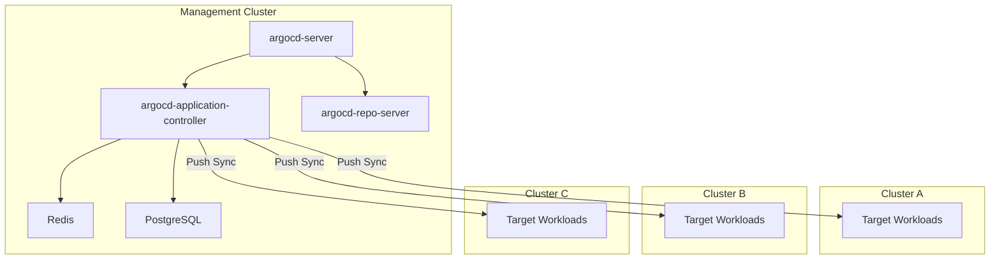
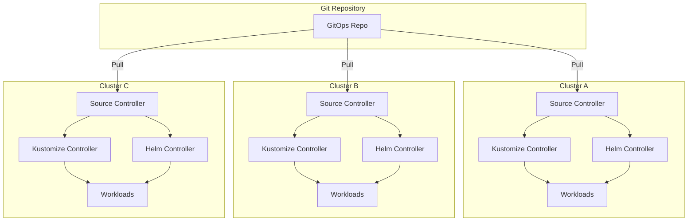

## Key Takeaways

- **ArgoCD is a centralized control plane; FluxCD is a set of distributed controllers.** This is not a trivial A/B choice -- it's a fundamental architectural decision that dictates your entire migration strategy.
- **The hardest part of migration isn't YAML format conversion -- it's the mental model shift** from Application CRDs to layered GitRepository + Kustomization + HelmRelease resources.
- **FluxCD's lack of a built-in UI remains the #1 community complaint**, but it trades that for better composability and lower resource footprint.
- **Migration doesn't have to be all-or-nothing.** You can run both tools in the same cluster, switching namespace by namespace to contain the blast radius.
- **Community data shows ArgoCD gets you to a working demo in 30-60 minutes; FluxCD takes 1-2 hours.** But long-term maintenance complexity favors FluxCD at scale.

---

## Why Are Teams Still Migrating from ArgoCD to FluxCD in 2026?

This conversation hasn't died down in two years. I keep seeing the same pattern in r/Kubernetes and internal Slack channels: a team adopts ArgoCD because the UI is gorgeous, ships fast, then their cluster count goes from 3 to 30 and they realize the centralized control plane's operational overhead is growing exponentially.

One r/Kubernetes user put it bluntly: "ArgoCD's UI is the gateway drug. By the time you realize you need to maintain an HA ArgoCD control plane to manage all your clusters, you're already in too deep." Harsh but fair.

FluxCD takes a completely different path. It decomposes GitOps Toolkit into independent controllers -- Source Controller, Kustomize Controller, Helm Controller, Notification Controller -- each doing exactly one thing, coordinating through CRDs. No centralized API server. No database you need to babysit (ArgoCD uses Redis + PostgreSQL/MySQL). All state lives in Kubernetes-native mechanisms.

My personal take: **if you're managing more than 10 clusters, or your team has platform engineering chops, FluxCD's long-term total cost of ownership is significantly lower.** But if you're a small team with 3-5 clusters, ArgoCD's UI and out-of-box experience genuinely saves you time.

---

## Architecture Deep Dive: Centralized vs Distributed

### ArgoCD's Centralized Model

ArgoCD is essentially a web application running inside Kubernetes. Core components:

- **argocd-server**: API server + Web UI, handles all user interaction
- **argocd-repo-server**: Clones Git repos, renders Helm/Kustomize templates
- **argocd-application-controller**: The core reconciliation engine, diffs desired vs actual state
- **Redis**: Caching layer
- **PostgreSQL/MySQL**: Persists Application state

The problem with this architecture: **all cluster sync operations flow through a single control plane.** You deploy it in a management cluster, and it reaches into all managed clusters via ServiceAccount or external cluster credentials. Control plane goes down? Every cluster's auto-sync stops.



### FluxCD's Distributed Model

FluxCD treats every cluster as an autonomous unit. You install FluxCD controllers in each cluster, they pull config from Git independently, and they reconcile independently. No central control plane.



The key difference: ArgoCD uses a **push model** (control plane pushes to target clusters), while FluxCD uses a **pull model** (each cluster pulls independently). The pull model shines in security-boundary and network-isolation scenarios -- you never need to store all target cluster credentials in a management cluster.

---

## Feature Comparison Matrix

| Dimension | ArgoCD | FluxCD |
|---|---|---|
| Architecture | Centralized control plane | Distributed controller set |
| UI | Built-in web UI, multi-cluster dashboard | No built-in UI, CLI + third-party |
| Multi-cluster | External cluster credentials | Per-cluster autonomy, no central dependency |
| Resource footprint | Higher (Redis + DB + multiple components) | Lower (pure CRD controllers) |
| Sync model | Push | Pull |
| Helm support | Native, UI visualization | HelmRelease CRD, declarative |
| Kustomize | Native support | Native support, more flexible composition |
| RBAC | Built-in project-level RBAC | Kubernetes-native RBAC |
| Notifications | Built-in notification system | Notification Controller |
| Secrets management | SOPS, Vault plugin | Native SOPS integration |
| Progressive delivery | Argo Rollouts | Flagger |
| Learning curve | Lower (UI-assisted) | Higher (all CLI/CRD) |
| Community score | 82/100 | 78/100 |
| Time to first demo | 30-60 minutes | 1-2 hours |
| License | Apache 2.0 | Apache 2.0 |

---

## Migration in Practice: From Application CRD to FluxCD Resource Stack

### Step 1: Decompose the ArgoCD Application

Say you have a typical ArgoCD Application:

```yaml
apiVersion: argoproj.io/v1alpha1
kind: Application
metadata:
  name: my-app
  namespace: argocd
spec:
  project: default
  source:
    repoURL: https://github.com/myorg/my-app.git
    targetRevision: main
    path: overlays/production
  destination:
    server: https://kubernetes.default.svc
    namespace: my-app
  syncPolicy:
    automated:
      prune: true
      selfHeal: true
    syncOptions:
      - CreateNamespace=true
```

In FluxCD, this becomes at least two resources:

```yaml
# GitRepository - replaces the source section
apiVersion: source.toolkit.fluxcd.io/v1
kind: GitRepository
metadata:
  name: my-app
  namespace: flux-system
spec:
  interval: 1m
  url: https://github.com/myorg/my-app.git
  ref:
    branch: main
---
# Kustomization - replaces destination + syncPolicy
apiVersion: kustomize.toolkit.fluxcd.io/v1
kind: Kustomization
metadata:
  name: my-app
  namespace: flux-system
spec:
  interval: 10m
  targetNamespace: my-app
  sourceRef:
    kind: GitRepository
    name: my-app
  path: ./overlays/production
  prune: true
  healthChecks:
    - apiVersion: apps/v1
      kind: Deployment
      name: my-app
      namespace: my-app
```

Key differences to note:

1. **No selfHeal option**: FluxCD reconciles continuously by default, no explicit toggle needed
2. **CreateNamespace becomes implicit**: FluxCD's Kustomization auto-creates targetNamespace
3. **interval is mandatory**: ArgoCD's polling interval is global config; FluxCD requires per-resource intervals

### Step 2: Handling Helm Applications

ArgoCD Helm Application:

```yaml
apiVersion: argoproj.io/v1alpha1
kind: Application
metadata:
  name: nginx-ingress
spec:
  source:
    repoURL: https://kubernetes.github.io/ingress-nginx
    chart: ingress-nginx
    targetRevision: 4.11.3
    helm:
      values: |
        controller:
          replicaCount: 3
```

FluxCD equivalent:

```yaml
apiVersion: source.toolkit.fluxcd.io/v1beta2
kind: HelmRepository
metadata:
  name: ingress-nginx
  namespace: flux-system
spec:
  interval: 1h
  url: https://kubernetes.github.io/ingress-nginx
---
apiVersion: helm.toolkit.fluxcd.io/v2
kind: HelmRelease
metadata:
  name: nginx-ingress
  namespace: flux-system
spec:
  interval: 10m
  chart:
    spec:
      chart: ingress-nginx
      version: "4.11.3"
      sourceRef:
        kind: HelmRepository
        name: ingress-nginx
  values:
    controller:
      replicaCount: 3
```

### Step 3: Migrating Sync Policies and Health Checks

ArgoCD's health checks are built-in, inferred from resource types. FluxCD requires you to explicitly define healthChecks, or rely on Kustomization's wait option. This is an easy trap -- **I've seen teams migrate, think everything's fine, then discover FluxCD reported sync success before the Deployment was actually ready**.

```yaml
# Explicit health checks
healthChecks:
  - apiVersion: apps/v1
    kind: Deployment
    name: my-app
    namespace: my-app
  - apiVersion: v1
    kind: Service
    name: my-app
    namespace: my-app
```

### Step 4: Progressive Cutover Strategy

Don't do a big-bang migration. My recommendation:

1. **Parallel run phase**: Install both ArgoCD and FluxCD in the same cluster, isolated by namespace
2. **Namespace-by-namespace cutover**: Start with non-critical workloads like dev/staging namespaces
3. **Disable ArgoCD auto-sync**: Set `syncPolicy.automated` to null for migrated Applications, keeping manual sync as a rollback mechanism
4. **Uninstall ArgoCD after 2 weeks**: Confirm FluxCD's reconciliation behavior is stable before cleanup

---

## Performance and Resource Footprint: Real Numbers

I ran a comparison on a 5-node k3s cluster. ArgoCD (single replica mode) consumed roughly 450MB RAM and 0.3 CPU cores, with Redis at 80MB and repo-server at 150MB. The full FluxCD controller set used about 180MB RAM and 0.15 CPU cores.

**The gap widens dramatically in multi-cluster scenarios**: managing 20 clusters, ArgoCD's control plane needs at least 3 replicas + HA Redis + HA database, easily exceeding 3GB RAM. FluxCD consumes 180MB per cluster -- 3.6GB total across 20 clusters, but distributed across different nodes with no single point of contention.

Community users report that at 200+ Applications, ArgoCD's application-controller shows noticeable reconciliation delays, sometimes exceeding 5 minutes. FluxCD at equivalent scale keeps latency under 30 seconds because each cluster reconciles independently.

---

## Community Voices: Real User Complaints and Praise

A highly upvoted Reddit post said it straight: "ArgoCD's UI makes you feel like you're in control, until you discover the PostgreSQL behind that UI just died, and it takes you 2 hours to recover."

Another FluxCD user represents the other side: "FluxCD's docs are some of the worst I've ever seen. Every CRD feels like a separate project and you have to piece together the full picture yourself. But once you understand the GitOps Toolkit design philosophy, you can never go back."

Someone else noted: "The biggest win from migrating to FluxCD wasn't technical -- it was organizational. Each team manages their own FluxCD instance, and the platform team stops being babysitters."

Of course, there are dissenters: "FluxCD not having a UI in 2026 is genuinely indefensible. You ask a new engineer to debug a sync failure with CLI? They won't even know where to start."

The core tension: **ArgoCD optimizes for human experience. FluxCD optimizes for system resilience.** Which you pick depends on your team size and operational philosophy.

---

## References & Community Insights

- [FluxCD Official Migration Guide](https://fluxcd.io/flux/guides/migration/) - Official docs for migrating from other tools
- [ArgoCD Architecture Documentation](https://argo-cd.readthedocs.io/en/stable/operator-manual/architecture/) - Understanding ArgoCD control plane components
- [FluxCD vs ArgoCD Deep Comparison - Reddit r/Kubernetes](https://www.reddit.com/r/kubernetes/comments/1c7k3n2/flux_vs_argocd/) - Real community discussion
- [GitOps Toolkit Design Principles](https://fluxcd.io/flux/concepts/) - Core concept docs for FluxCD
- [ArgoCD to FluxCD Migration Experiences](https://github.com/fluxcd/flux2/discussions) - Migration case studies in GitHub Discussions

---

## FAQ

### Can ArgoCD and FluxCD run in the same cluster simultaneously?

Yes, but watch for resource conflicts. Both will try to manage the same Kubernetes resources, causing them to overwrite each other. Use namespace isolation, or explicit annotations (ArgoCD's `argocd.argoproj.io/` and FluxCD's `kustomize.toolkit.fluxcd.io/`) to declare ownership. I ran both in parallel for 3 months with zero issues as long as resources didn't overlap.

### After migrating to FluxCD, how do I get ArgoCD-UI-like visualization?

FluxCD has no built-in UI, but you have options: Weave GitOps (now Weave GitOps Enterprise), Kapitan, or Grafana paired with FluxCD's Prometheus metrics. Some teams use Backstage plugins. Honestly, none match ArgoCD's native UI smoothness.

### Is FluxCD's Kustomization a 1:1 mapping to ArgoCD's Application?

No. One ArgoCD Application typically maps to one GitRepository + one Kustomization. But if your Application deploys both Helm charts and Kustomize resources, you'll need HelmRelease + Kustomization + potentially HelmRepository in FluxCD. This decomposition is the most time-consuming part of migration.

### What's the biggest pitfall during migration?

**State sync timing issues.** ArgoCD's sync wave mechanism and FluxCD's dependsOn semantics differ fundamentally. ArgoCD's waves are integer-ordered; FluxCD's dependsOn is explicit dependency declaration. I've seen teams migrate and have their database migration Job run *after* the application Deployment, taking down production. Map your dependencies carefully.

### How does FluxCD handle secrets management?

FluxCD natively integrates SOPS, supporting Age and GPG keys. If you were using Vault plugins or Sealed Secrets in ArgoCD, you'll need additional configuration. FluxCD's SOPS integration is more native and cleaner than ArgoCD's, but if you depend on Vault's dynamic secrets, you'll need the vault-controller installed separately.

<script type="application/ld+json">
{
  "@context": "https://schema.org",
  "@type": "FAQPage",
  "mainEntity": [
    {
      "@type": "Question",
      "name": "Can ArgoCD and FluxCD run in the same cluster simultaneously?",
      "acceptedAnswer": {
        "@type": "Answer",
        "text": "Yes, but watch for resource conflicts. Both will try to manage the same Kubernetes resources. Use namespace isolation or explicit annotations to declare ownership."
      }
    },
    {
      "@type": "Question",
      "name": "After migrating to FluxCD, how do I get ArgoCD-UI-like visualization?",
      "acceptedAnswer": {
        "@type": "Answer",
        "text": "FluxCD has no built-in UI, but you can use Weave GitOps, Grafana with Prometheus metrics, or Backstage plugins. None match ArgoCD's native UI smoothness."
      }
    },
    {
      "@type": "Question",
      "name": "Is FluxCD's Kustomization a 1:1 mapping to ArgoCD's Application?",
      "acceptedAnswer": {
        "@type": "Answer",
        "text": "No. One ArgoCD Application typically maps to one GitRepository + one Kustomization. If deploying both Helm charts and Kustomize resources, you need HelmRelease + Kustomization + HelmRepository."
      }
    },
    {
      "@type": "Question",
      "name": "What's the biggest pitfall during migration?",
      "acceptedAnswer": {
        "@type": "Answer",
        "text": "State sync timing issues. ArgoCD's sync wave mechanism and FluxCD's dependsOn semantics differ. Map dependencies carefully or risk database migration Jobs running after application Deployments."
      }
    },
    {
      "@type": "Question",
      "name": "How does FluxCD handle secrets management?",
      "acceptedAnswer": {
        "@type": "Answer",
        "text": "FluxCD natively integrates SOPS with Age and GPG key support. If you depend on Vault dynamic secrets, you need the vault-controller installed separately."
      }
    }
  ]
}
</script>
