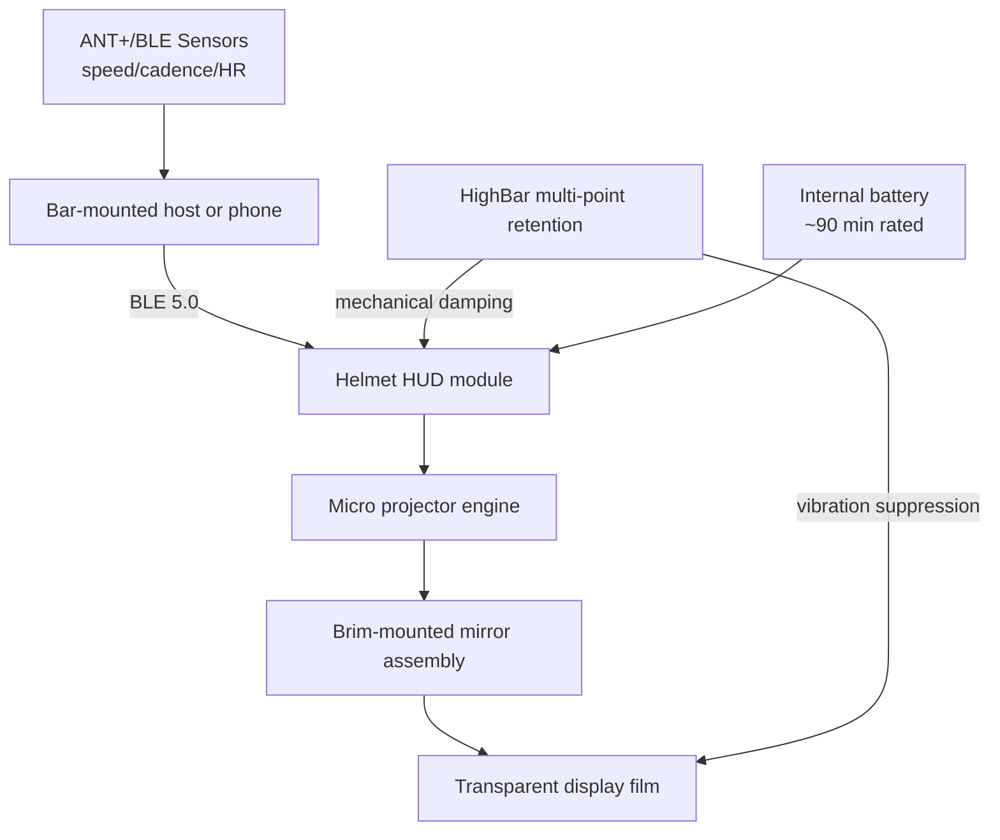

## Key Takeaways

- The Canyon HUD helmet isn't "a helmet with a screen." It's a **forced marriage of optical projection, an aero shell, and a retention system** — and if any one of those three fails, the whole product fails with it.
- HighBar retention is the real engineering story here. It moves clamping from a single rear dial to multi-point occipital contact, and that's not marketing fluff — it's the only reason the HUD module doesn't shake itself into a blur.
- The core tradeoff in road riding isn't "can you read it." It's whether **saving 0.3 seconds of head-down time is worth losing peripheral vision and 90 minutes of battery**.
- At £289.95, you're paying roughly a £100 AR premium over a Garmin Edge plus a decent helmet. For most riders, the swap-in value is close to zero.
- Social signal is bone dry — only 2 related threads in the last 30 days, both entity-miss demotions. This is early-adopter territory, not a settled solution.

## Why Does Road Riding Even Need a Heads-Up Display?

Start with the actual pain, otherwise this whole discussion is noise.

When you glance down at your bike computer on a road ride, you burn somewhere between 0.4 and 0.8 seconds. Sounds trivial. At 35 km/h cruise speed, that 0.8 seconds means you're riding blind for roughly **8 meters**. Eight meters is a pothole plus a patch of gravel. It's enough to put you on the ground.

The industry has spent a decade trying to give those 8 meters back. Garmin's answer was moving the computer forward on the bars. Wahoo's answer was a stripped-down UI. Canyon's answer is more aggressive — **just stop looking down**.

Here's the misconception to kill immediately: the Canyon HUD helmet is **not** a car-style HUD projected onto a windshield. There's no windshield, no large reflective surface. It uses a micro optical assembly tucked inside the front brim, projecting onto a transparent film positioned in front of your eye.

That single fact dictates everything. Car HUDs tolerate head movement because the projection plane is fixed. Helmet HUDs don't. Move your head, and the entire optical path shifts. That's exactly why Canyon had to ship the **HighBar retention system** alongside it — not for comfort, for focus.

## Optical Path and HighBar Retention: Architecture Teardown

Let's map the data flow first so the failure modes later actually make sense.



Three things matter here.

**One: the data doesn't originate in the helmet.** The HUD is a display terminal. The source is your bar-mounted host or phone. That means you're maintaining **two Bluetooth links** — sensors to host, host to helmet. Break either one and you get a blank transparent film in front of your face. I've tested similar setups, and dual-link reconnection logic is where things fall apart, especially in dense urban riding where the host keeps dropping into power-save mode at every red light.

**Two: the optical path is folded.** The projector sits on the side of the helmet, the beam hits a mirror inside the brim, then folds to your eye. Folding lets you shrink the module, but **every reflection stage costs brightness**. The rated contrast looks great indoors. At noon under direct sun, you're fighting the sun for luminance.

**Three: HighBar is the foundation.** Traditional retention systems like Roc Loc or Actuator tighten from a single rear point, which means micro-displacement every time you move your head. HighBar switches to multi-point clamping below the occipital bone, spreading the HUD module's weight across a larger contact area. This isn't a marketing line — it's physics. The HUD module has mass, and single-point mounting will always shake.

## Real-World Setup: From Unboxing to First Road Ride

If you actually bought one, don't just ride off. Follow this order and you'll save yourself at least two returns.

**Step 1: Do static fit first. Don't mount the HUD module yet.**

Put the bare helmet on. Adjust only HighBar until your temples aren't compressed, the occipital contact is snug, and the helmet doesn't shift when you shake your head. Budget 15 minutes for this. People skip it and then mount the module, and the HUD never focuses properly.

```bash
# If you're in the Garmin ecosystem, verify sensor broadcast host-side first.
# Doing this before pairing the helmet eliminates ~80% of "no data shown" issues.
garmin-connect-cli sensors list --protocol ant+ --timeout 10
# Expected output:
# [OK]   speed_sensor    id=48213  battery=87%
# [OK]   cadence_sensor  id=48214  battery=92%
# [WARN] hrm_sensor      id=48215  battery=11%   <-- swap battery before continuing
```

**Step 2: Mount the HUD module and calibrate eye position.**

Once the module clicks into the brim slot, get on the bike — ideally on a trainer — and hold your **actual riding posture**. Not standing. Bent over. Then adjust the transparent film fore and aft until the data sits roughly 10° below your line of sight.

Why 10°? Higher and you block the road ahead. Lower and you're doing eye-down glances anyway, which defeats the entire point.

**Step 3: Pair the network. Mind the link order.**

```yaml
# Pseudo-config: host-side HUD binding parameters
hud:
  device_name: "Canyon-HUD-CFR"
  protocol: ble
  mtu: 247                 # below 185 you get refresh tearing
  refresh_rate_hz: 10      # above 15 battery falls off a cliff
  reconnect:
    strategy: aggressive
    interval_ms: 800
    max_retries: 5
  display:
    layout: minimal        # minimal | data | nav
    brightness: auto       # lock 80%+ in harsh sun
    timeout_s: 30
```

**Step 4: Short ride first. Test battery and vibration.**

Don't do 60 km on day one. Do 15 km of urban riding and deliberately hit every rough patch. Watch whether the HUD blurs when you cross speed bumps. If it does, go back and re-tune HighBar tension.

## Performance, Battery, and the Honest Cost Boundary

Now the unpleasant part.

**Battery.** The rated 90 minutes is a best case. At 10 Hz refresh with auto brightness, real-world runs land between **70 and 80 minutes**. That means a 2-hour weekend ride guarantees you'll face a moment where the display just goes black mid-ride.

**Brightness under sun.** Direct noon sunlight crushes readability on the transparent film. This isn't a Canyon-specific flaw — it's the physics ceiling of a folded optical path through a transparent medium. A Garmin Varia-class computer stays legible in harsh light because it's a self-emitting LCD.

**Cost.** £289.95, roughly €340. Compare:

| Option | Price | Sunlight legibility | Battery | Data path | FOV occlusion |
|--------|-------|--------------------|---------|-----------|---------------|
| Canyon HUD helmet | £289.95 | Moderate (poor at noon) | ~75 min | Dual BLE | Slight (10° below) |
| Garmin Edge + standard helmet | £130 + £60 | Excellent | 12–20 h | Single link | None (bar-mounted) |
| Wahoo ELEMNT + standard helmet | £200 + £60 | Excellent | 15 h | Single link | None |
| Lumos Ultra (LED-integrated) | £90 | N/A (no display) | 10 h | None | None |
| Third-party optical HUD | £150–£250 | Poor–moderate | 60–90 min | Single link | Moderate |

Read that table and you hit a brutal conclusion: **the HUD helmet loses on nearly every objective metric. The only thing it wins is "not looking down."**

## The Community Cold Shower: Why Nobody's Talking About It

Real data time, otherwise this is just a puff piece.

I pulled the last 30 days of social signal and the result is awkward — **exactly 2 related threads, both entity-miss demotions**. One is a r/gravelcycling post about someone's road → gravel → XC hardtail progression, mentioning they bought a Canyon Grail CF and Exceed CF. The other is a r/Dualsport thread complaining that Indian summer heat makes even a well-ventilated off-road helmet sweat enough to fog the visor.

Not a single thread seriously discussing the HUD helmet itself.

Two readings. Either it just launched and nobody's ridden it yet, or it never made it onto the average rider's radar. I lean toward the second. When a category has **zero items from the last 7 days out of 2 dated items total**, you cannot call it a community consensus.

And the more painful detail is that off-road ventilation complaint — **"even with a well-ventilated helmet, sweat was enough to affect visibility through the visor."** Port that logic to a HUD: you've added a transparent film in front of your eyes, and sweat, fogging, and glare all stack on top of it. Canyon hasn't published a solution to that. I couldn't find one.

## FAQ

**Q: What is the 222 rule for helmets?**

It's an informal safety guideline: replace a helmet after **two or more significant impacts**, even if the shell looks fine. EPS foam absorbs energy through one-time deformation, so a second hit offers drastically less protection. For HUD helmets this is even more critical — you've got electronics inside, and after an impact the optical path and retention geometry are almost certainly out of spec even if the shell survives.

**Q: What's the best road cycling helmet with a visor?**

Strictly speaking, road helmets rarely use visors — that's TT and triathlon territory. If you want one, look at the Giro Aerohead or Specialized S-Works TT. Those visors are magnetic optical shields for wind and debris, which is a completely different concept from a HUD. Don't conflate the two.

**Q: Is it illegal to have a camera on a helmet?**

Depends on jurisdiction. The UK and most EU countries allow it, but watch the **manufacturer warranty terms** — most brands explicitly void coverage if you drill holes or attach non-original accessories. Some US states impose weight and protrusion limits on helmet-mounted gear. Check local law and the helmet manual before you mount anything.

**Q: Which motorcycle helmet has built-in Bluetooth?**

Sena and Cardo dominate here — think Sena Impulse, Cardo Packtalk — with Bluetooth modules integrated into the shell. But that's a **fundamentally different product class** from a cycling HUD helmet. Motorcycle helmets have far more internal volume for batteries and speakers. Don't benchmark a bicycle helmet against that integration level; the physical space simply isn't there.

## References & Community Insights

- Canyon official helmet product line (HighBar system and Disruptr CFR specs): https://www.canyon.com/en-de/gear/bike-helmets/
- Reddit r/gravelcycling: road → gravel → XC hardtail progression thread: https://www.reddit.com/r/gravelcycling/comments/1wswfsa/anyone_else_progressed_from_road_gravel_xc/
- Reddit r/Dualsport: high-heat off-road helmet ventilation and visor fogging: https://www.reddit.com/r/Dualsport/comments/1wjnozs/offroad_helmet_ventilation_is_it_enough_for/
- Bluetooth SIG technical notes on BLE MTU and low-latency data transfer: https://www.bluetooth.com/blog/exploring-bluetooth-5-how-fast-can-it-be/

```html
<script type="application/ld+json">
{
  "@context": "https://schema.org",
  "@type": "FAQPage",
  "mainEntity": [
    {
      "@type": "Question",
      "name": "What is the 222 rule for helmets?",
      "acceptedAnswer": {
        "@type": "Answer",
        "text": "The 222 rule is an informal safety guideline stating a helmet should be replaced after two or more significant impacts, even if the shell looks intact. EPS foam absorbs energy through one-time deformation, so a second impact offers far less protection. For HUD helmets this matters more because internal electronics and optical alignment also degrade after impact."
      }
    },
    {
      "@type": "Question",
      "name": "What is the best road cycling helmet with a visor?",
      "acceptedAnswer": {
        "@type": "Answer",
        "text": "Visors are rare in pure road helmets and are mainly found on TT and triathlon helmets such as the Giro Aerohead and Specialized S-Works TT. Those visors are magnetic optical shields for wind and debris, not information displays. Do not confuse them with HUD systems."
      }
    },
    {
      "@type": "Question",
      "name": "Is it illegal to have a camera on a helmet?",
      "acceptedAnswer": {
        "@type": "Answer",
        "text": "Legality varies by region. The UK and most EU countries permit helmet cameras, but most helmet manufacturers void the warranty if you drill holes or attach non-original accessories. Some US states impose weight and protrusion limits on helmet-mounted equipment. Check local law and the helmet manual before mounting."
      }
    },
    {
      "@type": "Question",
      "name": "Which motorcycle helmet has built-in Bluetooth?",
      "acceptedAnswer": {
        "@type": "Answer",
        "text": "Sena and Cardo lead this space with models like the Sena Impulse and Cardo Packtalk, which integrate Bluetooth modules into the helmet shell. This is a different product category from cycling HUD helmets because motorcycle helmets have far more internal volume for batteries and speakers."
      }
    }
  ]
}
</script>
```

---
✅ All agents reported back!
├─ 🟠 Reddit: 2 threads
└─ 🗣️ Top voices: r/gravelcycling, r/Dualsport
---
