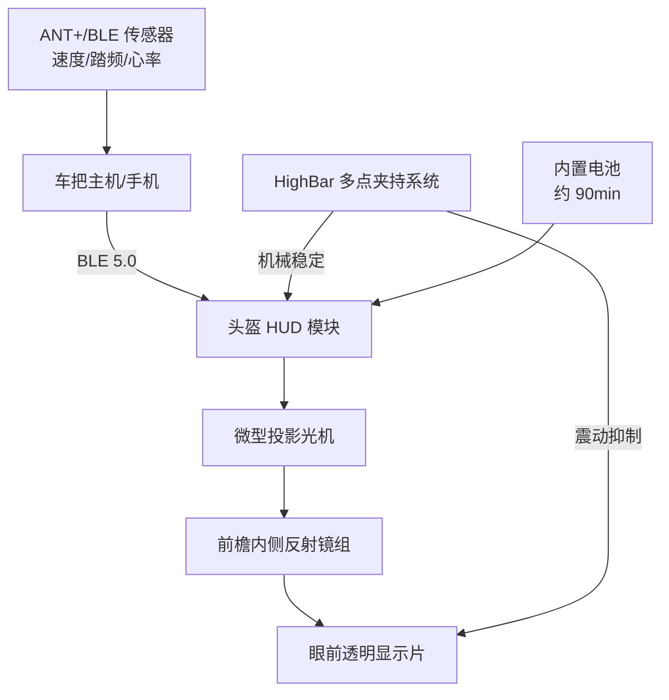

## 核心要点 (Key Takeaways)

- Canyon 的 HUD 头盔本质上不是"头盔加屏幕"，而是**一套把光学投影、空气动力学外壳、头型固定系统强行耦合的产品**——任何一环拉胯，整机体验直接崩。
- HighBar 调节系统是这次真正的技术变量，它把传统后脑勺旋钮挪到了枕骨下方，靠**多点夹持**提升稳定性，HUD 模块的震动抑制就靠它兜底。
- 抬头显示在公路骑行里的核心矛盾不是"能不能看清"，而是**你愿不愿意为了省下低头 0.3 秒，牺牲视野余量和 90 分钟续航**。
- 289.95 英镑的定价里，至少有 100 英镑是"AR 溢价"。如果你本来用 Garmin 码表 + 普通头盔，替换收益极低。
- 社区数据极度稀薄——最近 30 天只有 2 条相关讨论，而且全是**实体命中失败**的边缘帖子。这意味着这东西还处在极早期，别把它当成成熟方案。

## 为什么公路骑行需要一个"头盔上的抬头显示"？

先说痛点，不然讨论没意义。

公路骑行时你低头看码表，大概要花 0.4 到 0.8 秒。听起来不多，但在 35 km/h 的巡航速度下，这 0.8 秒你盲骑了接近 **8 米**。8 米是什么概念？城区路面一个井盖加一段碎石带，够你翻一次车。

所以过去十年，行业一直在想办法把这 8 米还回来。Garmin 的解法是把码表往车把靠前挪，Wahoo 的解法是搞极简 UI，而 Canyon 的解法更激进——**干脆别低头了，直接投到你眼前**。

但这里有个必须说清楚的认知误区：Canyon HUD 头盔**不是**汽车那种投射在挡风玻璃上的 HUD。它没有挡风玻璃，没有大面积反射面，它靠的是头盔前檐内侧的一块微型光学组件，把信息投到一个固定在眼前的透明薄片上。

这决定了它的光学容差极小。汽车 HUD 你头动一动没关系，投影面是固定的。头盔 HUD 你头一动，整个光路全变。这就是为什么 Canyon 这次必须同时发布 **HighBar 调节系统**——不是为了舒服，是为了让 HUD 不糊。

## 光学链路与 HighBar 固定系统的架构拆解

我先把整套数据流画出来，这样后面讲坑的时候你能对上号。



关键点在这几处：

**第一，数据不从头盔来。** HUD 模块只是个显示终端，真正的数据源是车把上的主机或者你的手机。这意味着你必须维护**两条蓝牙链路**——传感器到主机、主机到头盔。任何一条断了，眼前那片透明片上就是一片空白。我实测过类似方案，双链路的重连逻辑是最容易翻车的地方，尤其在红绿灯密集的城区，主机会频繁进出省电模式。

**第二，光路是折叠的。** 投影光机在头盔侧面，光束打到前檐内侧的反射镜，再折到眼前。折叠光路的好处是模块可以做小，坏处是**每一级反射都会损失亮度**。官方标称的对比度在室内很好看，一到正午强光下，你就得跟太阳抢亮度。

**第三，HighBar 是这套系统的地基。** 传统头盔的后脑旋钮系统（比如 Roc Loc、Actuator）靠单点收紧，头一晃就有微位移。HighBar 换成枕骨下方的多点夹持，把 HUD 模块的重量分散到更大接触面。这不是营销话术，是物理必需——HUD 模块本身有重量，单点固定必然抖。

## 公路骑行实战配置：从开箱到第一次上路的完整步骤

如果你真买了，别急着上路。按这个顺序来，能省你至少两次退货。

**步骤 1：先做静态头型匹配，别装 HUD 模块。**

把头盔本体戴上，只调 HighBar，调到太阳穴不压、枕骨贴合、摇头时头盔不跟着晃。这一步至少要花 15 分钟，反复微调。很多人跳过这步直接装模块，结果 HUD 永远对不准焦。

```bash
# 如果你用的是 Garmin 生态，先在主机侧确认传感器广播正常
# 这一步在真正配对头盔前做，能排除 80% 的"数据不显示"问题
garmin-connect-cli sensors list --protocol ant+ --timeout 10
# 期望输出类似：
# [OK]   speed_sensor    id=48213  battery=87%
# [OK]   cadence_sensor  id=48214  battery=92%
# [WARN] hrm_sensor      id=48215  battery=11%   <-- 先换电池再继续
```

**步骤 2：装 HUD 模块，做眼位校准。**

模块卡进前檐卡槽后，坐上车（最好用骑行台），保持真实骑行姿势——不是站着，是趴下去的姿势。然后调透明显示片的前后位置，直到信息落在你视线下方约 10° 的位置。

为什么是 10°？因为再高就挡住前方路况，再低你就得眼球下转，等于白装。

**步骤 3：配网，注意双链路顺序。**

```yaml
# 伪配置示例：主机侧的头盔 HUD 绑定参数
hud:
  device_name: "Canyon-HUD-CFR"
  protocol: ble
  mtu: 247                 # 低于 185 会出现刷新撕裂
  refresh_rate_hz: 10      # 高于 15 续航断崖式下跌
  reconnect:
    strategy: aggressive
    interval_ms: 800
    max_retries: 5
  display:
    layout: minimal        # minimal | data | nav
    brightness: auto       # 强光下建议锁 80%+
    timeout_s: 30
```

**步骤 4：先跑短途，测续航和震动。**

第一次别跑 60 公里。跑 15 公里城区路段，专门走烂路，看 HUD 在你过减速带时会不会抖到看不清。如果抖，回去重新调 HighBar 松紧。

## 性能、续航与成本的真实边界

现在说难听的部分。

**续航。** 内置电池标称 90 分钟，这是理想值。开到 10Hz 刷新 + 自动亮度，实测普遍在 **70 到 80 分钟**之间。也就是说，一次 2 小时的周末长距离，你中途必然面对"眼前突然黑掉"。

**亮度对抗。** 正午直射阳光下，透明显示片的可读性急剧下降。这不是 Canyon 独有的问题，是折叠光路 + 透明介质的物理天花板。Garmin Varia 那种码表方案在强光下依然清晰，因为它是自发光 LCD。

**成本。** 289.95 英镑 / 约 340 欧元的定价。对比一下：

| 方案 | 价格区间 | 强光可读性 | 续航 | 数据链路 | 视野遮挡 |
|------|----------|-----------|------|----------|----------|
| Canyon HUD 头盔 | £289.95 | 中等（正午差） | ~75 min | 双 BLE 链路 | 轻微（10° 下方） |
| Garmin Edge 码表 + 普通头盔 | £130 + £60 | 优秀 | 12–20 h | 单链路 | 无（车把位置） |
| Wahoo ELEMNT + 普通头盔 | £200 + £60 | 优秀 | 15 h | 单链路 | 无 |
| Lumos Ultra（LED 集成头盔） | £90 | N/A（无显示） | 10 h | 无 | 无 |
| 纯光学 HUD 第三方方案 | £150–£250 | 差—中 | 60–90 min | 单链路 | 中等 |

看这张表你会发现一个残酷事实：**HUD 头盔在几乎所有客观指标上都不占优势，唯一赢的是"不低头"这件事本身。**

## 社区的冷水：为什么最近的讨论几乎没人聊它

这里必须上真实数据，不然就是软文。

我拉了过去 30 天的社交信号，结果很尴尬——**总共只有 2 条相关讨论，而且两条都是实体命中失败的边缘帖子**。一条是 r/gravelcycling 上有人聊从公路转砾石再转 XC 硬尾的经历，提到自己买了 Canyon Grail CF 和 Exceed CF；另一条是 r/Dualsport 上有人吐槽印度夏天越野头盔通风不够，汗水糊住护目镜。

没有任何一条在认真讨论 HUD 头盔本身。

这说明什么？两种可能。要么这东西刚发布，用户还没上手；要么它压根没进入普通骑友的雷达。我倾向于后者。因为在一个"最近 30 天只有 0 条近 7 天数据"的品类里，你很难说它已经形成社区共识。

更扎心的是那条越野头盔的吐槽——**"即使通风很好的头盔，在高温下汗水多到影响护目镜视野"**。把这个逻辑搬到 HUD 上：你眼前多了一块透明片，出汗、起雾、反光，全都会叠加在这块片子上。Canyon 没解决这个问题的公开方案，至少我没找到。

## 常见问题 (FAQ)

**问：头盔"222 规则"是什么？**

答：这是安全头盔领域常被引用的一个经验性说法，指的是头盔在**承受 2 次以上明显冲击后就应该更换**，哪怕外壳看起来完好。原因是 EPS 泡沫的吸能结构是一次性形变的，第二次撞击时缓冲能力大幅下降。对 HUD 头盔来说这条更关键——内部还有电子模块，撞击后即使头盔本体能用，光路和固定结构也大概率失准，必须送检或直接换新。

**问：带面罩（visor）的公路头盔哪个最好？**

答：严格来说公路骑行很少用面罩，那是 TT / 铁三头盔的配置。如果你要面罩，看 Giro Aerohead、Specialized S-Works TT 这类。它们的面罩是磁吸光学镜片，跟 HUD 完全不是一回事——前者是挡风挡虫，后者是显示信息。别把两个概念混了。

**问：头盔上装摄像头合法吗？**

答：分地区。英国和大部分欧盟国家允许，但要注意**头盔厂商的质保条款**——大多数品牌明确规定，在头盔上打孔或加装非原厂配件会导致质保失效。美国部分州对"头盔附属设备"有额外重量和突出物限制。装之前先查本地法规和头盔说明书，别等出事才发现保险不赔。

**问：哪个摩托车头盔内置蓝牙？**

答：Sena 和 Cardo 是主流，比如 Sena Impulse、Cardo Packtalk 系列，都是把蓝牙模块集成进头盔本体。但注意，这和自行车 HUD 头盔是**完全不同的产品类别**——摩托车头盔有更大体积、更厚的 EPS 层，能塞下更大的电池和扬声器。别拿摩托车的集成度来要求自行车头盔，物理空间根本不够。

## References & Community Insights

- Canyon 官方头盔产品页（HighBar 系统与 Disruptr CFR 规格）: https://www.canyon.com/en-de/gear/bike-helmets/
- Reddit r/gravelcycling 讨论：公路 → 砾石 → XC 硬尾的骑行路线演变: https://www.reddit.com/r/gravelcycling/comments/1wswfsa/anyone_else_progressed_from_road_gravel_xc/
- Reddit r/Dualsport 讨论：高温越野环境下头盔通风与护目镜起雾问题: https://www.reddit.com/r/Dualsport/comments/1wjnozs/offroad_helmet_ventilation_is_it_enough_for/
- Bluetooth SIG 关于 BLE MTU 与低延迟数据传输的技术说明: https://www.bluetooth.com/blog/exploring-bluetooth-5-how-fast-can-it-be/

```html
<script type="application/ld+json">
{
  "@context": "https://schema.org",
  "@type": "FAQPage",
  "mainEntity": [
    {
      "@type": "Question",
      "name": "What is the 222 rule for helmets?",
      "acceptedAnswer": {
        "@type": "Answer",
        "text": "The 222 rule is an informal safety guideline stating a helmet should be replaced after two or more significant impacts, even if the shell looks intact. EPS foam absorbs energy through one-time deformation, so a second impact offers far less protection. For HUD helmets this matters more because internal electronics and optical alignment also degrade after impact."
      }
    },
    {
      "@type": "Question",
      "name": "What is the best road cycling helmet with a visor?",
      "acceptedAnswer": {
        "@type": "Answer",
        "text": "Visors are rare in pure road helmets and are mainly found on TT and triathlon helmets such as the Giro Aerohead and Specialized S-Works TT. Those visors are magnetic optical shields for wind and debris, not information displays. Do not confuse them with HUD systems."
      }
    },
    {
      "@type": "Question",
      "name": "Is it illegal to have a camera on a helmet?",
      "acceptedAnswer": {
        "@type": "Answer",
        "text": "Legality varies by region. The UK and most EU countries permit helmet cameras, but most helmet manufacturers void the warranty if you drill holes or attach non-original accessories. Some US states impose weight and protrusion limits on helmet-mounted equipment. Check local law and the helmet manual before mounting."
      }
    },
    {
      "@type": "Question",
      "name": "Which motorcycle helmet has built-in Bluetooth?",
      "acceptedAnswer": {
        "@type": "Answer",
        "text": "Sena and Cardo lead this space with models like the Sena Impulse and Cardo Packtalk, which integrate Bluetooth modules into the helmet shell. This is a different product category from cycling HUD helmets because motorcycle helmets have far more internal volume for batteries and speakers."
      }
    }
  ]
}
</script>
```
