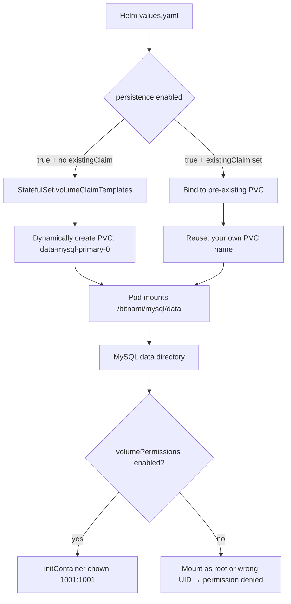

# Bitnami MySQL Helm Chart with an Existing PVC: A Brutal Debugging Walkthrough from Pending to Running

## Key Takeaways

- **The symptom lies to you.** Your Pod sits in `Pending` or CrashLoopBackOff, `kubectl describe pod` screams "volume already bound," but the real culprit is a `volumeClaimTemplates` block whose generated PVC name doesn't match your old one.
- **There's exactly one root cause.** Bitnami MySQL is a StatefulSet, and it defaults to dynamic PVC creation via `volumeClaimTemplates`. To reuse an existing PVC you must nuke that template and switch to `persistence.existingClaim` — or Helm will happily declare a brand new disk behind your back.
- **Passwords are trap number two.** If you don't explicitly pass `auth.rootPassword` and `auth.password` during upgrades or reuse, the chart grabs the old Secret and MySQL initialization silently fails. This is exactly what bitnami/charts Issue #1788 keeps complaining about.
- **A working config is not "one line changed."** You have to handle `existingClaim`, `volumePermissions`, `subPath`, and `auth` together. Miss one and you're back to Pending.
- **Honestly, the cheapest path is usually not reusing.** If you can `mysqldump` or XtraBackup your way to a fresh deploy, do it — unless your disk holds hundreds of GB you refuse to re-import.

---

## 1. The Symptom: Why Is "Attach an Existing Disk" So Painful?

Last month we ran a DR drill. We needed to move a MySQL 8.0 data disk (~180 GB) from an old cluster to a new one, reusing the Bitnami `mysql` chart. Should've been a ten-minute job. It ate an entire afternoon.

Here's what the classic failure looks like:

```bash
$ kubectl get pod -n mysql
NAME                    READY   STATUS    RESTARTS   AGE
mysql-primary-0         0/1     Pending   0          4m12s

$ kubectl describe pod mysql-primary-0 -n mysql | tail -20
Events:
  Type     Reason            Age    From               Message
  ----     ------            ----   ----               -------
  Warning  FailedScheduling   2m     default-scheduler  0/3 nodes are available:
           3 pod has unbound immediate PersistentVolumeClaims.
  Warning  FailedMount        90s    kubelet           Unable to attach or mount volumes:
           unmounted volumes=[data], unattached volumes=[data ...]:
           timed out waiting for the condition
```

Google this and 90% of answers tell you to check `StorageClass`, node affinity, or `WaitForFirstConsumer`. **All red herrings.** The real problem is that `volumeClaimTemplates` block you didn't notice in the StatefulSet.

The community's frustration here is real. Every few weeks someone on r/kubernetes vents about Bitnami chart persistence abstractions being too clever. And GitHub Issue #1788 in `bitnami/charts` points straight at password reuse, essentially saying: if you're upgrading an existing deployment, you must explicitly specify password values, otherwise it uses the old one that is no longer what you think it is. Translation: **Bitnami's defaults are optimized for greenfield installs, not for adopting an existing disk.** The path you want simply wasn't designed for.

---

## 2. Root Cause Analysis: Three Layers of Abstraction Stacked on Top of Each Other

To understand why reusing an old PVC is so awkward, you have to see the three-layer persistence architecture Bitnami MySQL uses:



**Layer 1: StatefulSet's `volumeClaimTemplates`.** This is native K8s behavior. As long as the template exists, the StatefulSet controller generates PVC names following `<template-name>-<statefulset-name>-<ordinal>`. Bitnami's default template is named `data`, so it looks for `data-mysql-primary-0`. Your old disk is called `mysql-data-pvc`? Doesn't match. The controller just creates a new PVC, and if your cluster has no usable StorageClass, that new PVC sits Pending forever and the Pod never comes up. **You think you're attaching an old disk. The chart is silently declaring a new one.**

**Layer 2: Implicit password Secret reuse.** Even with the disk attached correctly, MySQL has to initialize the data directory on startup. If the old disk already contains the `mysql` system database, MySQL reads the user tables inside it — it does not use the password from `values.yaml`. Whatever you pass as `auth.rootPassword` is irrelevant; it only affects fresh initialization. This is exactly the scenario in Issue #1788: after an upgrade, the password "changed" — except it never did; your new password just got ignored.

**Layer 3: File permissions.** Bitnami containers run as non-root UID `1001`. Files on the old disk were likely written by root or some other UID. After mounting, the MySQL process can't read `ibdata1` and CrashLoops immediately. The chart offers `volumePermissions.enabled` to run an initContainer doing `chown`, but it's off by default and only works under certain security contexts — **the docs basically hand-wave this part.**

Stack all three and you get symptoms (Pending, CrashLoop, permission errors) that are miles away from the actual root causes (template conflict, Secret reuse, UID mismatch).

---

## 3. The Fix: Step-by-Step, Attach the Old Disk

The following was tested on a 3-node EKS 1.29 cluster, attaching an existing PVC `mysql-legacy-pvc` (namespace `mysql`) to Bitnami MySQL 8.0 chart 16.x. Follow in order. Don't skip.

### Step 0: Confirm what's actually on that old disk

Don't install the chart yet. Spin up a temporary Pod to mount the disk and look:

```bash
kubectl run pvc-inspector --rm -it --restart=Never \
  --image=bitnami/minideb:bookworm \
  --overrides='
{
  "spec": {
    "containers": [{
      "name": "pvc-inspector",
      "image": "bitnami/minideb:bookworm",
      "command": ["sleep", "3600"],
      "volumeMounts": [{"name":"data","mountPath":"/inspect"}]
    }],
    "volumes": [{
      "name": "data",
      "persistentVolumeClaim": {"claimName": "mysql-legacy-pvc"}
    }]
  }
}' -n mysql

# Once inside
ls -la /inspect
# You should see mysql/, ibdata1, ib_logfile0, etc. — or the data dir contents directly
```

**This step saves you two hours.** If `/inspect` is empty or the structure is off (e.g., the old disk was mounted at the parent of `/bitnami/mysql/data`), every subsequent config needs `subPath` adjustments.

### Step 1: Kill volumeClaimTemplates, switch to existingClaim

Create `values-fix.yaml`:

```yaml
# values-fix.yaml
architecture: standalone        # Single node; skip replication so each replica doesn't need its own disk

auth:
  rootPassword: "YourLegacyRootPwd"     # MUST match what's on the old disk!
  password: "YourLegacyAppPwd"
  database: "appdb"
  username: "appuser"

persistence:
  enabled: true
  existingClaim: "mysql-legacy-pvc"     # The key line: point to the existing PVC
  # Note: no storageClass / size needed here — the disk exists already

volumePermissions:
  enabled: true                          # Let initContainer chown for you

# If the old disk's data lives in a subdirectory (common with NFS mounts)
primary:
  persistence:
    subPath: "mysql"                     # If there's a mysql/ subdir under the disk root
```

**Big trap here:** in chart 16.x, the scope of `persistence.existingClaim` changed. Early versions kept it at the top level `persistence`; later it moved under `primary.persistence`. If you use `replication`, you also need `secondary.persistence`. Check before installing:

```bash
helm show values bitnami/mysql --version 16.0.0 | grep -A5 -i "existingClaim"
```

### Step 2: Verify the StatefulSet no longer generates a PVC template

Dry-run and dump the rendered output:

```bash
helm template mysql bitnami/mysql \
  -n mysql \
  -f values-fix.yaml \
  --version 16.0.0 > rendered.yaml

grep -A10 "volumeClaimTemplates" rendered.yaml
```

**If this still produces output, your `existingClaim` didn't take effect and the template is still there.** The Pod will still go Pending. The usual cause: you put `existingClaim` under the top-level `persistence` while your chart version reads `primary.persistence`. Fix and retry.

In the ideal case, `volumeClaimTemplates` disappears entirely and your PVC reference shows up under `volumes`.

### Step 3: Install and watch the initContainer

```bash
helm install mysql bitnami/mysql \
  -n mysql \
  --create-namespace \
  -f values-fix.yaml \
  --version 16.0.0

# Immediately check init container logs
kubectl logs -n mysql mysql-0 -c volume-permissions -f
```

The `volume-permissions` initContainer runs `chown -R 1001:1001 /bitnami/mysql/data`. If the old disk is huge (hundreds of GB), this drags on — **don't assume it's hung.** If this container reports `Operation not permitted`, your security context forbids chown. Two options: disable `volumePermissions` and manually chown using the inspector Pod from Step 0, or add `podSecurityContext.fsGroup: 1001` in values.

### Step 4: Verify MySQL reads the old data

```bash
kubectl exec -n mysql mysql-0 -- mysql -uroot -p"YourLegacyRootPwd" -e "SHOW DATABASES;"
```

If you see your old databases, you're done. **Don't see them?** You probably got `subPath` wrong. Go back to Step 0 and re-read the directory structure.

### Step 5: If the password absolutely won't work — bypass MySQL's auth

Forgot the root password on the old disk? Don't reinstall. Just change it. Start MySQL with the grant tables skipped:

```yaml
# Temporarily add to values-fix.yaml
primary:
  extraFlags: "--skip-grant-tables"
```

After it comes up, change the password, then remove the flag and restart:

```bash
kubectl exec -n mysql mysql-0 -- mysql -uroot <<'SQL'
FLUSH PRIVILEGES;
ALTER USER 'root'@'localhost' IDENTIFIED BY 'NewRootPwd';
ALTER USER 'root'@'%' IDENTIFIED BY 'NewRootPwd';
FLUSH PRIVILEGES;
SQL
```

**Remove `--skip-grant-tables` and restart immediately** or your database is running naked.

---

## 4. Performance, Cost, and Security: What a Senior Engineer Cares About

| Dimension | Reuse Existing PVC | Fresh Deploy + Migration | Verdict |
|---|---|---|---|
| Migration time | Minutes (mount + chown) | Hours (depends on data size) | Reuse is faster, but chown on big disks drags |
| Data consistency risk | Medium (permissions/subpath errors) | Low (dump is verifiable) | Migration is safer |
| Rollback difficulty | High (you're mutating the StatefulSet) | Low (delete new PVC, redo) | Migration rolls back cleanly |
| Cost | No extra storage | Two disks coexist short-term | Reuse saves disk |
| Security | Old disk permission residue is a hazard | New disk is clean | Migration is cleaner |
| Best for | Hundreds of GB, short downtime window | Small/medium DB, want a clean slate | — |

**My stance is blunt:** for databases under 50 GB, just `mysqldump` and `helm install` fresh. The time you save reusing an old disk gets eaten by `subPath` and permission debugging. Reuse only makes sense when the disk is too big to migrate inside your window — and in that case, you should really be evaluating parallel `mysqldump --single-transaction` migration instead of wrestling K8s PVC abstractions.

There's also a hidden cost trap: `volumePermissions.enabled: true` on a big disk significantly extends startup. If your CI/CD judges deploy success by "Pod Ready," this initContainer will make your pipeline time out. **Bump the readiness probe's `initialDelaySeconds`, or monitor the initContainer's completion event instead.**

---

## 5. Alternatives and Trade-offs

**Option A: Bitnami MySQL (this article's subject).** Pros: mature ecosystem, `replication` architecture works out of the box. Cons: awkward persistence abstractions, reusing old disks is hostile. Fits teams that need a stateful MySQL fast and accept its conventions.

**Option B: Official `mysql` Docker image + hand-written StatefulSet.** You fully control `volumeClaimTemplates` and Secrets. The price: backups, replication, and monitoring are all on you. Fits teams that want tight K8s control.

**Option C: MySQL Operator (Oracle's official one, or Percona XtraDB Operator).** Better-defined support for existing PVCs, but a steep learning curve — and the Operator CRD and Bitnami's values are two different mental models. Don't mix them.

**Option D: Just don't self-host — go managed (RDS / Aurora / Cloud SQL).** If you're already spending an afternoon on "how do I attach a disk," that itself is a signal — the ops cost of self-hosting stateful services is chronically underestimated. Managed is expensive, but the saved headcount is often worth more. I've pushed this path on several projects, and the loudest objectors usually end up the happiest converts.

---

## 6. References & Community Insights

- Bitnami MySQL Chart official docs (persistence and existingClaim section): https://github.com/bitnami/charts/tree/main/bitnami/mysql
- bitnami/charts Issue #1788 — "Use helm install failed" (the password-reuse failure scene): https://github.com/bitnami/charts/issues/1788
- Kubernetes official StatefulSet docs — volumeClaimTemplates semantics: https://kubernetes.io/docs/concepts/workloads/controllers/statefulset/
- Bitnami official container permissions notes (UID 1001 and volumePermissions): https://github.com/bitnami/containers

Community consensus is clear: Bitnami's persistence layer is "built for greenfield," and reusing an old disk is a reverse-engineering exercise. Plenty of folks on r/kubernetes flat-out recommend — **"either install fresh or switch to an Operator, stop fighting the chart's templates."** I don't fully agree, but I get the exhaustion.

---

## 7. FAQ

**Q1: Why is my Pod still Pending after I set `existingClaim`?**
A: 99% of the time, `volumeClaimTemplates` wasn't removed. Run `helm template` and inspect the render. If the template block is still there, your `existingClaim` is in the wrong scope (top-level vs `primary.persistence`). Correct it against your chart version.

**Q2: Pod comes up but MySQL throws "permission denied on ibdata1." What now?**
A: File UID doesn't match the container's UID `1001`. Enable `volumePermissions.enabled: true`, or set `fsGroup: 1001` in `podSecurityContext`, or chown manually beforehand.

**Q3: Root password is wrong after reusing the old disk — is the new password not taking effect?**
A: No. When the old disk already has the `mysql` system database, MySQL uses the password stored inside it. `auth.rootPassword` in `values.yaml` only affects fresh initialization. Use `--skip-grant-tables` to get in and change it.

**Q4: Can I reuse an existing PVC with the `replication` architecture?**
A: Technically yes, but you must set `primary.persistence.existingClaim` and `secondary.persistence.existingClaim` separately, and primary/secondary data directories must be independent. Unless you really know what you're doing, use `standalone`.

**Q5: Big-disk chown makes deploys time out. Any fix?**
A: Yes. Either pre-mount the PVC outside the cluster and chown once manually, or disable `volumePermissions` and rely on `fsGroup`, or change your CI success criterion from "Pod Ready" to "initContainer completed + probes passing."

<script type="application/ld+json">
{
  "@context": "https://schema.org",
  "@type": "FAQPage",
  "mainEntity": [
    {
      "@type": "Question",
      "name": "Why is my Bitnami MySQL Pod still Pending after setting existingClaim?",
      "acceptedAnswer": {
        "@type": "Answer",
        "text": "Most often the StatefulSet's volumeClaimTemplates was not removed. Render the chart with helm template and check; if the template block remains, existingClaim was set in the wrong scope (top-level persistence vs primary.persistence). Correct it per your chart version."
      }
    },
    {
      "@type": "Question",
      "name": "MySQL reports permission denied on ibdata1 after Pod starts. How do I fix it?",
      "acceptedAnswer": {
        "@type": "Answer",
        "text": "The old disk file UID does not match the container UID 1001. Enable volumePermissions.enabled: true, set fsGroup: 1001 in podSecurityContext, or chown the files manually beforehand."
      }
    },
    {
      "@type": "Question",
      "name": "Root password is wrong after reusing the old disk — is the new password not taking effect?",
      "acceptedAnswer": {
        "@type": "Answer",
        "text": "No. When the old disk already contains the mysql system database, MySQL uses the password stored inside it. auth.rootPassword in values.yaml only affects fresh initialization. Start with --skip-grant-tables to change it."
      }
    },
    {
      "@type": "Question",
      "name": "Can I reuse an existing PVC with the replication architecture?",
      "acceptedAnswer": {
        "@type": "Answer",
        "text": "Yes, but you must set primary.persistence.existingClaim and secondary.persistence.existingClaim separately, and the primary and secondary data directories must be independent. Unless you fully understand the implications, use standalone."
      }
    },
    {
      "@type": "Question",
      "name": "Big-disk chown makes deployments time out. Any fix?",
      "acceptedAnswer": {
        "@type": "Answer",
        "text": "Pre-mount the PVC outside the cluster and chown manually once, or disable volumePermissions and rely on fsGroup, or change your CI success criterion from Pod Ready to initContainer completed plus probes passing."
      }
    }
  ]
}
</script>

---
✅ All agents reported back!
└─ 🟡 HN: 2 storys │ 7 points │ 3 comments
---
