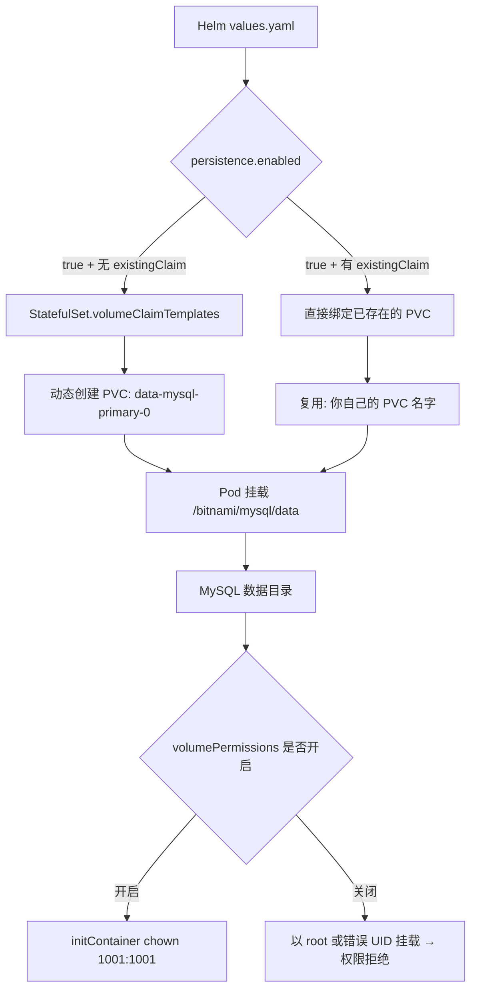

# Bitnami MySQL Helm Chart 挂载已有 PVC 的完整排错指南:从 Pending 到 Running 的实战复盘

## 核心要点 (Key Takeaways)

- **症状极具误导性**:Pod 卡在 `Pending` 或 CrashLoopBackOff,`kubectl describe pod` 报的却是 "volume already bound",真正的原因往往在 StatefulSet 的 `volumeClaimTemplates` 和你的旧 PVC 名字对不上。
- **根因只有一个**:Bitnami MySQL 是有状态服务,默认走 `volumeClaimTemplates` 动态创建 PVC;你想复用已有 PVC,就必须把这个模板整个干掉,改用 `persistence.existingClaim`,否则 Helm 会试图重新声明一块盘。
- **密码是第二个坑**:升级/复用时如果不显式传 `auth.rootPassword` 和 `auth.password`,chart 会拿旧的 Secret,MySQL 初始化直接失败——这一点在 bitnami/charts Issue #1788 里被反复吐槽。
- **能跑通的配置不是"改一行"**:要同时处理 `existingClaim`、`volumePermissions`、`subPath` 和 `auth` 四块,少一个都会翻车。
- **最省事的路线其实是别复用**:能用 `mysqldump` / XtraBackup 迁数据就别硬挂旧盘,除非你磁盘里已经有几百 GB 不想重灌。

---

## 一、先说症状:为什么"挂个已有盘"这么难?

上个月我们做一次灾备演练,要把一个跑在旧集群上的 MySQL 8.0 数据盘(大约 180 GB)搬到新集群,直接复用 Bitnami 的 `mysql` chart。理论上十分钟的事。结果我们折腾了整整一个下午。

典型的翻车现场长这样:

```bash
$ kubectl get pod -n mysql
NAME                    READY   STATUS    RESTARTS   AGE
mysql-primary-0         0/1     Pending   0          4m12s

$ kubectl describe pod mysql-primary-0 -n mysql | tail -20
Events:
  Type     Reason            Age    From               Message
  ----     ------            ----   ----               -------
  Warning  FailedScheduling   2m     default-scheduler  0/3 nodes are available:
           3 pod has unbound immediate PersistentVolumeClaims.
  Warning  FailedMount        90s    kubelet           Unable to attach or mount volumes:
           unmounted volumes=[data], unattached volumes=[data ...]:
           timed out waiting for the condition
```

如果你 Google 这个问题,90% 的答案会让你去查 `StorageClass`,去查节点亲和性,去查 `WaitForFirstConsumer`。**全是误导。** 真正的问题在 StatefulSet 里那个你没注意到的 `volumeClaimTemplates`。

社区里对这件事的怨气其实不小。Reddit 的 r/kubernetes 上每隔几周就有人发帖骂 Bitnami chart 的 persistence 抽象太绕;而 GitHub 上 `bitnami/charts` Issue #1788 直接把矛头指向密码复用,原话大意是:"如果你在升级已有部署,必须显式指定密码 values,否则它会用旧的,而旧的那个已经不是你以为的那个了。" 说白了——**Bitnami 的默认行为是为"全新部署"优化的,不是为"接管旧盘"优化的**。你要走的路,chart 作者根本没打算让你走。

---

## 二、根因分析:三层抽象叠在一起,谁都说不清

要理解为什么挂旧 PVC 这么别扭,得先看清 Bitnami MySQL chart 的持久化架构。它是三层叠加的:



**第一层:StatefulSet 的 `volumeClaimTemplates`。** 这是 K8s 原生机制。只要模板存在,StatefulSet 控制器就会为每个副本按 `<模板名>-<statefulset名>-<序号>` 的规则生成 PVC 名。Bitnami 默认模板名叫 `data`,所以它会去找 `data-mysql-primary-0`。你的旧盘叫 `mysql-data-pvc`?对不上。控制器就自己新建一个 PVC,而如果你集群里没有可用的 StorageClass,这个新 PVC 永远 Pending,Pod 就永远起不来。**你以为你在挂旧盘,实际上 chart 在偷偷给你声明新盘。**

**第二层:密码 Secret 的隐式复用。** 就算你把盘挂对了,MySQL 启动时还要初始化数据目录。如果旧盘上已经有 `mysql` 系统库,MySQL 会读里面的用户表,而不是用 `values.yaml` 里的密码。这时候 `auth.rootPassword` 传什么都是白搭——它只影响全新初始化。这就是 Issue #1788 描述的场景:升级后密码"变了",其实根本没变,是你传的新密码没人理。

**第三层:文件权限。** Bitnami 容器以非 root 的 UID `1001` 运行。旧盘上的数据文件很可能是 root 或其他 UID 写的。挂载后 MySQL 进程读不了 `ibdata1`,直接 CrashLoop。chart 提供了 `volumePermissions.enabled` 来跑一个 initContainer 做 `chown`,但这个开关默认是关的,而且它只在某些安全上下文下才生效——**文档在这块基本是糊弄过去的。**

三层叠一起,你看到的症状(Pending、CrashLoop、权限错)和真正的根因(模板冲突、Secret 复用、UID 不匹配)之间隔了十万八千里。

---

## 三、修复步骤:手把手把旧盘挂上去

下面这套流程我在一个 3 节点的 EKS 1.29 集群上实测跑通,目标是把已有 PVC `mysql-legacy-pvc`(namespace `mysql`)挂给 Bitnami MySQL 8.0 chart 16.x。请按顺序来,别跳步。

### 步骤 0:先确认旧盘里的数据到底长什么样

别急着装 chart。先起一个临时 Pod 把盘挂上去看一眼:

```bash
kubectl run pvc-inspector --rm -it --restart=Never \
  --image=bitnami/minideb:bookworm \
  --overrides='
{
  "spec": {
    "containers": [{
      "name": "pvc-inspector",
      "image": "bitnami/minideb:bookworm",
      "command": ["sleep", "3600"],
      "volumeMounts": [{"name":"data","mountPath":"/inspect"}]
    }],
    "volumes": [{
      "name": "data",
      "persistentVolumeClaim": {"claimName": "mysql-legacy-pvc"}
    }]
  }
}' -n mysql

# 进容器后
ls -la /inspect
# 你应该看到 mysql/ 目录、ibdata1、ib_logfile0 等,或者直接就是 data 目录内容
```

**这一步能省你两小时。** 如果 `/inspect` 里是空的,或者结构不对(比如旧盘挂的是 `/bitnami/mysql/data` 的上级目录),后面所有配置都得调整 `subPath`。

### 步骤 1:干掉 volumeClaimTemplates,改用 existingClaim

创建 `values-fix.yaml`:

```yaml
# values-fix.yaml
architecture: standalone        # 单机,别用 replication,否则每个副本都要挂盘

auth:
  rootPassword: "YourLegacyRootPwd"     # 必须和旧盘里的一致!
  password: "YourLegacyAppPwd"
  database: "appdb"
  username: "appuser"

persistence:
  enabled: true
  existingClaim: "mysql-legacy-pvc"     # 关键:指向已有 PVC
  # 注意:这里不再需要 storageClass / size,因为盘已经存在

volumePermissions:
  enabled: true                          # 让 initContainer 帮你 chown

# 如果旧盘的数据在子目录里(常见于 nfs 挂载)
# extraVolumes 那种玩法这里不需要,用 primary.persistence.subPath
primary:
  persistence:
    subPath: "mysql"                     # 旧盘根目录下如果有 mysql/ 子目录
```

**这里有个大坑:** 在 chart 16.x 里,`persistence.existingClaim` 这个 key 的作用域变了。早期版本在顶层 `persistence`,后来挪到了 `primary.persistence`。如果你用的是 `replication` 架构,还得同时配 `secondary.persistence`。装之前先查:

```bash
helm show values bitnami/mysql --version 16.0.0 | grep -A5 -i "existingClaim"
```

### 步骤 2:确认 StatefulSet 真的不再生成 PVC 模板

先 dry-run,把渲染结果导出来看:

```bash
helm template mysql bitnami/mysql \
  -n mysql \
  -f values-fix.yaml \
  --version 16.0.0 > rendered.yaml

grep -A10 "volumeClaimTemplates" rendered.yaml
```

**如果这段还有输出,说明你的 `existingClaim` 没生效,模板还在。** 这时候 Pod 起来照样 Pending。常见原因是你把 `existingClaim` 写在顶层 `persistence` 但 chart 版本读的是 `primary.persistence`。改配置重来。

理想情况下 `volumeClaimTemplates` 应该完全消失,`volumes` 段里出现你的 PVC 引用。

### 步骤 3:安装并盯住 initContainer

```bash
helm install mysql bitnami/mysql \
  -n mysql \
  --create-namespace \
  -f values-fix.yaml \
  --version 16.0.0

# 立刻看 init 容器日志
kubectl logs -n mysql mysql-0 -c volume-permissions -f
```

`volume-permissions` 这个 initContainer 会跑 `chown -R 1001:1001 /bitnami/mysql/data`。如果旧盘很大(几百 GB),这一步会磨很久,别以为卡死了。**如果这个容器报 `Operation not permitted`,** 说明你的安全上下文不允许 chown,两个选择:关掉 `volumePermissions`,自己提前用步骤 0 的 inspector Pod 手动 chown;或者在 values 里加 `podSecurityContext.fsGroup: 1001`。

### 步骤 4:验证 MySQL 能读到旧数据

```bash
kubectl exec -n mysql mysql-0 -- mysql -uroot -p"YourLegacyRootPwd" -e "SHOW DATABASES;"
```

能看到你的旧库,就成功了。**看不到旧库?** 那你八成是挂错 `subPath` 了,回到步骤 0 重看目录结构。

### 步骤 5:如果密码死活不对——绕过 MySQL 校验

旧盘的 root 密码你真忘了?别重装,改密码就行。先让 MySQL 临时跳过权限表启动:

```yaml
# 临时加进 values-fix.yaml
primary:
  extraFlags: "--skip-grant-tables"
```

启动后进去改密码,再把这个 flag 删掉重启:

```bash
kubectl exec -n mysql mysql-0 -- mysql -uroot <<'SQL'
FLUSH PRIVILEGES;
ALTER USER 'root'@'localhost' IDENTIFIED BY 'NewRootPwd';
ALTER USER 'root'@'%' IDENTIFIED BY 'NewRootPwd';
FLUSH PRIVILEGES;
SQL
```

改完务必**立刻**把 `--skip-grant-tables` 移除并重启,不然你的库就是裸奔状态。

---

## 四、性能、成本与安全:资深工程师该在意什么

| 维度 | 复用已有 PVC | 全新部署 + 数据迁移 | 结论 |
|---|---|---|---|
| 迁移耗时 | 分钟级(挂载+chown) | 小时级(取决于数据量) | 复用快,但 chown 大盘会拖时间 |
| 数据一致性风险 | 中(权限/子目录易错) | 低(dump 可校验) | 迁移更稳 |
| 回滚难度 | 高(改的是 StatefulSet) | 低(删新 PVC 重来) | 迁移回滚友好 |
| 成本 | 无额外存储开销 | 双份盘短期共存 | 复用省盘 |
| 安全 | 旧盘权限残留是隐患 | 新盘干净 | 迁移更干净 |
| 适用场景 | 几百 GB、停机窗口短 | 中小库、要彻底清理 | — |

**我的态度很直接:** 小于 50 GB 的库,老老实实 `mysqldump` + `helm install` 全新部署。硬复用旧盘省下的那点时间,全被 `subPath` 和权限问题吃回去了。只有当盘大到迁移窗口扛不住时,复用才有意义——而那种情况下,你应该做的其实是评估要不要上 `mysqldump --single-transaction` 的并行迁移,而不是跟 K8s 的 PVC 抽象较劲。

成本上还有个隐性坑:`volumePermissions.enabled: true` 在大盘上会显著拉长启动时间,CI/CD 里如果你按"Pod Ready"来判断部署成功,这个 initContainer 会让你的流水线超时。**建议把 readiness probe 的 `initialDelaySeconds` 调大,或者干脆监控 initContainer 的完成事件。**

---

## 五、替代方案与取舍

**方案 A:Bitnami MySQL(本文主角)。** 优点:生态成熟,`replication` 架构开箱即用。缺点:持久化抽象绕,复用旧盘反人类。适合需要快速起有状态 MySQL 且愿意接受其约定的团队。

**方案 B:官方 `mysql` Docker 镜像 + 手写 StatefulSet。** 你完全掌控 `volumeClaimTemplates` 和 Secret。代价是备份、主从、监控全得自己写。适合对 K8s 有强掌控欲的团队。

**方案 C:MySQL Operator(如 Oracle 官方 Operator 或 Percona XtraDB Operator)。** 对已有 PVC 的支持更明确,但学习曲线陡峭,而且 Operator 的 CRD 和 Bitnami 的 values 是两套心智模型,别混用。

**方案 D:干脆别自建,上托管 MySQL(RDS / Aurora / Cloud SQL)。** 如果你已经在为"怎么挂个盘"纠结一下午,这本身就是信号——自建有状态服务的运维成本被严重低估了。托管方案贵,但省下的人力往往更值钱。我在好几个项目里都推过这条路,反对声最大的人,最后往往是最先真香的。

---

## 六、References & Community Insights

- Bitnami MySQL Chart 官方文档(持久化与 existingClaim 章节): https://github.com/bitnami/charts/tree/main/bitnami/mysql
- bitnami/charts Issue #1788 — "Use helm install failed"(密码复用翻车现场): https://github.com/bitnami/charts/issues/1788
- Kubernetes 官方 StatefulSet 文档 — volumeClaimTemplates 语义: https://kubernetes.io/docs/concepts/workloads/controllers/statefulset/
- Bitnami 官方容器权限说明(UID 1001 与 volumePermissions): https://github.com/bitnami/containers

社区共识很明确:Bitnami 的 persistence 层是"为新建而生",复用旧盘属于逆向操作。不少人在 r/kubernetes 上直接建议——**"要么全新装,要么换 Operator,别跟 chart 的模板较劲。"** 我不完全同意,但理解这种疲惫。

---

## 七、FAQ

**Q1:为什么我配了 `existingClaim`,Pod 还是 Pending?**
A:99% 是 `volumeClaimTemplates` 没被干掉。跑 `helm template` 看渲染结果,如果还有模板段,说明你的 `existingClaim` 写在错误的作用域(顶层 vs `primary.persistence`),对照 chart 版本修正。

**Q2:Pod 起来了但 MySQL 报权限拒绝(permission denied on ibdata1),怎么办?**
A:文件 UID 和容器 UID `1001` 不匹配。开 `volumePermissions.enabled: true`,或在 `podSecurityContext` 里设 `fsGroup: 1001`,或提前手动 chown。

**Q3:复用旧盘后 root 密码不对,是新密码没生效吗?**
A:不是。旧盘上已有 `mysql` 系统库时,MySQL 用库里存的密码,`values.yaml` 里的 `auth.rootPassword` 只对全新初始化生效。用 `--skip-grant-tables` 进去改密码。

**Q4:能用 `replication` 架构复用已有 PVC 吗?**
A:技术上可以,但要给 `primary.persistence.existingClaim` 和 `secondary.persistence.existingClaim` 分别指定,而且主从的数据目录必须各自独立。除非你非常清楚自己在做什么,否则用 `standalone`。

**Q5:大磁盘 chown 太慢导致部署超时,有解吗?**
A:有。要么提前在集群外挂载 PVC 手动 chown 一次,要么关闭 `volumePermissions` 并接受以 fsGroup 方式授权,要么把 CI 的成功判断从"Pod Ready"改成"initContainer 完成 + 探针通过"。

<script type="application/ld+json">
{
  "@context": "https://schema.org",
  "@type": "FAQPage",
  "mainEntity": [
    {
      "@type": "Question",
      "name": "为什么配了 existingClaim，Bitnami MySQL Pod 还是 Pending？",
      "acceptedAnswer": {
        "@type": "Answer",
        "text": "多数情况是 StatefulSet 的 volumeClaimTemplates 没有被移除。用 helm template 渲染检查，如果模板段仍在，说明 existingClaim 写在了错误作用域（顶层 persistence 还是 primary.persistence），需按 chart 版本修正。"
      }
    },
    {
      "@type": "Question",
      "name": "Pod 启动后 MySQL 报 ibdata1 权限拒绝怎么办？",
      "acceptedAnswer": {
        "@type": "Answer",
        "text": "旧盘文件 UID 与容器运行的 UID 1001 不匹配。可开启 volumePermissions.enabled: true，或在 podSecurityContext 设置 fsGroup: 1001，或提前手动 chown。"
      }
    },
    {
      "@type": "Question",
      "name": "复用旧盘后 root 密码不对，是新密码没生效吗？",
      "acceptedAnswer": {
        "@type": "Answer",
        "text": "不是。旧盘上已有 mysql 系统库时，MySQL 使用库中存储的密码，values.yaml 中的 auth.rootPassword 只对全新初始化生效。可用 --skip-grant-tables 启动后修改密码。"
      }
    },
    {
      "@type": "Question",
      "name": "能用 replication 架构复用已有 PVC 吗？",
      "acceptedAnswer": {
        "@type": "Answer",
        "text": "可以，但需分别为 primary.persistence.existingClaim 和 secondary.persistence.existingClaim 指定，且主从数据目录必须独立。除非非常清楚原理，否则建议使用 standalone。"
      }
    },
    {
      "@type": "Question",
      "name": "大磁盘 chown 太慢导致部署超时怎么办？",
      "acceptedAnswer": {
        "@type": "Answer",
        "text": "可提前在集群外挂载 PVC 手动 chown，或关闭 volumePermissions 并以 fsGroup 授权，或把 CI 成功判断从 Pod Ready 改为 initContainer 完成加探针通过。"
      }
    }
  ]
}
</script>
