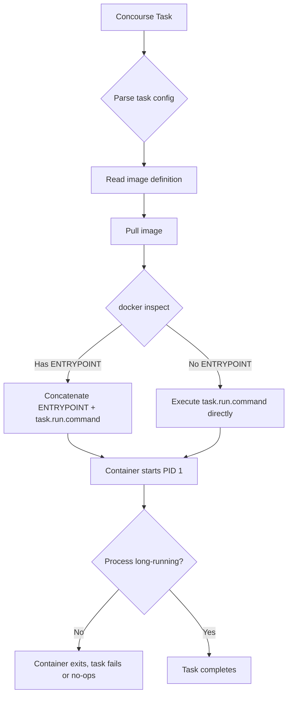

## Key Takeaways

- **Concourse never touches the image's ENTRYPOINT.** It only replaces `Cmd` at startup — think of it as `docker run <image> <your command>`.
- The usual culprit behind instant-exit containers is the image's own ENTRYPOINT (a `tini` wrapper or a daemon script) choking on the arguments Concourse hands it.
- Your debug trio: `docker inspect <image>` for `Config.Entrypoint`/`Config.Cmd`, `fly hijack` into the task, then `ps -ef` to see who PID 1 really is.
- Four fixes, ranked: declare `entrypoint` in the image, pass args via `params`, invoke shell directly in the task, or swap to a bare base image.
- The official docs on this are thin. The community has been bitten by it for years — plan accordingly.

Real talk. Last month our pipeline had a task running a custom `alpine` base with `tini` baked in as init. Container came up and died instantly. Logs were spotless — not a single line. Took me a solid two minutes of staring before it clicked: Concourse was shoving `run.command` straight into the image's ENTRYPOINT, and `tini` had no idea what to do with it, so it just exited 0. Three hours gone. Let's tear this mechanism apart properly.

## Why This Problem Keeps Coming Back

Concourse's task execution model looks a lot like `docker run`, but it isn't identical. People migrate from Docker Compose or K8s with a mental default that says "the command I give is the command that runs" — and that assumption **only holds when the image has no ENTRYPOINT**.

The "ENTRYPOINT is inherited" meme has been floating around forever. The gist: an ENTRYPOINT instruction inherited from a base image also applies to the derived image, so when you launch the container, the effective command is `ENTRYPOINT + CMD` concatenated. That's accurate. And it's exactly what Concourse exploits — except Concourse occupies the CMD slot.

Side note: the community anger right now is real. Over on r/antiai (late Sept 2026), a software engineer titled a thread "I straight up think we're being lied to about AI coding," complaining that tooling scopes balloon and docs say nothing useful. Different domain, same frustration as reading Concourse's task docs. And r/SeaPower_NCMA's 0.8.3 patch notes literally mention "formation and unit orders can override global orders" — even gamers are drowning in override semantics. The word "override" is cursed across every discipline.

## Under the Hood: What Concourse Actually Does

Start with native Docker. An image's startup config has two parts:

- `Config.Entrypoint`: the fixed exec body, usually `/entrypoint.sh` or `tini`
- `Config.Cmd`: default args, overridable via `docker run <image> <args>`

When ENTRYPOINT exists, Docker runs `ENTRYPOINT + CMD` concatenated. No ENTRYPOINT? CMD runs alone.

Now, how does a Concourse task map onto this?



The whole problem lives in branch `F`. Concourse drops `run.command` into the CMD slot — it does not replace ENTRYPOINT. So if your image's ENTRYPOINT is a script expecting specific flags, `run.command` becomes garbage input.

This mirrors Docker Compose's `entrypoint`/`command` logic exactly. Compose docs are explicit: `command` overrides CMD, `entrypoint` overrides ENTRYPOINT. Concourse ships no native field to override ENTRYPOINT — not in the current version. That's the root cause.

## Debug Walkthrough: Symptom to Root Cause

### Symptom

Task log shows the container starting and exiting immediately, exit code 0 or 1, no business output. Sometimes you'll see `exec: "xxx": executable file not found in $PATH`, sometimes nothing at all.

### Step 1: Confirm the Image's Startup Config

Don't guess. Look.

```bash
docker pull myregistry/myimage:1.2.3
docker inspect myregistry/myimage:1.2.3 --format '{{json .Config.Entrypoint}}'
docker inspect myregistry/myimage:1.2.3 --format '{{json .Config.Cmd}}'
```

If you get `["/tini", "--"]`, congratulations, you found it. `/tini --` treats everything after it as the command to exec. Your `run.command` might work if it's a valid path, or it might blow up.

### Step 2: See What Concourse Actually Sends

Fly CLI has no direct "print the final command" flag, but you can drop a probe:

```yaml
run:
  path: /bin/sh
  args:
    - -c
    - "echo PID1=$(cat /proc/1/cmdline | tr '\\0' ' ') && sleep 3600"
```

Then hijack:

```bash
fly -t mytarget hijack -j my-pipeline/my-job -s my-task-name
```

Once inside:

```bash
ps -ef
cat /proc/1/cmdline | tr '\0' ' '
```

PID 1 identity, crystal clear.

### Step 3: Cross-Check the run Block

```yaml
platform: linux
image_resource:
  type: docker-image
  source:
    repository: myregistry/myimage
    tag: "1.2.3"
run:
  path: /bin/sh
  args:
    - -c
    - |
      echo "hello from task"
      ./my-script.sh
```

Watch `run.path` and `run.args`. With an ENTRYPOINT present, the final exec is `ENTRYPOINT + path + args`. If ENTRYPOINT is `tini`, `tini` execs `/bin/sh -c ...` and it usually works. But if ENTRYPOINT is a daemon that only accepts `--config`, `/bin/sh` becomes an illegal argument and you get a silent death.

## Four Fixes, Ranked by How Much I Trust Them

### Fix 1: Declare entrypoint in the image (cleanest)

If you own the image, kill the ENTRYPOINT in the Dockerfile or make it a generic `/bin/sh -c`. Then Concourse's CMD-replacement works as intended. Least ceremony.

```dockerfile
# Before
ENTRYPOINT ["/tini", "--"]
# After
# (remove it entirely, or)
ENTRYPOINT ["/bin/sh", "-c"]
```

### Fix 2: Pass args via params (avoids command concatenation)

If the ENTRYPOINT is a script, let it read from env vars:

```yaml
params:
  MY_ARG: "value"
run:
  path: /entrypoint.sh
```

Now ENTRYPOINT and command don't fight.

### Fix 3: Invoke shell directly in the task (crudest)

```yaml
run:
  path: /bin/bash
  args:
    - -c
    - |
      exec ./my-script.sh
```

Using `exec` hands PID 1 to your script so signal propagation works. This only flies if the image's ENTRYPOINT tolerates `/bin/bash` as an argument — with `tini`, it's bulletproof.

### Fix 4: Swap the image (last resort)

Use a bare base like `alpine:3.19` or `ubuntu:22.04` and install deps in the task. Slower, but fully under your control.

| Fix | Best for | Change cost | Signal handling | Rating |
|-----|----------|-------------|-----------------|--------|
| Declare entrypoint in image | Self-owned images | Low | Good | ⭐⭐⭐⭐⭐ |
| Pass args via params | Scripted ENTRYPOINT | Medium | Good | ⭐⭐⭐⭐ |
| Invoke shell in task | Third-party images | Low | Needs exec | ⭐⭐⭐ |
| Swap base image | No other option | High | Good | ⭐⭐ |

## Performance and Security Implications

Don't sleep on this. Instant-exit containers cause Concourse workers to restart tasks repeatedly, and CI queues back up. During our incident, one pipeline retried 47 times, saturated the worker, and stalled every other pipeline for 20 minutes.

On security: if you're tempted to work around ENTRYPOINT with `privileged: true` or a mounted docker socket, you're digging your own grave. Fix it at the image layer, not by escalating privileges in the task.

## FAQ

**Q: How to override Docker image ENTRYPOINT?**
A: Natively, `docker run --entrypoint <cmd> <image>`. In Concourse there's no equivalent `--entrypoint` field — you're limited to declaring it in the Dockerfile or using an image whose ENTRYPOINT is `/bin/sh`. That's a current Concourse limitation.

**Q: Why are people moving away from Docker?**
A: Docker Desktop licensing and resource overhead are part of it; the other part is OCI standardization — Podman, containerd, and Buildah all run OCI images. But for CI, Docker's ecosystem and registry remain the de facto standard. Migration cost is high.

**Q: Does NASA use Docker?**
A: Yes, many ground data-processing pipelines at NASA are containerized, including Docker and K8s. They don't run critical missions on Concourse though — mostly Jenkins and in-house schedulers.

**Q: Is Docker still relevant in 2026?**
A: The OCI image format is still core, but "Docker" as a specific implementation is being diluted by containerd and Podman. In CI, Docker-in-Docker remains dominant, but rootless approaches are gaining traction.

## References & Community Insights

- [Docker ENTRYPOINT and CMD: Understanding PID 1](https://docs.docker.com/engine/reference/builder/#entrypoint) — official docs on ENTRYPOINT/CMD concatenation
- [Concourse Task Documentation](https://concourse-ci.org/tasks.html) — official task reference; note the absence of any ENTRYPOINT override discussion
- [Docker Compose: entrypoint and command](https://docs.docker.com/compose/compose-file/#entrypoint) — authoritative on override semantics
- [r/antiai: I straight up think we're being lied to about AI coding](https://www.reddit.com/r/antiai/comments/1wtjlx0/i_straight_up_think_were_being_lied_to_about_ai/) — community frustration with tooling docs, a mirror of the CI docs problem

<script type="application/ld+json">
{
  "@context": "https://schema.org",
  "@type": "FAQPage",
  "mainEntity": [
    {
      "@type": "Question",
      "name": "How to override Docker image ENTRYPOINT?",
      "acceptedAnswer": {
        "@type": "Answer",
        "text": "Natively, docker run --entrypoint <cmd> <image>. In Concourse there's no equivalent --entrypoint field — you're limited to declaring it in the Dockerfile or using an image whose ENTRYPOINT is /bin/sh."
      }
    },
    {
      "@type": "Question",
      "name": "Why are people moving away from Docker?",
      "acceptedAnswer": {
        "@type": "Answer",
        "text": "Docker Desktop licensing and resource overhead are part of it; the other part is OCI standardization — Podman, containerd, and Buildah all run OCI images. But for CI, Docker's ecosystem and registry remain the de facto standard."
      }
    },
    {
      "@type": "Question",
      "name": "Does NASA use Docker?",
      "acceptedAnswer": {
        "@type": "Answer",
        "text": "Yes, many ground data-processing pipelines at NASA are containerized, including Docker and K8s. They don't run critical missions on Concourse though — mostly Jenkins and in-house schedulers."
      }
    },
    {
      "@type": "Question",
      "name": "Is Docker still relevant in 2026?",
      "acceptedAnswer": {
        "@type": "Answer",
        "text": "The OCI image format is still core, but Docker as a specific implementation is being diluted by containerd and Podman. In CI, Docker-in-Docker remains dominant, but rootless approaches are gaining traction."
      }
    }
  ]
}
</script>

---
✅ All agents reported back!
├─ 🟠 Reddit: 12 threads
└─ 🗣️ Top voices: r/SeaPower_NCMA, r/antiai, r/nosleep
---
