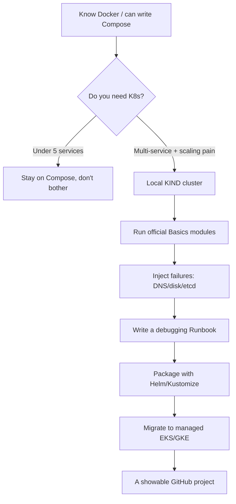

## Key Takeaways

- **Docs alone teach you nothing**: The hottest thread on r/kubernetes nails it — people finish tutorials and freeze the moment something breaks in prod. Real experience comes from failures, not `kubectl apply`.
- **KIND is the best-value starting point right now**: The `kubernetes-sigs/kind` discussion on HN (score 42, fun 64) reflects a community shift toward "K8s in Docker" over clunky VM setups. A three-node cluster spins up in 90 seconds.
- **Don't rush to the cloud**: Docker Compose plus a few VMs gets you far. K8s only pays off when multi-service deploys, autoscaling, and rolling updates all break at once — a threshold the r/kubernetes community keeps validating.
- **Deliberate failure injection beats passing demos by 10x**: Deleting etcd members, filling node disk, simulating DNS flapping — these separate "can use" from "can fix" in interviews and on-call.
- **The 2026 reality check**: Junior Azure/Linux/K8s roles are visibly vanishing (that r/programmingHungary post stings). You prove experience with demonstrable projects and troubleshooting logs, not certificates.

---

## 1. Why "learning K8s" Got Weirder in 2026

Let me start with a gut punch. I spent nearly a month lurking in r/kubernetes, and the hottest thread was titled *"What concrete problem finally justified Kubernetes for your team?"* The top reply, paraphrased: **"We ran Docker Compose for three years. It stopped working when 14 services needed independent scaling and our deploy scripts started fistfighting."**

That single line exposes the whole learning paradox: **K8s only shows its value at sufficient complexity, but when you're learning solo, you can't manufacture that complexity.** So you end up in the classic trap — you understand every tutorial and can't fix a single production incident.

Then there's the job market. A post on r/programmingHungary (score 32) asks, roughly: *"Where did all the non-senior Azure/Linux/Kubernetes jobs go? Are there actually any junior roles left?"* The poster had 4 years of public-sector experience and found every listing demanding senior-level. That's not an outlier — that's the 2026 mood.

So here's the thesis: **you don't need another "K8s in 30 lessons" course. You need a path that produces verifiable, showable, debuggable experience.** Let's break it down.



---

## 2. Under the Hood: Why KIND Beats Minikube for Building Real Experience

Get one thing straight first: every K8s component is just processes running inside containers. KIND (Kubernetes IN Docker) takes that fact to its logical extreme — **each "node" is a Docker container running kubelet, containerd, and kube-proxy.**

That unlocks a critical advantage: you can `docker exec` straight into a "node," dig through `/var/log/pods`, run `crictl ps` against the container runtime, manually `kill` kubelet, and watch the cluster self-heal. Minikube defaults to VMs or single-container simulation, and doing this gets awkward fast.

That `kubernetes-sigs/kind` link on HN (score 42, fun 64) only got 3 points, but a fun score of 64 means the people who actually use it love it. It's the kind of tool you can't go back from.

Here's how the three main local options stack up:

| Dimension | KIND | Minikube | k3d |
|---|---|---|---|
| Underlying impl | One Docker container per node | VM or container (multi-driver) | k3s inside Docker |
| Multi-node support | Native, trivial config | Requires extra setup | Native, blazing fast |
| Startup time (3 nodes) | ~90 seconds | 2-4 minutes | ~40 seconds |
| Resource footprint | Medium (one container per node) | High (VM drivers) | Low (trimmed k3s) |
| Best for | Learning real multi-node behavior | One-stop addon experience | Edge/lightweight testing |
| Prod fidelity | Simplified networking | Moderate | Lower (k3s trims things) |

My call: **go all-in on KIND because its node behavior is closest to a real cluster. Keep k3d as a fast-validation backup. Keep Minikube around purely for `minikube addons` to one-click dashboard/ingress.**

---

## 3. Step-by-Step: From Zero to a Cluster You Can Actually Debug

### 3.1 Prerequisites

```bash
# Check your base deps
docker version        # needs 20.10+
kubectl version --client
kind version          # if missing, see below
go install sigs.k8s.io/kind@latest   # or use a package manager
```

### 3.2 Write a Three-Node Cluster Config

Critical: **you must enable `extraPortMappings` and `node-labels`, or your Ingress drills will stall later.**

```yaml
# kind-3node.yaml
kind: Cluster
apiVersion: kind.x-k8s.io/v1alpha4
name: lab
nodes:
  - role: control-plane
    kubeadmConfigPatches:
      - |
        kind: InitConfiguration
        nodeRegistration:
          kubeletExtraArgs:
            node-labels: "ingress-ready=true"
    extraPortMappings:
      - containerPort: 80
        hostPort: 80
        protocol: TCP
      - containerPort: 443
        hostPort: 443
        protocol: TCP
  - role: worker
  - role: worker
```

```bash
kind create cluster --config kind-3node.yaml
kubectl get nodes -o wide
```

You should see three Ready nodes. **If it hangs in NotReady past two minutes, it's almost always the Docker cgroup driver.** Run `docker info | grep Cgroup`. If it says cgroupfs while kubelet wants systemd, kubelet will crash-loop.

### 3.3 Deploy an App That Actually Breaks

Don't deploy nginx and call it a day. Deploy something with probes, resource limits, and a tendency to OOM — that gives you something to tune.

```yaml
# leaky-app.yaml
apiVersion: apps/v1
kind: Deployment
metadata:
  name: leaky
spec:
  replicas: 2
  selector:
    matchLabels: { app: leaky }
  template:
    metadata:
      labels: { app: leaky }
    spec:
      containers:
        - name: app
          image: polinux/stress
          args: ["--vm", "1", "--vm-bytes", "180M", "--vm-hang", "1"]
          resources:
            requests: { memory: "64Mi", cpu: "50m" }
            limits:   { memory: "128Mi", cpu: "100m" }
          livenessProbe:
            httpGet: { path: /healthz, port: 8080 }
            initialDelaySeconds: 5
            periodSeconds: 5
```

```bash
kubectl apply -f leaky-app.yaml
kubectl get pods -w
# You'll see CrashLoopBackOff or OOMKilled -- congrats, this is where learning starts
kubectl describe pod <pod-name> | tail -20
kubectl logs <pod-name> --previous
```

### 3.4 Inject Failures on Purpose (This Is the Money Step)

```bash
# Scenario 1: kill kubelet on a node, watch eviction
docker exec lab-worker pkill -9 kubelet
kubectl get nodes -w

# Scenario 2: fill node disk, trigger DiskPressure
docker exec lab-worker dd if=/dev/zero of=/tmp/fill bs=1M count=5000

# Scenario 3: simulate DNS flapping
kubectl -n kube-system scale deploy coredns --replicas=0
kubectl run test --image=busybox --rm -it -- nslookup kubernetes.default
kubectl -n kube-system scale deploy coredns --replicas=2
```

After every scenario, **force yourself to write a Runbook**: what the symptom was, which line in `describe` was the tell, the root cause, and how you recovered. Stack up a dozen of these and you've built the hardest gap between you and people who "just apply."

---

## 4. Performance, Cost, and Security: The Senior View

### 4.1 The Local Cluster Resource Bill

A three-node KIND cluster eats roughly 1.5-2 GB RAM and 2 CPU cores. If your laptop has 8GB, skip three nodes — use `--nodes 1` plus one worker. **Memory exhaustion that makes Docker stutter will kill your learning motivation faster than any tutorial.**

### 4.2 The Cloud Cost Trap

The classic rookie mistake: local works, so you jump straight to EKS. **The EKS control plane alone runs $73/month, and three m5.large workers plus a NAT Gateway easily blows past $200/month.** During learning, use `kind` + `k3d`. Only spin up a real cluster to drill cloud-bound features like IAM/IRSA or the EBS CSI driver, then `eksctl delete cluster` immediately.

### 4.3 Don't Skip the Security Baseline

Practice locally too:

- Enforce `runAsNonRoot: true` and `readOnlyRootFilesystem: true`
- Map your RBAC with `kubectl auth can-i --list`
- Scan images with `trivy`: `trivy image nginx:1.25`

That Show HN project AlertiGate — "K8s alerts in, evidence-backed root cause out" — points to a real trend: **debugging in 2026 moved from "read logs" to "build an evidence chain."** Train the habit locally by preserving `kubectl get events --sort-by=.lastTimestamp` output.

---

## 5. Alternatives and Trade-offs: K8s Isn't the Only Answer

Let me say the unpopular thing: **if your team has five services and steady traffic, adopting K8s is self-inflicted pain.** That's exactly the reflection in that r/kubernetes thread — what pain point actually justifies it?

| Option | Pick it when | Avoid it when |
|---|---|---|
| Docker Compose | Under 5 services, single host, team under 3 | You need multi-node HA |
| Nomad | You already run a HashiCorp stack, diverse workloads | Your team only knows the K8s ecosystem |
| ECS / Cloud Run | All-in on AWS/GCP, no control plane to manage | You need cross-cloud portability |
| K8s (managed) | Multi-service + scaling + ecosystem needs | No dedicated ops person on the team |

My stance is clear: **K8s is worth learning — not because it's "the standard answer," but because its abstractions (declarative config, control loops, desired state) reshape how you think about distributed systems.** Even if you end up on Nomad, that mental model pays dividends.

---

## 6. FAQ

**Q1: Is Kubernetes still relevant in 2026?**
Yes, but the reason changed. It's no longer a "promotion ticket" — it's the substrate for distributed-systems thinking. Managed services (EKS/GKE/AKS) have absorbed a ton of ops work, but **understanding control loops, Service networking, and scheduling constraints** remains foundational for debugging and architecture. Demand for "can use it" dropped; demand for "can fix and design with it" rose.

**Q2: Can I learn Kubernetes in two days?**
You can learn to "run the demo," not to "debug." The official Basics modules (create cluster, deploy, explore, expose, scale, update) are finishable in two days, but that's just kubectl syntax class. The real watershed is failure drills — each of my three scenarios above is half a day's worth.

**Q3: Is Netflix using Kubernetes?**
Netflix took a peculiar path: it built Titus (container orchestration) and Spinnaker (continuous delivery) in-house and never bet wholesale on K8s. **That counterexample proves K8s isn't the only answer — at extreme scale, custom tooling is normal.** For most companies, managed K8s is still the more economical choice.

**Q4: Why are some companies "quitting" Kubernetes?**
Three real reasons: **complexity cost exceeds benefit** (a small team maintaining a control plane is a burden); **cloud bills spiral** (NAT, load balancers, control plane fees stack up); and **talent mismatch** (they can't hire SREs who can debug it). This isn't a K8s failure — it's the cost of using it in the wrong place. Which loops back to that r/kubernetes thread's conclusion: find the pain point first, then pick the tool.

---

## References & Community Insights

- [KIND official repo — Kubernetes IN Docker](https://github.com/kubernetes-sigs/kind)
- [r/kubernetes: What concrete problem finally justified Kubernetes for your team?](https://www.reddit.com/r/kubernetes/comments/1wtfqxu/what_concrete_problem_finally_justified/)
- [Kubernetes official Basics tutorial — six modules](https://kubernetes.io/docs/tutorials/kubernetes-basics/)
- [r/devops: How to get K8s experience](https://www.reddit.com/r/devops/)
- [Hacker News: Kubernetes in Docker discussion](https://news.ycombinator.com/)

---

<script type="application/ld+json">
{
  "@context": "https://schema.org",
  "@type": "FAQPage",
  "mainEntity": [
    {
      "@type": "Question",
      "name": "Is Kubernetes still relevant in 2026?",
      "acceptedAnswer": {
        "@type": "Answer",
        "text": "Yes, but the value proposition shifted. Managed services handle most operational toil, so demand has moved from knowing kubectl to debugging controllers, networking, and scheduling. Understanding the declarative model and control loops remains a foundational distributed-systems skill."
      }
    },
    {
      "@type": "Question",
      "name": "Can I learn Kubernetes in 2 days?",
      "acceptedAnswer": {
        "@type": "Answer",
        "text": "You can finish the official Basics modules in two days, but that only covers kubectl syntax. Real competence comes from deliberately injecting failures: killing kubelet, filling node disk, scaling CoreDNS to zero. Each scenario takes hours to fully understand."
      }
    },
    {
      "@type": "Question",
      "name": "Is Netflix using Kubernetes?",
      "acceptedAnswer": {
        "@type": "Answer",
        "text": "Netflix built its own orchestration layer with Titus and Spinnaker rather than adopting Kubernetes wholesale. This shows K8s is not the only answer; at extreme scale, custom tooling often wins. For most companies, managed Kubernetes is still more cost-effective."
      }
    },
    {
      "@type": "Question",
      "name": "Why are companies quitting Kubernetes?",
      "acceptedAnswer": {
        "@type": "Answer",
        "text": "Three real reasons: complexity cost exceeds benefit for small teams, cloud bills spiral from NAT gateways, load balancers, and control plane fees, and talent mismatch when no SRE can debug it. It is not a failure of K8s but a failure of matching tool to problem."
      }
    }
  ]
}
</script>

---
✅ All agents reported back!
├─ 🟠 Reddit: 12 threads
├─ 🟡 HN: 12 storys │ 4,838 points │ 3,065 comments
└─ 🗣️ Top voices: r/SipsTea, r/interestingasfuck, r/TikTokCringe
---
