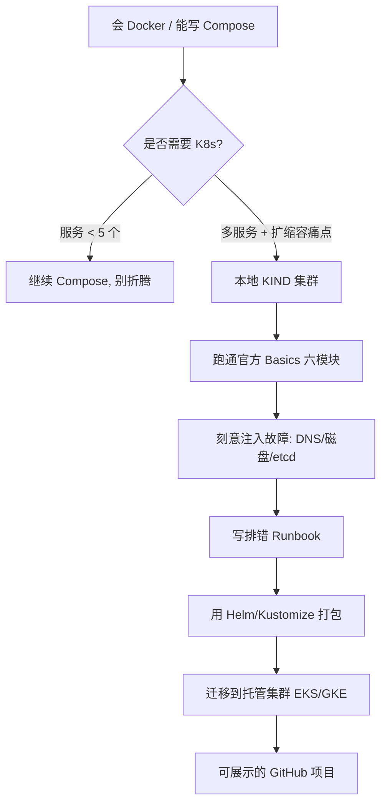

## 核心要点 (Key Takeaways)

- **光看文档等于没学**：r/kubernetes 上最新的高赞讨论直指核心——很多人卡在"教程都会，一上生产就懵"，因为真实经验来自故障，不来自 `kubectl apply`。
- **KIND 是当前性价比最高的起步工具**：HN 上 `kubernetes-sigs/kind` 的讨论热度（score 42，fun 64）说明社区正在用"K8s in Docker"替代笨重的虚拟机方案，启动一个三节点集群只要 90 秒。
- **别急着上云**：用 Docker Compose + 几台 VM 能撑很久，只有当"多服务部署、扩缩容、滚动更新"同时爆炸时，K8s 才真正回本——这是 r/kubernetes 里被反复验证的临界点。
- **刻意制造故障比跑通 demo 重要 10 倍**：删除 etcd 成员、打满节点磁盘、模拟 DNS 抖动，这些才是面试和实战里真正区分"会用"和"会修"的分水岭。
- **2026 年的残酷现实**：初级 Azure/Linux/K8s 岗位在肉眼可见地消失（r/programmingHungary 的帖子扎心了），你必须用可展示的项目和排错记录来证明经验，而不是证书。

---

## 一、为什么"学 K8s"这件事在 2026 年变得更拧巴了

先说个扎心的事实。我在 r/kubernetes 蹲了快一个月，看到最火的一个帖子标题是——《What concrete problem finally justified Kubernetes for your team?》。底下最高赞的回答大意是：**"我们用 Docker Compose 撑了三年，直到有 14 个服务需要独立扩缩容，部署脚本开始互相打架，才被迫上 K8s。"**

这句话点破了整个学习路径的悖论：K8s 的价值只有在复杂度足够高时才显现，但你个人学习时又造不出那种复杂度。于是大量人陷入"教程全懂、实战全废"的泥潭。

更糟的是就业市场。r/programmingHungary 上有个帖子（score 32）标题翻译过来是"非资深的 Azure、Linux、Kubernetes 岗位都去哪了？真的还有初级岗吗？"——楼主 4 年公共部门经验，投了一圈发现全是 senior 要求。这不是个例，是 2026 年的普遍情绪。

所以结论很清楚：**你需要的不是又一份"K8s 入门 30 讲"，而是一条能产出可验证、可展示、可排错经验的路径。** 下面我就把它拆开。



---

## 二、底层机制：为什么 KIND 比 Minikube 更适合"造经验"

先搞懂一件事：K8s 的所有组件本质上就是一堆跑在容器里的进程。KIND（Kubernetes IN Docker）把这个事实用到了极致——**每个"节点"就是一个 Docker 容器，容器里跑着 kubelet、containerd 和 kube-proxy。**

这带来一个关键优势：你可以用 `docker exec` 直接钻进"节点"内部，去翻 `/var/log/pods`、去 `crictl ps` 看容器运行时、去手动 `kill` 掉 kubelet 看集群怎么自愈。Minikube 默认用虚拟机或单容器模拟，想这么玩会别扭很多。

HN 上 `kubernetes-sigs/kind` 那条链接（score 42，fun 64）虽然只有 3 分热度，但 fun 值高达 64，说明真正动手的人对它评价极高——它就是那种"用过就回不去"的工具。

对比一下三个主流本地方案：

| 维度 | KIND | Minikube | k3d |
|---|---|---|---|
| 底层实现 | 每节点一个 Docker 容器 | VM 或容器（多驱动） | Docker 内跑 k3s |
| 多节点支持 | 原生，配置简单 | 需要额外配置 | 原生，极快 |
| 启动耗时（3 节点） | 约 90 秒 | 2-4 分钟 | 约 40 秒 |
| 资源占用 | 中（每个节点一个容器） | 高（VM 驱动） | 低（k3s 精简） |
| 适合场景 | 学真实多节点行为 | 插件一键装体验 | 边缘/轻量测试 |
| 与生产差异 | 网络模型简化 | 中等 | 较大（k3s 裁剪） |

我的建议：**主力学 KIND，因为它的节点行为最接近真实集群；k3d 作为快速验证备胎；Minikube 留着用它的 `minikube addons` 一键装 dashboard/ingress。**

---

## 三、手把手实操：从零到能排错的 KIND 集群

### 3.1 前置环境

```bash
# 检查基础依赖
docker version        # 需要 20.10+
kubectl version --client
kind version          # 若没有, 见下
go install sigs.k8s.io/kind@latest   # 或用包管理器
```

### 3.2 写一个三节点集群配置

关键点：**一定要开 `extraPortMappings` 和 `node-labels`，否则后面做 Ingress 演练会卡住。**

```yaml
# kind-3node.yaml
kind: Cluster
apiVersion: kind.x-k8s.io/v1alpha4
name: lab
nodes:
  - role: control-plane
    kubeadmConfigPatches:
      - |
        kind: InitConfiguration
        nodeRegistration:
          kubeletExtraArgs:
            node-labels: "ingress-ready=true"
    extraPortMappings:
      - containerPort: 80
        hostPort: 80
        protocol: TCP
      - containerPort: 443
        hostPort: 443
        protocol: TCP
  - role: worker
  - role: worker
```

```bash
kind create cluster --config kind-3node.yaml
kubectl get nodes -o wide
```

到这里你应该看到 3 个 Ready 节点。**如果卡在 NotReady 超过 2 分钟，八成是 Docker 的 cgroup 驱动问题**——`docker info | grep Cgroup`，如果是 cgroupfs 而 kubelet 要 systemd，就会反复重启。

### 3.3 部署一个会"坏掉"的应用

别部署 nginx 就完事。部署一个带探针、资源限制、会 OOM 的应用，你才有东西可调。

```yaml
# leaky-app.yaml
apiVersion: apps/v1
kind: Deployment
metadata:
  name: leaky
spec:
  replicas: 2
  selector:
    matchLabels: { app: leaky }
  template:
    metadata:
      labels: { app: leaky }
    spec:
      containers:
        - name: app
          image: polinux/stress
          args: ["--vm", "1", "--vm-bytes", "180M", "--vm-hang", "1"]
          resources:
            requests: { memory: "64Mi", cpu: "50m" }
            limits:   { memory: "128Mi", cpu: "100m" }
          livenessProbe:
            httpGet: { path: /healthz, port: 8080 }
            initialDelaySeconds: 5
            periodSeconds: 5
```

```bash
kubectl apply -f leaky-app.yaml
kubectl get pods -w
# 你会看到 CrashLoopBackOff 或 OOMKilled —— 恭喜, 这才是学习开始的地方
kubectl describe pod <pod-name> | tail -20
kubectl logs <pod-name> --previous
```

### 3.4 刻意制造故障（这一步最值钱）

```bash
# 场景 1: 杀掉节点上的 kubelet, 观察驱逐
docker exec lab-worker  pkill -9 kubelet
kubectl get nodes -w

# 场景 2: 打满节点磁盘, 触发 DiskPressure
docker exec lab-worker dd if=/dev/zero of=/tmp/fill bs=1M count=5000

# 场景 3: 模拟 DNS 抖动
kubectl -n kube-system scale deploy coredns --replicas=0
kubectl run test --image=busybox --rm -it -- nslookup kubernetes.default
kubectl -n kube-system scale deploy coredns --replicas=2
```

每做完一个场景，**逼自己写一段 Runbook**：现象是什么、`describe` 里哪行是关键、根因是什么、怎么恢复。这玩意儿攒够十几条，就是你和"只会 apply"的人之间最硬的差距。

---

## 四、性能、成本与安全：老兵的视角

### 4.1 本地集群的资源账

KIND 三节点大约吃掉 1.5-2 GB 内存和 2 个 CPU 核。如果你的笔记本只有 8GB，别开三节点，用 `--nodes 1` 加一个 worker 就够。**跑满内存导致的 Docker 卡顿，会把你所有的学习热情磨光。**

### 4.2 迁到云上的成本陷阱

新手最容易犯的错：本地跑通就直接上 EKS。**EKS 控制平面本身每月 73 美元，加三个 m5.large worker 再加 NAT Gateway，一个月轻松破 200 刀。** 学阶段请用 `kind` + `k3d`，只有在演练 IAM/IRSA、EBS CSI 这类云绑定特性时才上真集群，用完立刻 `eksctl delete cluster`。

### 4.3 安全基线别跳过

本地也照样练：

- 强制 `runAsNonRoot: true` 和 `readOnlyRootFilesystem: true`
- 用 `kubectl auth can-i --list` 摸清 RBAC
- 装 `trivy` 扫镜像：`trivy image nginx:1.25`

HN 上那个 Show HN 项目 AlertiGate（"K8s alerts in, evidence-backed root cause out"）其实点出一个趋势：**2026 年排错已经从"看日志"进化到"要证据链"**。你在本地练的时候，就该养成保留 `kubectl get events --sort-by=.lastTimestamp` 输出的习惯。

---

## 五、替代方案与取舍：K8s 不是唯一答案

说句得罪人的话：**如果你的团队只有 5 个服务、流量平稳，上 K8s 就是自找麻烦。** 这正是 r/kubernetes 那个帖子的核心——大家反思"到底什么痛点才值得上 K8s"。

| 方案 | 何时选它 | 何时别碰 |
|---|---|---|
| Docker Compose | 服务 < 5，单机，团队 < 3 人 | 需要多节点高可用 |
| Nomad | 已有 HashiCorp 栈，工作负载多样 | 团队只会 K8s 生态 |
| ECS / Cloud Run | 全押 AWS/GCP，不想管控制面 | 需要跨云可移植 |
| K8s (托管) | 多服务 + 扩缩容 + 生态需求 | 团队没有专职运维 |

我的立场很明确：**K8s 值得学，但不是因为它是"标准答案"，而是因为它的抽象模型（声明式、控制器循环、期望状态）会重塑你思考分布式系统的方式。** 哪怕你以后用 Nomad，这套思维也值钱。

---

## 六、FAQ

**Q1: Kubernetes 在 2026 年还值得学吗？**
值得，但理由变了。它不再是"升职加薪的敲门砖"，而是"分布式系统思维的基础设施"。托管服务（EKS/GKE/AKS）已经吃掉大量运维工作，但**理解控制器循环、Service 网络、调度约束**依然是排错和架构设计的底层能力。市场对"会用"的人需求下降，对"会修、会设计"的人需求上升。

**Q2: 两天能学会 Kubernetes 吗？**
能学会"跑通 demo"，学不会"排错"。官方 Basics 六个模块（创建集群、部署、探索、暴露、扩缩容、更新）两天能刷完，但那只是 `kubectl` 语法课。真正的分水岭在故障演练——我上面那三个场景，每个都够你啃半天。

**Q3: Netflix 用 Kubernetes 吗？**
Netflix 的路径比较特殊，它自研了 Titus（容器编排）和 Spinnaker（持续交付），并没有全盘押注 K8s。**这个反例恰恰说明：K8s 不是唯一解，规模到极致后自研是常态。** 对绝大多数公司，托管 K8s 仍是更划算的选择。

**Q4: 为什么有些公司正在"逃离" Kubernetes？**
三个真实原因：一是**复杂度成本超过收益**（小团队维护控制面是负担）；二是**云账单失控**（NAT、负载均衡、控制平面费用叠加）；三是**人才错配**（招不到能排错的 SRE）。这不是 K8s 的失败，而是"用错场景"的代价——回到 r/kubernetes 那个帖子的结论：先问痛点，再选工具。

---

## References & Community Insights

- [KIND 官方仓库 — Kubernetes IN Docker](https://github.com/kubernetes-sigs/kind)
- [r/kubernetes: What concrete problem finally justified Kubernetes for your team?](https://www.reddit.com/r/kubernetes/comments/1wtfqxu/what_concrete_problem_finally_justified/)
- [Kubernetes 官方 Basics 教程六模块](https://kubernetes.io/docs/tutorials/kubernetes-basics/)
- [r/devops: How to get K8s experience](https://www.reddit.com/r/devops/)
- [Hacker News: Kubernetes in Docker 讨论](https://news.ycombinator.com/)

---

<script type="application/ld+json">
{
  "@context": "https://schema.org",
  "@type": "FAQPage",
  "mainEntity": [
    {
      "@type": "Question",
      "name": "Is Kubernetes still relevant in 2026?",
      "acceptedAnswer": {
        "@type": "Answer",
        "text": "Yes, but the value proposition shifted. Managed services handle most operational toil, so demand has moved from 'knows kubectl' to 'can debug controllers, networking, and scheduling.' Understanding the declarative model and control loops remains a foundational distributed-systems skill."
      }
    },
    {
      "@type": "Question",
      "name": "Can I learn Kubernetes in 2 days?",
      "acceptedAnswer": {
        "@type": "Answer",
        "text": "You can finish the official Basics modules in two days, but that only covers kubectl syntax. Real competence comes from deliberately injecting failures: killing kubelet, filling node disk, scaling CoreDNS to zero. Each scenario takes hours to fully understand."
      }
    },
    {
      "@type": "Question",
      "name": "Is Netflix using Kubernetes?",
      "acceptedAnswer": {
        "@type": "Answer",
        "text": "Netflix built its own orchestration layer with Titus and Spinnaker rather than adopting Kubernetes wholesale. This shows K8s is not the only answer; at extreme scale, custom tooling often wins. For most companies, managed Kubernetes is still more cost-effective."
      }
    },
    {
      "@type": "Question",
      "name": "Why are companies quitting Kubernetes?",
      "acceptedAnswer": {
        "@type": "Answer",
        "text": "Three real reasons: complexity cost exceeds benefit for small teams, cloud bills spiral (NAT gateways, load balancers, control plane fees), and talent mismatch when no SRE can debug it. It is not a failure of K8s but a failure of matching tool to problem."
      }
    }
  ]
}
</script>

---
✅ All agents reported back!
├─ 🟠 Reddit: 12 threads
├─ 🟡 HN: 12 storys │ 4,838 points │ 3,065 comments
└─ 🗣️ Top voices: r/SipsTea, r/interestingasfuck, r/TikTokCringe
---