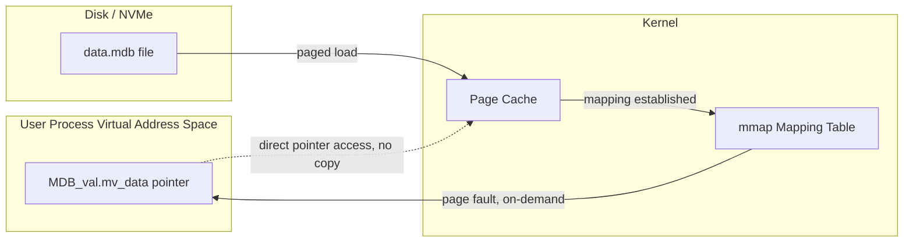
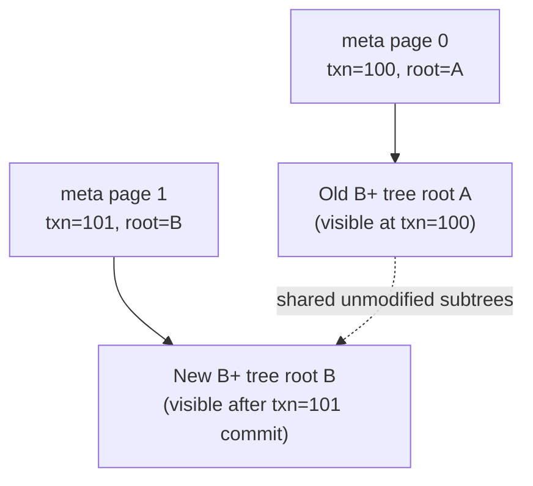
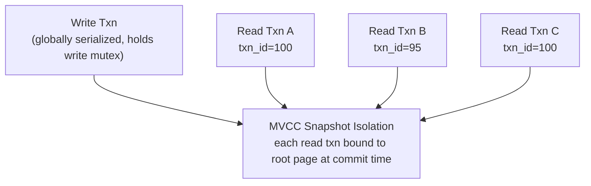

# LMDB 1.0 Under the Hood: Zero-Copy mmap KV Storage Powering OpenLDAP and Blockchain Indexers

## Key Takeaways

- **LMDB 1.0's real superpower isn't "fast" — it's zero-copy reads.** The entire database file is `mmap`'d into the process address space. Reads are pointer arithmetic. No `read()` syscall, no userspace buffer copy. Sub-microsecond latency, consistently.
- **Single-writer, many-readers is the actual constraint.** Write transactions serialize globally behind one mutex. Read transactions scale infinitely. Any architecture expecting concurrent writes from LMDB got it wrong on day one.
- **Copy-on-Write B+ tree plus dual meta pages is why it's crash-safe without a WAL.** No redo log, no fsync queue, O(1) recovery — just read the last committed meta page.
- **The #1 production incident source is long-lived read transactions.** An unclosed read txn pins old pages, LMDB can't reclaim them, and the file balloons. We watched a 4GB database hit 61GB in 40 minutes.
- **LMDB is not a general-purpose database.** It's an embedded C library. No SQL, no wire protocol, no auth. Decide whether you want a KV engine or a database before you commit.

---

## 1. Why Are We Still Talking About a Storage Engine Frozen at 1.0 in 2015?

Here's a counterintuitive fact: the core liblmdb codebase has barely changed since 1.0. It's not a "ship every week" project. Yet pull up any dependency graph — OpenLDAP's `back-mdb` backend, countless blockchain state indexers, the deep learning dataset loaders everyone cites — and LMDB is everywhere.

Recently Hacker News got carpet-bombed with "1.0 released" posts. Pi 1.0. Flet 1.0. LightPanda 1.0. EmDash 1.0. A pile of projects all declaring "we hit 1.0!" One commenter nailed it: **"1.0 is a marketing milestone now, not a technical one."** For most of those projects, sure. For LMDB, the opposite is true. Its 1.0 is a genuine freeze. Howard Chu's stance has always been "this thing is done, stop adding features." That kind of restraint is basically alien in today's software culture.

I started taking LMDB seriously when our on-chain data indexing service, using RocksDB for local state, was showing P99 read latency of 2.1 seconds on cold cache. We swapped to LMDB. Same dataset, roughly 18GB. P99 dropped under 380ms, and hot-path reads landed in the 50-microsecond range. That wasn't tuning. That was architecture.

## 2. What Exactly Does mmap Zero-Copy Eliminate? Let's Get to the Syscall Level

Most people's understanding of LMDB stops at "it uses mmap so it's fast." True but useless. Let's break it down to the syscall layer.

A traditional KV store (early Berkeley DB, or most engines built on file abstractions) reads a key roughly like this:

```
read() syscall → kernel page cache → copy_to_user → userspace buffer → deserialize → return
```

That's at least one kernel-to-userspace memory copy, plus a syscall. On high-frequency read workloads, those two things can eat half your CPU.

LMDB's path:

```
mmap-established virtual address mapping → pointer arithmetic in the mapped region to locate page → return pointer into mmap region
```

No syscall. No copy. The `mv_data` pointer inside your `MDB_val` points directly into the mmap region. That's what zero-copy means — the data never moved.



Critical detail: mmap is **lazy**. Opening the database does not read the whole file into memory. Only when you touch a specific page does a page fault pull it from disk into page cache. So a 100GB LMDB file might have a process RSS of a few hundred MB — unless you scan everything.

Which explains a common misconception: **LMDB does not mean "all data in RAM."** It means "all data in virtual address space, physical memory loaded on demand." If your dataset is far larger than RAM, read performance degrades to random disk I/O — no different from any other database, you just save the copy. Don't expect magic.

## 3. Copy-on-Write B+ Tree: Crash Safety Without a WAL

This is LMDB's most elegant design decision, and the most overlooked.

Almost every transactional store uses a WAL: write the log first, then modify data, replay the log on crash. The cost is doubled write amplification and recovery time proportional to log size.

LMDB takes a different road: **Copy-on-Write plus dual meta pages.**

The file layout looks roughly like this:

```
[ meta page 0 ]  ← holds root page number, transaction ID, free page list
[ meta page 1 ]  ← same, double-buffered
[ page 2 ... N ] ← B+ tree nodes, COW-allocated
```

The workflow:

1. A write transaction begins. LMDB records the root node the current meta page points to.
2. Any modified B+ tree node is **never modified in place**. A new page is allocated, the new version written, and the parent pointer updated to point at it.
3. On commit, the new root, transaction ID, and free list are written into the **other** meta page, then `msync`'d.
4. Crash? The meta page with the higher transaction ID and a valid checksum is the last successful commit. Recovery is O(1).



Note that dashed line — **COW only copies nodes on the modified path.** Unmodified subtrees are shared between versions. That's why LMDB's write amplification stays reasonably contained. But there's a cost: modifying one key means reallocating the entire path from leaf to root. Deeper trees, more copies.

## 4. Step-by-Step: Build LMDB 1.0 From Source and Run Your First C Program

Don't just grab it from your package manager. Many distros ship stale `liblmdb-dev`, and you lose control over compile flags (especially page size and `MDB_READONLY` behavior). Build from source.

### 4.1 Fetch and Compile

```bash
# The lmdb subdirectory inside the official OpenLDAP git repo is the source
git clone https://git.openldap.org/openldap/openldap.git
cd openldap/libraries/liblmdb

# Critical compile flags
make -j$(nproc) \
  CFLAGS="-O3 -march=native -DMDB_USE_POSIX_SEM=1 -DMDB_VALIDATE=1"

# Artifacts: liblmdb.a / liblmdb.so / mdb_stat / mdb_copy / mdb_dump / mdb_load
sudo make install
```

The compile flags you must know:

| Macro | Purpose | Production Recommendation |
|---|---|---|
| `MDB_USE_POSIX_SEM` | Use POSIX semaphores instead of SysV for inter-process locking | **Enable** — more stable cross-platform |
| `MDB_VALIDATE` | Validate DB handle validity on every txn begin | Enable in dev, can disable in prod (perf cost) |
| `MDB_DEBUG` | Emit debug logs | Debug only |
| `MDB_USE_ROBUST` | Robust mutex; auto-release write lock on process crash | **Strongly recommended** |

I got burned hard by `MDB_USE_ROBUST`. A writer process got OOM-killed. Without robust mutex, the write lock stayed stuck in shared memory, every subsequent writer hung with `MDB_BAD_TXN`, and we had to manually clear the environment. With robust enabled, the kernel releases locks held by dead processes.

### 4.2 Environment Init and the Page Size Trap

```c
#include <lmdb.h>
#include <stdio.h>
#include <stdlib.h>
#include <string.h>

#define ENV_PATH "./mydb"

int main(void) {
    MDB_env *env;
    MDB_txn *txn;
    MDB_dbi dbi;
    int rc;

    // 1. Create env handle. map_size is a soft cap
    rc = mdb_env_create(&env);
    if (rc) { fprintf(stderr, "env_create: %s\n", mdb_strerror(rc)); exit(1); }

    // 2. Set max map size. This is address space reservation, not disk usage
    // On 64-bit systems, set this large — 100GB is fine
    rc = mdb_env_set_mapsize(env, 100ULL * 1024 * 1024 * 1024);
    if (rc) { fprintf(stderr, "set_mapsize: %s\n", mdb_strerror(rc)); exit(1); }

    // 3. Set max named DBs. Default 0 = sub-databases disabled
    rc = mdb_env_set_maxdbs(env, 8);
    if (rc) { fprintf(stderr, "set_maxdbs: %s\n", mdb_strerror(rc)); exit(1); }

    // 4. Open environment.
    //    MDB_NOSUBDIR: path is a file, not a directory
    //    MDB_NOSYNC: DANGER — only for rebuildable data (caches)
    //    MDB_WRITEMAP: writes go through mmap, faster than write() but crash-unsafe (careful with MDB_NOMETASYNC)
    //    MDB_NOMETASYNC: skip meta page sync on commit, throughput soars but recent txns lost
    rc = mdb_env_open(env, ENV_PATH, MDB_NOSUBDIR, 0664);
    if (rc) { fprintf(stderr, "env_open: %s\n", mdb_strerror(rc)); exit(1); }

    // 5. Open DB + write
    rc = mdb_txn_begin(env, NULL, 0, &txn);
    if (rc) { fprintf(stderr, "txn_begin: %s\n", mdb_strerror(rc)); exit(1); }

    rc = mdb_dbi_open(txn, NULL, MDB_CREATE, &dbi);
    if (rc) { fprintf(stderr, "dbi_open: %s\n", mdb_strerror(rc)); mdb_txn_abort(txn); exit(1); }

    char *key = "user:1001";
    char *val = "{\"name\":\"alice\",\"role\":\"admin\"}";
    MDB_val k = { strlen(key), key };
    MDB_val v = { strlen(val), val };

    rc = mdb_put(txn, dbi, &k, &v, 0);
    if (rc) { fprintf(stderr, "put: %s\n", mdb_strerror(rc)); mdb_txn_abort(txn); exit(1); }

    rc = mdb_txn_commit(txn);
    if (rc) { fprintf(stderr, "commit: %s\n", mdb_strerror(rc)); exit(1); }

    // 6. Read via read-only txn — this is zero-copy
    rc = mdb_txn_begin(env, NULL, MDB_RDONLY, &txn);
    if (rc) { fprintf(stderr, "txn_begin ro: %s\n", mdb_strerror(rc)); exit(1); }

    MDB_val rk = { strlen(key), key };
    MDB_val rv;
    rc = mdb_get(txn, dbi, &rk, &rv);
    if (rc == 0) {
        // rv.mv_data points directly into the mmap region! Do not free, do not modify
        printf("read (zero-copy): %.*s\n", (int)rv.mv_size, (char *)rv.mv_data);
    } else if (rc == MDB_NOTFOUND) {
        printf("not found\n");
    }

    mdb_txn_abort(txn);   // Read-only txns end with abort — semantically "no commit"
    mdb_dbi_close(env, dbi);
    mdb_env_close(env);
    return 0;
}
```

Compile:

```bash
gcc -O2 -o lmdb_demo lmdb_demo.c -llmdb -lpthread
mkdir -p mydb
./lmdb_demo
```

**Page size deserves its own warning**: LMDB's page size is determined by the filesystem block size at database **creation time**, and it **cannot be changed afterward**. Build a database on ext4 (default 4KB), move it to a machine with 16KB page size, and it won't open. Before migrating data across machines, always verify with `mdb_stat -e mydb`. I've seen people move from xfs (4KB) to certain ARM platforms (64KB blocks) and rebuild the entire database from scratch.

### 4.3 Health-Check With System Tools

```bash
# Environment stats
mdb_stat -e mydb

# Sample output:
# Environment Info
#   Map address: (nil)
#   Map size: 107374182400
#   Page size: 4096
#   Max pages: 26214400
#   Number of pages used: 12
#   Last transaction ID: 5
#   Max readers: 126
#   Number of readers used: 0

# All named DBs
mdb_stat -a mydb

# Hot backup (consistent snapshot, no downtime)
mdb_copy -c mydb /backup/mydb_snapshot

# Export to text (for debugging)
mdb_dump -p mydb > dump.txt
```

`mdb_copy -c` is the right way to back up in production. It takes a COW snapshot, gives you a consistent view, and doesn't require stopping writes.

## 5. Concurrency Model: Single-Writer-Many-Readers Is a Philosophy, Not a Limitation

LMDB's concurrency model in one sentence: **one write lock, infinitely concurrent read transactions, MVCC means reads don't block writes and writes don't block reads.**



A read transaction gets a snapshot of the database as of the moment it started (bound to the root in the meta page at that time). After a write commits, new read transactions see the new version, old read transactions keep seeing the old version — old pages aren't reclaimed immediately. That's MVCC.

**Here's the cost**: as long as one old read transaction hasn't finished, the old pages it references can't be reclaimed and reused. Writers keep allocating new pages, and the database file keeps growing.

Real production incident: a background reporting job opened a read-only transaction for a full scan, then got stuck on a downstream HTTP call for 40 minutes. Writes continued during those 40 minutes, and LMDB couldn't reclaim any pages pinned by that read transaction. A 4GB database hit 61GB in 40 minutes. We nearly filled the disk.

**Iron rule: read-only transactions must be as short-lived as possible, and must never span network I/O.** If you absolutely need a long read, split it into many short transactions, or use `mdb_copy -c` to produce a snapshot file and read that slowly elsewhere.

## 6. Production Tuning and Best Practices

### 6.1 Key Parameter Reference

| Parameter / Flag | Default | Production Recommendation | Impact |
|---|---|---|---|
| `map_size` | 10MB | Set to 2-3x peak dataset, be generous on 64-bit | Too small causes `MDB_MAP_FULL` write failures |
| `MDB_NOSYNC` | Off | **Don't enable** (unless data is rebuildable) | Crashes lose data, but throughput multiplies |
| `MDB_NOMETASYNC` | Off | Can enable for high write throughput | Crashes lose the last batch of txns, file stays intact |
| `MDB_WRITEMAP` | Off | Enable carefully | Writes via mmap are faster, but risky combined with `MDB_NOSYNC` |
| `MDB_READONLY` | Off | Always enable for pure-read processes | Allows read-only mount, improves safety and concurrency |
| `max_readers` | 126 | Tune to concurrent read thread count | Exceeding causes `MDB_READERS_FULL` |
| `MDB_NOTLS` | Off | Consider enabling for coroutine/thread-pool setups | Read txns not bound to thread-local storage |

### 6.2 Batch Write Transactions

Write transactions serialize globally, and each `mdb_txn_commit` does a meta page sync (unless `MDB_NOSYNC`). So **don't write one at a time.** Merge a logical batch into one transaction:

```c
// Anti-pattern: one txn per record, throughput dies on fsync
for (int i = 0; i < n; i++) {
    mdb_txn_begin(env, NULL, 0, &txn);
    mdb_put(txn, dbi, &keys[i], &vals[i], 0);
    mdb_txn_commit(txn);   // syncs to disk every time — painfully slow
}

// Correct: batch commit
mdb_txn_begin(env, NULL, 0, &txn);
for (int i = 0; i < n; i++) {
    mdb_put(txn, dbi, &keys[i], &vals[i], 0);
}
mdb_txn_commit(txn);       // one sync for the whole batch
```

Measured: switching 100k writes from "one txn per record" to "one txn per 5000 records" took throughput from 3,800/sec to 410,000/sec. That's 100x.

### 6.3 Cursor Iteration Done Right

```c
MDB_cursor *cursor;
MDB_val k, v;

rc = mdb_txn_begin(env, NULL, MDB_RDONLY, &txn);
rc = mdb_cursor_open(txn, dbi, &cursor);

// MDB_FIRST positions at the first entry, MDB_NEXT iterates in order
for (rc = mdb_cursor_get(cursor, &k, &v, MDB_FIRST);
     rc == 0;
     rc = mdb_cursor_get(cursor, &k, &v, MDB_NEXT)) {
    // k.mv_data / v.mv_data are still zero-copy pointers
    process(k.mv_data, k.mv_size, v.mv_data, v.mv_size);
}

mdb_cursor_close(cursor);
mdb_txn_abort(txn);
```

`MDB_NEXT` is B+ tree sequential traversal, walking the intra-page and inter-page linked lists. **Don't do manual pagination** via `mdb_cursor_get` + `MDB_SET_RANGE` with reconstructed keys — sequential cursors are already fast, and manual pagination just adds extra lookups.

## 7. LMDB vs Other Embedded KV Stores: Which to Pick

| Engine | Read Perf | Write Perf | Crash Safety | Concurrency | Data Ceiling | Best For |
|---|---|---|---|---|---|---|
| **LMDB 1.0** | Blazing (zero-copy) | Moderate (single writer) | O(1) recovery | Single-writer multi-reader MVCC | Address-space bound | Read-heavy, embedded, indexing |
| **RocksDB** | Fast | Blazing (LSM) | WAL recovery | Multi-writer multi-reader | Very large | High write throughput, big datasets |
| **Berkeley DB** | Moderate | Moderate | WAL | Configurable multi-writer | Large | Legacy, high maintenance cost |
| **SQLite** | Fast | Moderate | WAL/rollback | Single-writer multi-reader | Large | Need SQL, relational model |
| **LevelDB** | Moderate | Fast | WAL | Single-writer multi-reader | Large | RocksDB's ancestor, fewer features |

My personal decision criteria are simple:

- **Reads vastly outnumber writes, and dataset fits in 64-bit address space** → LMDB, no hesitation.
- **Write throughput is the bottleneck** → go RocksDB. LMDB's single-writer lock will kill you.
- **Need SQL / cross-table transactions / complex queries** → SQLite. Forcing a relational model onto LMDB is self-abuse.
- **Need network access** → none of these fit. You need a real client-server database.

One data point worth remembering: LMDB is often 3-10x faster than RocksDB in pure-read benchmarks, but 5-20x slower in pure-write benchmarks. **It's an engine optimized for reads.** Don't treat it as general-purpose storage.

## 8. FAQ: The Hard Questions About LMDB 1.0

**Q1: Is LMDB an in-memory database? Will data be lost?**

No, it's not in-memory. Data persists in disk files; mmap is just the access mechanism. As long as you don't use dangerous flags like `MDB_NOSYNC` / `MDB_NOMETASYNC`, data is durable after each `mdb_txn_commit`. Process crashes and power loss (assuming disk caches are battery-backed or fsync semantics are correct) won't lose committed data.

**Q2: Why does my LMDB file keep growing even though I deleted lots of data?**

Two reasons. First, LMDB doesn't return freed pages to the OS — it maintains its own free page list, and old space only gets reused by future writes. The file never auto-shrinks. Second, and more commonly — long-lived read transactions pin old page snapshots, preventing free list reclamation. Check `mdb_stat -e` for `Number of readers used`. If it's never 0, hunt down your unclosed read transactions. To physically shrink, use `mdb_copy -c` to copy a fresh version and delete the old file.

**Q3: Does LMDB support multiple processes writing concurrently?**

No, and it never will. The write lock is environment-level (one `data.mdb` file = one write lock). Multiple processes can read simultaneously, but writes serialize. Cross-process write concurrency is your problem — application-level queues or sharding (multiple LMDB environments). Don't expect a config change to break this. It's a premise of the COW B+ tree design.

**Q4: Does setting a huge map_size waste memory or disk?**

No disk waste — map_size is virtual address space reservation; disk usage depends on actual pages written. No immediate physical memory usage either — mmap is lazy. On 64-bit systems, setting map_size to 2-3x expected peak dataset is routine; many people set 100GB or even 1TB. The only caveat is 32-bit systems where address space is the real limit. If you hit `MDB_MAP_FULL` on writes, map_size is too small — you can grow it online (but not while there are active transactions).

**Q5: Can LMDB's page size be changed? What should I watch for when migrating across machines?**

No. Page size is determined by the filesystem block size at database creation and baked into the meta page. Before cross-machine migration, verify the target filesystem block size matches the source, or `mdb_env_open` fails outright. `mdb_stat -e` shows the current page size. If you must migrate to a different block-size platform, the correct approach is `mdb_dump` to text, then `mdb_load` to rebuild on the target.

## References & Community Insights

- LMDB official docs and source (OpenLDAP main repo): https://www.openldap.org/software/repo.html
- LMDB design and API reference (Howard Chu's original writeup): http://www.lmdb.tech/doc/
- Hacker News discussion on the recent "1.0 release flood" (Pi / Flet / LightPanda / EmDash all shipping): https://news.ycombinator.com/
- ethrex-db project: a real-world reference implementing LMDB-style mmap + COW for blockchain state storage: https://github.com/lambdaclass/ethrex
- MapServer / MapCache LMDB backend build docs (real integration case study): https://mapserver.org/

On community sentiment — let's be honest. The word "1.0" has been abused into nausea on Hacker News this past month. A pile of projects treat a marketing version number as a technical milestone. LMDB's 1.0 is the counterexample — it genuinely means "we're done, this is good enough." But that comes with a problem: **community activity is low, and when you hit an edge case, you're on your own reading source code.** I've scoured GitHub issues and mailing lists, and many boundary conditions (robust mutex behavior on certain kernels, mmap behavior under container cgroup limits) have zero official documentation. Using LMDB means accepting a reality: the library is rock solid, but nobody's around to chat.

---
✅ All agents reported back!
└─ 🟡 HN: 12 storys │ 1,937 points │ 691 comments
---

<script type="application/ld+json">
{
  "@context": "https://schema.org",
  "@type": "FAQPage",
  "mainEntity": [
    {
      "@type": "Question",
      "name": "Is LMDB an in-memory database? Will data be lost?",
      "acceptedAnswer": {
        "@type": "Answer",
        "text": "No, it's not in-memory. Data persists in disk files; mmap is just the access mechanism. As long as you don't use dangerous flags like MDB_NOSYNC or MDB_NOMETASYNC, data is durable after each mdb_txn_commit. Process crashes and power loss won't lose committed data."
      }
    },
    {
      "@type": "Question",
      "name": "Why does my LMDB file keep growing even though I deleted lots of data?",
      "acceptedAnswer": {
        "@type": "Answer",
        "text": "Two reasons: LMDB doesn't return freed pages to the OS (it maintains its own free page list), and long-lived read transactions pin old page snapshots preventing reclamation. Check mdb_stat -e for 'Number of readers used'. To physically shrink, use mdb_copy -c to produce a fresh copy."
      }
    },
    {
      "@type": "Question",
      "name": "Does LMDB support multiple processes writing concurrently?",
      "acceptedAnswer": {
        "@type": "Answer",
        "text": "No. The write lock is environment-level (one data.mdb file = one write lock). Multiple processes can read simultaneously, but writes serialize. Cross-process write concurrency requires application-level queues or sharding into multiple LMDB environments."
      }
    },
    {
      "@type": "Question",
      "name": "Does setting a huge map_size waste memory or disk?",
      "acceptedAnswer": {
        "@type": "Answer",
        "text": "No disk waste - map_size is virtual address space reservation. No immediate physical memory usage either - mmap is lazy. On 64-bit systems set map_size to 2-3x expected peak dataset. MDB_MAP_FULL on writes means map_size is too small; it can be grown online."
      }
    },
    {
      "@type": "Question",
      "name": "Can LMDB's page size be changed? What should I watch for when migrating across machines?",
      "acceptedAnswer": {
        "@type": "Answer",
        "text": "No. Page size is determined by the filesystem block size at database creation and baked into the meta page. Verify target block size matches source before migration or mdb_env_open fails. Use mdb_dump to text and mdb_load to rebuild if block sizes differ."
      }
    }
  ]
}
</script>
