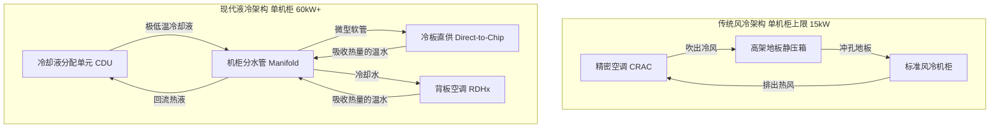

在 AI 大模型和高密度 GPU 计算统治一切的时代，传统数据中心的设计指标已经被彻底撕碎了。过去，我们规划机房时，每个机柜的功耗 (Power Density) 通常在 5kW 到 8kW 之间。但在 2026 年，仅仅一台 8 卡 NVIDIA B200 HGX 服务器的功耗就能飙破 10kW。如果一个机柜塞满 AI 算力，功耗轻松突破 60kW。这早就超越了传统精密空调 (CRAC) 的物理散热极限。

这场范式转变要求我们彻底重构数据中心基础设施管理 (DCIM)。作为一线的架构师，如果你还不会计算三相电的相序负载，不懂得规划液冷管路，你的昂贵硬件必将因为过热而降频，你的机房电闸也随时会跳闸。

## 核心痛点：无法逾越的“密度之墙”

过去二十年里，数据中心严重依赖“高架地板、冲孔板和冷热通道隔离”。冷空气从高架地板下被吹上来冷却服务器，热空气从机柜后面排走。

然而，空气的比热容太低了。当单机柜功耗逼近 20kW 到 25kW 这道红线时，风冷在物理学上就破产了。你根本无法在 1U 的狭窄空间里，吹入足够 CFM (每分钟立方英尺) 的风量来带走现代 CPU/GPU 的可怕热量。强行靠风冷，只会产生震耳欲聋的噪音，以及足以摧毁风扇轴承的破坏性静压。

### 热管理架构的演进

## 电力基础设施：三相 PDU 的极致负载均衡

当机柜功耗跨过 20kW 大关，传统的单相交流电就彻底不够用了。你必须将三相电 (Three-phase Power) 直接拉到机柜里。

在现代超大规模数据中心中，415V/240V 的三相电分配系统已经是标配。然而，初级 DCIM 工程师最容易犯的致命错误就是 **三相负载不平衡 (Unbalanced Phase Loading)**。

如果 A 相承载了 25 安培，B 相承载了 25 安培，但 C 相只承载了 5 安培，整个电路就会严重失衡，在零线上产生极其危险的电流，并且会大幅拉低上游 UPS (不间断电源) 的总输出能力。

### 工程师必背：三相电容量计算公式
计算单根 PDU 鞭线总容量的公式：
`总功率 (瓦特) = 电压 (Volts) × 电流 (Amps) × 1.732 (根号3)`

**实战推演：**
一根 32A、415V 的三相 PDU 能提供多少电力？
`415V × 32A × 1.732 ≈ 23,000 瓦特 (23kW)`。
对于一个 60kW 的高密度 AI 机柜，你至少需要 **三根** 这样的 PDU，并且必须极其精确地把几十个服务器电源，均匀地插在 L1/L2、L2/L3、L3/L1 这三个不同的相位上。

## 芯片直冷 (Direct-to-Chip / D2C)

为了撞破“密度之墙”，企业级数据中心正在疯狂地给机柜加装冷板直冷 (D2C) 系统。

在 D2C 架构中，一套闭环的绝缘冷却液或处理过的去离子水，会直接流过紧贴在 CPU 和 GPU 表面的微通道紫铜冷板。

### 液冷三大件
1. **CDU (Coolant Distribution Unit)**：系统的心脏。它负责在一次侧（机房大楼的冷却水塔）和二次侧（机柜内部的冷却液）之间进行热交换。
2. **Manifold (分水管)**：垂直固定在机柜后部的粗管，带有防漏水的盲插快拔接头 (QDs)。
3. **RDHx (背板热交换器)**：一个巨大的散热器，直接替换掉机柜的后门。那些没有被 CPU 冷板带走、散发到空气中的余热，会在吹出机柜前被这扇“冷门”全部拦截。

## 性能、成本与商业影响

| 散热模式 | 单机柜密度上限 | 能效指标 (PUE) | 初始建设成本 (CapEx) | 运维复杂度 |
| :--- | :--- | :--- | :--- | :--- |
| **传统风冷 (CRAC)** | ~15 kW | 1.4 - 1.6 (差) | 低 | 低 (只换滤网、皮带) |
| **背板空调 (RDHx)**| ~35 kW | 1.2 - 1.3 | 中 | 中 (涉及水路维护) |
| **芯片直冷 (D2C)** | 100+ kW | < 1.1 (极佳) | 极高 | 高 (液质检测、防漏) |

### 暴降电费的 PUE 魔法
PUE 是评估数据中心能效的核心指标。PUE 为 2.0 意味着：IT 设备每消耗 1 度电计算，机房就要消耗 1 度电来给它散热。液冷技术可以大幅降低压缩机和风扇的转速，将 PUE 死死压在 1.1 甚至更低。省下来的巨额电费，通常在 18 到 24 个月内就能抹平铺设 CDU 和水管的初始成本。

## 替代方案与权衡 (Trade-offs)

- **浸没式液冷 (Immersion Cooling)**：将整个服务器主板泡在绝缘的氟化液或矿物油里。这能支持恐怖的 200kW+ 单机柜密度。但运维简直是灾难：换一根坏掉的内存条，你需要动用小型吊车把服务器吊出来，忍受刺鼻的气味，并准备成堆的吸油毛巾。
- **风液混合冷板 (AALC)**：把微型水泵直接集成在服务器机箱里，把热量转移到机箱内自带的散热排上，再用上万转的暴力风扇吹出去。极其吵，震动大，但好处是机房不需要铺设任何水管。

## 资深架构师的最后总结

你不可能把 2026 年的 AI 算力，强行塞进 2015 年标准的基础设施里。试图用暴力风冷去压制 NVIDIA DGX 集群完全是螳臂当车，结果只会是毁灭性的热降频和极其短命的硬件。

转向液冷和三相电分配，要求 IT 工程师必须与暖通机电 (MEP) 工程师进行深度跨界合作。但随着算力密度的继续翻倍，啃下这些硬核的 DCIM 基础，是严肃的基础设施团队唯一能走的活路。
