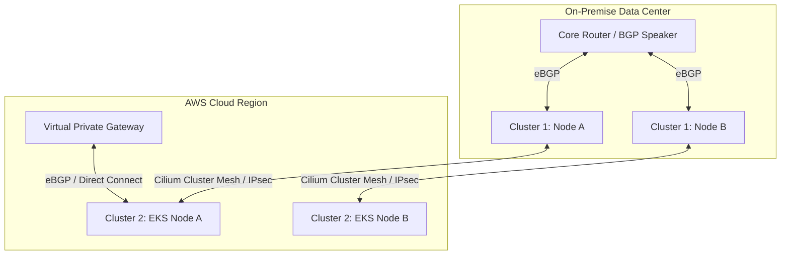

As enterprise Kubernetes adoption scales, the "single massive cluster" anti-pattern is rapidly being replaced by multi-cluster fleets deployed across hybrid clouds and edge locations. The operational challenge in 2026 is no longer *how to deploy* Kubernetes, but rather *how to connect and secure* thousands of microservices spanning multiple isolated networks.

Enter **Cilium** (powered by eBPF) and **BGP (Border Gateway Protocol)**. In this deep dive, we'll architect a production-ready, zero-trust multi-cluster network that entirely bypasses traditional kube-proxy bottlenecks and insecure overlay networks.

## The Bottleneck: Why iptables and Overlays are Dead

Historically, Kubernetes networking relied on `kube-proxy` translating Services into massive, tangled lists of `iptables` rules. If you have 10,000 services, you have tens of thousands of sequential rules. Network latency spikes, and CPU overhead burns through your budget. Furthermore, standard overlay networks (like Flannel or Calico in IPIP/VXLAN mode) encapsulate packets, reducing Maximum Transmission Unit (MTU) size and adding unnecessary encapsulation/decapsulation tax.

### eBPF to the Rescue
**eBPF (Extended Berkeley Packet Filter)** allows us to run sandboxed programs directly within the Linux kernel. Cilium leverages eBPF to bypass the TCP/IP stack entirely for pod-to-pod communication, performing routing, load balancing, and security filtering at the kernel level. 

## Architecture: Cilium Cluster Mesh with BGP

To connect multiple clusters securely, we use **Cilium Cluster Mesh**. It establishes a high-performance tunnel (or direct routing if networks are routable) between nodes in different clusters. 

However, to expose these services to the outside world—or to legacy bare-metal servers—without hair-pinning traffic through a centralized Ingress bottleneck, we pair Cilium with **BGP**.



### How it Works:
1. **Cluster Mesh**: Pods in *Cluster 1* can directly address Pods in *Cluster 2* via native Pod IPs. Cilium encrypts this cross-cluster traffic transparently using IPsec or WireGuard.
2. **BGP Peering**: Cilium acts as a BGP router. When a Kubernetes Service of type `LoadBalancer` is created, Cilium announces the Service's External IP directly to the Data Center Core Router. The router uses Equal-Cost Multi-Path (ECMP) routing to distribute traffic across all Kubernetes nodes hosting the Pods.

## Implementation: Configuring BGP in Cilium

Let's look at the actual configuration required to announce a service via BGP. This replaces the need for MetalLB.

First, we define a `CiliumBGPPeeringPolicy`. This tells Cilium which AS (Autonomous System) number to use and who the peer routers are.

```yaml
apiVersion: "cilium.io/v2alpha1"
kind: CiliumBGPPeeringPolicy
metadata:
  name: datacenter-peering
spec:
  nodeSelector:
    matchLabels:
      kubernetes.io/os: "linux"
  virtualRouters:
  - localASN: 65001
    exportPodCIDR: true
    neighbors:
    - peerAddress: "10.0.0.1/32" # Core Router IP
      peerASN: 65000
```

Once the peering is established (which you can verify on your Cisco or Juniper switch using `show bgp summary`), any Service with a specific annotation will be announced.

```yaml
apiVersion: v1
kind: Service
metadata:
  name: global-payment-api
  annotations:
    io.cilium/bgp-announce: "true"
    # The Global Service annotation enables Cluster Mesh load balancing
    io.cilium/global-service: "true" 
spec:
  type: LoadBalancer
  ports:
  - port: 443
    targetPort: 8443
  selector:
    app: payment
```

## Security: Multi-Cluster Zero Trust

Connectivity is useless if it isn't secure. In a multi-cluster setup, you must assume the network between clusters is hostile.

### 1. Transparent Encryption
Enable WireGuard encryption in the Cilium `Helm` configuration. Cilium will automatically generate keys and encrypt all pod-to-pod traffic that traverses cluster boundaries, with near-zero performance penalty.

### 2. Network Policies based on DNS and Identity
IP addresses are ephemeral; security policies based on IPs are fundamentally flawed. Cilium allocates a unique Security Identity to every Pod based on its labels. 

You can enforce cross-cluster policies like this:

```yaml
apiVersion: "cilium.io/v2"
kind: CiliumNetworkPolicy
metadata:
  name: restrict-db-access
spec:
  endpointSelector:
    matchLabels:
      app: postgres-database
  ingress:
  - fromEndpoints:
    - matchLabels:
        app: backend-api
        io.cilium.k8s.policy.cluster: "cluster-1" # Only allow API from Cluster 1
```

## Performance & Cost Implications

- **Latency**: By replacing `iptables` with eBPF, we consistently observe a 20-30% reduction in P99 latency for microservice RPC calls.
- **Cost**: Removing external hardware load balancers (F5/Citrix) and replacing them with ECMP BGP routing saves massive licensing and maintenance fees. 
- **Cloud Egress**: Be cautious with Cluster Mesh across AWS/GCP regions. While traffic is encrypted, inter-region bandwidth costs still apply. We heavily utilize topology-aware routing to keep traffic local whenever possible.

## The Bottom Line

Building a multi-cluster Kubernetes environment in 2026 using eBPF and BGP provides the ultimate combination of bare-metal performance and cloud-native agility. It is the definitive architecture for high-compliance, high-throughput enterprise platforms.
