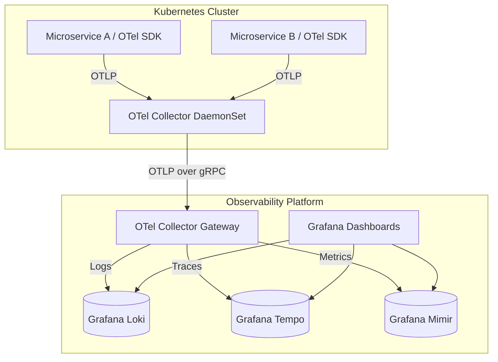

In the era of microservices, observability isn't a luxury; it's a survival requirement. For years, SaaS vendors like Datadog and New Relic provided incredible out-of-the-box experiences. However, as infrastructure scale grows exponentially, their volume-based pricing models often result in monthly bills that exceed the cost of the actual cloud infrastructure itself. 

By 2026, the industry consensus is clear: instrumentation must be vendor-neutral. In this guide, we break down how to migrate to a self-hosted, scalable observability stack using **OpenTelemetry (OTel)** and the **Grafana LGTM stack (Loki, Grafana, Tempo, Mimir)**.

## The Core Problem: Vendor Lock-in and High Cardinality Tax

Traditional APM (Application Performance Monitoring) agents inject proprietary code into your applications. This locks you into a specific vendor. Worse, modern infrastructure relies on *high cardinality* data—tags like `user_id`, `container_id`, or `request_id`. SaaS vendors charge astronomical "custom metric" fees for tracking these fields, forcing SREs to drop valuable debugging context just to save money.

### The OpenTelemetry Revolution
OpenTelemetry is a CNCF incubating project that standardizes how telemetry data (Logs, Metrics, and Traces) is collected and transmitted. You instrument your code *once* using OTel SDKs. From there, the OTel Collector can route that data anywhere—to Datadog, to Prometheus, or to your self-hosted backend—without changing a single line of application code.

## Architecture: The LGTM Stack + OTel Collector

To replace a full-featured commercial APM, we need a backend capable of ingesting massive amounts of telemetry data efficiently. The Grafana LGTM stack is the current open-source gold standard.

- **L**oki: Logs
- **G**rafana: Dashboards & Alerting
- **T**empo: Distributed Tracing
- **M**imir: Long-term Metrics (Prometheus compatible)



### The OTel Collector Gateway
Notice the two-tier collector architecture. 
1. The **DaemonSet Collector** runs on every node, grabbing infrastructure metrics and acting as a local receiver for applications.
2. The **Gateway Collector** runs as a scalable Deployment. It handles API key validation, data scrubbing (removing PII/passwords), tail-based sampling, and batching before hitting the storage backends.

## Real-world Implementation: OTel Collector Config

The magic happens in the OTel Collector configuration. Here is a production-grade snippet showing how a Gateway Collector processes incoming OTLP (OpenTelemetry Protocol) data, filters out sensitive data, and exports it to Tempo and Mimir.

```yaml
receivers:
  otlp:
    protocols:
      grpc:
      http:

processors:
  batch:
    send_batch_size: 10000
    timeout: 1s
  
  # Crucial for security: mask credit card numbers in spans
  redaction:
    allow_all_keys: true
    blocked_values:
      - "4[0-9]{12}(?:[0-9]{3})?" # Visa regex

exporters:
  otlp/tempo:
    endpoint: "tempo.observability.svc.cluster.local:4317"
    tls:
      insecure: true
  
  prometheusremotewrite/mimir:
    endpoint: "http://mimir.observability.svc.cluster.local/api/v1/push"

service:
  pipelines:
    traces:
      receivers: [otlp]
      processors: [redaction, batch]
      exporters: [otlp/tempo]
    metrics:
      receivers: [otlp]
      processors: [batch]
      exporters: [prometheusremotewrite/mimir]
```

## Performance, Cost, and Operational Impact

Migrating to this stack is not free; it requires engineering effort. Let's look at the trade-offs.

| Metric / Aspect | Commercial SaaS (e.g., Datadog) | OTel + Self-hosted LGTM |
| :--- | :--- | :--- |
| **Monthly Cost (100 Hosts)** | $15,000+ (depending on custom metrics) | ~$1,200 (EC2/S3 storage costs) |
| **Data Retention** | Expensive (usually 15-30 days for logs) | Cheap (Loki/Tempo use S3 object storage) |
| **Engineering Effort** | Low (Drop in the agent and go) | High (Requires tuning, scaling Mimir/Loki) |
| **Vendor Lock-in** | Extremely High | Zero (Standardized OTLP format) |

### The S3 Object Storage Advantage
One of the massive breakthroughs of Loki, Tempo, and Mimir is that they decouple compute from storage. Instead of requiring expensive NVMe SSDs or massive Elasticsearch clusters, they write chunks directly to Amazon S3 (or MinIO). This drops the long-term storage cost to pennies per gigabyte, allowing you to retain years of audit logs and traces.

## Alternatives and Trade-offs

- **Managed Grafana Cloud**: If your team doesn't have the bandwidth to maintain the LGTM stack, you can still use OpenTelemetry to send data to Grafana Cloud. You avoid vendor lock-in at the application level, but pay a premium for managed hosting.
- **Elastic Observability**: Uses the ELK stack. Excellent text search capabilities, but significantly heavier on RAM and storage costs compared to Loki's index-free design.
- **SigNoz**: An emerging open-source alternative built natively on ClickHouse. It offers an incredibly fast "Datadog-like" UI out of the box, but ClickHouse management can be intimidating for teams accustomed to Prometheus.

## The Senior Engineer's Verdict

The days of paying $100 per month just to monitor a single Kubernetes node are over. By decoupling your instrumentation (OpenTelemetry) from your storage backend (Grafana Stack), you take back control of your data and your budget. The initial setup requires a solid SRE team to configure the OTel pipelines and tune Mimir/Loki, but the massive ROI makes it an inevitable migration for any rapidly growing tech company.
