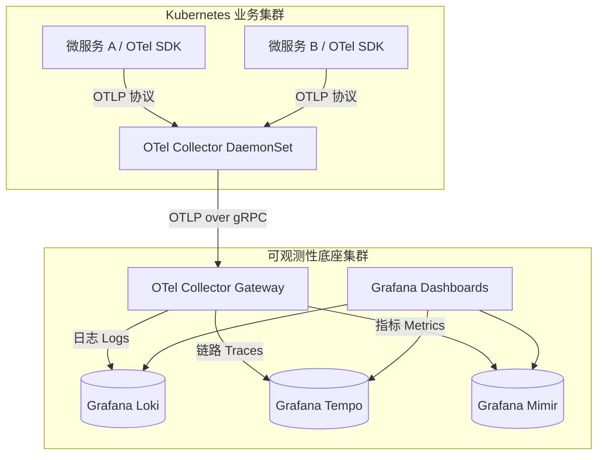

在微服务时代，可观测性 (Observability) 早就不是什么奢侈品，而是活下去的必需品。多年来，像 Datadog 和 New Relic 这样的商业 SaaS 厂商提供了无与伦比的开箱即用体验。然而，随着企业基础设施规模的指数级增长，他们基于数据量的计费模型，经常会导致每个月的监控账单比实际跑业务的云服务器账单还要高得多。

到了 2026 年，行业共识已经非常清晰：数据采集层必须是厂商中立的。在这篇硬核指南中，我们将彻底拆解如何使用 **OpenTelemetry (OTel)** 以及 **Grafana LGTM 技术栈 (Loki, Grafana, Tempo, Mimir)** 来搭建一套高可用的开源可观测性底座。

## 核心痛点：厂商锁定与高基数 (High Cardinality) 惩罚

传统的 APM (应用性能监控) 工具会在你的代码里注入专有的 Agent 代码，这直接导致你被死死地绑定在一家厂商上。更糟糕的是，现代微服务排查问题极度依赖“高基数数据”——也就是 `user_id`、`container_id` 或 `request_id` 这种标签。商业 SaaS 厂商会对这些自定义维度收取天文数字的“自定义指标费”，逼得 SRE 们为了省钱，不得不把宝贵的调试上下文信息丢弃掉。

### OpenTelemetry 的革命
OpenTelemetry 是 CNCF 旗下的孵化项目，它统一了遥测数据（日志、指标、链路追踪）的采集和传输标准。你只需要使用 OTel SDK 对代码进行**一次**埋点。之后，OTel Collector 可以把这些数据路由到任何地方——无论是发给 Datadog、Prometheus 还是你自建的后端——不需要修改任何一行应用代码。

## 架构演进：LGTM 栈 + OTel Collector

为了替换掉全功能的商业 APM，我们需要一个能高效吃下海量遥测数据的后端。Grafana 官方推出的 LGTM 栈是目前开源界当之无愧的黄金标准。

- **L**oki: 负责日志 (Logs)
- **G**rafana: 负责仪表盘与告警 (Dashboards)
- **T**empo: 负责分布式链路追踪 (Traces)
- **M**imir: 负责长期海量指标存储 (Metrics, 兼容 Prometheus)



### 为什么需要两层 OTel Collector？
注意架构图里的两层设计。
1. **DaemonSet Agent 层**：运行在每个节点上，负责抓取宿主机指标，并作为业务应用本地的超低延迟接收端。
2. **Gateway 集群层**：作为独立的 Deployment 运行，方便水平扩容。它负责统一的 API 鉴权、数据脱敏（清洗掉日志里的密码/身份证）、尾部采样 (Tail-based Sampling) 以及打包压缩，然后再发给后端的存储集群。

## 实战落地：OTel Collector 数据清洗配置

真正的魔法都发生在 OTel Collector 的配置文件里。下面是一段生产环境级别的 Gateway Collector 配置代码。它展示了如何接收 OTLP 数据、利用正则清洗掉敏感数据，并将指标和链路分别路由到 Mimir 和 Tempo。

```yaml
receivers:
  otlp:
    protocols:
      grpc:
      http:

processors:
  batch:
    send_batch_size: 10000
    timeout: 1s
  
  # 极其关键的安全操作：在链路 Span 中清洗掉信用卡号
  redaction:
    allow_all_keys: true
    blocked_values:
      - "4[0-9]{12}(?:[0-9]{3})?" # Visa 信用卡正则

exporters:
  otlp/tempo:
    endpoint: "tempo.observability.svc.cluster.local:4317"
    tls:
      insecure: true
  
  prometheusremotewrite/mimir:
    endpoint: "http://mimir.observability.svc.cluster.local/api/v1/push"

service:
  pipelines:
    traces:
      receivers: [otlp]
      processors: [redaction, batch]
      exporters: [otlp/tempo]
    metrics:
      receivers: [otlp]
      processors: [batch]
      exporters: [prometheusremotewrite/mimir]
```

## 性能、成本与运维代价 (Trade-offs)

切换到开源栈绝对不是零成本的，它需要真金白银的研发人力投入。让我们算算这笔账。

| 指标维度 | 商业 SaaS (以 Datadog 为例) | OTel + 自建 LGTM 栈 |
| :--- | :--- | :--- |
| **月度账单 (100台宿主机)** | $15,000+ (极度依赖自定义指标量) | ~$1,200 (EC2计算 + S3存储成本) |
| **数据保留期限** | 极其昂贵 (通常日志只保留 15-30 天) | 极其便宜 (Loki/Tempo 直接存入 S3) |
| **运维人力投入** | 极低 (一键安装 Agent 就完事) | 高 (需要专职 SRE 调优 Mimir/Loki) |
| **厂商锁定风险** | 极高 (被彻底绑架) | 零 (基于标准的 OTLP 协议) |

### 降维打击：对象存储 (S3) 的威力
Loki、Tempo 和 Mimir 能够击败 ELK 的核心原因在于：它们彻底**解耦了计算与存储**。它们不再需要昂贵的 NVMe SSD 或维护庞大的 Elasticsearch 索引集群，而是直接将数据块写入到 AWS S3（或者自建的 MinIO）中。这把海量日志和链路的长期存储成本降到了每 GB 几分钱，让保留“长达一年”的审计日志变得轻而易举。

## 替代方案与妥协

- **全托管的 Grafana Cloud**：如果你的团队没有精力去维护庞大的 LGTM 存储集群，你依然可以用 OpenTelemetry 采集数据，然后发给 Grafana 官方云。这样你在代码层解除了厂商绑定，只是付一点托管费。
- **Elastic Observability (ELK栈)**：全文检索能力天下无敌。但相比于 Loki 的“无索引”设计，ELK 吃内存和吃磁盘的能力也是极度夸张的。
- **SigNoz**：一个非常亮眼的新星，底层基于 ClickHouse。它开箱就送一个“极其类似 Datadog”的炫酷 UI，查询极快，但前提是你们团队能搞定 ClickHouse 的日常运维。

## 资深工程师的最后总结

仅仅为了监控一个 Kubernetes 节点就要每月掏 100 美元的日子已经一去不复返了。通过将“数据采集侧 (OpenTelemetry)”与“数据存储侧 (Grafana 栈)”强行解耦，企业能够重新拿回对自己数据和 IT 预算的绝对控制权。

虽然前期搭建 OTel 数据管道和调优 Mimir 需要一支硬核的 SRE 团队，但其带来的巨大成本回报 (ROI)，使得这场重构成为任何一家快速发展的科技公司都必须跨越的必经之路。


## 社区灵感与参考 (References & Community Insights)
本文探讨的架构演进与技术实现方案，深度提炼自 Hacker News、Reddit 等极客社区的真实工程师讨论、线上事故复盘（Post-mortems）以及一线技术博客的实战经验分享。
